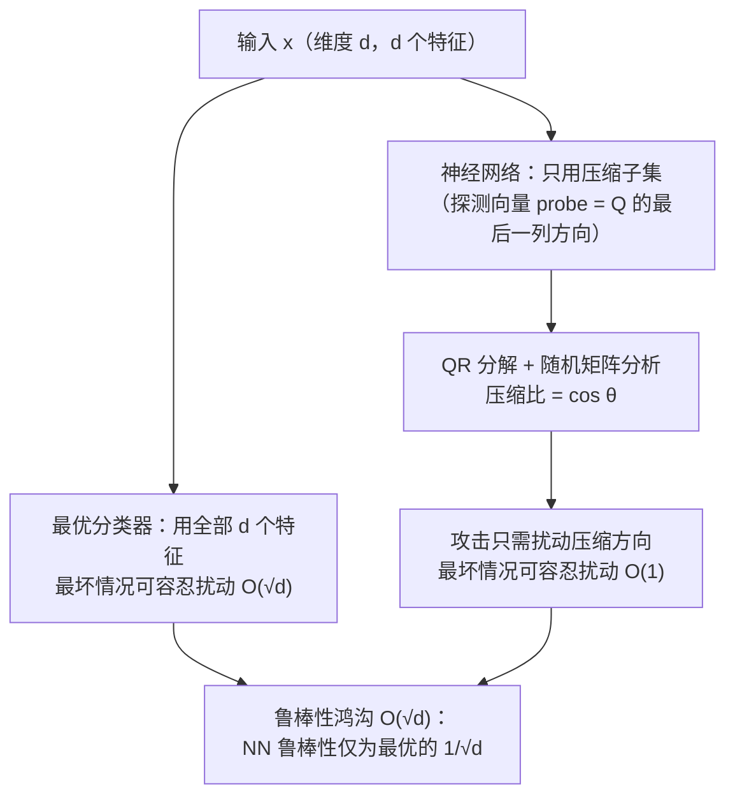

# Feature Compression is the Root Cause of Adversarial Fragility in Neural Networks

**会议**: ICLR 2026  
**OpenReview**: [https://openreview.net/forum?id=UYM3yaiUX9](https://openreview.net/forum?id=UYM3yaiUX9)  
**代码**: 未公开  
**领域**: 学习理论 / 对抗鲁棒性理论  
**关键词**: 对抗鲁棒性, 特征压缩, 随机矩阵理论, 最优分类器, QR 分解  

## 一句话总结
本文用随机矩阵理论给出对抗脆弱性的"特征压缩"解释：神经网络只用全部特征的一个压缩子集做分类，导致其最坏情况鲁棒性可能只有最优分类器的 $1/\sqrt{d}$，并在 ImageNet 上验证了该理论预测。

## 研究背景与动机
- **领域现状**: 深度网络分类精度很高，却几乎普遍地在对抗扰动下脆弱——输入加一点人眼难以察觉的噪声就能让标签翻转。学界对"为什么脆弱"提出过很多竞争性解释：决策边界的拟线性/梯度大小、高曲率、决策边界贴近数据流形、以及"高预测性但非鲁棒特征"的存在等。
- **现有痛点**: 这些解释至今没有形成共识，基于它们设计的防御"无一例外都被攻破"。更尴尬的是，近期工作表明即便用"鲁棒特征"训练，网络在更强攻击下仍然脆弱，说明脆弱性并不纯粹来自数据。
- **核心矛盾**: 一种诱人的解释是把脆弱性归因于"平均情况性能 vs 最坏情况性能"的差距。但作者反驳：这个差距几乎对所有分类器（包括最优分类器）都存在，并非神经网络独有；而且存在平均性能很好、最坏性能远优于神经网络的分类器。所以脆弱性必有更深层原因。
- **本文目标**: **首次**直接比较神经网络分类器的最坏情况性能与**最优分类器**的最坏情况性能，量化二者之间的 $O(\sqrt{d})$ 鸿沟，并给出可解析的成因。
- **核心 idea（特征压缩）**: 神经网络做决策时往往只使用全部 $d$ 个特征中的一个**压缩子集**。攻击者因此只需扰动这一小撮被用到的特征方向，就能翻转输出——**这就是对抗脆弱性的根因**。该结论与早期信息论"特征压缩假说"一致，但本文是从具体网络结构和分类样例出发的矩阵论证明。

## 方法详解

### 整体框架
本文不提出新模型，而是构建一套**从线性网络到非线性网络、从局部到全局**层层递进的理论。核心工具是对（高斯矩阵乘积的）QR 分解做随机矩阵分析：把网络对输入的"探测向量"(probing vector) 与最优分类器关注的"好特征"方向做投影，二者夹角的余弦 $\cos\theta$ 就是"压缩比"，它直接决定了攻击所需扰动相对最优分类器的比例。

### 关键设计

**1. 线性网络的矩阵论证明：压缩方向即攻击方向。** 以 $d$ 类、每类一个标准高斯样本 $x_i\in\mathbb{R}^d$ 的两层网络为例（Theorem 1）。把数据矩阵 $X=[x_1,\dots,x_d]$ 做 QR 分解 $X=Q_2R$，在"网络对每个训练点输出 one-hot"的条件下可解出第二层权重 $H_2=R^{-1}$。此时输入 $x_d=\sum_i (Q_2)_{:,i}R_{i,d}$ 由 $Q_2$ 的 $d$ 个列方向（即 $d$ 个特征）线性组成，但网络做决策**只依赖最后一个压缩方向 $(Q_2)_{:,d}$**。作者显式构造一个仅作用在该子空间的扰动 $e=Q_2 b$，其大小由 $R$ 的最后两行元素决定：$\|e\|_2\le |R_{d-1,d-1}|+|R_{d-1,d}|+|R_{d,d}|$。由随机矩阵理论，$R_{d,d}$ 是标准高斯的绝对值、$R_{d-1,d-1}$ 服从自由度 2 的卡方分布开方——这些量都是 $O(1)$，与 $d$ 无关。于是攻击只要 $\|e\|_2\le C$（常数）就能翻转标签，而最优（最小距离）分类器需要 $\Omega(\sqrt{d})$，鸿沟 $O(\sqrt{d})$ 由此而来。

**2. 从两层推广到多层、海量数据点与一般权重。** 单一样例不足以服人，作者把结论沿三个维度扩展。其一（Theorem 3）用线性生成模型 $x_i=G_t\cdots G_1 v_i$ 把网络推到多层，为此证明了一个新引理（Lemma 7）：**高斯矩阵乘积的 QR 分解的分布刻画**，这是独立的技术贡献。其二（Theorem 4）放弃"输出恰为 one-hot"的强条件，对一般权重定义类 $i$、$j$ 的探测向量 $\text{probe}_i=(w_i^T H_{l-1}\cdots H_1)^T$，证明把标签从 $i$ 翻到 $j$ 只需在两个探测向量张成的二维子空间内扰动，扰动大小 $\le\sqrt{a_{i1}^2+a_{i2}^2}$——再次印证"只需攻击被压缩用到的特征"。其三（Theorem 5）处理**每类含 $2^{d-1}$ 个、随输入维度指数增长**的复杂数据点（$x_i=Az_i$，标签由 $z_i$ 最后一位的符号决定），证明仍可沿 $A$ 的 QR 分解中 $Q$ 的最后一列方向用 $O(1)$ 扰动攻破。这一设定比 Vardi et al. (2022) 等前作（要求数据点近似正交、只能处理少量点）严格更强。

**3. 非线性网络与"压缩比 $\cos\theta$"的全局代数解释。** Theorem 6 把分析推到一般非线性多层网络：在输入 $x$ 附近，要把网络误判成"输入是 $x+\epsilon x_2$ 而非真值 $x+\epsilon x_1$"，只需扰动 $\|e\|_2\le\epsilon\|P_{\nabla f_1,\nabla f_2}(x_1-x_2)\|$，即把 $x_1-x_2$ 投影到两个输出梯度张成的子空间——若该子空间只含 $x_1-x_2$ 的"压缩部分"，扰动幅度便可低至 $\epsilon\|x_2-x_1\|$ 的 $1/\Omega(\sqrt{d})$。Section 5 进一步给出全局视角的简洁代数解释：沿直连路径 $x_2\to x_1$，类间得分差 $g(x)=f_2(x)-f_1(x)$ 的总变化量 $D$ 既可写成 $D=\int_0^{\|x_1-x_2\|}\|\nabla g\|\cos(\theta_\gamma)\,d\gamma$（含压缩因子 $\cos\theta_\gamma$，常很小甚至为负），也可写成攻击者沿梯度方向走过的路径 $D=\int_0^{z}-\|\nabla g\|\,d\gamma$。两式相等，意味着最优分类器需要的扰动 $\|x_1-x_2\|$ 必须远大于攻击者路径长度 $z$——**正是 $\cos\theta_\gamma$ 这个压缩因子拉开了二者差距，且它是脆弱性发生的必要条件**。

## 实验关键数据

实验目的是验证纯理论预测，而非刷点。核心思路：用 QR 分解算出"理论压缩比 $\phi$"，再用实际训练好的网络测"经验压缩比 $|\cos\theta_1|$"，看二者是否吻合。

### 主实验（线性网络，$d=12$）
对 Theorem 5 的数据模型训练单隐层（3000 神经元）线性网络，取训练精度为 1 的有效 run。$|\cos\theta_1|$ 表示翻转标签所需扰动相对 $A$ 最后一列 $\ell_2$ 范数的比例，$\phi$ 是理论预测的压缩比。

| 量 | 含义 | 代表性结果（Exp.9） |
| --- | --- | --- |
| $\phi$ | 理论压缩比（QR 分解 $R_{d,d}$ / $A$ 末列范数） | 0.1480 |
| $\|\cos\theta_1\|$ | 经验对抗鲁棒性（实际所需扰动比例） | 0.1665 |
| $\|\cos\theta_2\|$ | 探测向量与 $A^{-1}$ 末行对齐度（应≈1） | 0.9942 |

理论与经验高度吻合：$\phi$ 小则实际所需扰动也小，验证"压缩比越高越脆弱"。

### 统计实验（18 个有效 run 的平均）

| 指标 | 数值 |
| --- | --- |
| 平均 $\|\cos\theta_1\|$（经验鲁棒性） | 0.3645 |
| 平均 $\|\phi\|$（理论预测） | 0.3280 |
| 平均 $\big\|\,\|\cos\theta_1\|-\|\phi\|\,\big\|$（误差） | 0.0367 |

误差仅 0.037，且在 $d=7\sim17$ 的多个维度上 $\phi$ 与 $\cos\theta_1$ 曲线持续重合（Figure 1）。

### ImageNet 非线性网络（Inception-ResNet-v2）
取 "English springer" 与 "Afghan hound" 两类图像，沿插值路径测压缩率 $\cos\theta_\alpha$（普遍很小，均值约 $-0.002\sim-0.035$，体现强压缩/脆弱），并比较理论预测 $|M/(0.5L)|$ 与实际最小攻击扰动 $Q/(0.5L)$。

| Exp. | $\|M/(0.5L)\|$（理论） | $Q/(0.5L)$（实测） |
| --- | --- | --- |
| 1 | 0.0765 | 0.0722 |
| 2 | 0.0349 | 0.0828 |
| 3 | 0.0387 | 0.0607 |
| 4 | 0.0806 | 0.0679 |

二者数量级一致，验证特征压缩在真实大网络上同样导致对抗脆弱性（差异源于 least-likely class 攻击未必找到最小扰动及近似假设）。

### 关键发现
- 最优分类器可容忍最坏情况扰动 $O(\sqrt{d})$，神经网络只能容忍 $O(1)$，鸿沟 $O(\sqrt{d})$ 与理论吻合。
- 平均-最坏差距对最优分类器也存在，因此**脆弱性不来自平均/最坏差距，而来自特征压缩**。
- 理论压缩比 $\phi$ 能在尚未训练时就预测出实际网络的对抗鲁棒性。

## 亮点与洞察
- **视角切换是关键贡献**：以往工作要么解释脆弱性的现象、要么比较 NN 之间，本文第一个把 NN 最坏性能直接对标**最优分类器**，从而把"脆弱"量化成一个干净的 $1/\sqrt{d}$ 鸿沟。
- **对"非鲁棒特征"叙事的反驳很有启发**：作者论证 Ilyas et al. (2019) 所谓"非鲁棒特征"未必非鲁棒，它们可能只是鲁棒特征被压缩后的残差部分——因此构建鲁棒模型时**不该把这些特征清洗掉**，反而需要它们。
- **理论能反向指导训练**：既然根因是压缩，结论自然给出"训练时对特征压缩做正则化"这一可操作的鲁棒化方向。
- **纯理论却能预测真实网络**：从 QR 分解算出的 $\phi$ 与 ImageNet 大模型实测攻击幅度对得上，说明这套抽象分析抓住了真实机制。

## 局限与展望
- 理论主要建立在结构化数据（高斯、线性生成模型）与较强假设（如输出 one-hot 条件、梯度幅度沿路径变化不大）之上，向 MNIST/ImageNet 这类非结构化数据的完整迁移仍靠数值实验补充。
- 多数定理针对线性网络，非线性结论是局部一阶近似 + 全局代数论证，缺少端到端的严格非线性界。
- 只给出"特征压缩是根因"的诊断，尚未把"压缩正则化"做成完整防御方法并实证其有效性。
- 作者自陈需把分析扩展到更一般的数据分布、网络架构与训练方式（如 Frei et al. 2023 的训练设定）。

## 相关工作与启发
- **信息论特征压缩假说 (Xie et al. 2019)**：本文是其矩阵论的、基于具体架构的"实锤版"，二者结论一致但论证层次不同。
- **两层 ReLU 脆弱性 (Vardi et al. 2022 / Frei et al. 2023 / Melamed et al. 2023)**：本文在数据点数量（指数级 vs 近正交少量点）、对标对象（最优分类器 vs 另一 NN）、技术工具（随机矩阵 vs KKT/梯度流）上都更强更一般，且给出更紧的 $\tilde O(1)$ 扰动界。
- **非鲁棒特征 (Ilyas et al. 2019) 与梯度大小解释 (Simon-Gabriel et al. 2019)**：本文把脆弱性归因于梯度的**角度**（压缩）而非大小或数据特征本身，提供了不同的因果叙事。
- **启发**：把"模型实际使用的有效特征子空间"与"任务所需的完整特征空间"之间的对齐度作为鲁棒性度量，可能比对抗训练更本质；压缩比 $\cos\theta$ 也许能成为一个无需攻击就可估计的鲁棒性指标。

## 评分
- **新颖性**: ⭐⭐⭐⭐ 首次将 NN 最坏性能对标最优分类器并给出 $1/\sqrt{d}$ 鸿沟，"特征压缩=根因"的矩阵论刻画与对"非鲁棒特征"叙事的反驳都很有原创性。
- **实验充分度**: ⭐⭐⭐ 线性网络的理论-经验吻合扎实，ImageNet 验证抓住了机制，但样例规模小、缺少与主流防御/攻击的系统对比。
- **写作质量**: ⭐⭐⭐⭐ 定理层层递进、动机论证（反驳平均-最坏差距）清晰有力，符号体系完整，但理论密度高、对非理论读者门槛偏陡。
- **价值**: ⭐⭐⭐⭐ 为长期无共识的对抗脆弱性给出可量化、可验证、可指导训练的统一解释，对鲁棒学习理论方向有实质推动。

<!-- RELATED:START -->

## 相关论文

- [\[ICLR 2026\] Scaling Laws and Spectra of Shallow Neural Networks in the Feature Learning Regime](scaling_laws_and_spectra_of_shallow_neural_networks_in_the_feature_learning_regi.md)
- [\[ICLR 2026\] Transfer Learning in Infinite Width Feature Learning Networks](transfer_learning_in_infinite_width_feature_learning_networks.md)
- [\[ICLR 2026\] FACT: a first-principles alternative to the Neural Feature Ansatz for how networks learn representations](fact_a_first-principles_alternative_to_the_neural_feature_ansatz_for_how_network.md)
- [\[ICLR 2026\] From Neural Networks to Logical Theories: The Correspondence between Fibring Modal Logics and Fibring Neural Networks](from_neural_networks_to_logical_theories_the_correspondence_between_fibring_moda.md)
- [\[ICLR 2026\] Overparametrization bends the landscape: BBP transitions at initialization in simple Neural Networks](overparametrization_bends_the_landscape_bbp_transitions_at_initialization_in_sim.md)

<!-- RELATED:END -->
