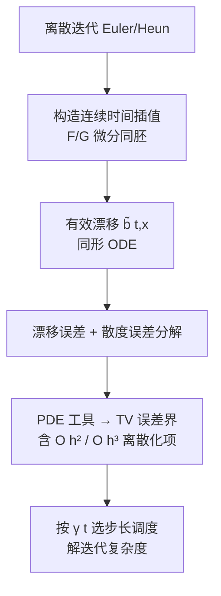

# Finite-Time Convergence Analysis of ODE-based Generative Models for Stochastic Interpolants

**会议**: ICLR 2026  
**OpenReview**: [https://openreview.net/forum?id=VCStVrq0BZ](https://openreview.net/forum?id=VCStVrq0BZ)  
**代码**: 待确认  
**领域**: 学习理论 / 生成模型采样收敛分析  
**关键词**: 随机插值, ODE 采样, 有限时间收敛, 迭代复杂度, Heun 方法, 扩散模型理论  

## 一句话总结
本文首次给出随机插值（stochastic interpolant）框架下 ODE 数值求解器的有限时间收敛分析，为一阶前向 Euler 和二阶 Heun 方法建立了离散时间 TV 误差界与迭代复杂度（$O(\varepsilon^{-1}d^2)$ 与 $O(\varepsilon^{-1/2}d^{3/2})$），并在退化到扩散模型时在光滑性假设和维度依赖上超越了已有结果。

## 研究背景与动机
**领域现状**：随机插值（Albergo & Vanden-Eijnden, 2023）通过在两个任意分布 $\rho_0,\rho_1$ 之间构造插值路径并估计平均速度场，统一了 flow matching 与 score-based diffusion，可用 ODE 或 SDE 完成 data-to-data 的生成变换，是当下生成建模的重要框架。

**现有痛点**：理论侧的收敛性分析进展不均衡。SDE 版本已经有了连续时间（Albergo et al., 2023）和离散时间（Liu et al., 2025）的误差界；但其确定性对应物 ODE 版本——也就是实践中真正大量使用的 probability-flow ODE——的分析**只停留在连续时间**，缺少对实际数值离散化的刻画。

**核心矛盾**：直接照搬扩散模型的 ODE 分析行不通。一方面随机插值是一般的 data-to-data 变换，插值过程**非马尔可夫**，无法套用 Gaussian-to-data 的专用技巧；另一方面把 SDE 的有限时间分析（Liu et al., 2025）迁移到 ODE 上，会在退化过程的奇异行为处遇到本质性困难（没有了 SDE 的扩散项来"抹平"误差）。

**本文目标**：回答"数值 ODE 求解器需要多少次迭代才能保证随机插值的生成精度"，即给出离散时间 TV 误差界 + 迭代复杂度 + 最优步长调度。

**核心 idea**：**【连续时间插值重构】** 把离散迭代重新解读成一个与真过程同形的连续时间 ODE，从而能调用连续时间的 PDE 分析工具，通过比较"诱导漂移"和"散度"来量化离散化误差。

## 方法详解

### 整体框架
论文围绕同一套分析范式处理两个数值求解器：先把离散迭代 $\{\hat X_{t_k}\}$ **重写成一个分段定义的连续时间过程** $\hat X_t$，使其满足形如 $\mathrm{d}\hat X_t=\tilde b(t,\hat X_t)\mathrm{d}t$ 的 ODE（与真过程 $\mathrm{d}X_t=b(t,X_t)\mathrm{d}t$ 同形）；再借助 PDE 工具，把目标分布与近似分布之间的 TV 距离归结为"有效漂移 $\tilde b$ 与真漂移 $b$、以及二者散度之间的差距"；最后针对具体的插值 $\gamma(t)$ 选择，优化步长调度并解出迭代复杂度。

### 关键设计

**1. 连续时间插值重构：把离散迭代变回 ODE。** 这是全文的技术枢纽。对前向 Euler，作者在区间 $[t_k,t_{k+1}]$ 上把更新写成映射 $\hat X_t=F_{t_k\to t}(\hat X_{t_k}):=\hat X_{t_k}+(t-t_k)\hat b(t_k,\hat X_{t_k})$；在小步长下 $F_{t_k\to t}$ 是 $\mathbb{R}^d$ 上的微分同胚，于是可定义有效漂移 $\tilde b(t,x):=\hat b(t_k,F^{-1}_{t_k\to t}(x))$ 并得到 $\mathrm{d}\hat X_t=\tilde b(t,\hat X_t)\mathrm{d}t$。这样离散估计就和真 ODE 写成了完全相同的形式，从而能在连续时间框架里直接比较两者，避开了"离散 vs 连续"难以对齐的根本障碍。

**2. 漂移与散度误差的序贯分解。** 有了同形 ODE，控制 TV 距离的关键就落到证明 $\tilde b\approx b$ 且 $\nabla\!\cdot\tilde b\approx\nabla\!\cdot b$。作者采用序贯逼近 $\tilde b(t,X_t)\approx\hat b(t_k,X_{t_k})\approx b(t,X_t)$，并对散度项利用 $\nabla\!\cdot\tilde b(t,X_t)=\mathrm{tr}[\nabla\hat b(t_k,F^{-1}_{t_k\to t}(X_t))\cdot\nabla F_{t_k\to t}(\cdot)^{-1}]\approx\mathrm{tr}[\nabla\hat b(t_k,X_{t_k})\cdot I_d]\approx\nabla\!\cdot b(t,X_t)$。配合一个把 TV 距离用漂移/散度误差上界的 PDE 引理（Lemma D.2），即得 Theorem 4.5 的总误差界，其离散化项为 $\sum_k h_k^2(\bar\gamma_k^{-4}d^2+\bar\gamma_k^{-2}M^2)$，每步 $O(h_k^2)$ 与扩散模型一阶采样器的已知结论一致。

**3. Heun 方法的线性速度插值与高阶加速。** 对二阶 Heun 更新，作者构造了一个更精细的连续插值 $\hat X_t=G_{t_k\to t}(\hat X_{t_k})$，其速度 $\frac{\mathrm{d}}{\mathrm{d}t}\hat X_t=\frac{t_{k+1}-t}{t_{k+1}-t_k}\hat b(t_k,\hat X_{t_k})+\frac{t-t_k}{t_{k+1}-t_k}\hat b(t_{k+1},F_{t_k\to t_{k+1}}(\hat X_{t_k}))$ 在两个漂移估计之间做**线性插值**。这一构造把每步逼近误差从 Euler 的 $O(h_k)$ 压到 $O(h_k^2)$，使离散化项升阶为 $\sum_k h_k^3(\bar\gamma_k^{-6}d^3+\bar\gamma_k^{-4}M^3)$（Theorem 5.4），并且与某些需要在整段连续区间上界定的做法（如 Huang et al., 2025）不同，**只需在离散时间步上访问 $\hat b$**，放宽了对估计器的要求。

**4. 与 $\gamma(t)$ 适配的指数衰减步长调度。** 由于离散化误差正比于 $h_k^2\bar\gamma_k^{-4}$（Euler）或 $h_k^3\bar\gamma_k^{-6}$（Heun），平衡误差自然要求 $h_k\propto\bar\gamma_k^2$。对 Brownian-bridge 型 $\gamma(t)=\sqrt{at(1-t)}$，作者以中点 $t_m=0.5$ 为界、向两侧指数衰减构造 $t_k=\tfrac12(1-h)^{m-k}$（$k\le m$）/ $t_k=1-\tfrac12(1-h)^{k-m}$（$k>m$）；对 VP 扩散对应的插值则用 $t_k=1-(1-h)^k$。该调度保证 $h_k\bar\gamma_k^{-2}=O(h)$，配合 early stopping（在子区间 $[t_0,t_N]\subset(0,1)$ 上模拟以避开 $\gamma(0)=\gamma(1)=0$ 处的奇异），最终解出 Euler 的 $O(\varepsilon^{-1}d^2\log^2(1/\delta))$ 与 Heun 的 $O(\varepsilon^{-1/2}d^{3/2}\log^{3/2}(1/\delta))$ 复杂度。

## 实验关键数据

### 主实验：收敛率验证

| 设置 | 求解器 | 理论离散化误差阶 | 实验观测 |
|------|--------|------------------|----------|
| 2D 密度变换（3 个任务对） | 前向 Euler | $O(h)$ | TV vs $h$ 线性，吻合 |
| 2D 密度变换 | Heun | $O(h^2)$ | TV vs $h^2$ 线性，吻合 |
| $d$ 维 Gaussian mixture（解析 $b$，免训练） | Euler / Heun | $O(h)$ / $O(h^2)$ | 步长依赖吻合 |

### 维度依赖：理论 vs 实验

| 求解器 | 理论维度依赖 | 实验观测 |
|--------|--------------|----------|
| Euler | $O(hd^2)$ | 近似**线性**增长 |
| Heun | $O(h^2d^3)$ | 近似**线性**增长 |

### 关键发现
- 步长依赖（$O(h)$ / $O(h^2)$）在 2D 与高维 Gaussian mixture 上都得到经验验证。
- 维度依赖存在 **theory-experiment gap**：实测维度增长接近线性，远好于理论的 $d^2/d^3$，作者明确指出当前界仍有收紧空间，是 future work。
- 还在真实图像生成任务上验证了两种方法的适用性（详见附录 C）。

## 亮点与洞察
- **填补 ODE 离散时间分析空白**：第一篇给随机插值 ODE 求解器有限时间收敛保证的工作，覆盖所有满足温和正则性的插值过程（含著名的 VP 扩散）。
- **退化到扩散模型即超越 SOTA**：Heun 方法的 $\tilde O(\varepsilon^{-1/2}d^{3/2})$ 维度依赖低于 Li et al. (2025a) 的 $\tilde O(\varepsilon^{-1/2}d^2)$；与同为 $\tilde O(\varepsilon^{-1/2}d^{3/2})$ 的 Huang et al. (2025) 相比，本文只需 $\hat b$ 对 $x$ 的二阶导有界，而非他们对 $\hat s$ 关于 $t,x$ 的三阶导一致有界（真漂移的 $t$ 导可能无界，这一放宽很关键）。
- **"重写成同形 ODE"的分析范式可迁移**：连续插值重构 + 漂移/散度误差分解的思路，给后续更高阶求解器或更一般插值的分析提供了通用模板。

## 局限与展望
- **维度依赖不紧**：理论 $d^2$（Euler）/$d^3$（Heun）与实验近线性增长存在明显 gap，界有待收紧。
- **依赖较强光滑性假设**：需要 $\hat b$ 的 Lipschitz/二阶导有界（Assumption 4.4），且对 Heun 还要求更高阶矩与时间导数有界；真实神经网络估计器未必严格满足。
- **早停近似**：分析在子区间 $[t_0,t_N]\subset(0,1)$ 上进行，终端不是精确的 $\rho_1$，初始/终端误差被假定为小项。
- **纯理论 + 验证性实验**：图像生成实验主要用于佐证误差界趋势，而非追求生成质量 SOTA。

## 相关工作与启发
- **随机插值**：Albergo & Vanden-Eijnden (2023) 提出框架并给连续时间 Wasserstein 界；Benton et al. (2024b) 用时变 Lipschitz 常数收紧；Liu et al. (2025) 给出 SDE 的首个离散时间有限时间界——本文是其 ODE 对应物。
- **ODE 扩散模型分析**：Chen et al. (2023b) 给 DDIM 型采样器首个多项式收敛界；Li et al. (2024b,c) 用离散时间密度演化控制 TV；Huang et al. (2025)、Li et al. (2025b) 用 PDE 技术界定 TV。本文在退化到扩散时与这条线对接并改进。
- **启发**：把"离散数值迭代重写成与真过程同形的连续 ODE"是处理采样器收敛分析的有力套路；对生成模型理论研究者，本文的漂移/散度误差分解 + 步长调度优化提供了可复用的工具箱。

## 评分
- **新颖性**: ⭐⭐⭐⭐ 首次给随机插值 ODE 求解器有限时间分析，连续插值重构是实质性技术创新，退化到扩散模型还超越已有结果。
- **实验充分度**: ⭐⭐⭐ 2D + 高维 Gaussian mixture + 图像生成验证了步长依赖，但维度依赖与理论存在明显 gap，定位为理论验证而非大规模实验。
- **写作质量**: ⭐⭐⭐⭐ 假设、定理、证明思路与复杂度推导层次清晰，与已有工作的对比（光滑性/维度）交代到位。
- **价值**: ⭐⭐⭐⭐ 为实践中广泛使用的 ODE 采样器补上了离散时间理论保证，且提供了可迁移的分析范式与最优步长调度，对生成模型理论社区价值明确。

<!-- RELATED:START -->

## 相关论文

- [\[ICLR 2026\] Polynomial Convergence of Riemannian Diffusion Models](polynomial_convergence_of_riemannian_diffusion_models.md)
- [\[NeurIPS 2025\] Finite-Time Analysis of Stochastic Nonconvex Nonsmooth Optimization on the Riemannian Manifolds](../../NeurIPS2025/learning_theory/finite-time_analysis_of_stochastic_nonconvex_nonsmooth_optimization_on_the_riema.md)
- [\[ICLR 2026\] A Sharp KL Convergence Analysis for Diffusion Models under Minimal Assumptions](a_sharp_kl_convergence_analysis_for_diffusion_models_under_minimal_assumptions.md)
- [\[ICLR 2026\] Interactive Learning of Single-Index Models via Stochastic Gradient Descent](interactive_learning_of_single-index_models_via_stochastic_gradient_descent.md)
- [\[ICLR 2026\] Robustness of Probabilistic Models to Low-Quality Data: A Multi-Perspective Analysis](robustness_of_probabilistic_models_to_low-quality_data_a_multi-perspective_analy.md)

<!-- RELATED:END -->
