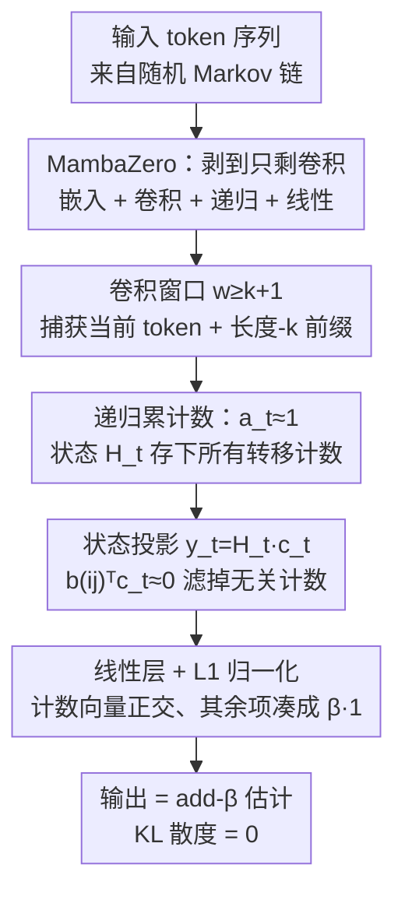

# From Markov to Laplace: How Mamba In-Context Learns Markov Chains

**会议**: ICLR 2026  
**OpenReview**: [https://openreview.net/forum?id=kmK3WSCOCT](https://openreview.net/forum?id=kmK3WSCOCT)  
**代码**: https://github.com/Bond1995/Markov-Mamba  
**领域**: 学习理论 / 状态空间模型 / 上下文学习  
**关键词**: Mamba, 上下文学习, Markov 链, Laplacian 平滑, 卷积, 表示能力

## 一句话总结
本文用「随机 Markov 链上的上下文学习」当显微镜，证明并实证：哪怕只有单层、单头的 Mamba（Selective SSM），也能在上下文里学到 Bayes 与 minimax 双重最优的 add-$\beta$（Laplacian 平滑）计数估计器——而其中真正起决定性作用的不是门控或非线性，而是**卷积**；作者进一步给出可精确复现该估计器的构造性证明，以及任何递归架构都逃不掉的 $\Omega(2^k)$ 隐状态维度下界。

## 研究背景与动机

**领域现状**：Transformer 推动了这一轮 AI 浪潮，但其序列长度上的二次复杂度和推理时线性增长的 KV-cache 让人持续寻找替代品。结构化状态空间模型（SSM）尤其是带选择性的 Mamba / Mamba-2，在多种语言建模任务上做到了与 Transformer 相当甚至更优的效果，同时推理吞吐大幅提升，成为最热门的替代架构。

**现有痛点**：人们对 Transformer「为什么 work」已经积累了不少机制级理解（比如 induction head 如何在上下文里做计数预测），但对 Mamba 的**根本学习能力**几乎是黑箱。已有研究大多停留在「实验上 Mamba 的 ICL 比 Transformer 强还是弱」的经验比较，结论甚至互相矛盾，缺乏一个形式化的、能说清「Mamba 到底在算什么」的理论。

**核心矛盾**：Mamba 的递归更新里塞了选择性衰减 $a_t$、输入相关的卷积、ReLU 非线性、门控等一堆组件，到底哪个组件在承担「上下文学习」这件事？没有一个干净的 sandbox 把它们拆开看，就只能凭直觉猜。

**本文目标**：用一个能严格刻画「最优解长什么样」的任务，系统回答两个子问题——(1) 单层 Mamba 在上下文里到底学到了什么估计器？(2) 是哪个架构组件让它学会的？并给出表示能力的上界（能精确实现）与下界（最少需要多大）。

**切入角度**：借用 Edelman 等人为 Transformer 设计的 **Markov-ICL 框架**——每条训练/测试序列都来自一条**随机抽取的** $k$ 阶 Markov 链（转移核从 Dirichlet 先验独立采样）。因为每条序列的转移分布都不同，模型在推理时**必须**就地（in-context）统计这条序列的转移频次才能最优预测下一个 token，这就把「上下文学习能力」逼了出来。更妙的是，这个任务的**贝叶斯最优解有闭式**——就是经典的 Laplacian add-$\beta$ 平滑计数估计器，于是「Mamba 学到了什么」变成了可被精确度量的问题。

**核心 idea**：把 Mamba 一步步剥离到只剩「卷积 + 递归」的最小骨架（MambaZero），证明这个骨架能**精确**（KL 散度为 0）复现 add-$\beta$ 估计器，从而首次在 Mamba 与最优统计估计器之间建立形式化联系。

## 方法详解

### 整体框架

全文是一条「实证现象 → 拆解归因 → 构造性证明 → 表示下界」的逻辑链，而非一个工程 pipeline。先把任务和最优解钉死：输入是来自随机 $k$ 阶 Markov 链的 token 序列，训练目标是逐 token 的交叉熵下一词预测；该任务的贝叶斯/minimax 最优预测器是 **Laplacian add-$\beta$ 平滑**

$$P_\beta^{(k)}\big(x_{t+1}=j \mid x_1^t\big) = \frac{n_j + \beta}{n + 2\beta},$$

其中 $n_j$ 是当前长度-$k$ 上下文后面跟 token $j$ 的次数，$n$ 是该上下文出现的总次数。要做到这个估计，模型必须在上下文里**就地计数**——这正是 ICL 的体现。

实验先抛出两个反直觉现象：① 单层 Mamba 就能锐利贴合最优估计器（Transformer 需要两层才能勉强做到，单层直接失败）；② 消融发现真正不可或缺的组件是**卷积**，去掉卷积模型彻底学不会，而只保留卷积的简化版 MambaZero 反而和完整 Mamba 一样好。沿着「卷积是关键」这条线，作者构造性地证明 MambaZero 能精确实现 add-$\beta$，并给出任何递归架构的维度下界。下图是 MambaZero 实现计数估计器的计算流，也是论文机制的核心：

### 关键设计

**1. MambaZero：把 Mamba 剥到只剩卷积，定位真正起作用的组件**

完整 Mamba-2 的递归是 $H_t = a_t H_{t-1} + \tilde{x}_t b_t^\top$，$y_t = H_t c_t$，再叠加门控 $z_t = y_t \odot \mathrm{ReLU}(W_z x_t)$ 和输出投影；其中 $\tilde{x}_t, b_t, c_t$ 都先经过逐维度卷积再做 ReLU。组件这么多，单看实验无法判断谁在干活。作者的做法是对三类组件逐一消融——输入选择性里的卷积、ReLU 非线性、以及 Mamba/MLP 里的门控——发现去掉卷积后 $|L(\theta)-L_\beta|$ 完全收不到 0（学不会任务），而去掉非线性和门控影响有限。于是他们顺势定义 **MambaZero**：只保留嵌入层、Mamba 块里的卷积、线性递归与最后的线性层，连 ReLU 和门控都去掉，预测层用 $L_1$ 归一化代替 softmax 以便理论分析。关键结论是：这个被剥光的 MambaZero 在 Markov 任务上的损失和完整 Mamba 一样贴近最优，说明**卷积（配合递归）才是上下文计数能力的承载体**，门控和非线性是锦上添花。这一步既是实证归因，也为后续证明提供了一个干净到能手算的对象。

**2. 卷积 + 递归 + 选择性如何拼出计数估计器**

这是全文的理论核心（Theorem 1）：存在一组 MambaZero 参数（取 $N=S$、$d=2S$、$e=1$、卷积窗口 $w=2$），使其输出对一阶有限状态 Markov 链**精确**等于 add-$\beta$ 估计器，即对所有序列和所有 $t$ 都有 $D_{\mathrm{KL}}\big(P_\beta^{(1)}(\cdot|x_1^t)\,\|\,P_\theta(\cdot|x_1^t)\big)=0$；由于该 KL 恰好是交叉熵损失相对最优解多付的代价，这等价于损失能被压到与最优完全相等。构造背后有两个被实验反复验证的机制支点。其一，**状态衰减 $a_t \approx 1$**：$a_t=\exp(-a\Delta_t)$ 控制过去信息流入当前状态的比例，训练收敛后模型把 $a_t$ 学到约等于 1（通过让 $a$ 或 $\Delta_t$ 趋零实现），这样状态 $H_t$ 才能把所有历史转移计数累加进去——展开递归后 $o_t = W_o \tilde{x}_0 b_0^\top c_t + \sum_{ij} n_{ij}\, W_o \tilde{x}(ij) b(ij)^\top c_t$，每个转移计数 $n_{ij}$ 都线性地进入输出。其二，**卷积窗口 $w \ge k+1$**：因为 $\tilde{x}_t, b_t, c_t$ 只通过卷积看到过去，窗口必须至少覆盖「当前 token + 长度-$k$ 前缀」才能算出 Laplacian 需要的上下文计数；若 $w \le k$ 就会出现「可混淆序列」——长度-$k$ 前缀计数相同但后继 token 计数不同——导致估计偏离最优（实验也证实 $w=k+1$ 恰好够用）。最后一道关键是**选择性读出**：训练后参数自然满足 $b(ij)^\top c_t \approx 0$（当 $i \ne x_t$ 时），于是只有与当前 token $x_t$ 真正相关的计数 $n_{x_t,j}$ 进入 logits，再让计数对应的向量两两正交、与计数无关的项之和恰好等于 $\beta\mathbf{1}$，经 $L_1$ 归一化即得 $(n_j+\beta)/(n+2\beta)$。对二元字母表，还可利用 $n_{01}$ 与 $n_{10}$ 至多相差 1 的强相关性，把隐维度从 $2S$ 进一步压到 $S=2$。

**3. 表示能力下界：任何递归架构的维度都必须随阶数指数膨胀**

构造证明了「能做到」，下界（Theorem 2）回答「至少要多大」。作者证明：对任意形如 $H_t = h_t(H_{t-1}, x_t)$、$y_t = g_t(H_t)$ 的递归模型（不限深度），若以 $p$ 比特精度逐点逼近 $k$ 阶 Laplacian 估计器到 $\ell_\infty$ 误差 $\varepsilon$，则必须满足 $d \cdot p \ge 2^k(1-3\varepsilon)\log(1/\varepsilon)$。也就是说隐状态维度 $d$ 必须随 Markov 阶数 $k$ **指数级**增长，且这个结论与深度无关——叠多少层都救不了。这正好刻画出 Mamba 这类递归架构与 Transformer 的本质分野：捕获 $k$ 阶过程，Mamba 隐维度要 $\Omega(2^k)$，而已知最好的 Transformer 结果只需三层、隐维度随 $k$ **线性**增长。反过来，对一阶源单层 Mamba 又比 Transformer 贴合得更锐利。两条结论合在一起，给出了「为什么 Mamba 在低阶/局部依赖上高效、在高阶长程依赖上吃力」的可证明解释。

### 一个完整示例

以二元序列 $x_1^t = 0\,1\,1\,0\,1$、当前 token $x_t = 0$、$\beta=1$ 为例走一遍机制：卷积窗口 $w=2$ 让每个时刻同时看到 $(x_{t-1}, x_t)$ 这对转移；随着序列推进、$a_t\approx1$，状态 $H_t$ 把各类转移计数累加起来，得到 $n_{01}=2, n_{11}=1, n_{10}=1$ 等。预测 $x_{t+1}$ 时当前上下文是 $x_t=0$，选择性读出 $b(0j)^\top c_t$ 只保留以 0 为前缀的计数 $n_{00}=0, n_{01}=2$，丢掉以 1 为前缀的计数。最终估计 $P(x_{t+1}=1\mid \cdot)=(n_{01}+\beta)/(n_0+2\beta)=(2+1)/(2+2)=0.75$——这正是 add-$\beta$ 平滑的输出，整条链路完全由「卷积取前缀 → 递归累计数 → 投影选相关计数 → 归一化加平滑」串成，没有用到门控或非线性。

### 损失函数 / 训练策略

训练目标是标准的逐 token 交叉熵下一词预测损失，模型用 AdamW 优化。理论分析里把 softmax 换成 $L_1$ 归一化预测，使「logits → 概率」这一步可解析地对上 add-$\beta$ 的分式形式；该 $L_1$ 化处理沿用了 Nichani 等、Rajaraman 等在 Transformer Markov 分析中的做法。

## 实验关键数据

### 主实验：单层 Mamba 贴合最优估计器

在随机 Markov 链上训练后，于固定测试序列上对比各模型的下一词预测概率与 add-$\beta$ 最优估计器的 $L_1$ 偏差（误差区间为 5 次运行标准差）。

| 模型 | 1 阶 | 高阶 (2–4 阶) | 与最优的吻合 |
|------|------|---------------|-------------|
| 单层 Mamba | 锐利贴合 | 仍贴合 | 最佳，几乎重合 |
| 单层 Transformer | 失败 | 失败 | 学不会任务 |
| 两层 Transformer | 贴合但偏松 | 贴合但偏松 | 次之 |
| 最优 add-$\beta$ 估计器 | — | — | 基准 |

结论与既有理论（单层 Transformer 无法高效实现 induction head、需两层）一致；线性注意力与 softmax 注意力在此表现相近。

### 消融实验：卷积是关键组件

| 配置 | 是否学会 Markov 任务 | 说明 |
|------|---------------------|------|
| 完整 Mamba | ✅ | 基准 |
| Mamba 去掉卷积 | ❌ | $\|L(\theta)-L_\beta\|$ 收不到 0，彻底失败 |
| MambaZero（只剩卷积） | ✅ | 与完整模型同样贴近最优 |

窗口大小实验进一步验证：要学会 $k$ 阶预测，必须 $w \ge k+1$，否则出现可混淆序列导致估计偏离。

### 推广实验：超越 Markov

- **切换 Markov 过程**：在字母表加入 switch token（$p_{\text{switch}}=0.01$），命中后重采转移核。最优策略是在两个 switch 之间用 add-$\beta$、遇到 switch 就清零计数。Mamba 精确学到这一策略——把 $a_t$ 在 $x_t=S$ 时置 0、其余时置 1，证明选择性衰减 $a_t$ 在非 Markov 场景下真正被激活。
- **自然语言（WikiText-103 困惑度）**：

| 模型 | 参数量 | 困惑度 |
|------|--------|--------|
| Mamba-2（无卷积） | 14.53 M | 30.68 |
| Mamba-2（有卷积） | 14.54 M | 27.55 |
| Transformer（无卷积） | 14.46 M | 29.28 |
| Transformer（有卷积） | 14.46 M | 28.67 |

卷积对两种架构都有帮助，但对 Mamba 提升更显著（11% vs. 2%），把「卷积是关键」的结论从合成 Markov 数据推广到了真实语言任务。

### 关键发现
- **卷积 > 门控 > 非线性**：在合成 Markov 任务上卷积是唯一不可或缺的组件；在语言任务上门控也开始变重要（约 17% 变化），说明组件重要性随数据复杂度迁移。
- **深度会稀释卷积的重要性**：层数增多时卷积的相对作用下降，可能因为其它 Mamba 层本身就能近似卷积。
- **$a_t$ 的「休眠」与「激活」**：纯 Markov 任务下最优解要求用上全部历史，故 $a_t\approx1$ 一直休眠；只有在 switching 这类需要「遗忘」的过程里，选择性才显出价值。

## 亮点与洞察
- **用「最优解可写成闭式」的任务当探针**：随机 Markov-ICL 的妙处在于贝叶斯最优解就是 add-$\beta$ 计数估计器，于是「模型学到了什么」从玄学变成了可测量的 KL=0，这套方法论可迁移到任何「有解析最优解」的合成任务上做机制分析。
- **把架构剥到能手算（MambaZero）再证明**：先用消融找到关键组件、再把模型简化到只剩该组件，让构造性证明既干净又与实证学到的参数结构对齐——证明里的 $a_t\approx1$、$w=k+1$、$b^\top c\approx0$ 都是先在训练好的模型里观察到、再写进构造的。
- **上界与下界配成一对**：Theorem 1 说「能精确做到」、Theorem 2 说「至少要 $\Omega(2^k)$ 维」，正负两面合起来把 Mamba 与 Transformer 在 Markov 阶数上的指数 vs. 线性差异讲清楚，可直接用来解释 SSM 在长程/高阶依赖上的吃力。

## 局限与展望
- **构造证明限于一阶有限状态过程**：Theorem 1 只对一阶 Markov 给出精确构造，高阶只有 Fig. 1b 的实证「强烈暗示」，尚无证明。
- **只谈表示能力、不谈学习动力学**：本文回答「Mamba 能不能表示最优估计器」，但「梯度下降为何/如何收敛到这个解」留作未来工作，因此无法保证训练一定学到构造里的参数。
- **任务高度受控**：随机 Markov 链是干净的 sandbox，与真实语言的长程、层次依赖差距很大；语言实验只验证了「卷积有用」这一条结论的推广性，并未验证「学到 add-$\beta$」本身。
- **改进方向**：把构造推广到任意阶、刻画学习动力学、以及研究多层 Mamba 中卷积作用被其它层接管的机制，都是自然的下一步。

## 相关工作与启发
- **vs. Transformer 的 Markov-ICL 分析（Edelman 等、Rajaraman 等）**：他们用同一框架揭示 Transformer 靠 induction head 做上下文计数、需两/三层；本文首次把该框架用于 Mamba/SSM，发现单层即可，且关键组件是卷积而非注意力，并给出指数 vs. 线性的维度分野。
- **vs. 「Mamba 能否做 ICL」的经验研究（Grazzi 等 / Halloran 等 / Park 等）**：这些工作结论互相矛盾且停留在经验层面；本文提供了首个把 Mamba 连到最优统计估计器的形式化结果，给经验争论一个可证明的锚点。
- **vs. SSM 表达能力的形式语言视角（Merrill 等、Sarrof 等、Cirone 等）**：他们多从形式语言/状态错觉角度论 SSM 的局限；本文从「精确实现某个统计估计器 + 维度下界」的角度切入，两条路线互补。

## 评分
- 新颖性: ⭐⭐⭐⭐⭐ 首次把单层 Mamba 与 Bayes/minimax 最优的 Laplacian 估计器精确挂钩，并配上下界。
- 实验充分度: ⭐⭐⭐⭐ 合成任务消融扎实、与理论高度吻合，但真实语言侧只验证了「卷积有用」一条推论。
- 写作质量: ⭐⭐⭐⭐⭐ 逻辑链「现象→归因→构造→下界」清晰，证明与实证互相印证。
- 价值: ⭐⭐⭐⭐⭐ 给 SSM/Mamba 的机制理解提供可证明的基石，并解释了卷积的不可替代性。

<!-- RELATED:START -->

## 相关论文

- [\[ICLR 2026\] Infinite Horizon Markov Economies](infinite_horizon_markov_economies.md)
- [\[ICLR 2026\] Theory of Scaling Laws for In-Context Regression: Depth, Width, Context and Time](theory_of_scaling_laws_for_in-context_regression_depth_width_context_and_time.md)
- [\[ICLR 2026\] Towards a Theoretical Understanding of In-Context Learning: Stability and Non-i.i.d. Generalisation](towards_a_theoretical_understanding_of_in-context_learning_stability_and_non-iid.md)
- [\[ICLR 2026\] Pretrain–Test Task Alignment Governs Generalization in In-Context Learning](pretraintest_task_alignment_governs_generalization_in_in-context_learning.md)
- [\[ICLR 2026\] Transformers with Endogenous In-Context Learning: Bias Characterization and Mitigation](transformers_with_endogenous_in-context_learning_bias_characterization_and_mitig.md)

<!-- RELATED:END -->
