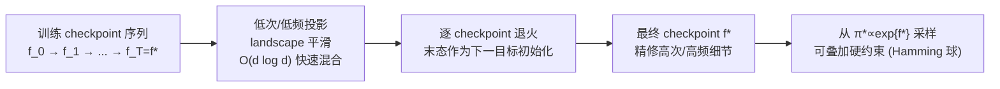

# From Predictors to Samplers via the Training Trajectory

**会议**: ICLR 2026  
**OpenReview**: [https://openreview.net/forum?id=JAOOOgzVUl](https://openreview.net/forum?id=JAOOOgzVUl)  
**代码**: 待确认  
**领域**: 学习理论 / 采样 / MCMC / 训练动力学  
**关键词**: 训练轨迹退火, coarse-to-fine, 谱偏置, NTK, Boolean 函数, GWG, 混合时间  

## 一句话总结
不训练任何额外生成模型，直接复用一个已训练预测器在**训练过程中留下的 checkpoint 序列**做"轨迹退火"MCMC——早期 checkpoint 自带 coarse-to-fine 的平滑、能快速混合，晚期 checkpoint 补细节，从而把崎岖 / needle 型 landscape 上原本指数级的采样混合时间压到近线性。

## 研究背景与动机
**领域现状**：在医疗设备、推荐、信贷评分等结构化数据场景，部署的主力仍是小型 CNN/MLP 而非大 Transformer。从这些**已训练好的标量预测器** $f^*:\mathcal{X}\to\mathbb{R}$ 中采样（即从其诱导的 Gibbs 密度 $\pi^*(x)\propto\exp\{f^*(x)\}$ 采样）有两大刚需：一是**可解释性**（采样最小反事实编辑，揭露皮肤癌 CNN 把手术标记当病灶之类的捷径偏差），二是**主动设计**（从 DNA-转录因子亲和力、蛋白适应度模型里采高价值候选）。

**现有痛点**：当 landscape 崎岖（高频高幅波动制造大量尖锐局部最优）或存在**协同效应 / needle gadget**（只有罕见的多变量联合配置才有回报，单变量看不出名堂）时，局部采样器退化为超立方体上的随机游走，命中时间随 needle 维度和协同阶数**指数爆炸**。

**核心矛盾**：要解决这个难题，传统路线是训练一个 reward-conditioned diffusion 或 walk-jump 采样器，但有三宗罪——(1) 需额外训练一个生成模型、吃大量算力，与"复用已有预测器"相悖；(2) 想加 Hamming 球这类**硬约束**得另搭 guidance 网络或 SMC 机制；(3) 不能直接对一个已部署模型做可解释性采样。而纯 test-time 的温度退火 MCMC（并行回火、AIS 等）只能放松势垒、给不出方向性引导，对罕见协同依然是随机游走，混合时间仍指数。

**本文目标**：在**纯 plug-and-play、零额外算力**的前提下，把崎岖/needle landscape 上的采样从指数加速到近线性。

**核心 idea（训练轨迹退火）**：神经网络训练天然是 coarse-to-fine 的——**早期 checkpoint 压制高次/高频分量（Boolean 单项式按 degree 排序、球谐函数在 NTK 下按 degree 衰减），晚期 checkpoint 才恢复细节**。于是不只对 $\pi^*$ 采样，而是沿训练 checkpoint 序列 $\{f_t\}_{t=0}^T$ 逐个用 $\pi_t(x)\propto\exp\{f_t(x)\}$ 做短链 MCMC：早期高流动性提议负责"探索/找到模式所在"，晚期负责"精修"。整个过程不改训练、不加任何计算。

## 方法详解

### 整体框架
方法本身极简：给定一个 MSE 训练的预测器及其训练过程中保存的 checkpoint 序列 $\{f_t\}_{t=0}^T$（$f_T\equiv f^*$），定义中间目标 $\pi_t(x)\propto\exp\{f_t(x)\}$。从 $t=0$ 出发，在每个 $\pi_t$ 上跑 $N_t$ 步短 Markov 核，把末态作为下一个 checkpoint $\pi_{t+1}$ 的初始化，coarse-to-fine 一路推进到 $t=T$。离散变量用 GWG+MH（Gibbs-with-Gradients + Metropolis-Hastings）核，连续变量用 MALA。真正的"内核"是它背后的理论论证：为什么早期 checkpoint = 低次/低频投影，以及为什么在这些投影上混合会从指数变线性。

### 关键设计

**1. 度数化 checkpoint 假设：把训练轨迹读成"低次→高次的投影序列"。** 全文的理论支点借自 Abbe et al. (2023) 的分层学习结论——SGD 拟合稀疏 Boolean 目标时低次单项式先收敛（涉及变量更少 ⇒ 梯度对齐更强），训练时间被最大的 "leap"（一次需新增的变量数）主导。本文把它直接抬成一个工作假设：沿轨迹存在递增 checkpoint $\tau_0<\tau_1<\cdots<\tau_K$，使得在 $\tau_k$ 时模型已学到所有 $\le k$ 次的交互、更高次仍可忽略，即可把 $f_{\tau_k}$ 近似当作最终模型的 degree-$k$ 投影 $f_{\le k}(x):=\sum_{|S|\le k}\hat f^*(S)\prod_{i\in S}x_i$。作者在 FCNN/CNN 上补了经验证据：低次 Fourier–Walsh 分量更早对齐，且 degree-wise 质量要等该次所有单项式对齐后才增长（Transformer 满足前者不满足后者——这正是方法不适用 Transformer 的伏笔）。

**2. 高频高幅势垒：用早期 checkpoint 绕过指数壁。** 以 $\pi_\gamma(x)\propto\exp\{\sum_i x_i+\gamma\prod_i x_i\}$ 为例，线性项偏好多 $+1$，而 parity 项 $\prod_i x_i$ 在 $|\gamma|$ 大时筑起高墙——低温下 vanilla Gibbs 一旦落到满足 parity 的态，任何增加 $+1$ 的移动都要翻越 $|\gamma|$ 量级的壁，混合时间 $\tilde\Theta(\exp\{c|\gamma|\})$。轨迹采样器先在 $\tau_1$ 跑一小段（此时高次 parity 还没学进来，landscape 平滑，Gibbs 以 $O(d\log d)$ 混合）迅速抵达多 $+1$ 的态，再切到最终 checkpoint 调整 parity，于是近线性命中全局最优，整段绕开指数壁。

**3. 协同 needle：低次投影把随机游走变成 Curie–Weiss 上的快混。** 对指示函数 $f^*(x)=\mathbf{1}\{x=z^\star\}$，在 Walsh 基下展开为 $2^{-d}\sum_S\prod_{i\in S}(z^\star_i x_i)$，因为密度在 needle 之外几乎处处平坦，局部链就是超立方体上的随机游走，指数于 $d$。但取对齐自旋 $y_i:=x_i z^\star_i$，degree-$\le2$ 的代理 $f_{\le2}(y)\approx 2^{-d}(\sum_i y_i+\sum_{i<j}y_i y_j)$ 恰是带正外场的 **Curie–Weiss Hamiltonian**——低温下用常数条并行链 $O(d\log d)$ 步即可高概率命中 $z^\star$。这一步把指数随机游走转成近线性混合，且低次投影同时充当"联想记忆"，能存取多个 needle（经由 Hopfield 模型连接）。作者还观察到单调规律：$k$ 越大 landscape 越尖、命中越慢，$k=2$ 最快，但任意 $k<d$ 的中间 checkpoint 都有帮助。

**4. 连续域的 NTK 视角：训练轨迹 = 一连串热核平滑版本。** 在球面 $S^{d-1}$ 上，Gaussian/diffusion 平滑对球谐函数按度数作用，degree-$k$ 系数乘以 $M_k(t)=\exp\{-t\,k(k+d-2)\}$（$t$ 越大越平滑、$k$ 越高衰减越强）。NTK 训练（无限宽、零初始化、均匀数据的理想 FCNN）同样按球谐度数作用，ReLU 下 $M_k\sim\Theta(k^{-d})$、Tanh 下 $\Theta(k^{-d}e^{-\sqrt k})$。结论是 NTK 的训练轨迹 $\{f_t\}$ 本身就免费提供了一族"$f^*$ 的渐次平滑版本"，与显式热核平滑同效，但 diffusion 需要额外学这些平滑函数——这就是"零额外算力"的连续域根基。

## 实验关键数据

### 主实验表格
统一**匹配算力**对比：合成 Boolean、binary MNIST-EBM、DNA 设计（含约束采样）、Ackley-10D、超导体设计。离散用 GWG，连续用 SMC 家族。

| 任务 | 本文方法 | 最强 baseline | 说明 |
|---|---|---|---|
| 高频高幅 8 变量多项式 (Table 1) | **0.52** 成功率 / 仅 40 步 | GWG+TempAnneal 0.04 / 2000 步 | 50× 更少步数仍碾压 |
| MNIST-EBM FID↓ 10K 步 (Table 5) | **5.49** | Temp-GWG 21.12 | 1K 步时 11.73 vs 29.61 |
| DNA 设计 适应度中位数 (Table 6) | **10.04** (Pct. 99.78) | GWG 2.72 | motif 命中 74% vs 39% |
| DNA 约束采样 Hamming≤7 (Table 7) | **7.42** (Pct. 99.45) | GWG 2.09 / PT-GWG 1.92 | motif 63% vs 31% |
| Ackley-10D Best↓ (Table 8) | **3.69** (SMC-Train) | 7.86 (SMC-Temp) | CI 不重叠 |
| 超导体 Tc↑ Best (Table 8) | **318.4** | 107.4 (多 baseline 持平) | 超过参考值 185 |

### 消融实验表格

| 指示函数维度 $d$ (Table 2) | 本文成功率 | GWG 成功率 |
|---|---|---|
| 3 | 0.98 | 0.47 |
| 5 | 1.00 | 0.21 |
| 8 | 1.00 | 0.17 |
| 10 | 0.99 | 0.12 |

- **对抗非凸线性项 (Table 3)**：在指示函数上加反向 degree-1 项，本文仍 1.00，GWG 仅 0.08——因指示项主导稳态测度、低次展开里局部场仍由它支配。
- **多 needle (Table 4)**：3 个长度-5 非重叠指示同时命中，本文 1.00，GWG 0.025（单 needle 时 GWG 还有 0.21，叠到 3 个就崩到 ~3%）。
- **checkpoint 数量消融 (App. G)**：在很宽的 checkpoint 数范围内都显著优于 baseline。

### 关键发现
- GWG 的条件命中中位数仅 1–4 步，说明它**几乎只在初始化就靠近目标时才成功**，命中率随 $d$、协同数、虚假变量数指数衰减；本文方法靠"低次快混 + 从低次投影获知 support"两件事，在这些 regime 都不退化。
- 每个合成任务都掺了 **500 个虚假变量**做压力测试，本文方法不受影响。
- 约束采样（Hamming 球）只需把 MCMC 链限制在约束集内即可天然支持，diffusion 需另加 guidance/SMC 机制——这是 predictor-based 路线的实用优势。

## 亮点与洞察
- **"训练轨迹即免费退火阶梯"这一视角是真正的新意**：以往退火靠温度或显式平滑，这里直接把 SGD coarse-to-fine 的副产物（checkpoint 序列）当成现成的 degree-wise 平滑序列，零额外训练/算力。作者称这是首个用训练轨迹改进采样的工作。
- 离散域有**干净的理论闭环**：借 Abbe 的 leap 复杂度 + Curie–Weiss 混合时间，把"指数→$O(d\log d)$"讲成可证的结论，而非纯经验。
- **连续与离散的统一解释**：连续靠 NTK 球谐谱衰减、离散靠 Boolean degree 排序，本质都是"低频/低次先学"的谱偏置，方法因此跨 FCNN/CNN/ResNet（2–20 层）通用。
- 约束采样的天然支持 + 对已部署模型的可解释性采样，是相对 diffusion 路线的差异化卖点。

## 局限与展望
- **不适用 Transformer**：分层学习/度数化 checkpoint 假设是 FCNN-specific（可迁移到 CNN/ResNet），Transformer 通过 attention 学交互、谱结构不同，经验上只满足"低次先对齐"却不满足"degree-wise 质量延后增长"。作者把推广到 Transformer 列为 future work。
- 理论保证建立在**理想化假设**上（Abbe 的受限两层网络 + 修改版 SGD；NTK 无限宽零初始化），对真实大网络只是"假设其成立"并补经验证据，degree-化 checkpoint 的存在性是假设而非证明。
- 依赖训练时**保存了足够密的 checkpoint 序列**；若只有最终模型则方法不可用（不过这是训练侧的轻量要求）。
- 评测聚焦 CNN/MLP 友好的科学设计/EBM 任务，未覆盖更广义的现代生成场景。

## 相关工作与启发
- **平滑加速采样**：reward-conditioned diffusion、walk-jump（Yuan 2023；Frey 2024）、图平滑蛋白适应度（Kirjner 2024，Zhu 2025 指出其谱偏置压制高次单项式）——本文区别在"用训练自带平滑、零额外算力"，故刻意不与显式平滑法对标。
- **test-time MCMC**：并行回火/AIS 等温度退火无法绕开罕见协同的随机游走；Diffusive Gibbs（Chen 2024）、IRED（Du 2024）引入辅助噪声变量但仍依赖 test-time 局部能量梯度的信息量。
- **离散采样**：GWG（Grathwohl 2021）用梯度选翻转坐标，及其后续 locally-balanced 提议、discrete Langevin、cyclical 调度、MALA 式离散核等——本文与所有这些梯度型离散核兼容，实验统一用 GWG。
- **coarse-to-fine 学习理论**：diffusion 的低频先学（Wang 2025）、SGD 的 saddle-to-saddle 多阶段动力学（Abbe 2023）、NTK 谱主导早期粗结构（Murray 2022）——本文把这条理论线第一次接到"采样"上。
- **启发**：训练轨迹/中间 checkpoint 是被长期丢弃的免费资源，"把训练动力学读成退火/课程"的思路可能推广到约束优化、主动学习、模型审计；也提示对 Transformer 找到等价的"度数化中间表示"是有价值的开放问题。

## 评分
- **新颖性**: ⭐⭐⭐⭐⭐ 把"训练轨迹"当作免费退火阶梯用于采样，是清晰且前人未做的新视角，理论与方法都自洽。
- **实验充分度**: ⭐⭐⭐⭐ 合成压力测试 + EBM + DNA(含约束) + 连续材料设计，匹配算力、带 CI、消融到位；但偏 CNN/MLP 友好任务，规模有限。
- **写作质量**: ⭐⭐⭐⭐ 动机—理论—实验链条扎实，Boolean/NTK 两条线讲得清楚；公式与定性图配合好，部分关键证明压在附录。
- **价值**: ⭐⭐⭐⭐ 零额外算力、即插即用、天然支持硬约束，对科学设计与模型可解释性有直接实用价值，唯独 Transformer 缺口限制了通用性。

<!-- RELATED:START -->

## 相关论文

- [\[ICLR 2026\] Diffusion Language Models are Provably Optimal Parallel Samplers](diffusion_language_models_are_provably_optimal_parallel_samplers.md)
- [\[ICLR 2026\] Strong Correlations Induce Cause Only Predictions in Transformer Training](strong_correlations_induce_cause_only_predictions_in_transformer_training.md)
- [\[ICLR 2026\] Training-Free Determination of Network Width via Neural Tangent Kernel](training-free_determination_of_network_width_via_neural_tangent_kernel.md)
- [\[ICLR 2026\] Tractability via Low Dimensionality: The Parameterized Complexity of Training Quantized Neural Networks](tractability_via_low_dimensionality_the_parameterized_complexity_of_training_qua.md)
- [\[ICLR 2026\] On the Convergence of Two-Layer Kolmogorov-Arnold Networks with First-Layer Training](on_the_convergence_of_two-layer_kolmogorov-arnold_networks_with_first-layer_trai.md)

<!-- RELATED:END -->
