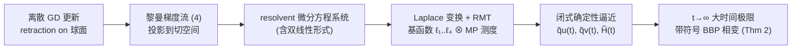

# Gradient Descent Dynamics of Rank-One Matrix Denoising

**会议**: ICLR 2026  
**OpenReview**: [https://openreview.net/forum?id=S5oAnaIbgb](https://openreview.net/forum?id=S5oAnaIbgb)  
**代码**: 待确认  
**领域**: learning theory / high-dimensional statistics  
**关键词**: 矩阵去噪, 梯度下降动力学, 随机矩阵理论, BBP 相变, spiked model, 闭式解  

## 一句话总结
本文用大维随机矩阵理论给出**矩形（Wishart）rank-one 矩阵去噪问题中梯度下降学习轨迹的闭式确定性逼近**，证明了估计与真值内积过程的几乎必然收敛，并揭示其大时间极限对应一个带符号的 BBP 相变。

## 研究背景与动机
- **领域现状**：矩阵去噪（从 $X = P + Z$ 中恢复低秩信号 $P$）是统计与机器学习的基础问题。经典理论（spiked model + BBP 相变）已经把 SVD 顶奇异向量的"静态/渐近"性能刻画得很透彻——当 SNR 超过临界阈值时顶奇异向量与真值的对齐度发生相变。
- **现有痛点**：当维度 $p,n$ 很大时直接做 SVD 的存储和计算开销难以承受，实践中普遍改用**梯度下降（GD）**这类迭代法优化二次代价。但 GD 的**学习动力学**——尤其是描述其精确轨迹的解析解——在文献里几乎被忽视。AMP 虽有理论但依赖特定先验分布、问题专用；GD 不依赖先验、适用面广，却缺乏轨迹刻画。
- **核心矛盾**：唯一最相关的工作 (Bodin & Macris, 2021) 只解决了**对称 Wigner 模型**（$P,Z$ 对称）的闭式动力学；而真实数据通常是序列 $\{x_j\}$ 堆成的**矩形 Wishart 模型**，其结构非对称、控制方程阶数更高，解析求解显著更难，此前没人做出来。
- **本文目标**：填补矩形 Wishart 模型下 GD 学习动力学的空白——给出内积 $q_u(t)=\langle u^*,u_t\rangle$、$q_v(t)=\langle v^*,v_t\rangle$ 的闭式确定性逼近、收敛证明与大时间渐近分析。
- **核心 idea**：**用大维随机矩阵理论（RMT）构造近似解** —— 把 GD 的黎曼梯度流写成关于特征函数（resolvent）的微分方程系统，再经 Laplace 变换求解，最终把动力学表达成若干"基函数"对 Marčenko-Pastur 测度的积分。

## 方法详解

### 整体框架
研究对象是 rank-one Johnstone spiked 模型 $X = Z + \lambda\, u^* v^{*\top}\in\mathbb{R}^{p\times n}$，以二次代价 $H(u,v)=\tfrac12\|X-uv^\top\|_F^2$ 为目标，在单位球面上做带投影的黎曼梯度流。整条分析链路是：**(1) 把离散 GD 近似为黎曼梯度流 → (2) 用 resolvent 把内积演化写成微分方程系统 → (3) Laplace 变换 + RMT 解出闭式确定性逼近 → (4) 取 $t\to\infty$ 得到带符号的 BBP 相变**。

### 关键设计

**1. 黎曼梯度流建模：把球面约束的 GD 化成可解的连续动力学。** 估计量被约束在单位球面 $\|u\|_2=\|v\|_2=1$ 上，作者把小步长 GD 近似为黎曼梯度流 $\frac{d}{dt}(u_t,v_t)^\top = -\mathrm{grad}(H)$，其中梯度被投影到切空间 $\mathrm{proj}_x(y)=(I-xx^\top)y$ 以自动保持单位范数。关注量是估计与真值的内积 $q_u(t),q_v(t)$（与距离 $\|x^*-x\|_2^2=2-2\langle x,x^*\rangle$ 等价）。Remark 7 进一步给出离散—连续误差界 $\max_k(\|\tilde u_k-u_{k\eta}\|_2,\|\tilde v_k-v_{k\eta}\|_2)\le C(\eta+\eta^2)$，从而把对连续流的分析合法地迁移回有限学习率的真实 GD。

**2. 闭式确定性逼近（Theorem 1）：基函数 ⊗ MP 测度的积分表示。** 这是全文核心。作者证明随机过程 $q_u(t),q_v(t)$ 在 $p,n\to\infty$ 时**几乎必然一致收敛**到确定性函数 $\tilde q_u(t)=\hat q_u(t)/\sqrt{\hat p(t)}$、$\tilde q_v(t)=\hat q_v(t)/\sqrt{\hat p(t)}$。其中 $\hat q_u,\hat q_v,\hat p$ 由四个**基函数** $\ell_{1,x}(t)=\cosh(\sqrt{x}t)$、$\ell_{2,x}(t)=\tfrac{1}{2\sqrt x}\sinh(2\sqrt x t)$、$\ell_{3,x}(t)=\tfrac{1}{\sqrt x}\sinh(\sqrt x t)$、$\ell_{4,x}(t)=\cosh(2\sqrt x t)$ 与 Marčenko-Pastur 测度 $\mu(dx)$ 卷积、积分而成（含 $\vartheta_\lambda=(1+\lambda^2)(c+\lambda^2)/\lambda^2$ 这类由维度比 $c=p/n$ 与 SNR $\lambda$ 决定的常数）。表达式只依赖 $(c,\lambda,\alpha_u,\alpha_v)$，其中 $\alpha_u=\langle u_0,u^*\rangle,\alpha_v=\langle v_0,v^*\rangle$ 是初始对齐度——这意味着**所有满足相同初始内积的初值点共享同一渐近学习曲线（旋转不变性）**。虽然积分/卷积繁多，但因 MP 测度支撑有界，用矩形法离散即可，复杂度仅 $O(N_t^2 N_x)$，对 $t$ 多项式可算。

**3. 带符号的大时间相变（Theorem 2）：比 BBP 多出一个符号信息。** 取 $t\to\infty$，作者得到 $\tilde q_u^\infty = I\cdot\sqrt{\tfrac{1-c\lambda^{-4}}{1+c\lambda^{-2}}}\,\mathbf 1\{\lambda>c^{1/4}\}$（$\tilde q_v^\infty$ 类似），其中符号 $I=\mathrm{Sgn}\{\tfrac{\alpha_v}{\sqrt{1+\lambda^2}}+\tfrac{\alpha_u}{\sqrt{\lambda^2+c}}\}$。当 $\lambda<c^{1/4}$ 时估计渐近平凡（内积 $\to0$），跨过临界阈值 $c^{1/4}$ 即发生相变——其**幅值与经典 BBP 完全一致**，但 BBP 给的是无符号的 $|\langle\hat u_1,u^*\rangle|^2$，本文额外给出**符号**：当 $\tfrac{\alpha_v}{\sqrt{1+\lambda^2}}+\tfrac{\alpha_u}{\sqrt{\lambda^2+c}}=0$ 这一临界初值时估计变得困难。这把"能不能恢复"从只看 SNR，细化到"SNR + 初始对齐方向"的联合条件。

**4. 把动力学变成可用工具：早停、SNR 估计与损失景观洞察。** 因为 $\tilde q_u,\tilde q_v$ 闭式可算，作者由此构造若干应用：(i) **早停**——给定性能阈值 $\gamma$，停止时刻 $\hat t=\inf\{t:\min(\tilde q_u(t),\tilde q_v(t))\ge\gamma\}$ 可由 line search 求得，复杂度仍 $O(N_t^2 N_x)$；(ii) **SNR 估计**——固定信号方向，用观测曲线与理论曲线在 $C([0,T])$ 范数下的拟合反解 $\hat\lambda$；(iii) **损失景观**——Corollary 2 给出损失渐近 $\lim_t \tilde H(t)=J\cdot[\sqrt{\vartheta_{\lambda,c}}-1-\sqrt c]$，由于随机初始化下 $P(J=0)=1$，说明 GD 能到达全局最优、避开鞍点。

## 实验关键数据

> 本文是理论工作，"实验"即数值仿真验证定理。仿真用 (17) 式的黎曼 GD，学习率 $\eta=0.005$。

### 主验证：确定性逼近的精度

| 设置 | 参数 | 观察 |
|------|------|------|
| 精度验证（Fig.1） | $p=900,\ n=1200$；$u^*$ 高斯、$v^*$ Bernoulli(0.3) 后归一化；$u_0\propto 10u^*+z_1$、$v_0\propto 5v^*+z_2$ | 仿真曲线 $q_u,q_v,H$ 与理论 $\tilde q_u,\tilde q_v,\tilde H$ **高度重合**，验证 Thm 1 + Cor 1 |
| 低于阈值 | $\lambda=0.3<c^{1/4}$ | 内积随 $t$ 趋于 0，估计平凡 |
| 高于阈值 | $\lambda=1.5>c^{1/4}$ | 内积收敛到正的 $\tilde q^\infty$，验证 Thm 2 |

### 进一步分析

| 实验 | 设置 | 关键发现 |
|------|------|----------|
| SNR 影响（Fig.2） | $c=0.5,\ \alpha_u=0.211,\ \alpha_v=-0.121$ | $\lambda\le c^{1/4}=0.841$ 时内积 $\to0$；超过则收敛到正极限。SNR 越高学得越快，但**初期损失可能更大**——快速降损不等于最终更好 |
| 初值影响（Fig.3） | $c=0.5,\ \alpha_v=0.4$，$\lambda=1.5$ 与 $0.2$ | 当 $\tfrac{\alpha_v}{\sqrt{1+\lambda^2}}+\tfrac{\alpha_u}{\sqrt{c+\lambda^2}}=0$（红实线临界初值）时估计困难，验证带符号相变与 Cor 2 |

### 关键发现
- 确定性逼近**随 SNR 升高更精确**：低 SNR 下噪声 $Z$ 主导，$q_u,q_v$ 随机性更强。
- 学习是**全局过程**：高潜力（高 SNR）数据初期损失下降反而慢，最终却收敛到更低水平。
- 高 SNR 下估计量与噪声的相关 $\tilde g_{u,v}(t)\approx\langle u_t, Z v_t\rangle$ 随 $\lambda\to\infty$ 趋于 0。

## 亮点与洞察
- **首次给出矩形 Wishart 模型 GD 动力学的闭式解**：突破了此前只能处理对称 Wigner 模型的限制，技术上要处理结构非对称、双线性形式的几乎必然收敛、高阶隐式 Laplace 极点。
- **带符号的 BBP**：经典 BBP 只给无符号的对齐幅值，本文把"动力学+初值"纳入，给出符号信息，从而可借先验确定真值方向的置信区间。
- **理论可直接落地**：闭式解使早停时间、SNR 估计都变成 $O(N_t^2 N_x)$ 的可算量，给高维信号估计提供了可操作的调参依据。
- **与统计物理对照**：相比 CHSCK 方程那种隐式、纯数值的 Langevin 动力学刻画，本文闭式表达更可解释、更可算。

## 局限与展望
- **rank-one 限定**：只处理秩 1 spiked 模型，更高秩或张量情形（鞍点数随维度指数增长）尚待推广。
- **连续流近似**：核心定理建立在梯度流上，虽有 $O(\eta+\eta^2)$ 的离散误差界兜底，但大学习率/非渐近区间仍未覆盖。
- **i.i.d. 噪声假设**：依赖 $Z$ 元素 i.i.d.、四阶矩有限等 RMT 标准假设，相关噪声/结构化噪声未讨论。
- **未来方向**：作者明确指向用流形上随机微积分把框架推广到 **SGD（带梯度噪声）**，以及推广到张量/混合 matrix-tensor 结构。

## 相关工作与启发
- **静态/渐近线**：spiked Wigner / Wishart 模型、BBP 相变 (Baik et al., 2005) 及其在相关噪声、随机特征、puncturing 等方向的推广——共性是用极值特征向量做恢复，但只刻画终态。
- **迭代算法线**：AMP 在信息论框架下能达最小 MSE 并有 SNR 边界，但依赖先验、问题专用；GD 不依赖先验、适用广，本文正是补上 GD 这条线的动力学刻画。
- **最直接前驱**：(Bodin & Macris, 2021) 解决对称 Wigner 的闭式动力学，但未研究解的存在唯一性与解析性质；本文不仅推广到 Wishart，还补全了特征方程解的积分表示与存在唯一性证明。
- **启发**：这套"resolvent 微分方程 + Laplace + RMT"的框架可迁移到其他高维学习问题（如核回归、随机特征模型）的动力学分析，是连接 GD 动力学与随机矩阵理论的一个可复用范式。

## 评分
- **新颖性**: ⭐⭐⭐⭐⭐ 首次给出矩形 Wishart 模型 GD 学习轨迹的闭式确定性逼近，并把 BBP 相变推广到带符号版本，理论上是实打实的新结果。
- **实验充分度**: ⭐⭐⭐ 作为理论文章，数值仿真（Fig.1-3）系统地覆盖了精度、SNR、初值三类验证，足以支撑定理；但无真实数据/下游任务，纯验证性质。
- **写作质量**: ⭐⭐⭐⭐ 结构清晰、定理-推论-remark 层层递进，应用动机（早停/SNR 估计）交代到位；公式密度极高，对非 RMT 背景读者门槛较陡。
- **价值**: ⭐⭐⭐⭐ 在理解 GD 动力学这一深度学习核心问题上提供了干净可算的解析样板，早停/SNR 估计等应用有实际意义，对高维统计与优化理论社区价值明确。

<!-- RELATED:START -->

## 相关论文

- [\[ICLR 2026\] Interactive Learning of Single-Index Models via Stochastic Gradient Descent](interactive_learning_of_single-index_models_via_stochastic_gradient_descent.md)
- [\[ICLR 2026\] Continuum Transformers Perform In-Context Learning by Operator Gradient Descent](continuum_transformers_perform_in-context_learning_by_operator_gradient_descent.md)
- [\[ICLR 2026\] Computational Bottlenecks for Denoising Diffusions](computational_bottlenecks_for_denoising_diffusions.md)
- [\[ICLR 2026\] On the Benefits of Weight Normalization for Overparameterized Matrix Sensing](on_the_benefits_of_weight_normalization_for_overparameterized_matrix_sensing.md)
- [\[ICLR 2026\] Transformers Learn Latent Mixture Models In-Context via Mirror Descent](transformers_learn_latent_mixture_models_in-context_via_mirror_descent.md)

<!-- RELATED:END -->
