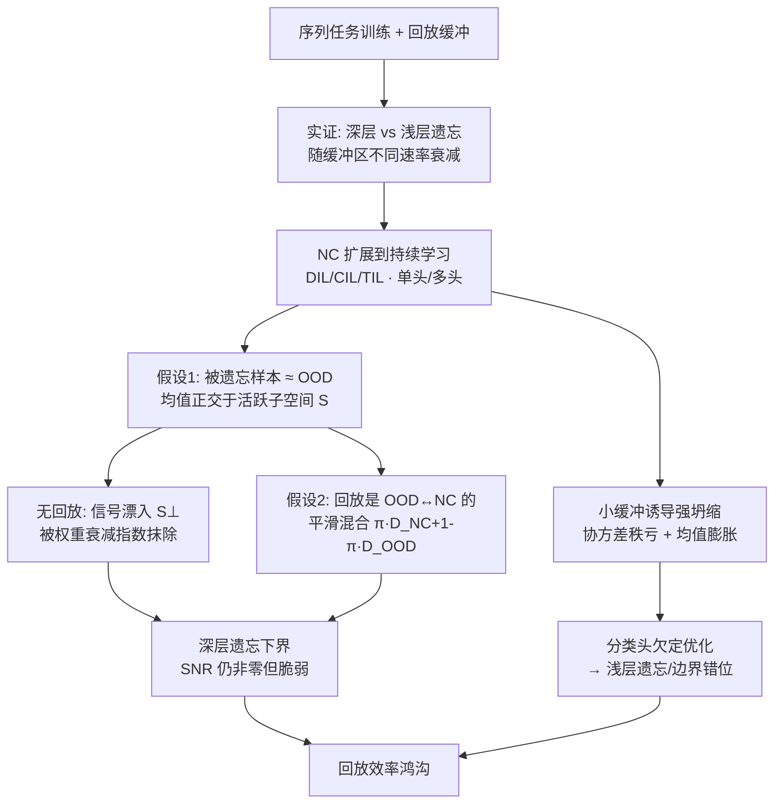

# Heads Collapse, Features Stay: Why Replay Needs Big Buffers

**会议**: ICLR 2026  
**OpenReview**: [https://openreview.net/forum?id=IdW0d0mRnG](https://openreview.net/forum?id=IdW0d0mRnG)  
**代码**: 待确认  
**领域**: 持续学习理论 / Neural Collapse / OOD 检测  
**关键词**: 持续学习, 经验回放, 灾难性遗忘, Neural Collapse, 线性可分性, OOD 检测  

## 一句话总结
本文把"深层遗忘(特征空间)"与"浅层遗忘(分类头)"拆开,用 Neural Collapse 理论证明:任意非零回放比例都能渐近保住过去任务特征的线性可分性,但小缓冲区会让分类头落入"欠定优化",导致协方差秩亏、类均值膨胀,从而需要远大得多的缓冲区才能修复输出层对齐——这就是"回放效率鸿沟"。

## 研究背景与动机

**领域现状**：持续学习(Continual Learning)的目标是让网络在任务序列上不断学习而不灾难性遗忘。经验回放(Experience Replay)——存一小撮旧样本和新数据联合训练——是最有效也最常用的策略。一个被反复观察到的悖论是：即便网络的输出预测已经"忘掉"旧任务,旧任务在特征空间里往往仍然线性可分——用一个线性探针(linear probe)在冻结特征上重训,旧任务精度远高于网络自己的输出层。

**现有痛点**：以往工作把这个现象当成一个孤立的"特征-输出差异"来报告,但没人系统刻画：这两层遗忘对缓冲区大小的依赖是否不同?实践中大家默认"要少忘就得加大缓冲区",可这既不可扩展(存储和重算成本随缓冲区线性增长),也没人解释为什么大缓冲区是必需的。

**核心矛盾**：回放在"稳住特征几何"和"维持分类头对齐"上效率是**不对称**的——很小的缓冲区就足以防住深层遗忘(特征不丢可分性),但要消除浅层遗忘(输出层精度掉)却需要大得离谱的缓冲区。换句话说,特征里明明还有信息,分类头却"视而不见"。

**本文目标**：形式化区分深层 vs 浅层遗忘,并给出一个可预测、可下界的理论解释:为什么回放对两者效率差这么多,以及小缓冲区到底坏在哪。

**核心 idea**：**[特征锚定 + 头部欠定]** 把"被遗忘的旧样本"看成相对当前模型的 OOD 数据,用 Neural Collapse 框架刻画其渐近几何——只要缓冲区非空,旧任务特征就被"锚"在活跃子空间里(可分性不灭);但小缓冲区诱导的"强坍缩"让缓冲区协方差秩亏、均值膨胀,使分类头优化变成欠定问题,决策边界偏离真实总体边界。

## 方法详解

### 整体框架

本文是一篇分析性论文,主线是把 Neural Collapse(NC)从静态单任务设定**扩展到持续学习的序列设定**,再用它推导深层/浅层遗忘的渐近行为。流程是:先实证刻画两层遗忘随缓冲区的不同衰减速率(发现"回放效率鸿沟")→ 用 NC 描述序列训练终态几何(覆盖 DIL/CIL/TIL 三种设定、单头与多头)→ 把"被遗忘 ≈ OOD"形式化,推导无回放时特征如何漂入无效子空间被权重衰减抹掉,以及有回放时如何用混合模型保住可分性 → 最后机理性地解释浅层遗忘源于分类头的欠定优化。

### 关键设计

**1. 深层 vs 浅层遗忘的形式化：用线性探针把"特征记得"和"输出忘了"分开度量。** 沿用 Lopez-Paz & Ranzato 的遗忘定义,浅层遗忘是输出层精度差 $A_{ij}-A_{jj}$(在会话 $i$ 后测任务 $j$ 的精度,减去刚学完任务 $j$ 时的精度),衡量分类头层面可恢复的退化;深层遗忘则是把分类头换成一个在冻结特征上重训的线性探针,得到精度 $A^\star_{ij}-A^\star_{jj}$,衡量特征空间里不可逆的可分性损失。两者一拆开,实证(Figure 2)立刻暴露出核心现象:单头设定(CIL/DIL)里小缓冲就能压平深层遗忘曲线,但浅层遗忘要到接近 100% 回放才收敛,中间始终存在一条持续的鸿沟;多头(TIL)里这条鸿沟则小得多。

**2. Neural Collapse 的序列扩展：把终态几何从单任务搬到 DIL/CIL/TIL,并首次刻画多头情形。** NC 描述训练终末期(TPT)特征坍缩到三条性质:类内方差消失(NC1)、中心化类均值构成单纯形等角紧框架 ETF(NC2,$\langle\tilde\mu_c,\tilde\mu_{c'}\rangle$ 在 $c=c'$ 时为 $\beta_t$、否则为 $-\beta_t/(K-1)$)、分类头权重与类均值对齐(NC3,$W_h^\top\propto\tilde U$)。本文把它推进到持续学习:DIL 中标签集固定,ETF 目标几何不变;CIL 中类数递增,ETF 随之演化,且旧类一旦在训练集里成为少数类就会触发"少数坍缩"(Minority Collapse)塌向原点——但任务均衡采样的回放能让各类等量出现,维持全局 ETF。多头 TIL 是前人 NC 理论没碰过的情形,本文发现:NC 在每个头**局部**成立,但跨任务**全局不对齐**(类均值的缩放和角度任意),且局部归一化把全局特征空间的最大秩从单头的 $nK-1$ 压到 $n(K-1)$,出现意外的秩缩减。

**3. "被遗忘 ≈ OOD" 假设 + 无回放下的指数抹除。** 关键洞察(假设1)是:被遗忘、不再进损失函数的旧样本,几何上表现得和从没学过的 OOD 输入一样——其平均表示正交于由当前训练数据类均值张成的活跃子空间 $S_t=\text{span}\{\tilde{\hat\mu}_1,\dots,\tilde{\hat\mu}_K\}$。Figure 4 验证:任务切换后,旧任务均值在 $S_t$ 上的投影迅速塌陷,和未见 OOD 任务无法区分。一旦 NC3 对齐成立,优化更新被限制在 $S_t$ 内,正交补 $S^\perp$ 里的分量被冻结或在权重衰减下指数衰减。定理给出 OOD 类的渐近均值 $\mu_c(t)=(1-\eta\lambda)^{t-t_0}\mu_{c,S^\perp}(t_0)$ 与方差 $\sigma_c^2(t)\in\Theta(\beta_t+(1-\eta\lambda)^{2(t-t_0)})$,并推出可分性下界 $\text{SNR}(c,c')\in\Theta(\beta_t(\upsilon^{2(t-t_0)}+1)^{-1})$,其中 $\upsilon=1-\eta\lambda$。这里揭示了权重衰减的**双刃**作用:它既加速 $S^\perp$ 中残余信号的指数衰减(损害可分性),又约束类均值范数 $\beta_t$ 不爆炸(间接保住可分性)。

**4. 回放的混合模型：用 $\pi$ 把 OOD 与 NC 平滑插值,证明任意非空缓冲都保住可分性。** 假设2认为回放让特征结构随缓冲区平滑涌现:旧任务特征在活跃子空间 $S$ 里保留越来越大的分量。形式化为混合分布 $\phi(x)\sim\pi_c\,\mathcal{D}_{NC}+(1-\pi_c)\,\mathcal{D}_{OOD}$,$\pi_c\in[0,1]$ 是缓冲区大小的单调函数,在两端($\pi=0/1$)精确、中间插值。由此得到含回放的 SNR 下界 $\text{SNR}(c,c')\in\Theta\big(\frac{r^2\beta_t+\upsilon^{2(t-t_0)}}{r^2\delta_t+\beta_t+\upsilon^{2(t-t_0)}}\big)$,$r^2=\pi^2/(1-\pi)^2$;推论是只要 $\pi>0$,$\text{SNR}\to\Theta(r^2)$ 不消失——任意非空缓冲都把特征锚在 $S$ 里。锚定强度 $r^2$ 随缓冲区增长,但单头(CIL/DIL)是超线性、多头 TIL 是亚线性。

**5. 浅层遗忘的机理：小缓冲诱导欠定分类头。** 这是回放效率鸿沟的另一半答案。小样本诱导"强 NC"(Hui et al.),缓冲数据被激进地塌到经验均值上,投影到一个秩约 $K-1$ 的低维子空间 $S_B\subset S$;而真实总体在 $S_B$ 的正交方向(尤其 $S^\perp$)上仍有方差。这种几何错配让分类头优化变成**欠定问题**:由于缓冲方差在某些方向消失,损失对权重 $W$ 在这些方向上不敏感,于是存在一整片"缓冲最优"解流形——它们都完美分类存下的样本,却能在 $S_B$ 正交补里任意取值,导致决策边界偏离真实总体质心(Figure 1)。本文用合成 LDA 反事实把统计鸿沟拆成两个伪影:**协方差亏缺**(缓冲经验协方差 $\hat\Sigma_B$ 秩亏,对 $S^\perp$ 中方差盲视——把真协方差换成单位阵会让精度暴跌)和**均值范数膨胀**(缓冲均值因斥力被推外、范数偏大——用缓冲均值替换总体均值带来叠加性退化);两个伪影一直持续到缓冲区接近满才消失。

## 实验关键数据

实验在 ResNet 与 ViT 上、从随机初始化和预训练两种起点,跑 Cifar100、Tiny-ImageNet、CUB200 三个基准的持续学习版本,覆盖 TIL/CIL/DIL 三种设定。

### 主实验：回放效率鸿沟(Figure 2)

| 现象 | 观测 |
|------|------|
| 深层遗忘 vs 缓冲区 | 小缓冲(几个百分点)即可压平,特征可分性几乎不丢 |
| 浅层遗忘 vs 缓冲区 | 衰减缓慢,需接近 100% 回放才收敛 |
| 头结构差异 | 鸿沟在单头(CIL/DIL)显著,多头(TIL)小得多 |
| DIL 反直觉 | DIL 深层遗忘高,收敛到与 CIL 相近水平(非普遍认为的 CIL 最难) |
| 预训练鲁棒性 | 预训练模型深层遗忘几乎可忽略,曲线近乎平直 |

### 机理验证：统计鸿沟拆解(Figure 6,合成 LDA)

| 替换设置 | 效果 |
|----------|------|
| 真协方差 → 单位阵(灰线) | 精度急剧下降 → 二阶统计量至关重要 |
| 总体均值 → 缓冲均值(橄榄线) | 叠加性退化 → 均值范数膨胀有害 |
| 均值+协方差都用缓冲估计(青线) | 性能甚至跌破原网络 |
| 协方差秩缺口 | 持续到缓冲区接近满尺寸才闭合 |

### 关键发现

- **任意非零回放比例渐近保住线性可分性**(推论2),小缓冲就能锚住特征几何。
- **小缓冲坏在分类头欠定**:协方差秩亏 + 均值膨胀让分类头对真实边界"盲视",而非特征本身丢了信息。
- NC 在序列训练中快速涌现(Figure 3);任务均衡采样能抑制 CIL 的少数坍缩、恢复全局 ETF。
- 意外现象:类特征范数随类数在 CIL/TIL 中增长;多头模型特征空间秩更低($n(K-1)<nK-1$);权重衰减对可分性双刃。

## 亮点与洞察

- **把"忘"重新定义成几何漂移**:从"精度掉了"升级到"特征均值正交于活跃子空间",给遗忘一个严格的几何刻画,并首次把持续学习和 OOD 检测两条文献正式桥接起来。
- **解释了一个长期被当作经验事实的悖论**:特征记得、输出忘了,根因不是特征丢信息,而是分类头优化欠定——这把问题从"存更多数据"转向"修统计伪影"。
- **实践含义颠覆性**:既然大缓冲是低效的暴力解,与其加大缓冲区,不如显式纠正小缓冲诱导的协方差秩亏和径向斥力,有望用极小回放换稳健性能。
- **首次刻画多头 NC**:补上了 NC 理论在持续学习常用的多头设定上的空白,并发现秩缩减这一结构性现象。

## 局限与展望

- **渐近视角**:理论聚焦训练终态,忽略了早期瞬态动力学,而后者很可能正是遗忘起源的关键。
- **回放的理想化建模**:把缓冲区当成两个理想极端(纯 OOD ↔ 全 NC)之间的插值,简化了真实分布动力学,可能不完全覆盖实际场景。
- **类均值范数随类数增长**被归因为分类头初始化的伪影,但只有初步证据,作者留待后续系统研究。
- **未给出完整算法**:本文是分析性工作,"显式纠正统计伪影以用小缓冲换性能"目前是方向性建议,尚无落地方法与端到端验证。

## 相关工作与启发

- **深层 vs 浅层遗忘**:前人(Murata 2020、Hess 2023 等)用探针发现内部表示比输出层记得更多,本文首次证明两者随缓冲区**根本不同速率**衰减。
- **Neural Collapse**:从 Papyan 2020 的 ETF 现象,到少数坍缩(Fang 2021)、过完备情形,再到 CL 里固定 ETF 头减遗忘的工作(Yang 2023 等);本文不同点是用 NC 做 CL 的渐近分析并引入多头设定。
- **OOD 检测**:早期看 softmax 置信度,后续发现 OOD 特征塌向原点;近期把这与 NC 的 ID/OOD 正交性(Ammar 2024)联系起来。本文形式化了正交性、厘清权重衰减与特征范数的作用,并首次把 OOD 检测和 CL 遗忘显式连起来。
- **启发**:把"表示几何 + 二阶统计量"作为分析持续学习的统一语言,提示后续工作可在不增大缓冲区的前提下,通过协方差校正、范数正则等手段直接对齐分类头与真实总体边界。

## 评分
- 新颖性: ⭐⭐⭐⭐⭐ 把深层/浅层遗忘的缓冲区依赖差异第一次理论化,并桥接 NC、OOD 检测与持续学习三条文献,视角原创。
- 实验充分度: ⭐⭐⭐⭐ 覆盖三基准 × 两架构 × 随机/预训练 × 三种 CL 设定,且用合成 LDA 反事实做机理拆解;扣分在于只验证理论、未给出可落地的缓冲区缩减算法。
- 写作质量: ⭐⭐⭐⭐ 逻辑清晰、定理与实证交替推进;但符号密集、依赖大量附录,阅读门槛较高。
- 价值: ⭐⭐⭐⭐⭐ 颠覆"大缓冲区不可避免"的默认假设,为低存储持续学习指出新方向(修统计伪影而非堆数据)。

<!-- RELATED:START -->

## 相关论文

- [\[ICLR 2026\] Neural Collapse in Multi-Task Learning](neural_collapse_in_multi-task_learning.md)
- [\[ICLR 2026\] Random Label Prediction Heads for Studying Memorization in Deep Neural Networks](random_label_prediction_heads_for_studying_memorization_in_deep_neural_networks.md)
- [\[ICLR 2026\] Why Less is More (Sometimes): A Theory of Data Curation](why_less_is_more_sometimes_a_theory_of_data_curation.md)
- [\[ICLR 2026\] Why We Need New Benchmarks for Local Intrinsic Dimension Estimation](why_we_need_new_benchmarks_for_local_intrinsic_dimension_estimation.md)
- [\[ICLR 2026\] Why Ask One When You Can Ask k? Learning-to-Defer to the Top-k Experts](why_ask_one_when_you_can_ask_k_learning-to-defer_to_the_top-k_experts.md)

<!-- RELATED:END -->
