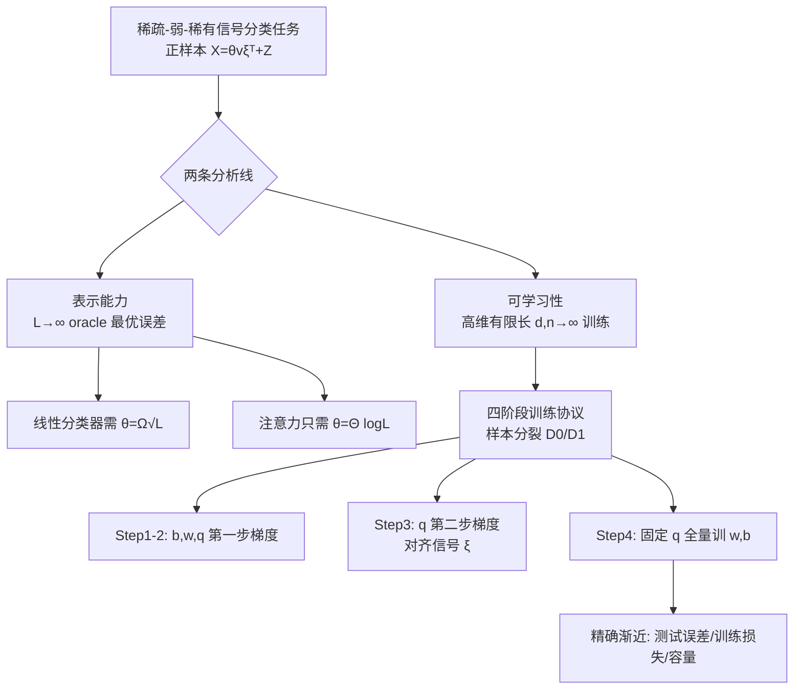

# High-Dimensional Analysis of Single-Layer Attention for Sparse-Token Classification

**会议**: ICLR 2026  
**OpenReview**: [https://openreview.net/forum?id=Ae7VWAEIAW](https://openreview.net/forum?id=Ae7VWAEIAW)  
**代码**: 待确认  
**领域**: learning theory  
**关键词**: 注意力机制理论, 稀疏 token 分类, 高维渐近分析, 梯度下降可学习性, 信号检测  

## 一句话总结
作者在一个"稀疏-弱-稀有"信号分类模型上给出单层注意力的精确高维理论：表示层面注意力只需 $\theta=\Theta(\log L)$ 信号强度即可完美分类（线性分类器需 $\sqrt{L}$），可学习层面证明**两步梯度**就足以让 query 权重 $q$ 对齐隐藏信号，并给出训练后测试误差与容量的精确渐近表达式。

## 研究背景与动机
**领域现状**：注意力机制在 NLP、CV 上大获成功，理论界普遍相信它的核心优势是"动态选择相关 token"。围绕单层可解模型的稀疏 token 回归/分类已有一批工作（Sanford、Marion、Oymak、Mousavi-Hosseini 等），证明注意力相比全连接网络在样本/神经元复杂度上有指数级分离。

**现有痛点**：以往分析大多局限在**平方损失**、且只考虑信号"稀疏"这一个挑战。但真实场景里稀疏往往与**信号弱**（lesion 很微弱）和**信号稀有**（正样本里也只有少数 token 带信号、甚至负样本完全无信号）叠加。同时，多数工作只刻画了"表示能力/oracle 误差"或粗糙的梯度步数界，缺少对**训练后真实测试误差**的精确（含常数）刻画。

**核心矛盾**：注意力的优势在 $L\to\infty$ 的渐近里看起来是"碾压式"分离，但在**有限 $L$、有限样本**下这种分离会变得微妙——到底什么时候注意力真的赢、赢多少，需要一套能精确到常数的分析工具，而注意力特征 $f_q(X)$ 的非线性分布让经典高维线性模型理论无法直接套用。

**本文目标**：在一个把稀疏+弱+稀有三重困难都建模进去的二分类任务上，从"表示能力"和"可学习性"两条线，给出单层注意力分类器与线性基线（向量化/池化）的精确对比。

**核心 idea**：(1) **表示侧**——证明注意力对数级信号强度即可完美分类，揭示与线性分类器的指数级信号检测分离；(2) **可学习侧**——采用样本分裂的四阶段训练协议，证明 query 权重只需两步梯度就能对齐信号，并用 leave-one-out 高维渐近给出测试误差、训练损失与容量的精确解。

## 方法详解

### 整体框架
任务是 $L\times d$ 的二分类：负样本是纯高斯噪声 $X=Z$，正样本在随机选中的 $R$ 个 token 上叠加一个固定单位信号 $\xi$，即 $X=\theta v\xi^\top+Z$，其中 $v$ 标记信号位置、$\theta$ 是信号强度、$\pi$ 是正样本先验概率。难点在于信号位置 $R_i$ 逐样本变化，分类器必须**动态定位**带信号 token。研究分两层：先在 $L\to\infty$ 比较三个模型（向量化线性、池化线性、单层注意力）的 oracle 最优误差，刻画表示能力；再在高维有限长极限（$d,n\to\infty$，$\alpha=n/d$ 固定，$L,\theta,R$ 有限）下精确刻画一套四阶段训练后的真实测试误差与容量。

### 关键设计

**1. 三重困难的信号模型：把"稀疏×弱×稀有"一次性建进数据分布。** 不同于以往只刻画稀疏性的设定，本文的正样本 $X=\theta v\xi^\top+Z$ 同时引入三个挑战：信号位置 $|R|=R<L$ 体现**稀疏**，信号部分范数 $O(\theta\sqrt R)$ 远小于背景噪声 $\|Z\|=O(\sqrt{Ld})$ 体现**弱**，负样本完全不含信号、$\pi$ 可以很小体现**稀有**。位置分布还被约束为足够分散（$\|p\|\le CR/\sqrt L$），不让任何特权 token 泄露信息，使检测更难。这个建模直接对应 CT 扫描里检测 lesion 这类"微弱、位置不定、出现频率低"的现实任务，也比 Oymak 等人的"信号无噪声、所有样本都带信号"的设定更接近实战。

**2. 注意力对数级信号检测优势：表示能力上的指数级分离。** 在 $L\to\infty$、$R=\Theta(1)$ 下，作者证明池化与向量化线性分类器要做到测试误差归零，信号强度必须满足 $\theta=\Omega(\sqrt L)$（Proposition 1、Theorem 1，由 SNR $=\lim \theta R/\sqrt L$ 控制；SNR 有限时误差被严格 bound 在零以上）。根因是平均池化把信号项稀释成 $O(R/L)$ 而噪声仅降到 $O(\sqrt{d/L})$，信噪比反而变差。而注意力模型 $f_q(X)=X^\top\mathrm{softmax}(\beta Xq)$ 通过 $q$ 与 $\xi$ 对齐，能把权重动态压到带信号 token 上、放大信噪比，Theorem 2 证明只要 $\liminf \theta/\log L>0$ 就有 $E^*_{\text{test}}[A]=0$。也就是说注意力能检测**比线性分类器指数级更弱**的信号——这正是"动态 token 选择"价值的严格量化。

**3. 两步梯度对齐 + 四阶段样本分裂训练：可学习性的精确刻画。** 表示能力强不代表能被梯度学到，作者设计了一套可解析的训练协议：把数据分成 $D_0,D_1$；从零初始化后，第一步梯度只让 $w,b$ 动而 $q^{(1)}$ 仍为零；关键在**第二步对 $q$ 的梯度** $q^{(2)}=-\frac{\eta_q\beta}{n_0L}\sum_i h_i\,X_i^\top(I-\tfrac{1_L 1_L^\top}{L})X_i w^{(1)}$，此步让 query 权重产生与信号 $\xi$ 的非平凡对齐；最后固定 $q^{(2)}$ 在 $D_1$ 上全量训 $w,b$。Theorem 3 给出 $\|q^{(2)}\|$ 与 $\langle q^{(2)},\xi\rangle$ 的确定性极限，Corollary 1 进一步证明余弦相似度 $|s_q|=1-C/\alpha_0+o(1/\alpha_0)$，即样本越多对齐越接近满分 1（$1/\alpha_0$ 速率）。样本分裂保证 $q^{(2)}$ 与 $D_1$ 独立，使 step 4 退化成一个高维线性分类问题、可用现有理论分析。

**4. leave-one-out 渐近 + softmax 低维约化：把非线性注意力特征做精确求解。** Step 4 固定 $q$ 后，等价于在高度非高斯的注意力特征 $f_{q^{(2)}}(X)$ 上训线性模型，经典高斯混合假设失效。作者的关键观察是 **softmax 只作用在 token 沿 $q^{(2)}$ 方向的低维投影 $g\in\mathbb R^L$ 上**，可把这部分单独处理。基于此用 leave-one-out 方法得到 Theorem 4：训练后测试误差与训练损失收敛到由一组自洽方程决定的确定性极限，**精确到显式常数**——这比 Oymak 等人只有误差上界、或需 oracle 信息的特例刻画更紧。Corollary 2 还给出平方损失 ridgeless 下三模型都以 $1/\alpha_1$ 速率收敛到极限误差的简洁结论，并指出注意力是否赢取决于对齐 $s_q$：$s_q$ 太小（$\alpha_0$ 不足或超参不当）时注意力反而输给线性分类器，$s_q$ 中大时注意力凭动态重加权胜出。

## 实验关键数据

> 本文是理论工作，"实验"指理论曲线与有限维数值模拟的吻合验证。

### 主实验：三模型测试/训练误差 vs 样本复杂度

| 模型 | 表示能力（$L\to\infty$ 所需 $\theta$） | 有限样本测试误差 | 备注 |
|------|------|------|------|
| 向量化线性 $L^{\text{vec}}$ | $\Omega(\sqrt L)$ | 高，无法适应动态稀疏 | SNR 有限时误差 $>0$ |
| 池化线性 $L^{\text{pool}}$ | $\Omega(\sqrt L)$ | 高，平均池化稀释信噪比 | 与 vec 共享 $\alpha_1\to\infty$ 极限 |
| 单层注意力 $A$ | $\Theta(\log L)$ | **最低**（$s_q$ 中大时） | 动态重加权放大信噪比 |

Fig.1 设置 $L=10,R=1,\pi=0.5,\theta=5,\lambda=10^{-5},d=1000$：Theorem 4/5 理论实线与数值散点（8 trials）高度吻合，注意力测试误差显著低于两个线性基线。

### 消融视角：对齐度 $s_q$ 决定注意力优劣

| 对齐情形 | 触发条件 | 结果 |
|------|------|------|
| 高/中对齐 $s_q$ 较大 | $\alpha_0$ 充足、超参 $\eta_{w,b}$ 合理 | $E^\infty_{\text{test}}[A]<E^\infty_{\text{test}}[L]$，注意力胜 |
| 低对齐 $s_q$ 较小 | $\alpha_0$ 不足或超参不当 | $E^\infty_{\text{test}}[A]>E^\infty_{\text{test}}[L]$，注意力反输线性 |
| $q=0$（退化） | 等价平均池化 | 退化为池化线性分类器 |

### 关键发现

| 发现 | 内容 |
|------|------|
| 指数级信号分离 | 注意力可检测比线性分类器**指数级更弱**的信号（$\log L$ vs $\sqrt L$） |
| 两步梯度足够 | 仅 2 步梯度即让 $q$ 对齐信号，对齐度 $\to 1$ 以 $1/\alpha_0$ 速率 |
| 收敛速率一致 | 平方损失下三模型测试误差均以 $1/\alpha_1$ 收敛到各自极限 |
| 注意力非总赢 | $s_q$ 太小时 $E^\infty_{\text{test}}[A]>E^\infty_{\text{test}}[L]$，对齐不足会反噬 |
| 容量排序 | 实验设定下 $\alpha^\star_{\text{vec}}>\alpha^\star_A>\alpha^\star_{\text{pool}}$（Conjecture 1） |
| 池化容量最低 | $\alpha^\star_{\text{pool}}=\alpha^\star_{\text{vec}}/L$，平均池化把可分容量压缩 $L$ 倍 |

## 亮点与洞察
- **把"注意力为什么强"的直觉做成可证定理**：信号放大不再是 hand-wavy 解释，而是 $\theta=\log L$ vs $\sqrt L$ 的精确分离 + query 对齐的确定性刻画。
- **可学习性与表示能力分开论证**：表示能强（Theorem 2）但梯度学不学得到是两回事，本文用两步梯度协议把"能学到"也补上，结论更完整。
- **精确到常数的测试误差**：相比以往的 bound，Theorem 4 的自洽方程刻画在工程上能定量预测样本/序列长/信号强对误差的影响。
- **诚实地指出注意力的失败区**：$s_q$ 不足时注意力输给线性模型，提醒动态表示需要足够的对齐预算（数据/超参）。
- **softmax 低维约化技巧**：把非线性注意力特征的高维分析化归为可控的低维投影 + leave-one-out，方法层面有可复用价值。

## 局限与展望
- **单层、简化注意力模型**：只分析 $f_q(X)=X^\top\mathrm{softmax}(\beta Xq)$ 这一类 [CLS]-style 简化结构，未覆盖多头、多层、带 value 投影的完整 self-attention（仅在附录 A 做经验对比）。
- **训练协议高度理想化**：四阶段 + 样本分裂 + 仅两步梯度是为可解析而设计，与真实端到端联合训练有差距（虽附录指出复用数据时表现类似）。
- **容量结论仍是 Conjecture**：式 (18) 的容量表达式含启发式步骤，未给完整严格证明。
- **信号模型简化**：单一固定信号向量 $\xi$、$R=\Theta(1)$、各向同性高斯噪声，离真实图像/文本的结构化相关性尚远。
- **展望**：把分析推广到多步/联合训练、多层注意力、结构化噪声，以及把容量从猜想升级为定理。

## 相关工作与启发
- **稀疏 token 回归/分类**：Sanford 2023、Wang 2024、Mousavi-Hosseini 2025、Marion 2024、Oymak 2023 等证明注意力相对全连接的样本/神经元分离；本文最接近 Oymak 2023（同款模型、三步梯度），但扩展到任意凸损失（含 logistic）、并加入信号弱与稀有两重挑战，且给出精确到常数的误差。
- **高维注意力渐近**：Cui、Troiani、Duranthon、Rende 等高维注意力分析线提供了技术工具（leave-one-out、自洽方程）。
- **单步梯度学特征**：Ba 2022、Moniri 2023、Dandi 2023/2024 在两层网络上证明一步梯度即可学到有意义首层特征，本文把这一范式迁移到注意力 query 权重（两步）。
- **启发**：(1) 评估注意力优势要同时看"表示能力"和"对齐预算"，光有表示能力不够；(2) softmax 的低维约化是分析非线性注意力的有效切口；(3) "弱+稀有"信号检测的对数级优势，可能解释注意力在医学影像等稀疏弱信号任务上的实际收益。

## 评分
- 新颖性: ⭐⭐⭐⭐⭐ 首次把稀疏+弱+稀有三重困难同时建模，并给出注意力测试误差/容量精确到常数的高维渐近，与表示能力的对数级分离互补。
- 实验充分度: ⭐⭐⭐⭐ 理论工作，数值模拟（$d=1000/2000$，多 trials）与理论曲线吻合极好；但仅在简化模型上验证，复杂注意力只在附录略提。
- 写作质量: ⭐⭐⭐⭐ 两层（表示/可学习）结构清晰，定理与直觉解释配合到位；不足是核心表达式都推到附录，正文略抽象。
- 价值: ⭐⭐⭐⭐ 为"注意力为何能选择性关注弱稀疏信号"提供了严格、可量化的理论基础，对理解 transformer 归纳偏置与稀疏信号任务有长期参考价值。

<!-- RELATED:START -->

## 相关论文

- [\[ICLR 2026\] High-dimensional Analysis of Synthetic Data Selection](high-dimensional_analysis_of_synthetic_data_selection.md)
- [\[ICLR 2026\] A Generalized Geometric Theoretical Framework of Centroid Discriminant Analysis for Linear Classification of Multi-dimensional Data](a_generalized_geometric_theoretical_framework_of_centroid_discriminant_analysis_.md)
- [\[ICLR 2026\] Learning under Quantization for High-Dimensional Linear Regression](learning_under_quantization_for_high-dimensional_linear_regression.md)
- [\[ICLR 2026\] Improved High-Dimensional Estimation with Langevin Dynamics and Stochastic Weight Averaging](improved_high-dimensional_estimation_with_langevin_dynamics_and_stochastic_weigh.md)
- [\[ICLR 2026\] On the Convergence of Two-Layer Kolmogorov-Arnold Networks with First-Layer Training](on_the_convergence_of_two-layer_kolmogorov-arnold_networks_with_first-layer_trai.md)

<!-- RELATED:END -->
