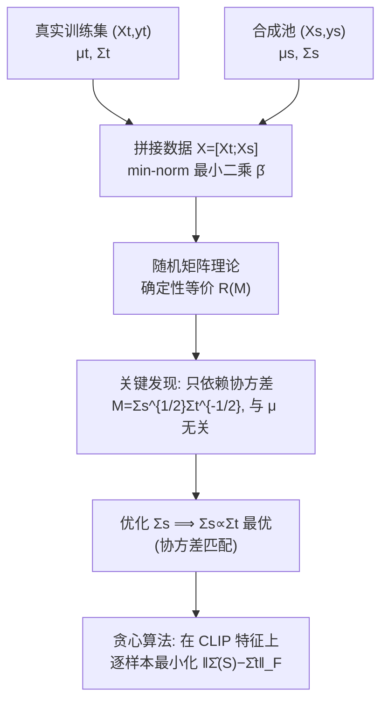

# High-dimensional Analysis of Synthetic Data Selection

**会议**: ICLR 2026  
**OpenReview**: [https://openreview.net/forum?id=Y54P2BBPPh](https://openreview.net/forum?id=Y54P2BBPPh)  
**代码**: 待确认  
**领域**: 学习理论 / 高维回归 / 合成数据增强  
**关键词**: 合成数据选择, 高维回归, 协方差匹配, 随机矩阵理论, 数据增强  

## 一句话总结
用高维岭回归（ridgeless regression）理论刻画"训练数据 + 合成数据"联合训练的测试误差，证明**只有协方差偏移会影响泛化、均值偏移惊人地不影响**，并由此导出一个极其简单的合成数据选择准则——协方差匹配（covariance matching），在真实图像/文本分类上打平甚至超过近年所有 CLIP-based 筛选方法。

## 研究背景与动机
- **领域现状**：生成模型越来越强，"生成无限合成数据来训练分类器"被寄予厚望（数据稀缺、隐私、类别不平衡场景尤甚）。但实验结论一直矛盾——有人报告涨点，有人质疑还不如多检索些真实数据，甚至有人警告会引发模型崩溃（model collapse）和额外偏见。
- **现有痛点**：实践中只有"合成数据要接近真实分布"这种启发式口号，**到底是分布的哪个性质决定泛化误差，没人说清楚**。各种筛选方法（按 CLIP 相似度剪枝、按文本嵌入采样、聚类选代表）都是经验试出来的，缺乏理论支撑，也无法解释何时有效、何时失效。
- **核心矛盾**：合成数据与真实数据的差异同时体现在**均值偏移** $\mu_t \neq \mu_s$ 和**协方差偏移** $\Sigma_t \neq \Sigma_s$ 两个维度，而所有现有筛选方法本质上都在"对齐均值/中心"上做文章（center matching、text matching 等），却没人问过：均值对齐真的重要吗？
- **本文目标**：把问题 (Q)"如何选择合成集 $(X_s, y_s)$ 使测试误差最小"放进可严格求解的高维线性回归框架，**精确刻画测试误差对各分布参数的依赖**，进而导出有理论最优性保证的选择准则。
- **核心 idea**：**【理论结论】** 在"训练数据不太少"的前提下，联合训练的极限测试误差只依赖协方差矩阵 $\Sigma_t, \Sigma_s$（通过 $M = \Sigma_s^{1/2}\Sigma_t^{-1/2}$），**完全不依赖均值** $\mu_t, \mu_s$；**【实践准则】** 因此把合成数据的协方差对齐到真实数据（$\Sigma_s \propto \Sigma_t$）就是最优的，而无需操心均值对齐。

## 方法详解

### 整体框架
论文走"理论刻画 → 推出最优准则 → 实证落地"三段：先把数据增强建模成两段线性高斯模型，求 min-norm 最小二乘解（即从 0 初始化的梯度下降插值解）的超额风险（excess risk）；再用随机矩阵理论给出 $n, p \to \infty$ 比例缩放下风险的**确定性等价（deterministic equivalent）**；发现这个等价式只含协方差，于是把"选数据"化归为"选 $\Sigma_s$ 的优化问题"，证明协方差匹配最优；最后把抽象结论翻译成一个贪心算法，在 CLIP/DINO 特征空间上对真实图像分类做实证。

### 关键设计

**1. 非零均值高维回归建模：把"测试集不能去中心化"这件事认真对待。** 论文把训练集与合成集都建模为 $y^{(i)} = X^{(i)}\beta + \varepsilon^{(i)}$，其中行向量 $X^{(i)} = Z^{(i)}(\Sigma^{(i)})^{1/2} + \mathbf{1}\mu_{(i)}^\top$ 带有非零均值 $\mu_{(i)}$，$\beta$ 在真实/合成两侧共享（即标签条件分布一致）。与 Yang et al. (2025)、Song et al. (2024) 等前作的关键区别在于：他们假设数据零均值，但本文指出**测试分布不能被去中心化**——因为知道测试样本的均值等价于知道它的未知标签，所以均值偏移必须被显式保留在分析里。超额风险定义为 $R_X(\hat\beta;\beta) = \mathbb{E}[\|\hat\beta - \beta\|^2_{\Sigma_t + \mu_t\mu_t^\top} \mid X]$，注意这里的度量矩阵 $\Sigma_t + \mu_t\mu_t^\top$ 同时含协方差和均值外积项，正是为了把均值的潜在影响"留在台面上"，再由理论证明它最终消失。

**2. 确定性等价与"均值无关"现象：用随机矩阵理论把随机风险钉成一个只含协方差的常数。** 在欠参数化（$n > p$，bias 为 0）和过参数化（$n < p$，bias 不消失）两个 regime 下，论文分别给出超额风险的确定性极限（Theorem 4.1 / 4.4）。欠参数化下，记 $M = \Sigma_s^{1/2}\Sigma_t^{-1/2}$，风险收敛到 $R_u(M) = \frac{\sigma^2}{n}\mathrm{Tr}[(\alpha_1 M^\top M + \alpha_2 I_p)^{-1}]$，其中 $\alpha_1, \alpha_2$ 由两个自洽方程定出——**整个表达式只依赖 $\Sigma_t, \Sigma_s$，与 $\mu_t, \mu_s$ 无关**。证明的核心技巧是把均值 $\mu_t, \mu_s$ 当作随机矩阵的一个秩-2 扰动"因式分解"出去，再对零均值情形套用各向异性局域律（anisotropic local laws），收敛率为 $O(\sigma^2 p^{-1/2})$。作为对照，论文还证明：**只用合成数据训练时**（$\gamma_t = 0$），风险表达式里就会出现 $\|\Sigma_s^{-1/2}\mu_t\|^2$ 这类显含均值的项（Proposition 4.2）——这反衬出"联合训练消均值"现象的反直觉与微妙：只要保留了足够的真实训练数据，均值对齐就变得无关紧要。

**3. 协方差匹配的最优性证明：均值化的特征谱给出 $\Sigma_s \propto \Sigma_t$。** 既然风险只依赖 $M$，问题 (Q) 就化归为"给定 $\Sigma_t$，选什么 $\Sigma_s$ 使 $R_u(M)$ 最小"。在归一化约束 $\mathrm{Tr}[M^\top M] = p$ 下，Theorem 4.3 证明最优 $M_{\mathrm{opt}}$ 的所有特征值都相等（$\lambda_i(M_{\mathrm{opt}}^\top M_{\mathrm{opt}}) = 1$），即 $M \propto I$，等价于 $\Sigma_s \propto \Sigma_t$——**协方差匹配最优**。证明思路是先把 $R_u(M)$ 写成单参数 $\alpha_1$ 的单调函数，再用形如 $(\lambda_i, \lambda_j) \to (\lambda_i - c, \lambda_j + c)$ 的"削峰填谷"变换配合 majorization 论证，说明特征谱越均衡风险越低。论文还附带一个有趣结论：在固定方向下整体放大 $\Sigma_s$（即 $R_u(\eta M) \le R_u(M), \eta > 1$）能进一步降风险，**暗示合成数据多样性越大越好**——但放大倍数 $\eta$ 必须是常数阶，否则确定性等价不再成立，这正是为何要做迹归一化。过参数化 regime 下（Theorem 4.5）则在各向同性训练数据 $\Sigma_t = I_p$ 的简化假设下给出同样的协方差匹配最优性。

**4. 从理论到落地的贪心协方差匹配算法。** 理论说"对齐协方差"，但实践中 $\Sigma_s$ 是从一个固定的生成样本池里"挑"出来的，不能任意构造。论文实现为一个贪心选择：初始化 $S = \emptyset$，反复从生成池里加入使 $\|\hat\Sigma(S \cup \{x\}) - \hat\Sigma_t\|_F$ 最小的样本 $x$，直到 $|S| = n_s$，其中 $\hat\Sigma$ 是 CLIP 特征的样本协方差。为加速，协方差在用 $n_t$ 个真实参考特征拟合出的 32 维 PCA 子空间里计算。选完后在"真实 + 选中合成"的并集上训练分类器。这个算法把抽象的谱匹配落成了一个对任意生成模型/特征提取器都通用、且无需任何标签信息或均值信息的纯无监督筛选器。

## 实验关键数据

### 主实验表格（CIFAR-10，CLIP ViT-B 特征，$n_t=200, n_s=800$/类）

截断 StyleGAN2-Ada 生成（Table 1，分类准确率 %）：

| 方法 | Scratch | Distillation | Pretrained |
|------|---------|--------------|------------|
| No synthetic | 44.36 | 47.33 | 63.40 |
| Center matching (He 2023) | 50.04 | 53.83 | 67.01 |
| Center sampling (Lin 2023) | 50.48 | 54.91 | 67.71 |
| DS3 (Hulkund 2025) | 52.83 | 58.32 | 68.21 |
| K-means (Lin 2023) | 50.74 | 56.06 | 66.50 |
| Random | 49.38 | 54.89 | 67.65 |
| **Covariance matching (ours)** | **54.00** | **59.77** | **69.20** |
| Real upper bound | 61.08 | 65.38 | 74.35 |

文生图（T2I：SANA-1.5 + PixArt-α + SD1.4）混合生成（Table 2）：协方差匹配 Scratch 54.45 / Distillation 59.17 / Pretrained 66.69，与最强 baseline（DS3）打平或略胜。

### 消融与扩展实验

| 设置 | 结论 |
|------|------|
| ImageNet-100（Table 3a，截断模型） | 协方差匹配 57.52 ≈ DS3 57.47，明显超 Random 54.14 |
| RxRx1 荧光显微（Table 3b，MorphGen 增强） | 协方差匹配 90.00 最高，超 DS3 89.67 / No-synthetic 86.83 |
| DINO 特征替换 CLIP（Table 6-7） | 增益不依赖特定特征提取器 |
| 零多样性生成器（Table 5） | 协方差匹配自动避开坍缩簇，DS3 等表现差 |
| 真实样本混入合成池（Figure 2） | 协方差匹配选中目标分布样本比例最高 |
| 文本分类 Ironic-Tweet（Table 13） | 同样有效，跨模态泛化 |

### 关键发现
- **均值对齐无用，协方差对齐才是关键**：理论（Figure 1a 改变均值余弦相似度风险不变）和实验双重验证；这直接挑战了所有以 center/text matching 为代表的"对齐中心"范式。
- **协方差匹配偏好多样性**：在截断 StyleGAN 实验中，它从 0.2-截断（高保真低多样）模型只选 268/245/333 个样本，却从 0.6-截断（高多样）模型选 3692/3462 个，带来更优的 Recall/FID/KID——理论预测的"放大协方差降风险"在实践中体现为"偏好多样样本"。
- **简单且通用**：一个无监督贪心算法横扫三种训练范式（从头训/蒸馏/微调）、两类架构（ResNet/Transformer）、三个数据集、五种生成模型，无需调参。

## 亮点与洞察
- **反直觉的硬核结论 + 立刻可用的落地准则**：高维回归推出的"均值无关"现象既漂亮又出人意料，更难得的是它直接翻译成一行贪心算法并在真实视觉/文本任务上 work，理论与实践的距离压得极短。
- **把"测试集不可去中心化"提升为建模原则**：指出去中心化等价于偷看标签，从而必须保留非零均值——这个看似技术性的细节恰是与前作的本质分野，也让"均值最终不影响风险"的结论更有说服力。
- **统一解释了既有筛选方法的成败**：协方差匹配框架解释了为何 center matching 这类只盯均值的方法天花板有限，为何 DS3 这类隐含多样性考量的方法表现较好但仍不及显式协方差对齐。

## 局限与展望
- **单类、线性、共享 $\beta$ 的强假设**：理论分析在单个类别内孤立进行（per-class 增强），忽略类间交互，且基于线性模型和良态协方差谱；作者坦承这是为数学可解性付出的代价，靠大量实验弥补。
- **过参数化最优性仅在 $\Sigma_t = I_p$ 下证明**：由于表达式复杂，协方差匹配在过参数化 regime 的最优性只对各向同性训练数据给出，更一般情形是开放问题。
- **依赖特征空间与 PCA 降维**：实际协方差在 CLIP/DINO 特征的 32 维 PCA 子空间估计，特征空间质量与维度选择会影响效果；高维原始空间下协方差估计的可靠性也是隐忧（与 El Firdoussi 2025 指出的"坏协方差估计导致性能下降"相呼应）。
- **模型偏移（model shift）只在附录处理**：训练/合成两侧不同 $\beta$ 的情形被推到 Appendix B，主线未充分展开。

## 相关工作与启发
- **高维回归的随机矩阵分析谱系**：benign overfitting（Bartlett 2020）、double descent（Belkin 2019）、ridgeless 回归测试误差（Hastie 2022）等是技术基础；本文把这套工具用到"训练于多分布、测试于其一"的新设定，并补上非零均值这一现实维度。
- **多分布/surrogate 数据理论**：Yang et al. (2025)、Song et al. (2024) 分析过多分布训练但假设零均值；Ildiz et al. (2025) 研究 weak-to-strong 泛化、Jain et al. (2024) 限于各向同性——本文的非零均值各向异性分析是对这条线的实质推进。
- **CLIP-based 合成数据筛选实践**：He et al. (2023) 的 center matching、Lin et al. (2023) 的多种 sampling/filtering、Hulkund et al. (2025) 的 DS3 都是本文的对比基线，本文为这些经验方法提供了"它们到底在优化什么"的理论透视。
- **启发**：当工程社区在某个问题上方法五花八门却结论矛盾时，一个可严格求解的简化模型（哪怕假设很强）往往能识别出"真正起作用的那个量"，并据此给出比复杂启发式更简单、更鲁棒的方案——这是理论指导实践的范例。

## 评分
- **新颖性**: ⭐⭐⭐⭐⭐ "均值无关、协方差匹配最优"是反直觉且首次被严格刻画的结论，把混乱的合成数据筛选问题统一进高维回归框架。
- **实验充分度**: ⭐⭐⭐⭐⭐ 跨 3 训练范式 × 2 架构 × 4 数据集 × 5 生成模型 + 文本任务，DINO/CLIP 双特征、零多样性/真实混入等多组控制实验，理论与实证闭环。
- **写作质量**: ⭐⭐⭐⭐ 理论严谨、动机清晰、图表充分；但大量关键证明与设定（过参数化、模型偏移）压在附录，主线对非理论读者门槛偏高。
- **价值**: ⭐⭐⭐⭐⭐ 既贡献了硬核理论洞察，又给出一行即用、跨场景鲁棒的实用筛选准则，对数据增强与合成数据训练社区有直接指导意义。

<!-- RELATED:START -->

## 相关论文

- [\[ICLR 2026\] High-Dimensional Analysis of Single-Layer Attention for Sparse-Token Classification](high-dimensional_analysis_of_single-layer_attention_for_sparse-token_classificat.md)
- [\[ICLR 2026\] Learning under Quantization for High-Dimensional Linear Regression](learning_under_quantization_for_high-dimensional_linear_regression.md)
- [\[ICLR 2026\] Optimizing Data Augmentation through Bayesian Model Selection](optimizing_data_augmentation_through_bayesian_model_selection.md)
- [\[ICLR 2026\] A Generalized Geometric Theoretical Framework of Centroid Discriminant Analysis for Linear Classification of Multi-dimensional Data](a_generalized_geometric_theoretical_framework_of_centroid_discriminant_analysis_.md)
- [\[ICLR 2026\] Improved High-Dimensional Estimation with Langevin Dynamics and Stochastic Weight Averaging](improved_high-dimensional_estimation_with_langevin_dynamics_and_stochastic_weigh.md)

<!-- RELATED:END -->
