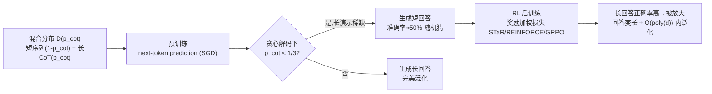

# How Reinforcement Learning after Next-Token Prediction Facilitates Learning

**会议**: ICLR 2026  
**OpenReview**: [https://openreview.net/forum?id=CTGpC7xWHM](https://openreview.net/forum?id=CTGpC7xWHM)  
**代码**: 待确认  
**领域**: learning theory  
**关键词**: 强化学习理论, 思维链, 奇偶校验, next-token prediction, GRPO/STaR, 样本复杂度分离, 测试时计算  

## 一句话总结
本文用"奇偶校验 + 长短思维链混合分布"这个可证明的玩具模型，第一次从优化理论上严格刻画了「先 next-token 预训练、再 RL 后训练」为何能学会单纯预训练学不会的难任务，并解释了 RL 过程中回答变长的机制。

## 研究背景与动机
- **领域现状**: o1、DeepSeek-R1 这类推理模型的成功配方是"自回归 Transformer 先做 next-token 预测预训练，再用 RL（带正确性奖励）做后训练"，后训练阶段常伴随回答显著变长（所谓"思考过程"）。这套配方经验上极其有效，但**为什么有效缺乏理论解释**。
- **现有痛点**: 已有理论要么只分析监督学习/思维链能让难函数变可学，要么只分析 RL 的收敛，**没有人在自回归设定下把"NTP" 与 "NTP+RL" 做出可证明的分离**，也没人从优化角度解释"RL 为什么会让回答变长"。
- **核心矛盾**: 像 $d$ 位奇偶校验（XOR）这类任务，直接用神经网络预测被认为需要指数级样本/迭代；但若数据里**偶尔**出现带中间计算的长思维链演示，任务又是可高效学习的。问题在于：当长演示**稀缺**时，预训练为何学不会、而 RL 又如何快速补救？
- **本文目标**: 在一个可证明的简化设定里回答三件事——(1) 为何预训练阶段难以泛化；(2) RL 为何能在极少样本内快速提升；(3) 什么优化压力导致回答变长。
- **核心 idea**: **【建模假设】** 把互联网级数据建模成"短演示（只给输入和答案）+ 稀有长演示（给出完整中间计算链）"的混合分布 $\mathcal{D}(p_{\text{cot}})$；**【关键洞察】** 预训练时模型从长演示学得远快于短演示且保持"长度校准"，RL 用奖励加权损失会**放大长回答在训练 batch 中的比例**（因为长回答正确率更高），从而推动长度增长并最终实现泛化。

## 方法详解

### 整体框架
论文构造一个最小可分析的学习问题：预测 $d$ 个 $\pm1$ 比特的奇偶 $\prod_{i=1}^d x_i$。数据来自混合分布 $\mathcal{D}(p_{\text{cot}})$，以概率 $p_{\text{cot}}$ 给出"长序列"（逐步前缀积 $x_1, x_1x_2, \dots, \prod x_i$ 的完整思维链），以概率 $1-p_{\text{cot}}$ 给出"短序列"（仅输入和最终答案）。训练分两段：先 next-token 预测预训练，再用 RL（STaR / REINFORCE / GRPO + 正确性奖励）后训练。论文先在 Transformer 上做大量实证（Sec.3），再在"自回归线性模型串"这一可解析架构上证明定理（Sec.4），最后在数乘和 Llama-3-8B 数学推理上验证现象通用（Sec.5）。

### 关键设计

**1. 长短思维链混合分布 $\mathcal{D}(p_{\text{cot}})$：把"互联网数据偶含长演示"形式化。** 输入 $x_1,\dots,x_d \sim \text{Rad}(1/2)$，输出以伯努利变量 $Z\sim\text{Ber}(p_{\text{cot}})$ 决定形态：$Z=1$ 时输出完整链 $(x_1, x_1x_2, \dots, \prod_{i=1}^d x_i, \texttt{<EOS>})$，$Z=0$ 时只输出 $(\prod_{i=1}^d x_i, \texttt{<EOS>})$。这个设计的妙处在于：它把"难任务其实在数据里有正确但稀有的详细解法"这一对互联网数据的自然观察，压缩成一个单参数 $p_{\text{cot}}$ 可调的可证明模型。混合权重 $p_{\text{cot}}$ 越小，长演示越稀缺，问题越接近"纯靠短样本学 XOR"这一指数难的极端。

**2. 预训练的"长度校准"与临界阈值 $p_{\text{cot}}=1/3$：解释为何稀缺长演示下预训练失败。** 论文证明（Theorem 1）：预训练时自回归模型从长演示学习的速度远快于短演示，且在生成时保持**长度校准**——即生成长回答的概率与数据中长演示的占比一致。后果是：在**贪心解码**下，只有当 $p_{\text{cot}}$ 足够大时模型才会选择走"长回答"路径从而算出正确奇偶。理论给出的临界点 $p_{\text{cot}}<1/3$ 时模型贪心解码退化为短回答、准确率停在 50%（随机猜），这一阈值与 Transformer 实验观测到的临界值**精确吻合**。关键结论：失败不是模型容量/深度不够（approximation），而是**估计（estimation）层面的样本限制**。

**3. 奖励加权损失放大长回答 → 长度增长机制。** 后训练用 STaR/REINFORCE 型算法，对每个 prompt 采样若干回答，奖励函数验证正确性（端到端 $r_{\text{e2e}}=\mathbb{1}\{y[-1]=\prod x_i\}$ 或整链 $r_{\text{cot}}$），再用奖励加权的 next-token 损失训练。由于**长回答的正确概率远高于短回答**，奖励加权后 batch 里长回答的有效占比被放大，等价于把 $p_{\text{cot}}$ 往上推。这是论文给出的"RL 使回答变长"的优化解释——长度增长不是被显式鼓励的，而是奖励正确性的副产物。

**4. 自回归线性模型上的可证明分离与快速性（Theorem 2）。** 在 Malach (2024) 的"一串线性模型"自回归架构上，论文证明：只要长演示不是关于维度 $d$ 指数稀有（$p_{\text{cot}}$ 不指数小），NTP 预训练 + STaR 后训练能在 $O(\text{poly}(d))$ 次 SGD 迭代内学会奇偶；更精细地，只需 $O\!\left(\log\frac{1-p_{\text{cot}}}{p_{\text{cot}}}\right)$ 轮 RL 即可得到泛化模型——刻画了实验中"RL 一开就立刻起飞"的现象。据作者所知，这是自回归设定下 **NTP 与 NTP+RL 的首个理论分离**，也是 LLM 中 **RL 导致长度增长的首个优化结果**。

## 实验关键数据

### 主实验（Parity, Transformer 从零训练）

| 设定 | 预训练（仅 NTP） | 后训练（NTP + RL/GRPO） |
|------|------------------|--------------------------|
| $d=50, p_{\text{cot}}=0.25$ 贪心解码准确率 | 长期停在 ~50%（随机猜） | RL 一开即快速升至 ~100% |
| 回答长度（贪心解码中位） | 短（≈1） | 后训练阶段显著增长（→ 接近 $d$） |
| 样本量 | 256 seq/iter × 50k iter（数百万序列）仍失败 | 仅需 ~20 RL 轮即泛化 |

### 关键消融

| 变量 | 现象 |
|------|------|
| 混合权重 $p_{\text{cot}}$（$d=25$） | 临界阈值约 $1/3$：$p_{\text{cot}}\gtrsim1/3$ 预训练即可学会；以下失败，与理论吻合 |
| RL 算法（STaR/REINFORCE/GRPO，e2e/cot 奖励） | 各算法均能在后训练阶段提升准确率并增长长度，现象稳健 |
| 采样温度 $\tau_{\text{RL}}$（0.75/1.0/1.5） | 温度影响探索与长度增长速度，但泛化趋势一致 |

### 关键发现
- 失败是**估计（样本）限制而非逼近（容量）限制**：增大模型深度/宽度无法救场，只有 RL（改变有效数据分布）能救。
- RL 的提速来自"放大已有的稀有长演示"，而非凭空学会新能力——后训练只需对数级轮数。
- 现象在数乘、Llama-3-8B 在 GSM8K/MATH 的长短混合变体上同样复现，说明玩具模型抓住了真实推理后训练的核心机制。

## 亮点与洞察
- **把模糊的经验现象做成可证明定理**：用奇偶校验 + 单参数混合分布，把"RL 后训练为何有效""为何变长"两件 LLM 玄学，落到能写出收敛速率的优化分析上。
- **临界阈值 $1/3$ 理论与实验对齐**，是玩具模型抓住真实机制的有力证据。
- **重新定义"RL 学到了什么"**：RL 不是学新技能，而是**重加权数据分布**去放大预训练里已存在的稀有正确解法——对理解"RL 是否引入新能力"的争论提供了一个干净视角。

## 局限与展望
- 核心定理建立在**自回归线性模型串**上，并非真实 Transformer；从线性可分析架构到 attention 的理论桥梁仍缺。
- 任务局限于奇偶/数乘这类有**唯一确定中间链**的可验证问题，对开放式、多解、奖励含噪的真实推理任务结论是否成立未知。
- "长演示不指数稀有"是关键前提——若真实难任务的正确长解法在数据里指数稀缺，本框架预测 RL 也无能为力，这一边界值得进一步刻画。
- 只分析了正确性奖励；过程奖励、长度惩罚等更复杂奖励如何改变长度动力学尚待研究。

## 相关工作与启发
- **奇偶/XOR 学习难度**：Shalev-Shwartz 2017、Daniely & Malach 2020、Abbe 2023、Barak 2022 等长期把 parity 当作神经网络可学性的试金石，本文借其指数难度构造分离。
- **思维链可学性**：Malach 2024、Wies 2023、Joshi 2025 证明带中间计算的链可让难函数高效可学，本文把它嵌入"稀有长演示"的混合分布。
- **RL 后训练算法**：STaR (Zelikman 2022)、REINFORCE (Williams 1992)、GRPO (Shao 2024) 是被分析的对象，本文给出它们在该设定下的优化保证。
- **启发**：对设计数据混合有直接指导——与其追求海量短样本，不如确保**少量但足够（不指数稀有）的完整推理演示**存在，再让 RL 去放大它们。

## 评分
- **新颖性**: ⭐⭐⭐⭐⭐ 自回归设定下 NTP vs NTP+RL 的首个理论分离 + RL 长度增长的首个优化结果，填补了推理模型理论的关键空白。
- **实验充分度**: ⭐⭐⭐⭐ 玩具任务上多算法/多超参/多温度消融扎实，且在数乘、Llama-3-8B 真实基准上验证通用性；但真实大模型实验规模仍有限。
- **写作质量**: ⭐⭐⭐⭐ 理论与实验交织清晰，临界阈值的理论-实验对照有说服力；定理表述较密集，需一定背景。
- **价值**: ⭐⭐⭐⭐⭐ 为"RL 后训练为何有效、为何变长"提供了第一性原理级解释，对理解和设计推理模型训练配方有长远参考价值。

<!-- RELATED:START -->

## 相关论文

- [\[ICLR 2026\] Physics-informed learning under mixing: How physical knowledge speeds up learning](physics-informed_learning_under_mixing_how_physical_knowledge_speeds_up_learning.md)
- [\[ICLR 2026\] How hard is learning to cut? Trade-offs and sample complexity](how_hard_is_learning_to_cut_trade-offs_and_sample_complexity.md)
- [\[ICLR 2026\] The Lie of the Average: How Class Incremental Learning Evaluation Deceives You?](the_lie_of_the_average_how_class_incremental_learning_evaluation_deceives_you.md)
- [\[ICLR 2026\] High-Dimensional Analysis of Single-Layer Attention for Sparse-Token Classification](high-dimensional_analysis_of_single-layer_attention_for_sparse-token_classificat.md)
- [\[ICLR 2026\] Sharp Asymptotic Theory for Q-Learning with LD2Z Learning Rate and Its Generalization](sharp_asymptotic_theory_for_q-learning_with_textttld2z_learning_rate_and_its_gen.md)

<!-- RELATED:END -->
