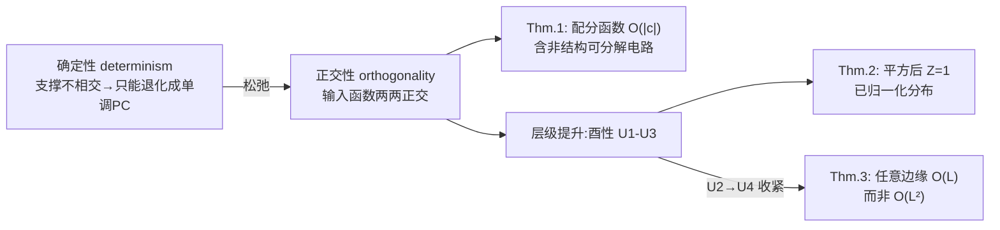

# How to Square Tensor Networks and Circuits Without Squaring Them

**会议**: ICLR 2026  
**OpenReview**: [https://openreview.net/forum?id=gHPRSPxIsk](https://openreview.net/forum?id=gHPRSPxIsk)  
**代码**: 已开源（论文 Reproducibility Statement 中提供）  
**领域**: 学习理论 / 概率电路 / 张量网络  
**关键词**: 平方概率电路, 张量网络, 正交性, 酉参数化, 边缘化, Born machine  

## 一句话总结
通过把张量网络规范形式（canonical form）中的"正交性"和电路中的"确定性"（determinism）统一成一族新的电路结构性质（正交性 / 酉性），让平方概率电路（squared PC）的归一化与边缘化从 $O(|c|^2)$ 降到 $O(|c|)$，并且首次让"非结构可分解"的平方电路也能高效边缘化——而无需真正把电路平方展开。

## 研究背景与动机
**领域现状**：张量网络（TN）和把 TN 推广成计算图的电路（circuit）都是表达力很强的分布估计器。要让一个实/复参数的电路 $c$ 表示合法概率分布，常见做法是取模平方 $p(x)=Z^{-1}|c(x)|^2$（即 Born machine / squared PC），这能在保持闭式边缘化的同时获得远超单调 PC（参数非负）的表达力。

**现有痛点**：平方这一步是有代价的。要算配分函数 $Z=\int|c(x)|^2\mathrm{d}x$ 或任意边缘，必须先把 $c$ 和它的共轭 $c^*$ 相乘、物化成另一个可分解电路，规模平方膨胀到 $O(|c|^2)$，于是配分函数和所有边缘的计算都背上了平方复杂度。这让 squared PC 在需要高效精确条件化的场景（采样、无损压缩）里很吃亏。

**核心矛盾**：TN 那边其实有解药——规范形式（canonical form）用（半）酉矩阵参数化，让 $|\psi|^2$ 天然归一化（$Z=1$），边缘也能简化。但规范形式有两个硬伤：(1) 每种 TN（MPS/TTN）需要不同的左/右/混合规范形式，且每个只服务特定边缘；(2) 它们**只对应已知 TN 结构**，对电路里那些不对应任何已知张量分解的"自由拼接"因子分解无能为力。

**本文目标**：把规范形式背后的核心原理抽出来，用电路的语言重新表述成结构性质，使得 (i) 平方 PC 的边缘化降到线性时间，(ii) 该性质能覆盖比 TN 更大的因子分解集合，包括非结构可分解的电路。

**核心 idea**：作者发现 TN 规范形式的"正交性"和经典电路性质"确定性"（determinism，sum 单元各输入支撑两两不相交）其实是同一件事的两面。**【关键洞察】** 把确定性松弛成"正交性"——只要求 sum 单元的各输入函数两两正交（内积为 0），而不必支撑不相交——就能保留实/复参数的表达力优势，同时让平方后的交叉项因正交而相互抵消，从而免去物化平方。

## 方法详解

### 整体框架
论文从"标量单元"到"层（layer）"逐级搭建条件，分三步走：先在标量 sum 单元层面用**正交性**（Def. 5）松弛确定性，证明正交电路的配分函数可线性时间计算（Thm. 1）；再针对 GPU 友好的稠密张量化电路，把正交性提升为层级的**酉性**条件 U1–U3（正交归一输入函数 + 半酉权重矩阵），保证平方后直接归一化 $Z=1$（Thm. 2）；最后加一条更严的 U4，给出一个对任意变量子集都能在 $O(L)$ 而非 $O(L^2)$ 时间边缘化的算法（Thm. 3）。关键是全程**不真正平方电路**，而是利用正交性带来的抵消跳过交叉项的积分。

### 关键设计

**1. 正交性松弛确定性：用抵消代替支撑不相交**  
出发点是一个 2 变量 MPS 的观察：若左因子满足正交归一 $\langle\psi_1^i|\psi_1^j\rangle=\delta_{ij}$，则边缘 $p(x_2)=\int|\psi(x_1,x_2)|^2\mathrm{d}x_1$ 中的双求和会塌缩成单求和 $\sum_i|\psi_2^i(x_2)|^2$，因为 $i\neq j$ 的交叉项内积为 0。作者注意到，如果改成各因子**支撑不相交**（确定性），同样能把 $O(R^2)$ 降到 $O(R)$——这正是 squared PC 用 determinism 时的情形。但确定性有致命副作用：对确定性电路取模平方等价于把每个权重和输入函数直接换成它们的模平方，结果只剩非负激活，实/复参数毫无优势（退化成单调 PC）。于是作者保留"抵消"这个机制、但放弃"支撑不相交"这个要求，定义**正交性**（ortho-decomposability，Def. 5）：smooth sum 单元 $n$ 的任意两个不同输入满足 $\int_{\mathrm{dom}(Z)}c_i(z)c_j(z)^*\mathrm{d}z=0$。正交严格泛化了非单调情形下的确定性。Thm. 1 进而证明：smooth、可分解且正交的电路，其配分函数可在 $O(|c|)$ 算完——**即便它不是结构可分解的**，而后者一般是 #P-hard 的。这里的诀窍正是用正交带来的抵消，避免去积分那些"不兼容电路的乘积"。

**2. 从正交到酉性：把标量条件搬到层上以适配张量化电路**  
标量级的"正则正交"（regular orthogonality，Def. 7：基可分解 + 同变量输入函数正交）太苛刻，要求每个 sum 输入依赖**不同的**输入函数。但实际跑在 GPU 上的张量化电路（tensorized circuit，Def. 8）是稠密连接的层——一个 sum 层是 $W\in\mathbb{C}^{K_1\times K_2}$ 的矩阵向量积，层内各 sum 共享输入函数，根本不基可分解（如 TTN）。作者因此把条件改写到层级，提出**酉性** U1–U3：(U1) 每个输入层在同一变量上编码 $K$ 个正交归一函数 $\int f_i f_j^*=\delta_{ij}$；(U2) 每个 sum 层的各输入层在**至少一个**变量上不共享输入层（松弛版基可分解）；(U3) 每个 sum 层由（半）酉矩阵参数化 $WW^\dagger=I_{K_1}$（行正交归一）。Thm. 2 证明：满足 U1–U3 的电路是正交的，且取模平方后 $Z=1$，**天然归一化**。这与 TTN 的 upper-canonical form 精神相同，但作者的酉性能构造出**非结构可分解**的电路（图 4：同一 scope 被不同 product 以不同方式分解），表达的因子分解集合严格更大。

**3. 更紧的边缘化复杂度：把 U2 收紧成 U4，跳过会抵消的层**  
原有算法算任意边缘要 $O(L^2 S_{\max}^2)$（先物化平方使规模翻倍，再一次前向）。作者的核心观察是：算边缘时，那些 scope 只依赖被积分变量的层会简化成单位阵、根本不用算；而且不必平方整个电路，只需平方那一小撮"同时依赖被边缘变量和保留变量"的层，于是复杂度的一部分从 $S_{\max}^2$ 退回 $S_{\max}$。为了能边缘化**任意**变量子集，需要把 U2 里的"$\exists X$"改成"$\forall X$"，得到 **U4**：每个 sum 层的各输入层在**所有**变量上都不共享输入层。有了 U4，sum 层多输入间的所有两两乘积都因正交而湮灭，可以整体跳过其积分。Thm. 3 给出复杂度 $O(|\phi_{Y\setminus Z}|S_{\max}+|\phi_{Y\cap Z}|S_{\max}^2)$（$\phi_\star$ 是 scope 涉及 $\star$ 中变量的层集合），最好情况是 $O(|\phi_{Y\setminus Z}|S_{\max})$，整体从 $O(L^2)$ 降到 $O(L)$。相比 TN 规范形式，本算法**无需为每个待算边缘重新调整参数**，且天然推广到非结构可分解电路。

## 实验关键数据
实验目的不是刷 SOTA，而是回答三个 RQ：酉电路是否更快更省（RQ1）；学酉 squared PC 是否损失性能（RQ2）；能否首次高效训练非结构可分解的 squared PC（RQ3）。基线 $\pm^2_{\mathbb{C}}$ 用 Hadamard product 层并显式算 $Z$；本文 $\perp^2_{\mathbb{C}}$ 用 Kronecker product 层 + 酉参数化。优化采用为该场景适配的 LandingSGD（在 Stiefel 流形上免回缩优化）。

### 主实验表格（RQ1 吞吐量 + RQ2 性能）

| 设置 | 模型 | 关键结果 |
|------|------|----------|
| 大规模 357M 参数 | $\perp^2_{\mathbb{C}}$ Kronecker | 12 GiB 显存 / 0.29 ms 每步 |
| 大规模 357M 参数 | $\pm^2_{\mathbb{C}}$ Hadamard 基线 | 18 GiB 显存 / 0.52 ms 每步 |
| MNIST 分布估计 | $\perp^2_{\mathbb{C}}$ vs $\pm^2_{\mathbb{C}}$ | bpd 随规模平滑下降，与基线**持平**（约 1.20） |
| FashionMNIST 分布估计 | $\perp^2_{\mathbb{C}}$ vs $\pm^2_{\mathbb{C}}$ | bpd 与基线持平（约 3.5） |

### 消融 / 关键对比

| 对比维度 | 现象 |
|----------|------|
| Kronecker vs Hadamard product 层 | Kronecker 实测显著更好，故酉 PC 选 Kronecker |
| 结构可分解 vs 非结构可分解（RQ3） | 非结构可分解酉 PC 可训练且大规模下有竞争力，但更难学 |
| Fourier vs Gaussian 输入函数（App D.1） | Fourier 输入在密度估计上与 Gaussian 相当 |
| 优化器 LandingSGD vs Adam（图 5a） | Landing 系列在 Stiefel 流形上免回缩，使大规模酉训练可行 |

### 关键发现
- **RQ1**：酉 squared PC 全程更快更省内存，因为根本不物化平方来算 $Z$；这让 Kronecker 层（否则平方会让其尺寸暴涨）也能 scale 到 10 亿参数级。在 357M 参数点上，显存 18→12 GiB、单步耗时 0.52→0.29 ms，相当于节省约 1/3 资源。
- **RQ2**：酉约束（Stiefel 流形优化虽难）没有牺牲分布估计性能，与非酉基线 bpd 持平，呼应了"加半酉权重在多项式时间可做、不损表达效率"的理论（App. A.9）。换言之，归一化"免费午餐"是真的——既省算力又不掉点。
- **RQ3**：首次高效训练非结构可分解 squared PC——这类电路过去因平方后 #P-hard 而无法处理，现在借酉性变得可行，且大规模下与结构可分解版本竞争力相当（图 5b 灰线）。

## 亮点与洞察
- **概念统一**：把 TN 的规范形式（正交性）与电路的确定性这两条此前互不相干的线索，揭示为同一原理在不同语言下的化身——"用抵消换免平方"。这是论文最漂亮的洞见。
- **绕过 #P-hard**：非结构可分解电路的平方边缘化一般是 #P-hard，本文用正交带来的精确抵消"合法地跳过"了那些原本无法处理的非兼容乘积积分，是从复杂度理论角度真正意义上的突破。
- **不改参数即可边缘**：相比 TN 规范形式要为每个边缘单独调参，酉电路一套参数支持任意边缘的快速计算，工程上更友好。
- **保留实/复参数**：与确定性不同（平方后退化成非负单调 PC），正交性允许保留实/复参数带来的表达力增益，这是松弛而非简单替换确定性的关键价值。
- **理论与工程闭环**：从复杂度定理（Thm. 1–3）到可落地的层级算法（Alg. A.3）与流形优化器，论文把"为什么能省"与"怎么省"完整打通，而非停留在存在性结论。
- **打开新设计空间**：理论与实验共同表明，非结构可分解因子分解（可能指数级更表达）现在有了可训练的入口，为今后设计更强的 PC/TN 提供方向。

## 局限与展望
- **表达力分析仍是初步**：作者证明"在 smooth & decomposable 电路上强制正交是 #P-hard"，并猜测某些函数无法被多项式规模正交电路编码（类比确定性电路），但这只是猜想，未给出分离定理。
- **非结构可分解更难学**：RQ3 显示这类电路虽可训练且大规模有竞争力，但优化更困难，实验也未观察到表达力提升，真正"指数级更强"的因子分解尚待设计。
- **正交优化的工程挑战**：Stiefel 流形 / 半酉约束优化仍在活跃发展，作者依赖适配的 LandingSGD，性能受制于该领域进展。
- **评测面偏窄**：仅在 MNIST/FashionMNIST 两个图像密度估计基准上验证，未覆盖表格数据、文本等更广泛的分布估计任务，泛化性结论有待扩展。
- **展望**：把正交性像 Wang et al. (2024) 推广 determinism 那样推广成"两个电路之间"的性质，以简化因果推断、加权模型计数等组合操作；并进一步厘清新电路族相对其他 PC 类（如 positive unital circuits）的表达力。

## 相关工作与启发
- **平方 PC / Born machine**：Loconte et al. (2024, 2025a;b) 系列奠定了"实/复参数 + 平方"提升 PC 表达力的基础，本文直接在其之上解决平方的归一化/边缘化开销。
- **电路结构性质框架**：Vergari et al. (2021)、Darwiche & Marquis (2002) 的 smoothness / decomposability / compatibility / determinism 是本文条件设计的语言底座；本文新增 ortho-decomposability、basis decomposability、unitarity 进入这套谱系。
- **TN 规范形式**：MPS/TTN 的左右/上规范形式（Orús, Cheng et al.）提供了"用酉矩阵换归一化"的灵感，本文将其抽象并推广到电路。
- **流形优化**：Ablin & Peyré 的免回缩正交流形优化、LandingSGD 是让酉约束训练可行的关键工具，论文对其做了适配（App. E），本身对社区有独立价值。
- **基可分解与正则选择电路**：Peharz et al. (2014)、Lowd & Rooshenas (2013) 的"正则选择"（regular selective）确定性电路构造法，被本文改造成"正则正交"电路的构造模板。
- **启发**：这条"识别两个领域里同构的代数结构，再用更一般的语言统一并松弛"的研究范式，对其他"表达力 vs 可处理性"权衡问题（如可处理生成模型、神经符号推理）有借鉴意义。

## 评分
- 新颖性: ⭐⭐⭐⭐⭐ 把 TN 正交性与电路确定性统一、并松弛出正交/酉性条件，首次让非结构可分解平方电路高效边缘化，概念贡献扎实且原创。
- 实验充分度: ⭐⭐⭐ 在 MNIST/FashionMNIST 上验证了吞吐、性能与可训练性三个 RQ，并 scale 到十亿参数；但数据集偏少、未做更广分布估计基准对比，定位为理论驱动的验证性实验。
- 写作质量: ⭐⭐⭐⭐ 逻辑层层递进（确定性→正交→酉性→边缘算法），定义/定理组织清晰；但概念密度高、记号繁多，对不熟悉电路框架的读者门槛较高。
- 价值: ⭐⭐⭐⭐ 解决了 squared PC 的核心效率瓶颈，并打开非结构可分解因子分解的训练入口，对可处理概率建模社区有实质推动。

<!-- RELATED:START -->

## 相关论文

- [\[ICLR 2026\] Two Failure Modes of Deep Transformers and How to Avoid Them: A Unified Theory of Signal Propagation at Initialisation](two_failure_modes_of_deep_transformers_and_how_to_avoid_them_a_unified_theory_of.md)
- [\[ICLR 2026\] Subspace Kernel Learning on Tensor Sequences](subspace_kernel_learning_on_tensor_sequences.md)
- [\[ICLR 2026\] FACT: a first-principles alternative to the Neural Feature Ansatz for how networks learn representations](fact_a_first-principles_alternative_to_the_neural_feature_ansatz_for_how_network.md)
- [\[ICLR 2026\] On Universality of Deep Equivariant Networks](on_universality_of_deep_equivariant_networks.md)
- [\[ICLR 2026\] How hard is learning to cut? Trade-offs and sample complexity](how_hard_is_learning_to_cut_trade-offs_and_sample_complexity.md)

<!-- RELATED:END -->
