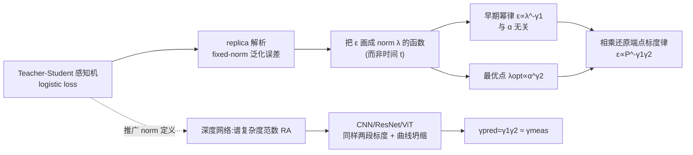

# Implicit bias produces neural scaling laws in learning curves, from perceptrons to deep networks

**会议**: ICLR 2026  
**OpenReview**: [https://openreview.net/forum?id=qBAV2DEvAC](https://openreview.net/forum?id=qBAV2DEvAC)  
**代码**: 待确认  
**领域**: learning_theory  
**关键词**: 神经标度律, 隐式偏置, 感知机, 统计力学, 学习曲线, 谱复杂度, replica 方法  

## 一句话总结
作者提出"沿训练全过程、把学习曲线画成模型范数 $\lambda(t)$ 的函数"这一新视角，在感知机里用统计力学解析地推出两条**动态标度律**，并证明它们的乘积恰好复现经典的"测试误差 vs 数据量"端点标度律；这套规律在 CNN / ResNet / ViT 上同样成立，根源是梯度训练全程的隐式偏置。

## 研究背景与动机
- **领域现状**：神经标度律（test error 随数据/模型/算力呈幂律下降）已成深度学习最稳健的经验规律之一，是 Kaplan、Chinchilla 等"算力最优配置"工作的基础。但绝大多数研究只看**训练结束时**（收敛点）的渐近行为，把整条训练轨迹压成一个点。
- **现有痛点**：另一条平行的理论线——梯度下降的**隐式偏置**（如 logistic loss 在线性可分数据上收敛到最大间隔解）——只被用来解释"训练终点为什么泛化好"，没人把它和"训练全程的标度行为"联系起来。两条线各说各话。
- **核心矛盾**：经验标度律是"宏观、端点、说不清机理"的；隐式偏置理论是"微观、有解析、但只管终点"的。中间整段训练动力学的标度结构是一片空白。
- **本文目标**：刻画**整条学习曲线**的标度结构，并给它一个来自隐式偏置的解析解释，最终把"动态标度律"和经典"端点标度律"打通。
- **核心 idea**：**【关键洞察】** 不要把学习曲线画成时间 $t$ 的函数，而要画成**权重范数 $\lambda(t)$ 的函数**——因为隐式偏置让范数随训练单调增长，$\lambda(t)$ 是比 $t$ 更本质的"训练进度"度量。换坐标后，原本杂乱的曲线显露出两段干净的幂律。

## 方法详解

### 整体框架
论文走"可解析的感知机 → 不可解析的深度网络"两步。先在 teacher–student 感知机里用 replica 方法解析求出 fixed-norm 下的泛化误差，发现把误差对 $\lambda$ 作图会自然分出早/晚两个标度区，并提炼出两条幂律 $\hat\epsilon\propto\lambda^{-\gamma_1}$ 与 $\lambda_{\text{opt}}\propto\alpha^{\gamma_2}$；二者相乘正好还原经典端点标度律 $\epsilon\propto P^{-\gamma_1\gamma_2}$。再把"范数"推广为深度网络的**谱复杂度范数**，验证同样的两段标度与曲线坍缩在 CNN/ResNet/ViT 上重现。

### 关键设计

**1. 用范数 $\lambda$ 当"训练进度表"：fixed-norm 与 free-norm 的等价桥梁。** logistic 损失 $V_\lambda(\Delta)=-\frac{1}{\lambda}(\lambda\Delta-\log 2\cosh(\lambda\Delta))$ 只通过乘积 $\lambda\Delta$ 起作用，而间隔 $\Delta=y(w\cdot x/\sqrt N)$ 又正比于权重范数 $\|w\|$。这意味着"固定范数、调超参 $\lambda$"与"固定 $\lambda=1$、让范数自由增长 $\|w(t)\|\equiv\lambda(t)$"在数学上等价。前者每个点是**不同感知机的训练终点**（可用 replica 解析算），后者是**同一个感知机的训练轨迹**（数值训练）。论文展示二者曲线在 $\epsilon$–$\lambda$ 平面上高度吻合，于是把解析可控的静态解直接搬来描述动力学，这正是"训练时隐式偏置"的体现。

**2. logistic loss 的三个 $\lambda$ 区间：从 Hebb 到 Bayes 最优再到最大稳定性。** 解析解显示泛化误差随 $\lambda$ 走过三段：$\lambda\to0$ 时 $V\to-\Delta$ 退化为 **Hebb 学习**，给出基线误差 $\epsilon_0$（大 $\alpha$ 下 $\epsilon_0\sim\alpha^{-1/2}$）；在有限的 $\lambda_{\text{opt}}(\alpha)$ 处误差取极小，且该极小**正好等于 Bayes 最优预测器**的泛化误差；$\lambda\to\infty$ 时 $V\to-2\Delta\theta(-\Delta)$，对应**最大稳定性感知机**（最大间隔解），此后开始过拟合。于是一条训练曲线被解释成"先 Hebb、再 Bayes 最优、最后 max-stability"的隐式偏置历程。

**3. 两条动态标度律及其乘积复现端点律。** 把相对误差 $\hat\epsilon\equiv\epsilon/\epsilon_0$ 对 $\lambda$ 作图，大 $\alpha$ 下分裂成两段：早期是**与 $\alpha$ 无关**的幂律 $\hat\epsilon=k_1\lambda^{-\gamma_1}+q_1$（式 2）；最优点位置服从 $\lambda_{\text{opt}}=k_2\alpha^{\gamma_2}+q_2$（式 3）。把每条曲线按各自的 $(\lambda_{\text{opt}},\hat\epsilon_{\text{opt}})$ 重标度，所有大 $\alpha$ 曲线**坍缩成同一条 master 曲线** $\hat\epsilon/\hat\epsilon_{\text{opt}}=\Phi(\lambda/\lambda_{\text{opt}})$（式 4）。正因为整条曲线随 $\alpha$ 同幂律，可把式 3 代入式 2 得端点标度律 $\hat\epsilon(\alpha)=k_1(k_2\alpha^{\gamma_2}+q_2)^{-\gamma_1}+q_1$（式 5），感知机里简化为 $\epsilon\sim\alpha^{-\gamma_1\gamma_2}$。固定范数下 $\gamma_1=1/2,\gamma_2=1$，恰好还原 $\gamma=\gamma_1\gamma_2=1/2$。论文还在附录用 MSE 损失作反例，说明这套标度律并非任意损失都有，是 logistic/隐式偏置特有的。

**4. 把"范数"推广到深度网络：谱复杂度范数。** 深度网络没有干净的 $\|w\|$，作者改用 Bartlett 等人的**谱复杂度范数** $R_A=\big(\prod_i\rho_i\|A_i\|_\sigma\big)\big(\sum_i \|A_i^\top-M_i^\top\|_{2,1}^{2/3}/\|A_i\|_\sigma^{2/3}\big)^{3/2}$（式 6）：第一项是各层最大奇异值连乘（输入能被放大的最大倍数），第二项估计各层输出的有效秩。令 $\lambda(t)=R_A(t)$（第 $t$ 个 epoch 后测得），无 weight decay 时 $\lambda(t)$ 单调增。作者特意指出 $\lambda$ 与 $t$ 的关系是非平凡的——直接画 $\epsilon(t)$ **看不到**标度律，只有画成 $\epsilon(\lambda(t))$ 才显露出与感知机一致的两段标度与曲线坍缩，且附录中其他四种范数定义虽也有定性两段，却给出不自洽的 $\gamma_{\text{pred}}$，说明谱复杂度范数是"对的那个"度量。

## 实验关键数据

### 主实验表格
在 CNN / ResNet / ViT × MNIST / CIFAR-10 / CIFAR-100（标准超参、无 weight decay）上，用独立拟合的 $\gamma_1,\gamma_2$ 预测端点指数 $\gamma_{\text{pred}}=\gamma_1\gamma_2$，与直接拟合 $\epsilon(P)$ 得到的 $\gamma_{\text{meas}}$ 对比：

| 模型 | 数据集 | $\gamma_{\text{pred}}$ | $\gamma_{\text{meas}}$ | $\sigma$ |
|------|--------|------|------|------|
| CNN | MNIST | 0.60 | 0.55 | 0.09 |
| CNN | CIFAR10 | 0.28 | 0.25 | 0.07 |
| CNN | CIFAR100 | 0.16 | 0.16 | 0.03 |
| ResNet | MNIST | 0.57 | 0.69 | 0.08 |
| ResNet | CIFAR10 | 0.54 | 0.56 | 0.04 |
| ResNet | CIFAR100 | 0.31 | 0.37 | 0.03 |
| ViT | MNIST | 0.47 | 0.54 | 0.03 |
| ViT | CIFAR10 | 0.23 | 0.21 | 0.03 |
| ViT | CIFAR100 | 0.14 | 0.12 | 0.04 |

九组配置里 $\gamma_{\text{pred}}$ 与 $\gamma_{\text{meas}}$ 均在拟合误差 $\sigma$ 内吻合，说明"两条动态律之积 = 端点律"在真实深度网络上成立。

### 消融实验表格

| 变化 | 现象 | 结论 |
|------|------|------|
| 加入 moderate weight decay | $\gamma_1,\gamma_2$ 改变，但 $\gamma_{\text{pred}}=\gamma_1\gamma_2$ 仍与无 WD 情形相容 | 标度律对正则鲁棒 |
| Adam → SGD（CNN） | 动态曲线变形、$\gamma_1,\gamma_2$ 不同 | 但 $\gamma_{\text{pred}}$ 不变，仍复现 Hestness 端点律 |
| 换 4 种其他范数定义 | 定性两段标度仍在 | 但 $\gamma_{\text{pred}}$ 与 $\gamma_{\text{meas}}$ 不自洽，唯谱复杂度范数自洽 |
| 损失换成 MSE（感知机） | 看不到幂律标度 | 标度律是 logistic/隐式偏置特有，非普适 |

### 关键发现
- **曲线坍缩在"有限 $P$"就出现**：虽然每个 $P$ 对应不同的损失地形、增大 $P$ 仍在降低误差（远未到 $P\to\infty$），大 $P$ 的早期曲线却包住了所有小 $P$ 的早期曲线，自相似地坍缩到一条 master 曲线。
- **早期标度与 $\alpha$（数据量）无关、晚期才依赖 $\alpha$**：这为"丢弃太小数据集训练的模型"这一标度律研究惯例提供了天然解释——标度只在大 $\alpha$ 才干净。
- 自由范数感知机数值实测 $\gamma_1=0.4901\pm0.0005$、$\gamma_2=0.96\pm0.25$，与固定范数解析值 $1/2,1$ 一致。

## 亮点与洞察
- **换坐标即换洞察**：把"时间轴"换成"范数轴"这一极简动作，让端点标度律从"经验黑箱"变成"两条可解析子律的乘积"，是非常漂亮的视角转换。
- **三条学习规则串成一条轨迹**：Hebb → Bayes 最优 → max-stability 不再是孤立的经典结论，而被统一成同一条训练轨迹上的三个阶段，给隐式偏置一个"全程"而非"终点"的图像。
- **可解析模型与真实网络对齐**：感知机的 replica 解析 + 深度网络的谱复杂度范数，让一个统计力学玩具模型的结论真的迁移到了 ViT 上，且指数定量吻合。
- **实用预言**：master 曲线坍缩意味着可在小数据上测出泛化曲线形状、外推到大数据，潜在地省算力（作者也诚实地说这需进一步鲁棒性验证）。

## 局限与展望
- 感知机里"训练时隐式偏置"目前主要是**定性**的——fixed-norm 静态解只是定性吻合 free-norm 动力学，要定量需用动力学平均场（DMFT）或类似 Wu et al. 2025 的方法做完整训练动力学求解。
- 深度网络**没有解析对应物**：谱复杂度范数只是一个"好像对"的候选，为什么它能扮演感知机里 $\|w\|$ 的角色、能否定量化，仍未知。
- 实验局限在中小规模视觉任务（MNIST/CIFAR、CNN/ResNet/ViT），未触及大语言模型这一标度律最重要的战场。
- 自由范数感知机在大 $\alpha$、大 $\lambda$ 下训练步数随 $\lambda$ 指数增长，导致无法直接测 $\gamma$，限制了纯动力学侧的验证。
- **展望**：约束谱复杂度按预设 $\lambda(t)$ 轨迹训练，看是否复现 $\epsilon(\lambda)$ 曲线；把框架推广到 square loss / 回归、committee machine 等更一般设置（作者引 Montanari–Urbani 2025 认为可行）。

## 相关工作与启发
- **经验神经标度律**：Hestness 2017、Kaplan 2020、Chinchilla（Hoffmann 2022）、Caballero 2023（broken scaling）——本文给这条线补了"训练全程"的微观机理。
- **隐式偏置**：Soudry 2018（logistic 收敛到最大间隔）、Lyu–Li 2020、Chizat–Bach 2020——本文把"终点偏置"扩展成"全程偏置"，与 Wu et al. 2025（过参化下的全轨迹偏置）互补。
- **感知机统计力学**：Gardner 1987/1988（存储容量、teacher–student）、Opper 系列（收敛时间、Bayes 最优学习曲线）、Aubin 2020（fixed-norm logistic 回归解，本文据此给出强调范数增长的等价推导）。
- **训练时间标度**：Velikanov–Yarotsky 2021、Bordelon 2024、Montanari–Urbani 2025（committee machine 的动态区与范数关联）——本文与之呼应并提供感知机的解析锚点。
- **启发**：研究"动力学过程的标度律"时，找到一个比时间更本质的进度变量（这里是范数）可能是揭示隐藏幂律结构的关键；这一思路对 LLM 训练曲线、优化动力学分析都有借鉴价值。

## 评分
- **新颖性**: ⭐⭐⭐⭐⭐ "把学习曲线画成范数函数"这一视角 + 两条动态律相乘还原端点律，是真正新的理论贡献，且把隐式偏置从终点推广到全程。
- **实验充分度**: ⭐⭐⭐⭐ 3 架构 × 3 数据集 + weight decay / SGD / 多范数消融，证据链完整；但局限于中小规模视觉任务，未触及 LLM。
- **写作质量**: ⭐⭐⭐⭐ 从可解析感知机到深度网络的叙事清晰，公式与图配合好；统计力学/replica 部分对非理论读者门槛较高。
- **价值**: ⭐⭐⭐⭐ 给经验标度律提供了少见的"机理级"解释，并暗示了小数据外推大数据曲线的实用前景，对标度律理论与优化动力学社区都有参考意义。

<!-- RELATED:START -->

## 相关论文

- [\[ICLR 2026\] Scaling Laws and Spectra of Shallow Neural Networks in the Feature Learning Regime](scaling_laws_and_spectra_of_shallow_neural_networks_in_the_feature_learning_regi.md)
- [\[ICLR 2026\] Variational Deep Learning via Implicit Regularization](variational_deep_learning_via_implicit_regularization.md)
- [\[ICLR 2026\] Theory of Scaling Laws for In-Context Regression: Depth, Width, Context and Time](theory_of_scaling_laws_for_in-context_regression_depth_width_context_and_time.md)
- [\[ICLR 2026\] Random Label Prediction Heads for Studying Memorization in Deep Neural Networks](random_label_prediction_heads_for_studying_memorization_in_deep_neural_networks.md)
- [\[ICLR 2026\] On Universality of Deep Equivariant Networks](on_universality_of_deep_equivariant_networks.md)

<!-- RELATED:END -->
