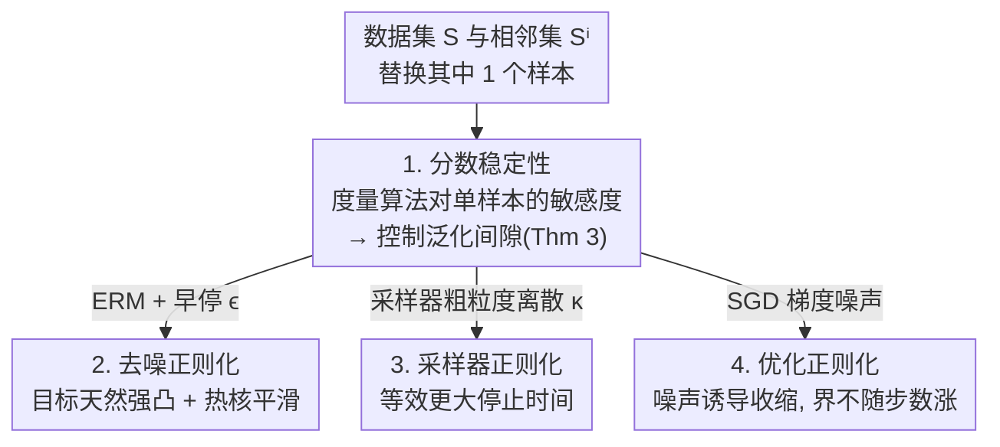

# Implicit Regularisation in Diffusion Models: An Algorithm-Dependent Generalisation Analysis

**会议**: ICLR 2026  
**OpenReview**: [https://openreview.net/forum?id=3lSqgESdPu](https://openreview.net/forum?id=3lSqgESdPu)  
**代码**: 无（纯理论）  
**领域**: 学习理论 / 扩散模型 / 泛化分析  
**关键词**: 扩散模型, 隐式正则化, 算法稳定性, 泛化界, 分数匹配

## 一句话总结
本文提出"分数稳定性"（score stability）这一**与算法相关**的泛化分析框架，把扩散模型对单个训练样本的敏感度直接转化为泛化间隙的上界，并用它在三处揭示了此前被忽视的隐式正则化来源——去噪目标本身、采样器的粗粒度离散、以及 SGD 的梯度噪声。

## 研究背景与动机

**领域现状**：扩散模型在图像、音频、视频、蛋白质生成上都达到了 SOTA，能从有限数据里学出复杂高维分布的"新样本"。但它为什么能泛化、而不是简单背下训练集，理论上并不清楚。

**现有痛点**：一个尖锐的事实是——如果把经验去噪分数匹配损失 $\hat\ell_{\mathrm{dsm}}$ 完全最小化、再完美采样，扩散模型会**精确复现训练数据**（图 1 在 CIFAR-10 上的记忆现象）。这是因为经验目标在所有 $L^2$ 分数函数空间里有**唯一**的最小值——经验分数函数 $\nabla\log\hat p_t$（Lemma 1）。这一点和监督学习根本不同：监督学习的经验风险最小化常有无穷多解、需要正则才良定。所以扩散模型能产出新数据，必然意味着它在训练或采样中**没有真的把目标最小化干净，或没有真的完美采样**——也就是说，某种隐式正则化才是泛化的关键。

**核心矛盾**：现有理论几乎都是**算法无关**（algorithm-independent）的。一类用一致收敛 / 覆盖数（Oko et al. 2023 等），结论强烈依赖精心挑选的网络结构，完全不碰算法本身；另一类（De Bortoli 2022）用 Wasserstein 距离配合经验测度收敛，更模型无关，但又忽略了扩散模型"如何生成新数据"。还有些工作为了引入算法效应只能退到高斯混合、随机特征这种受限设定。于是出现一个空白：缺一套**通用的、算法相关的**扩散模型泛化理论。

**本文目标**：构造一个不依赖具体模型类、而是利用"算法促进泛化"这一面的框架，并用它去**具体定位**扩散模型里到底有哪些隐式正则化在起作用。

**切入角度**：借用学习理论里经典的**算法稳定性**（algorithmic stability）思想——一个算法越不依赖某个单独训练样本，它泛化越好。但经典稳定性是为回归/分类设计的，作者把它改造成专门刻画扩散模型分数匹配算法的版本。

**核心 idea**：用"替换一个训练样本后，学到的分数函数变化多大"来定义**分数稳定性** $\varepsilon_{\mathrm{stab}}$，并证明泛化间隙以同样的速率衰减；再把这把"尺子"分别量到 ERM、采样器、SGD 三种算法上，逐一读出隐藏的正则化。

## 方法详解

### 整体框架

整篇论文的"方法"其实是一条分析链：**先造一把度量算法敏感度的尺子（分数稳定性），证明这把尺子直接控制泛化间隙，再把它依次套到扩散模型训练/采样的三个真实算法环节上，读出各自的隐式正则化。**

具体地：给定数据集 $S=\{x_1,\dots,x_N\}$，构造一个**相邻数据集** $S^i$——把第 $i$ 个样本替换成一个独立新样本 $\tilde x$。比较在 $S$ 与 $S^i$ 上训练得到的两个分数函数 $\hat s$ 与 $\hat s^i$ 的差异，就得到分数稳定性常数 $\varepsilon_{\mathrm{stab}}$。Theorem 3 把这个常数变成泛化间隙的上界。剩下三节分别针对**经验风险最小化（ERM，对应去噪正则化）**、**离散时间采样器（采样器正则化）**、**带裁剪与权重衰减的 SGD（优化正则化）**，估计各自的 $\varepsilon_{\mathrm{stab}}$。

### 关键设计

**1. 分数稳定性：把"换一个样本后分数变多少"变成泛化间隙的上界**

经典算法稳定性度量的是损失对单样本的敏感度，但扩散模型的"输出"是一个**函数**（分数网络），不是一个标量损失，没法直接套用。作者的做法是把敏感度定义在函数空间上：算法 $A_{\mathrm{sm}}$ 称为以常数 $\varepsilon_{\mathrm{stab}}$ 分数稳定，若对任意 $i$，

$$\mathbb{E}_{S,\tilde x}\Big[\inf_{(\hat s,\hat s^i)\in\Gamma_i}\int \mathbb{E}\big[\|\hat s(X_t,t)-\hat s^i(X_t,t)\|^2\,\big|\,X_0=\tilde x\big]\,\tau(dt)\Big]\le \varepsilon_{\mathrm{stab}}^2,$$

其中 $\hat s=A_{\mathrm{sm}}(S)$、$\hat s^i=A_{\mathrm{sm}}(S^i)$，$\tau$ 是时间步的加权测度。注意它在被替换样本 $\tilde x$ 诱导的扩散轨迹 $X_t$ 上度量两个分数的差，并对随机算法取**最优耦合** $\Gamma_i$（确定性算法时退化为单点）。

这把尺子的价值由 Theorem 3 兑现：它直接控制去噪分数匹配损失与分数匹配损失的期望泛化间隙，

$$\mathbb{E}[\ell_{\mathrm{dsm}}(\hat s)]^{1/2}-\mathbb{E}[\hat\ell_{\mathrm{dsm}}(\hat s)]^{1/2}\le \varepsilon_{\mathrm{stab}},\qquad \mathbb{E}[\ell_{\mathrm{sm}}(\hat s)]\lesssim \mathbb{E}[\hat\ell_{\mathrm{sm}}(\hat s)]+\varepsilon_{\mathrm{stab}}C_{\mathrm{sm}}^{1/2}+\varepsilon_{\mathrm{stab}}^2.$$

也就是说，**泛化间隙以与分数稳定性相同的速率衰减**。和一致收敛不同，这是个算法相关的界：要知道它随 $N$ 多快趋于 0，必须去分析具体算法——这正是后面三节做的事。

**2. 去噪正则化：去噪目标自带强凸性，无需任何额外正则就稳定**

第一个被分析的算法是直接最小化 $\hat\ell_{\mathrm{dsm}}$ 的 ERM。在传统监督学习里，ERM 只有在限制假设类或显式加正则时才稳定；而本文发现**去噪分数匹配目标本身就提供了稳定性**。证明分两步：其一，$\hat\ell_{\mathrm{dsm}}$ 在一个数据相关的加权 $L^2$ 空间里对 $s$ 是**强凸**的（这是由于对 $X_t\mid X_0$ 的积分，目标有唯一极小），由此得到形如 $\int\mathbb{E}\|\hat s-\hat s^i\|^2\lesssim \mathbb{E}[\hat\ell_{\mathrm{sm}}]+\tfrac{\varepsilon_{\mathrm{stab}}}{N}(C_{\mathrm{sm}}^{1/2}+\varepsilon_{\mathrm{stab}})$ 的不等式；其二，借助热核的 **Wang (1997) Harnack 不等式**——它刻画了热核"抹平函数"的平滑作用——把上式转成对 $\varepsilon_{\mathrm{stab}}$ 本身的界。

在流形假设下（数据落在维度 $d^*$、reach 为 $\tau_{\mathrm{reach}}$ 的子流形上），Proposition 6 给出

$$\varepsilon_{\mathrm{stab}}^2\lesssim C\big(CC_{\mathrm{sm}}N^{-2}+\mathbb{E}[\hat\ell_{\mathrm{sm}}]\big)^c,\qquad C=\tfrac{D_{\mathcal H}^2}{\sigma_\epsilon^4}\vee\tfrac{1}{c_\nu\sigma_\epsilon^{d^*}},$$

对任意 $c\in(0,1)$ 成立。两个读数特别有意思：界**只依赖内蕴维度 $d^*$ 而非环境维度 $d$**，说明扩散模型是自动**流形自适应**的；界对早停时间 $\epsilon$ 高度敏感，$\epsilon$ 越大界越小、$\epsilon\to 0$ 时指数爆炸——这恰好解释了扩散文献里普遍采用**早停**（把反向过程提前一点终止）的必要性，正则化在大噪声尺度上更充分。

**3. 采样器正则化：粗粒度离散等效于"更大的早停时间"，用采样精度换泛化**

实际采样无法精确解反向 SDE，要靠数值积分。作者分析 Benton et al. (2024) 那类 Euler–Maruyama 离散方案，时间步 $t_k=T-(1+\kappa)^{(T-1)/\kappa-k}$，其中 $\kappa>0$ 控制离散粗细。关键观察是：分数网络常常**只在采样器用到的时间步上训练**（时间加权 $\hat\tau_\kappa$），于是算法的"有效停止时间"可以远大于早停 $\epsilon$——离散越粗，等效停得越早，正则化越强。

Proposition 7 给出生成分布与数据分布之间 KL 散度的界，它由**两部分对冲**组成：来自 ERM 分数稳定性的项随 $\kappa$ 增大而**减小**，而离散误差项随 $\kappa$ 增大而**增大**。这就显式地刻画出一个**采样精度 ↔ 泛化**的权衡，由离散粗细 $\kappa$ 来调节；Corollary 8 进一步把这个权衡取了最优。相比 Oko et al. (2023) 等需要精心约束网络结构和特定早停时间，本文的结果只要求"足够小的早停时间"，把控制复杂度的担子转移到了"实践中本就要调"的离散方案上。

**4. 优化正则化：SGD 的高方差梯度噪声诱导收缩，让稳定性界不随迭代步数增长**

最后分析真实训练用的优化器：带梯度裁剪与权重衰减的 SGD，迭代为 $\theta_{k+1}=(1-\eta_k\lambda)\theta_k-\eta_k\,\mathrm{Clip}_C(G_k)$。这里只对分数网络做温和的结构假设（几乎处处 Lipschitz、光滑，允许常数随输入变化，从而能容纳 ReLU 网络），不绑定具体参数类。Proposition 11 先给出 $\propto 1/\sqrt N$ 量级的稳定性界，但它会**随迭代步数 $K$ 增长**——这对动辄需要大量步数的扩散训练是硬伤。

突破口在于扩散训练的梯度估计器**方差天然很高**（式 13 中对噪声 $\xi_{i,j}$ 和时间 $t_{i,j}$ 的额外随机性）。作者把这股噪声从"麻烦"变成"资源"：用二阶高斯近似刻画梯度噪声后，借鉴随机梯度 Langevin 动力学里的**反射耦合**（Farghly & Rebeschini 2021），证明这股噪声会让两条训练轨迹在期望意义下**收缩**。由此 Proposition 14 给出一个**不随步数无限增长**的长期稳定性界，同时保住了 $1/\sqrt N$ 的速率。换句话说，正是扩散模型独有的"高方差梯度估计器 + SGD"组合，反而带来了更紧的泛化保证——这是无额外注入噪声做不到的。

## 实验关键数据

本文是纯理论工作，没有 benchmark 对比表，核心"结果"是三条闭式泛化界以及一个一维玩具实验对它们的验证。

### 三种隐式正则化来源汇总

| 算法环节 | 正则化来源 | 调控量 | 关键性质 |
|----------|-----------|--------|----------|
| ERM（去噪分数匹配） | 去噪正则化 | 早停时间 $\epsilon$ | 目标强凸+热核平滑，无需额外正则即稳定；只依赖 $d^*$，流形自适应 |
| 离散时间采样器 | 采样器正则化 | 离散粗细 $\kappa$ | 粗离散等效更大停止时间；采样精度 ↔ 泛化权衡（Cor 8 取最优） |
| SGD（裁剪+权重衰减） | 优化正则化 | 梯度噪声 / 重采样数 $P$ | 噪声诱导轨迹收缩，界不随迭代步数 $K$ 增长（Prop 14） |

### 一维玩具实验（图 2）

| 扫描变量 | 观察到的曲线 | 结论 |
|----------|--------------|------|
| 离散缩放参数 $\kappa$ | 总体 KL 呈 U 形，存在明显极小 | 过粗/过细都不好，存在最优离散 |
| 离散步数 | KL 随步数先降后升，U 形 | 步数过多反而损害泛化 |
| 早停时间 $\epsilon$ | KL 随 $\epsilon$ U 形，有明显谷底 | 适度早停最利泛化 |

设定为 1 维高斯目标、数据集大小 $N=40$、用经验分数函数引导采样，追踪总体 KL 散度。

### 关键发现
- **三条 U 形曲线**是全文最直观的证据：限制采样过程（更粗离散、更早停止）确实像一种有效正则化——既不能不限制（会记忆训练数据），也不能限制过头（采样误差变大）。
- **维度依赖只看 $d^*$ 不看 $d$**：理论上说明扩散模型自动适应数据流形的内蕴维度，这是高维设定下的好消息。
- **梯度噪声是"特性"不是"缺陷"**：扩散训练里令人头疼的高方差梯度，恰恰是让稳定性界不随步数发散的关键机制。

## 亮点与洞察
- **把算法稳定性搬进函数空间**：传统稳定性度量标量损失的敏感度，本文改成度量"分数函数"的敏感度，并对随机算法取最优耦合——这一步让一整套经典工具第一次能作用到扩散模型上，是可复用的范式。
- **"完美训练+完美采样=记忆"这个反直觉事实被正面利用**：作者不绕开它，而是从它推出"正则必来自算法本身"，再逐一定位，逻辑链非常干净。
- **三处正则化对应三个实践常识**：早停、调离散步数、梯度裁剪/权重衰减——这些工程上"约定俗成"的操作，第一次被同一把尺子解释成泛化机制，对调参有直接指导意义（如离散步数不是越多越好）。
- **把"梯度噪声"反转成正则化资源**的视角可迁移：凡是估计器方差天然偏高的生成式训练，都可能用类似的"噪声诱导收缩"思路去论证更紧的泛化界。

## 局限与展望
- **作者承认**：ERM 分析没有利用模型类的光滑性来自适应数据分布的平滑度，留作未来工作；采样分析只覆盖了一种 SDE 离散方案，没有比较不同采样器（如概率流 ODE）。
- 结果以**期望泛化间隙**为主，尚无高概率界，也没有直接刻画记忆 / 隐私这类更细的量（作者把它列为后续方向）。
- 多处依赖**流形假设**（数据落在低维子流形、密度有正下界）和对分数网络的结构性假设（Assumption 5/9/10/12/13），这些假设在真实大模型上是否成立、常数大小如何，文中并未实证。
- 唯一的定量实验是 1 维高斯 $N=40$ 的玩具设定，离 CIFAR/ImageNet 这类真实高维场景还有距离——理论方向清楚，但验证的尺度偏小。

## 相关工作与启发
- **vs 一致收敛/覆盖数路线（Oko et al. 2023; Azangulov et al. 2024; Tang & Yang 2024）**：他们从假设类的复杂度出发给最坏情形界，需要精心设计的网络结构和特定早停时间；本文从算法敏感度出发，几乎不约束假设类，把控制复杂度的负担转移到"本就要调"的离散方案上，更贴近实践。
- **vs De Bortoli (2022) 的 Wasserstein/经验测度路线**：更模型无关，但忽略了扩散模型如何生成新数据；本文显式利用算法生成过程（采样器、优化器）来读出正则化。
- **vs 受限设定的算法相关分析（高斯混合 Shah et al. 2023 / Chen et al. 2024、随机特征 Li et al. 2023）**：那些工作为引入算法效应而牺牲了通用性；本文给出的是通用的、算法相关的框架。
- **vs 经典算法稳定性（Bousquet & Elisseeff 2002; Hardt et al. 2016）**：本文是其在扩散模型/函数空间上的非平凡推广，SGD 部分的反射耦合则承接了 SGLD 分析（Farghly & Rebeschini 2021; Eberle & Majka 2019）。

## 评分
- 新颖性: ⭐⭐⭐⭐⭐ 首个通用、算法相关的扩散模型泛化框架，"分数稳定性"是干净且可复用的新工具。
- 实验充分度: ⭐⭐⭐ 纯理论工作，仅 1 维高斯玩具实验佐证，缺真实高维验证。
- 写作质量: ⭐⭐⭐⭐ 逻辑链清晰，从"记忆现象"一路推到三处正则化，定理与直觉解释配合得当。
- 价值: ⭐⭐⭐⭐⭐ 把早停、离散步数、梯度裁剪等工程常识统一解释为泛化机制，对理论与调参都有启发。

<!-- RELATED:START -->

## 相关论文

- [\[ICLR 2026\] Towards a Theoretical Understanding of In-Context Learning: Stability and Non-i.i.d. Generalisation](towards_a_theoretical_understanding_of_in-context_learning_stability_and_non-iid.md)
- [\[ICLR 2026\] A Sharp KL Convergence Analysis for Diffusion Models under Minimal Assumptions](a_sharp_kl_convergence_analysis_for_diffusion_models_under_minimal_assumptions.md)
- [\[ICLR 2026\] On the Interpolation Effect of Score Smoothing in Diffusion Models](on_the_interpolation_effect_of_score_smoothing_in_diffusion_models.md)
- [\[ICLR 2026\] Provable Separations between Memorization and Generalization in Diffusion Models](provable_separations_between_memorization_and_generalization_in_diffusion_models.md)
- [\[ICLR 2026\] Quotient-Space Diffusion Models](quotient-space_diffusion_models.md)

<!-- RELATED:END -->
