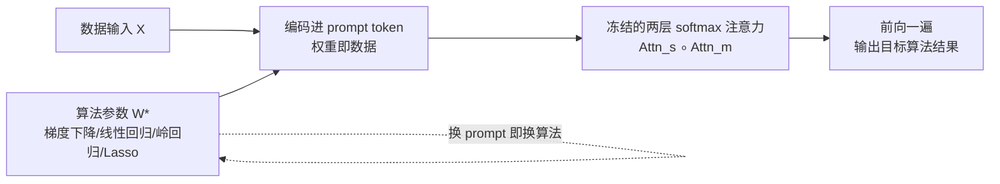

# In-Context Algorithm Emulation in Fixed-Weight Transformers

**会议**: ICLR 2026  
**arXiv**: [2508.17550](https://arxiv.org/abs/2508.17550)  
**代码**: [MAGICS-LAB/algo_emu](https://github.com/MAGICS-LAB/algo_emu)  
**领域**: 学习理论 / Transformer 表达力 / 上下文学习  
**关键词**: in-context learning, softmax attention, algorithm emulation, prompt programming, universality  

## 一句话总结
作者用构造性证明说明：**一个权重冻结的极简 softmax Transformer，仅靠改 prompt 就能模拟一大类算法**——单头单层注意力可逼近 $f(w^\top x-y)x$ 形式的算法（梯度下降、线性/岭回归等），而一个固定的两层注意力模块更进一步，能通过 prompt 把目标算法的权重编码进 token，从而"换 prompt 即换算法"，无需任何参数更新。

## 研究背景与动机
**领域现状**：大模型的 in-context learning（ICL）能在不更新权重的前提下，仅凭 prompt 里的示例就适配新任务。理论侧已有两条研究线索：一条训练模型让它对某个函数类做 in-context 学习（Garg 2022、Akyürek 2023 等）；另一条则手工设计 Transformer 权重去硬编码某个特定算法（Bai 2023、Von Oswald 2023 等），证明注意力层能在前向传播里实现最小二乘、岭回归、Lasso、梯度下降、Newton 法、PCA 等。

**现有痛点**：这些构造要么"一任务一训练"，要么"一算法一套权重"——每换一个算法就得重新设计或重新训练一整个 Transformer block。没有人给出**单一固定架构、靠 prompt 就能在多个算法间切换**的可证明结论。

**核心矛盾**：ICL 的实际威力恰恰来自"同一套冻结权重、靠 prompt 切换行为"，但已有理论无法解释这种"算法库式"的通用性，也大多用的是 linear/ReLU attention 而非实际的 softmax attention。

**本文目标**：建立一种新的 ICL 通用性——证明**一个权重冻结的 softmax 注意力模块**就能作为"prompt 可编程的算法解释器"，prompt 充当程序、冻结模型充当解释器，全程无 FFN、无参数更新。

**核心 idea**：**「权重即数据」（weights-as-data）**——把目标算法的参数编码进 prompt 的 token 表示里，构造出足够大的 query-key 点积间隔（dot-product gap），逼迫 softmax 沿着预期的计算路径走，从而让冻结注意力"按 prompt 指令执行算法"。

## 方法详解

### 整体框架
论文区分并依次攻克两种 in-context 算法模拟模式。**任务专属模式（Section 3）**：给定一个算法，存在一个固定权重的注意力模块，在格式良好的 prompt 上前向一遍就实现该算法，但每个算法要各自的权重。**Prompt 可编程模式（Section 4，主结果）**：存在**单个**冻结模块 $\mathrm{Attn}^\star$，对目标类里的每个算法 $A$ 都能找到合适 prompt $P_A$ 让它实现 $A$——一套权重模拟一整个算法库。后者通过"in-context 模拟任务专属模块"把前者收编，从而得到通用性结论。

### 关键设计

**1. 单头注意力对 $f(w^\top x-y)x$ 的 in-context 万能逼近：把"算法模板"塞进残差函数**。论文先抓住一个极其通用的算法模板 $f(w^\top x-y)x$——它作用在残差 $w^\top x-y$ 上，几乎涵盖所有线性模型的"残差驱动型"更新（$f(t)=t$ 是原始残差，$f=\nabla_w\ell$ 是逐样本梯度，sigmoid/step 对应感知机更新）。Theorem 3.1 证明：把数据 $X$ 与权重 $W=[w\,\cdots\,w]$ 拼成输入 $Z=[X;W]\in\mathbb{R}^{(2d+1)\times n}$，对任意连续可微 $f$ 和任意 $\epsilon>0$，都存在一个单头 softmax 注意力 $\mathrm{Attn}_s$ 配一个列向仿射层 $\mathrm{Linear}$，使 $\lVert\mathrm{Attn}_s\circ\mathrm{Linear}(Z)-[f(w^\top x_i-y_i)x_i]_{i=1}^n\rVert_\infty\le\epsilon$。关键在于把 $w$ 当作"数据"放进 prompt，而非烧进权重——这是后续一切的地基。

**2. 从万能逼近到具体算法：换一个 $f$ 就换一个统计方法**。有了模板逼近，具体算法只是"选 $f$"的推论。令 $f=\ell'$（损失的标量导数），Corollary 3.1.1 给出逐样本梯度 $\{\ell'(w^\top x_i-y_i)x_i\}$ 的并行逼近；再用读出向量 $u=\frac1n\mathbf{1}_n$ 做聚合（即右乘 $W_O=u$），Corollary 3.1.2 就得到单步梯度下降 $\hat w_{\mathrm{GD}}=w-\eta\nabla\hat L_n(w)$ 的逼近。把这种层堆 $L+1$ 层、每层把上一层输出的 $\hat w^{(t)}$ 重新写回 prompt 的 $W^{(t)}$，即得多步 GD，误差线性累积 $\lVert\hat w^{(t)}_{\mathrm{GD}}-w^{(t)}_{\mathrm{GD}}\rVert_\infty\le t\epsilon$。同一套构造换成平方损失就是线性回归（Corollary 3.1.3 收敛到 $w_{\mathrm{linear}}=\arg\min\frac1{2n}\sum(\langle w,x_i\rangle-y_i)^2$），加 $L_2$ 罚项就是岭回归（3.1.4）。一个模板统一了 GD、线性回归、岭回归。

**3. 「权重向量化进 prompt」的编码术：制造尖锐点积间隔**。要让一个固定模块模拟任意目标注意力头（参数 $W_K,W_Q,W_V$），核心是把这些权重 vectorize 后塞进 prompt 的扩展行。Definition 4.2 构造 $X_p=[X;\,W_{\mathrm{in}};\,I_n]$，其中 $W_{\mathrm{in}}$ 的第 $j$ 列携带 $(j\cdot w,\,w)$（$w=[\overline{W_K};\overline{W_Q};\overline{W_V}]$ 是三个权重的拼接向量），用"乘以序号 $j$"在 token 间制造单调递增的标记，从而在后续 softmax 里造出**尖锐的 query-key 点积间隔**——间隔越大，softmax 越接近 hard-argmax，就越精确地"路由"到预期 token。这正是「权重即数据」机制落地的技术核心。

**4. 两层注意力的通用性定理：固定权重模拟任意算法库**。Theorem 4.1 证明：对任意目标头 $W_K,W_Q,W_V$ 和任意 $\epsilon>0$，存在一个**两层网络**（多头层 $\mathrm{Attn}_m$ 接单头层 $\mathrm{Attn}_s$），使 $\lVert\mathrm{Attn}_s\circ\mathrm{Attn}_m(X_p)-W_VX\,\mathrm{Softmax}_\beta((W_KX)^\top W_QX)\rVert_\infty\le\epsilon$，且**无需 FFN、无需参数更新**。Theorem 4.2 给出对偶版本（先单头后多头、把权重作为额外 token 而非额外维度）。把 Theorem 3.1 的 $\mathrm{Linear}(Z)$ 当作这里的输入 $X$，就能用一个固定两层模块覆盖整个 $f(w^\top x-y)x$ 类（Corollary 4.2.1：任意有限算法库 $\{a_1,\dots,a_k\}$ 都能被同一模块靠换 prompt 模拟）。论文进一步指出，任何线性层 $x\mapsto\Theta x$ 也能照此把 $\Theta$ 编码进 prompt 来 in-context 替换（Remark 4.5），意味着标准网络里的可训练线性映射都可换成 prompt 可编程的注意力。

## 实验关键数据
实验为"概念验证"性质，在合成数据上验证两个构造块，量化逼近误差与模型规模/头数的关系。

### 主实验：验证 Theorem 3.1（逼近 $f(w^\top x-y)x$）
- 数据：$X\sim 10\cdot\mathcal{N}(0,1)-5$，$W,y\sim\mathcal{N}(0,1)$，目标函数取 $f=\tanh$，即逼近 $\tanh(w^\top x-y)\,x$。
- 模型：单头 softmax 注意力 + 线性连接，先对 $[X;y]$ 和 $W$ 做线性变换再训练逼近。
- 结果：MSE 损失下模型以极小误差逼近目标，实证支撑了万能逼近定理。

### 消融：注意力头数对模拟精度的敏感性（Theorem 4.1）
合成数据（50000 点，序列长 20，输入维 24，hidden 48，Adam lr=0.001，50 epoch，10 seed）下，用多头注意力模拟单个 softmax 头：

| Heads | 1 | 2 | 4 | 6 | 8 | 12 |
|-------|------|------|------|------|------|------|
| MSE | 3.469 | 2.802 | 1.222 | 1.012 | 0.793 | 0.686 |
| Std | 0.381 | 0.413 | 0.603 | 0.204 | 0.127 | 0.171 |

### 关键发现
- MSE 随头数单调下降，逼近率呈 $O(1/H)$ 趋势，验证了"多头 softmax 注意力可任意精度模拟目标注意力头"且随头数收敛。
- 附录补充了统计算法模拟（Appendix C.1）与真实数据集（Ames Housing）上**不访问真实算法权重**时的统计模型逼近（Appendix C.2），表明冻结模块靠 prompt 驱动仍能取得低误差。

## 亮点与洞察
- **「权重即数据」机制讲得透**：把算法参数从"模型权重"剥离到"prompt 数据"，prompt 即程序、冻结模型即解释器，给"GPT 风格模型靠 prompt 切换内部算法"提供了一个干净、可验证的玩具模型。
- **softmax-native 且极简**：用的是实际部署的 softmax 注意力（而非以往理论常用的 linear/ReLU attention），且全程无 FFN、最少两层就够，比 Giannou 2023 那种 13 层带循环、追求图灵完备的构造更轻、更透明。
- **大点积间隔 = 软 argmax 路由**：把"逼迫 softmax 走预期路径"显式化为"制造尖锐 query-key 间隔"，给 prompt 工程一个可解释的设计原则——prompt 工程其实是"算法选择的接口设计"。
- **统一模板的优雅**：$f(w^\top x-y)x$ 一个式子统摄梯度下降、线性回归、岭回归、感知机更新等一大批残差驱动算法，换 $f$ 即换算法。

## 局限与展望
- **仅限"注意力可实现"的算法类**：通用性是相对于"单层注意力能实现的算法"而言，并非任意算法；非注意力可表达的过程不在覆盖范围。
- **构造含非标准选择**：如沿 embedding 维度编码信息、用 $3n$ 个并行头，维度/头数偏理想化；论文坦言实践中可用更少 hidden 维和头数近似，但这部分主要靠实验佐证而非理论给出紧致界。
- **证明针对 attention-only 模块**：关于"GPT 风格模型靠 prompt 换算法"的论断是启发式外推，正式证明只覆盖无 FFN 的纯注意力模块。
- **实验偏概念验证**：主体在合成数据上验证逼近率，真实数据仅 Ames Housing 一例，离"大模型确实内化了算法库"的实证还有距离。
- **展望**：作者提出三条——把 prompt 工程视为算法选择的接口设计、设计鼓励学习"紧凑可复用过程库"的预训练目标、用内部路由分析理解基础模型如何在算法间选择。

## 相关工作与启发
- **Bai et al. 2023（Transformers as Statisticians）**：最接近的工作之一，证明 Transformer 能 in-context 执行多种标准算法，但用 ReLU attention 且一算法一套权重；本文升级到 softmax attention 并做到 prompt 可编程，Section 3 给出其主结果的 softmax 对应版本。
- **Giannou et al. 2023**：同样"一个固定模型多任务"，但目标是图灵完备的任意程序执行，需 13 层带循环的重构造；本文范围更窄但更干净——固定两层纯注意力模拟任意单层注意力可实现的算法。
- **Von Oswald 2023 / Akyürek 2023 等**：把 ICL 解释为隐式梯度下降；本文把这一视角推广为"in-context 算法模拟"，并给出构造性、可验证的 recipe。
- **启发**：为"prompt 即可调用子程序"提供了理论支点，提示未来预训练可显式优化"算法安装与调用"能力；也为可解释性研究指出一条路——分析注意力内部路由如何完成算法选择。

## 评分
- **新颖性**: ⭐⭐⭐⭐⭐ 首次在实际 softmax 注意力上建立"单一固定模块 + prompt 可编程"的算法模拟通用性，把任务专属构造收编为特例，「权重即数据」视角清晰且原创。
- **实验充分度**: ⭐⭐⭐ 概念验证扎实（逼近率 $O(1/H)$ 趋势漂亮），但规模小、真实数据仅一例，主要服务于"佐证定理"而非"逼近实际大模型"。
- **写作质量**: ⭐⭐⭐⭐ 两种模式划分清楚、定理-推论层层递进、与最接近工作的对比到位，机制解释（点积间隔/权重向量化）讲得明白。
- **价值**: ⭐⭐⭐⭐ 为 ICL=算法模拟提供了干净的理论地基与可解释机制，对理解基础模型通用性、指导 prompt 设计与预训练目标都有启发，理论意义大于即时落地价值。

<!-- RELATED:START -->

## 相关论文

- [\[ICLR 2026\] Transformers Learn Latent Mixture Models In-Context via Mirror Descent](transformers_learn_latent_mixture_models_in-context_via_mirror_descent.md)
- [\[ICLR 2026\] Transformers with Endogenous In-Context Learning: Bias Characterization and Mitigation](transformers_with_endogenous_in-context_learning_bias_characterization_and_mitig.md)
- [\[ICLR 2026\] Adversarially Pretrained Transformers May Be Universally Robust In-Context Learners](adversarially_pretrained_transformers_may_be_universally_robust_in-context_learn.md)
- [\[ICLR 2026\] Critical Attention Scaling in Long-Context Transformers](critical_attention_scaling_in_long-context_transformers.md)
- [\[ICLR 2026\] On learning linear dynamical systems in context with attention layers](on_learning_linear_dynamical_systems_in_context_with_attention_layers.md)

<!-- RELATED:END -->
