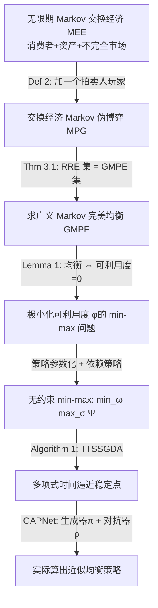

# Infinite Horizon Markov Economies

**会议**: ICLR 2026  
**OpenReview**: [https://openreview.net/forum?id=S0jIiiMtf4](https://openreview.net/forum?id=S0jIiiMtf4)  
**代码**: 论文中提供（GAPNet 实现）  
**领域**: 学习理论 / 博弈均衡计算 / 计算经济学  
**关键词**: Markov pseudo-game, 广义 Markov 完美均衡 (GMPE), 递归 Radner 均衡, 不完全市场, 策略梯度, 生成对抗策略网络  

## 一句话总结
本文提出 **Markov 伪博弈 (MPG)** 这一统一框架，把"动态不确定性"（Markov 博弈）和"行动依赖的可行性"（伪博弈）合二为一，证明了均衡存在性并给出多项式时间一阶求解算法，进而首次在一般化的无限期不完全市场经济中证明了递归 Radner 均衡的存在性，并用生成对抗策略网络 (GAPNet) 实际算出了均衡。

## 研究背景与动机

**领域现状**：一般均衡理论从 Walras 的供需模型到 Arrow–Debreu 的竞争经济，为"理性主体如何在交互中达成均衡"提供了严格的数学框架。Arrow & Debreu 把竞争经济刻画为**伪博弈 (pseudo-game)**——即每个玩家的可行行动集依赖于其他玩家的选择。Radner (1972) 又把它扩展为带不确定性的随机交换经济，得到经典的 Radner 均衡。

**现有痛点**：经典框架本质上是**静态**的，只刻画单期交易；即便把商品做成"状态条件"，也要依赖"完全市场"（拥有全套状态条件资产）这一不现实假设。而真实经济中的金融资产连续交易、跨期借贷、生产率/偏好的持续冲击，都需要**无限期**模型才能刻画。但无限期带来巨大的理论困难——例如允许 **Ponzi 骗局**（主体无限滚动债务），使得不完全市场下的均衡存在性变得棘手。Magill & Quinzii (1994) 把 Radner 框架推到无限期，但只限于金融资产，且计算进展极其有限，绝大多数求解方法仍困在有限期。

**核心矛盾**：一边是博弈论视角的 Markov 博弈（有可计算的均衡但不含"行动依赖可行性"），一边是经济学视角的无限期一般均衡（结构丰富但难以计算）。两者各执一端，缺乏一个既能算又能表达不完全市场经济的统一模型。

**本文目标**：构造一个同时具备 Markov 博弈"动态不确定性"和伪博弈"行动依赖可行性"的框架，证明其均衡存在、可在多项式时间内逼近，并把无限期不完全市场经济嵌入其中。

**核心 idea**：**(1) 统一建模** —— 提出 Markov 伪博弈 (MPG)，让可行行动集随状态和他人行动而变；**(2) 把均衡计算化归为可利用度极小化** —— 用对抗式 min-max 优化求解，借力近年生成对抗学习的进展拿到多项式时间保证；**(3) 经济学还原** —— 证明任意无限期 Markov 交换经济的递归 Radner 均衡集恰等于某个伪博弈的均衡集，从而打通"存在性证明"和"算法逼近"。

## 方法详解

### 整体框架

论文沿三条线推进：先定义 **Markov 伪博弈 (MPG)** 并证明其**广义 Markov 完美均衡 (GMPE)** 存在（Theorem 2.1），再把求 GMPE 化归为极小化**可利用度 (exploitability)** 的 min-max 优化，用两时间尺度随机梯度下降-上升 (TTSSGDA) 拿到多项式时间收敛（Theorem 2.2）；然后把无限期 Markov 交换经济 (MEE) 对应到一个"交换经济 MPG"，证明递归 Radner 均衡 (RRE) 集等于该 MPG 的 GMPE 集（Theorem 3.1），从而 RRE 的存在性与可计算性都被自动继承（Corollary 1、Theorem 3.2）；最后用生成对抗策略网络 (GAPNet) 落地求解。

### 关键设计

**1. Markov 伪博弈 (MPG)：让"谁能做什么"随状态和他人行动而变。** 标准 Markov 博弈里每个玩家的行动空间是固定的 $A_i$，而本文把它替换为**可行行动对应** $X_i(s,a_{-i})\subseteq A_i$——玩家 $i$ 在状态 $s$ 下能选的行动，取决于当前状态和其他玩家的行动 $a_{-i}$。这正是 Arrow–Debreu 伪博弈里"预算约束依赖于价格、而价格由拍卖人决定"那套耦合关系的动态版。在此之上，论文定义 Markov 策略 $\pi_i: S\to A_i$（只依赖当前状态）、可行策略对应 $F_i(\pi_{-i})$、状态值函数 $v^\pi$ 与动作值函数 $q^\pi$，并提出两个解概念：**广义 Nash 均衡 (GNE)**（只在初始分布上无单边偏离收益）和更强的 **广义 Markov 完美均衡 (GMPE)**（要求在**所有**状态 $s$ 上都满足 $v_i^{\pi^*}(s)\ge \max_{\pi_i\in F_i(\pi^*_{-i})} v_i^{(\pi_i,\pi^*_{-i})}(s)-\varepsilon$，是子博弈完美的类比）。Theorem 2.1 证明在标准凸性/连续性 + 策略类足够表达最优反应这两个假设下，凹 MPG 必存在纯策略 GMPE——这同时顺带证明了一大类连续行动 Markov 博弈存在**纯（确定性）**Markov 完美均衡，而此前文献只知道混合（随机）策略下的存在性。

**2. 可利用度极小化 + min-max 重构：把找均衡变成一个对抗优化问题。** 论文选用博弈论里常见的**可利用度 (exploitability)** 作为 merit function：$\phi(\pi)=\sum_{i\in[n]}\max_{\pi'_i\in F_i^{\mathrm{markov}}(\pi_{-i})} u_i(\pi'_i,\pi_{-i})$，它度量所有玩家可获得的最大单边偏离收益之和。Lemma 1 给出干净的刻画：$\pi^*$ 是 GMPE 当且仅当**状态可利用度** $\phi(s,\pi^*)=0$ 对所有 $s$ 成立；是 GNE 当且仅当 $\phi(\pi^*)=0$。但可利用度本身既非凸也不可微，GNE 计算更是 PPAD-hard（因为它推广了一次性博弈），直接极小化无望。于是论文沿 Goktas & Greenwald (2022) 的思路，把它重写成**耦合的 quasi-min-max 优化**：$\min_{\pi\in F(\pi)}\max_{\pi'\in F^{\mathrm{markov}}(\pi)}\Psi(\pi,\pi')$，其中 $\Psi(\pi,\pi')$ 是累积后悔。这一步把"找不动点均衡"转成了"外层玩家压低自身可被利用程度、内层玩家寻找最优偏离"的对抗博弈，为后续用 GAN 式算法求解铺路。

**3. 依赖策略参数化：消掉内层策略空间对外层的依赖，换来无约束 min-max。** 上面的 min-max 还有两个硬骨头：外层极小化要算不动点（$\pi\in F^{\mathrm{markov}}(\pi)$），内层玩家的可行策略空间又随外层选择而变。论文引入**依赖策略类** $R=\{\rho: S\times A\to A \mid \rho(s,a)\in X(s,a)\}$，把"内层最优反应隐式依赖外层决策"这件事**显式参数化**出来，得到解耦的 $\min_{\pi}\max_{\rho\in R}\Psi(\pi,\rho(\cdot,\pi(\cdot)))$（Lemma 2）。再配上参数化方案 $(\pi,\rho,\mathbb{R}^\Omega,\mathbb{R}^\Sigma)$ 并施加 Assumption 1（外层策略满足不动点可行性、内层 $\rho$ 把 $\pi(s)$ 当输入以编码依赖关系），整个问题就变成**无约束**的 $\min_{\omega}\max_{\sigma}\Psi(\omega,\sigma)$。无约束参数空间一举解决两难：既高效表达了外层不动点策略集，又消掉了内层策略空间对外层的依赖。论文还证明这种参数化对具有 DAG 依赖结构的 MPG（含所有交换经济 MPG）必然存在（Lemma 3）。

**4. 多项式时间收敛保证 + 经济学还原。** 在无约束 min-max 上，论文跑两时间尺度随机同时梯度下降-上升 **TTSSGDA**（Algorithm 1），依赖一个**可微博弈模拟器**（返回奖励和转移概率的梯度）来估计偏离收益与累积后悔。在 Lipschitz 光滑 + 内层梯度主导 + **最优反应错配系数** $C_{br}$ 有界等正则条件下，Theorem 2.2 证明算法在多项式步内收敛到可利用度的 $(\varepsilon,\delta)$-稳定点，从而近似满足 GMPE 的必要条件。经济学这一侧，论文把无限期 Markov 交换经济 (MEE) 通过**加一个"拍卖人"玩家**（其奖励是超额需求的价值，逼它出清市场）对应到交换经济 MPG（Def 2），Theorem 3.1 证明 MEE 的递归 Radner 均衡集**恰等于**该 MPG 的 GMPE 集——于是 RRE 存在性（Corollary 1）和多项式时间逼近（Theorem 3.2）全部自动成立。这是已知首个在多消费者、多商品、多（任意）资产的一般不完全市场设定下的递归竞争均衡存在性证明。

## 实验关键数据

实验把 MEE 对应的交换经济 MPG 用神经网络参数化：生成器网络输出 $\pi$、对抗器网络输出 $\rho$，整体即**生成对抗策略网络 (GAPNet)**，训练过程就是跑 Algorithm 1。对比基线是宏观经济学常用的**神经投影法 NPM**（即 deep equilibrium nets，极小化刻画 RRE 的一阶必要充分条件系统的范数）。两者用相同网络结构、各自网格搜索超参。评价指标：总一阶违反量、平均 Bellman 误差、可利用度。

### 主实验：基础经济中的收敛

| 设定 | 经济规模 | 偏好类型 | GAPNet | NPM |
|------|----------|----------|--------|-----|
| 确定性转移（附录 E） | 10 消费者 / 10 商品 / 1 资产 / 5 世界状态 | 线性、Cobb-Douglas、Leontief | 三项指标全部表现好 | 仅在其设计要极小化的指标上好 |
| 随机转移（Figure 1） | 同上 | 同上 | 三项指标在所有经济中都成功极小化 | 随机性进一步拖累其表现 |

关键对比：NPM 只在"它被设计去极小化"的指标上达标，而 GAPNet 在**全部三项指标**上都逼近 RRE 必要条件；随机性的引入会进一步损害 NPM，但 GAPNet 依旧稳健。

### 经济学合理性验证（不同偏好/贴现率）

| 偏好 / 设定 | 学到的均衡行为 | 与经典理论一致性 |
|------------|----------------|------------------|
| 线性偏好 | 几乎无资产需求，约 97–98% 财富用于当期消费 | 一致 |
| Cobb-Douglas | 消费占比降到 88–90%，持有正资产头寸（跨期平滑） | 一致（严格拟凹、边际效用递减） |
| Leontief | 支出升到近 99%，资产需求趋近 0 | 一致（受最稀缺品约束，避免跨期替代） |
| 高贴现率 γ（耐心主体） | 投资更多、跨期平滑消费 | 一致 |
| 低贴现率 γ（不耐心主体） | 几乎全部财富用于当期消费 | 一致 |

### 可扩展性

扩展到 **20 消费者 / 20 商品 / 5 资产 / 10 世界状态**的大经济：联合行动空间维度和内生状态转移复杂度都大幅上升，方差更大、对学习率更敏感、出现轻微不稳定，但 GAPNet 仍清晰收敛到接近零的可利用度（Figure 5，附录 E）。

### 关键发现
- GAPNet 不仅在收敛性指标上全面优于 NPM，且在**随机转移**下优势更明显——对抗式求解对不确定性更鲁棒。
- 学到的均衡能**复现经典消费者理论**（不同效用曲率下的消费/储蓄模式、贴现率对耐心的影响），说明求出的是经济上有意义的均衡而非数值假象。
- 即便在 Leontief 这类非光滑 primitive 上（理论假设要求光滑），神经参数化提供了有效的光滑近似，实践中依然好用。

## 亮点与洞察
- **一个框架统一两个世界**：Markov 伪博弈把博弈论的"动态不确定性"和经济学的"行动依赖可行性"装进同一个对象里，既是有可计算均衡的 Markov 博弈，又能表达不完全市场的一般无限期经济，这种"双向打通"非常优雅。
- **"加一个拍卖人"是点睛之笔**：把市场出清条件编码成拍卖人玩家的奖励，让"经济均衡 = 博弈均衡"这一还原变得自然，使得存在性与可计算性可以从博弈侧的定理"免费"搬到经济侧。
- **顺带证明了纯策略 Markov 完美均衡的存在性**：对一大类连续行动 Markov 博弈，此前只知混合策略均衡存在，本文给出确定性均衡的存在性，本身就是博弈论的独立贡献。
- **理论与工程闭环**：从 PPAD/FNP-hard 的悲观结论出发，退而求其近似稳定点，再用 GAN 式 GAPNet 真正算出来，理论保证与实证落地形成完整闭环。

## 局限与展望
- **理论结论偏弱**：算法只保证收敛到可利用度某稳定点的**邻域**，且仅"近似满足 GMPE 必要条件"——作者本人也承认这是相对弱的结论，全局均衡保证缺失，只在极限意义下才精确满足必要条件。
- **依赖一堆正则假设**：多项式时间保证建立在 Lipschitz 光滑、梯度主导、最优反应错配系数有界等假设上，对 Leontief 等非光滑经济只能靠神经网络近似，理论与实践之间有缝隙。
- **需要可微模拟器**：算法假定能从可微博弈模拟器拿到奖励和转移概率的梯度，这在很多真实经济/金融环境里未必可得。
- **实验规模仍有限**：最大也只到 20 消费者 / 20 商品 / 5 资产，且大经济下已出现不稳定，距离真正宏观尺度的经济仿真还有距离。
- **展望**：把框架用于带生产、带异质信念、带不完全信息的更丰富经济；探索更强的全局收敛保证；以及把"可微经济模拟器"作为基础设施推广到政策评估、宏观调控仿真等场景。

## 相关工作与启发
- **一般均衡谱系**：Walras → Arrow & Debreu（伪博弈/竞争经济）→ Radner (1972)（随机交换经济）→ Magill & Quinzii (1994)（无限期但限金融资产）。本文是这条线在"无限期 + 任意资产 + 可计算"方向上的延伸。
- **随机博弈/Markov 博弈**：Shapley (1953)、Fink (1964)、Takahashi (1964) 的随机博弈，Littman (1994) 的 Markov 博弈命名；本文在其上加入行动依赖可行性。
- **均衡计算复杂性**：NE 计算 PPAD-hard（Chen et al. 2009；Daskalakis et al. 2009），零和 Markov 博弈策略梯度结果（Daskalakis et al. 2020）；本文的可利用度极小化与之同源。
- **min-max 优化与 GAN**：Lin et al. (2020)、Daskalakis et al. (2020) 的两时间尺度梯度下降-上升，Goodfellow et al. (2014) 的 GAN；GAPNet 把"生成器-对抗器"映射到"外层策略-内层最优反应"。
- **宏观求解方法**：Azinovic et al. (2022) 的 deep equilibrium nets / 神经投影法是本文主要实证基线。
- **启发**：把"市场出清/约束满足"编码成一个额外玩家的奖励，从而用对抗博弈统一求解约束均衡，这套"约束→拍卖人玩家→min-max"的思路，对其他带耦合约束的多智能体均衡问题（如带资源约束的多智能体 RL、机制设计）有迁移价值。

## 评分
- **新颖性**: ⭐⭐⭐⭐⭐ Markov 伪博弈框架真正统一了博弈论与一般均衡两套语言，并首次在一般不完全市场设定下证明递归 Radner 均衡存在，概念贡献分量很重。
- **实验充分度**: ⭐⭐⭐ 在三类偏好、确定/随机转移、不同贴现率及一个放大规模上验证了收敛性和经济学合理性，对比基线清晰；但规模仍偏小、缺更大尺度/真实数据的压力测试。
- **写作质量**: ⭐⭐⭐⭐ 数学符号严谨、定理-引理-推论层层递进、动机交代充分；但理论密度极高、记号繁多，对非博弈论/经济学背景读者门槛较高。
- **价值**: ⭐⭐⭐⭐ 为无限期不完全市场经济提供了存在性证明 + 可计算算法的"理论-工程"闭环，对计算经济学、机制设计、多智能体均衡求解都有较强的基础性意义。

<!-- RELATED:START -->

## 相关论文

- [\[ICLR 2026\] Transfer Learning in Infinite Width Feature Learning Networks](transfer_learning_in_infinite_width_feature_learning_networks.md)
- [\[ICLR 2026\] On the Interpolation Effect of Score Smoothing in Diffusion Models](on_the_interpolation_effect_of_score_smoothing_in_diffusion_models.md)
- [\[ICLR 2026\] Sublinear Spectral Clustering Oracle with Little Memory](sublinear_spectral_clustering_oracle_with_little_memory.md)
- [\[ICLR 2026\] Random Spiking Neural Networks are Stable and Spectrally Simple](random_spiking_neural_networks_are_stable_and_spectrally_simple.md)
- [\[ICLR 2026\] Random-Projection Ensemble Dimension Reduction](random-projection_ensemble_dimension_reduction.md)

<!-- RELATED:END -->
