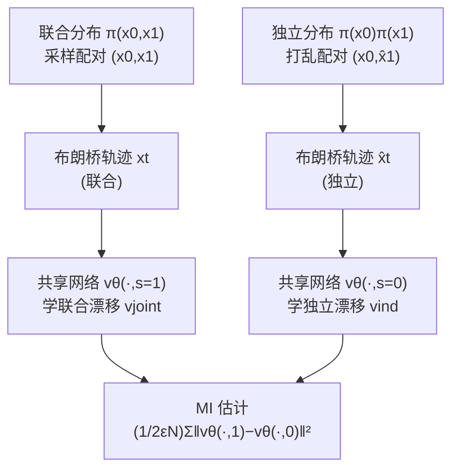

# InfoBridge: Mutual Information Estimation via Bridge Matching

**会议**: ICLR 2026  
**OpenReview**: [https://openreview.net/forum?id=y8Kzu9SKpv](https://openreview.net/forum?id=y8Kzu9SKpv)  
**代码**: [https://github.com/SKholkin/infobridge](https://github.com/SKholkin/infobridge)  
**领域**: 学习理论 / 信息论 / 生成模型  
**关键词**: 互信息估计, 扩散桥匹配, 互易过程, Girsanov 定理, 无偏估计  

## 一句话总结
把两个随机变量之间的互信息（MI）估计**重新表述成一个"域迁移"问题**：用一对扩散桥（一个连接联合分布、一个连接独立分布）的漂移项之差来表达 MI，从而得到一个理论上无偏、且在高维/高 MI 场景下显著优于现有方法的估计器 InfoBridge。

## 研究背景与动机
**领域现状**：互信息是衡量两个随机变量之间非线性依赖的核心信息论量，广泛用于自监督学习、泛化分析、生成模型对齐等。但从样本估计 MI 极其困难——维度灾难严重，长尾分布、高 MI 值都会让传统估计器（KDE、kNN/KSG）崩溃。近年神经估计器分两类：判别式（MINE、InfoNCE、SMILE）依赖 KL 的变分下界，存在高方差或大 batch 需求；生成式（归一化流、MINDE）通过逼近联合分布来估 MI，在复杂数据上更稳。

**现有痛点**：当前最强的生成式扩散方法 MINDE 把 MI 估计**框定为"从噪声生成数据"的生成建模任务**，用两个反向扩散模型的 score 之差估计 KL。但它的估计式里有一个**只有当扩散步数趋于无穷才消失的偏置项** $\mathrm{KL}(q_T^A\|q_T^B)$，而且其学习的轨迹（噪声→数据）较难训练、MI 估计方差大。

**核心矛盾**：要么用判别式方法（可扩展但高方差、理论缺陷），要么用生成式扩散方法（更稳但带不可消除的偏置）。能不能既保持生成式的高维处理能力、又得到一个**结构上无偏**的估计？

**本文目标**：构造一个理论上无偏、对高维和高 MI 数据鲁棒的 MI 估计器。

**核心 idea**：**把 MI 估计从"生成建模"换框成"域迁移（data-to-data translation）"**。利用扩散桥匹配（diffusion bridge matching）——专门用于数据到数据迁移的生成范式——把联合分布 $\pi(x_0,x_1)$ 和独立分布 $\pi(x_0)\pi(x_1)$ 各自诱导成一个互易过程（reciprocal process），再借助 Girsanov 定理证明这两个过程之间的 KL 散度恰好等于原始 MI，且能分解成两条桥的漂移项之差的平方积分。这条桥的轨迹是"数据到数据"而非"噪声到数据"，更易学、方差更小，且分解里**没有残余偏置项**。

## 方法详解

### 整体框架
InfoBridge 的核心是一个等式链：MI 等于联合互易过程 $Q_\pi$ 与独立互易过程 $Q_\pi^{\mathrm{ind}}$ 之间的 KL，而后者又能写成两条桥漂移之差的积分。实践中用**一个共享神经网络 + 一个二元开关** $s\in\{0,1\}$ 同时逼近两条漂移（$s=1$ 学联合漂移、$s=0$ 学独立漂移），训练时分别在"联合配对"和"打乱配对"的布朗桥轨迹上做桥匹配回归；估计时直接采样轨迹点、计算两个漂移之差的平方均值。整个训练与估计都是 **simulation-free**（无需仿真整条 SDE）。

### 关键设计

**1. 把 MI 改写成两个互易过程之间的 KL（域迁移视角的理论基石）**：给定联合分布 $\pi(x_0,x_1)$，作者用布朗桥 $W^\epsilon_{|x_0,x_1}$（固定起终点、加常数波动率 $\epsilon$ 的维纳过程）混合出两个互易过程——联合的 $Q_\pi=\int W^\epsilon_{|x_0,x_1}\,d\pi(x_0,x_1)$ 和独立的 $Q_\pi^{\mathrm{ind}}=\int W^\epsilon_{|x_0,x_1}\,d\pi(x_0)d\pi(x_1)$。两者唯一的区别在于起终点是按联合还是按独立配对。作者证明 $\mathrm{KL}(Q_\pi\|Q_\pi^{\mathrm{ind}})$ 通过两次分解定理（disintegration）恰好退化回 $\mathrm{KL}(\pi(x_0,x_1)\|\pi(x_0)\pi(x_1))$，也就是 MI 的定义 $I(X_0;X_1)$。换句话说，"判断两个变量是否独立"被翻译成"把一条数据桥从联合配对迁移到独立配对要花多少代价"，这正是域迁移的语言，也是它区别于 MINDE（生成建模视角）的根本。

**2. 用 Girsanov 定理把 KL 分解成漂移之差（Theorem 4.1）**：两个互易过程都能写成带漂移的 SDE 表示 $dx_t=v(x_t,t,x_0)\,dt+\sqrt{\epsilon}\,dW_t$，且共享相同的波动率 $\sqrt{\epsilon}$ 和相同的初始分布。对这类"同波动率、同起点"的扩散，Girsanov 定理给出 KL 的闭式：$\mathrm{KL}(Q^A\|Q^B)=\frac{1}{2\epsilon}\int_0^1 \mathbb{E}_{q^A(x_t)}\|f^A-f^B\|^2\,dt$。代入后得到核心估计式

$$I(X_0;X_1)=\frac{1}{2\epsilon}\int_0^1 \mathbb{E}_{q_\pi(x_t,x_0)}\big\|v_{\mathrm{joint}}(x_t,t,x_0)-v_{\mathrm{ind}}(x_t,t,x_0)\big\|^2\,dt,$$

其中 $v_{\mathrm{joint}}=\mathbb{E}_{q_\pi(x_1|x_t,x_0)}\big[\tfrac{x_1-x_t}{1-t}\big]$、$v_{\mathrm{ind}}=\mathbb{E}_{q_\pi^{\mathrm{ind}}(x_1|x_t,x_0)}\big[\tfrac{x_1-x_t}{1-t}\big]$。关键在于这个等式**没有 MINDE 那种随步数才消失的偏置项**——在理想可学漂移、可完全访问分布的假设下它是无偏的。

**3. 条件桥匹配 + 二元开关共享网络（把理论变成可训练算法）**：两条漂移 $v_{\mathrm{joint}},v_{\mathrm{ind}}$ 都不能直接算（无法从 $\pi(x_1|x_t,x_0)$ 采样），但可以用**条件桥匹配**的回归问题恢复：$v=\arg\min_u \mathbb{E}\big\|\tfrac{x_1-x_t}{1-t}-u(x_t,t,x_0)\big\|^2$，因为采样 $q_\pi(x_t,x_0)$ 只需先从 $\pi(x_0,x_1)$ 采配对、再从布朗桥采时间切片 $x_t$，非常容易。实现上作者**不开两个网络**，而是用单个网络 $v_\theta$ 加二元输入 $s$：$v_\theta(\cdot,1)\approx v_{\mathrm{joint}}$、$v_\theta(\cdot,0)\approx v_{\mathrm{ind}}$。训练时（Algorithm 1）一个 batch 同时算两个损失：联合损失用原配对 $(x_0,x_1)$ 的桥轨迹，独立损失用随机**置换**后的 $\hat{x}_1$ 配对的桥轨迹，两个梯度相加更新。估计时（Algorithm 2）直接采样、取 $\frac{1}{2\epsilon N}\sum\|v_\theta(\cdot,1)-v_\theta(\cdot,0)\|^2$。二元条件比开两个独立网络估计更准（Appendix C.5），且整个流程 simulation-free。

**4. 自然推广到 KL / 微分熵 / 多变量交互信息 / 异维变量**：因为框架本质是"把任意两个分布之间的 KL 写成漂移之差"，所以它不止能估 MI——可无偏估计任意两分布间的一般 KL 散度（Theorem B.1）、微分熵；还能推广到不同维度变量间的 MI、以及三个及以上变量的交互信息（interaction information）。此外学到的两条漂移本身定义了条件生成分布 $\pi_\theta(x_1|x_0)$ 和边缘 $\pi_\theta(x_1)$，是个"免费"的生成副产品。

## 实验关键数据

### 主实验：四类基准

| 基准 | 设置 | InfoBridge 表现 |
|------|------|------|
| 低维 (Czyż et al. 2023) | 40 个分布，含重尾/流形嵌入 | 与最强的 MINDE 持平，优于经典/流方法 |
| 图像数据 (16×16/32×32) | 把低维分布注入图像流形 | MAE **0.38**（最优），方差最小 |
| 蛋白质嵌入 (ProtTrans5, 1024 维) | A. thaliana / H. sapiens 真实数据 | MAE **0.04**，唯一稳定准确的方法 |
| 高 MI (d∈{20..160}, MI∈{10..80}) | 高维大互信息 | 最贴近真值，判别式方法全部失败 |

### 图像基准消融（MAE ↓ / 平均标准差 ↓）

| 方法 | InfoBridge | MIENF | MINDE-C | MINDE-J | MINE | KSG | InfoNCE | NWJ |
|------|-----------|-------|---------|---------|------|------|---------|-----|
| MAE ↓ | **0.38** | 0.45 | 0.56 | 1.66 | 0.92 | 1.15 | 1.44 | 1.24 |
| 平均 std ↓ | **0.07** | 0.08 | 0.43 | 0.45 | 0.13 | 0.02 | 0.04 | 0.08 |

### 关键发现
- **高维 + 高 MI 是分水岭**：在低维上各家差不多，但一进入高维/大 MI，判别式（MINE、InfoNCE、fDIME）和 MINDE-C 都明显低估或失败，InfoBridge 仍贴近真值。
- **方差显著更低**：图像基准上 InfoBridge 的种子间标准差远小于 MINDE（0.07 vs 0.43/0.45），印证"数据到数据轨迹比噪声到数据更易学"。
- **真实数据上代差**：蛋白质嵌入基准里 MINDE-C 严重高估（MAE 9.29），而 InfoBridge MAE 仅 0.04。
- **唯一软肋是无一阶矩分布**：Cauchy（Student-t, dof=1）因没有一阶矩违反桥匹配假设而失败，但用 asinh 尾部收缩变换后可恢复近似准确。

## 亮点与洞察
- **换框带来无偏**：把 MI 从"生成建模"换成"域迁移"看似只是视角变化，却让估计式天然去掉了 MINDE 的残余偏置项——这是"换个问题表述就解掉一个理论缺陷"的漂亮案例。
- **统一的 KL 估计骨架**：核心其实是"任意两分布的 KL = 两条同波动率桥漂移之差的积分"，MI 只是它的一个特例，因此能一口气覆盖 KL / 熵 / 交互信息 / 异维 MI。
- **simulation-free 且工程简洁**：训练和估计都不需要仿真整条 SDE，单网络 + 二元开关就够，落地成本接近 MINDE 而精度更高。

## 局限与展望
- **依赖一阶矩假设**：若 $\pi(x_0)$ 或 $\pi(x_1)$ 无一阶矩（如 Cauchy），桥匹配的正则性假设不成立，方法无保证；当前靠 asinh 等尾部变换绕过，但不够通用。
- **计算成本高于判别式**：作为扩散桥模型，复杂度高于 MINE/InfoNCE 这类判别式估计器（与 MINDE 相当）。
- **未来方向**：探索其他桥（如方差保持 SDE 桥）、引入时间重加权等先进扩散桥技巧，进一步降方差、提速。

## 相关工作与启发
- **vs MINDE（Franzese et al. 2024）**：同为扩散生成式 MI 估计，但 MINDE 把问题看成"从噪声生成"、score 之差估 KL、带不可消除偏置；InfoBridge 看成"数据到数据迁移"、桥漂移之差估 KL、结构无偏且方差更小。两者是最直接的对照。
- **桥匹配 / 互易过程谱系**：建立在 Schrödinger Bridge、Reciprocal Processes、Conditional Bridge Matching（Liu/Shi/Zhou 等）之上，把这套原本用于图像迁移、生物、化学的生成范式迁移到了信息论估计。
- **启发**：对任何"两分布差异度量"的估计问题（KL、JS、Wasserstein 旁支），"用一对同波动率扩散桥的漂移差来表达"可能是一条通用、低偏置的路线，值得在表示学习、对齐、泛化界分析中复用。

## 评分
- **新颖性**: ⭐⭐⭐⭐⭐ 把 MI 估计换框为域迁移、用互易过程 + Girsanov 得到无偏分解，是一个干净且原创的理论视角转换。
- **实验充分度**: ⭐⭐⭐⭐ 覆盖低维/图像/真实蛋白质/高 MI 四类基准，对比 9 个 baseline；但主要靠合成与半合成数据，真实下游应用验证偏少。
- **写作质量**: ⭐⭐⭐⭐ 理论推导清晰、动机与 MINDE 对照明确、算法伪代码完整；表格因 PDF 转写略显拥挤。
- **价值**: ⭐⭐⭐⭐ 在高维/高 MI 这一长期老大难场景给出可靠且方差小的估计器，并自然推广到 KL/熵/交互信息，对信息论工具的实用化有较强价值。

<!-- RELATED:START -->

## 相关论文

- [\[ICLR 2026\] Information Estimation with Discrete Diffusion](information_estimation_with_discrete_diffusion.md)
- [\[ICLR 2026\] Curse of Slicing: Why Sliced Mutual Information is a Deceptive Measure of Statistical Dependence](curse_of_slicing_why_sliced_mutual_information_is_a_deceptive_measure_of_statist.md)
- [\[ICLR 2026\] Characterizing Pattern Matching and Its Limits on Compositional Task Structures](characterizing_pattern_matching_and_its_limits_on_compositional_task_structures.md)
- [\[ICLR 2026\] FlowNIB: An Information Bottleneck Analysis of Bidirectional vs. Unidirectional Language Models](flownib_an_information_bottleneck_analysis_of_bidirectional_vs_unidirectional_la.md)
- [\[ICLR 2026\] Score-Based Density Estimation from Pairwise Comparisons](score-based_density_estimation_from_pairwise_comparisons.md)

<!-- RELATED:END -->
