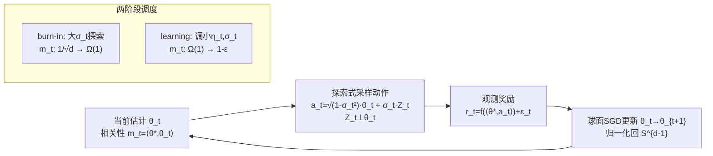

# Interactive Learning of Single-Index Models via Stochastic Gradient Descent

**会议**: ICLR 2026  
**OpenReview**: [https://openreview.net/forum?id=lZY0uluCzl](https://openreview.net/forum?id=lZY0uluCzl)  
**代码**: 未公开  
**领域**: 学习理论 / 老虎机理论  
**关键词**: 单指标模型, SGD, 广义线性老虎机, ridge bandit, 特征学习, burn-in, 样本复杂度, 后悔界  

## 一句话总结
本文证明：在交互式（老虎机）环境下学习单指标模型时，最朴素的归一化 SGD 配上合适的学习率与探索强度调度，就能在"烧入期(burn-in)"和"学习期(learning)"两个阶段同时取得近乎最优的样本复杂度与后悔界，无需任何为特定 link 函数定制的零阶探索算法。

## 研究背景与动机

**领域现状**：单指标模型 $y=f(\langle\theta^\star,x\rangle)+\varepsilon$ 是高维特征学习理论的核心范例。在**非交互**（i.i.d. 高斯特征 $x\sim N(0,I_d)$）下，Ben Arous 等人已建立完整理论：SGD 经历"search 阶段"（相关性 $m_t=\langle\theta_t,\theta^\star\rangle$ 从 $O(d^{-1/2})$ 爬到 $\Omega(1)$）后进入"descent 阶段"快速收敛，其样本复杂度由 link 函数的**信息指数(information exponent)**（即首个非零 Hermite 系数的阶）决定。

**现有痛点**：当把单指标模型搬到**交互式决策**场景（广义线性老虎机 / ridge bandit，奖励 $r_t=f(\langle\theta^\star,a_t\rangle)+\varepsilon_t$，动作 $a_t$ 自己选）时，故事变了。若 $f'(x)$ 在 $x\approx 0$ 附近很小（如 $f(x)=x^p$, $p\ge 3$），会出现一个漫长的 **burn-in 期**才能找到一个 $\langle\theta^\star,a_t\rangle=\Omega(1)$ 的好动作；而经典的 UCB 在这一阶段被证明是次优的。已有工作（Lattimore-Hao、Huang 等、Rajaraman 等 2024）为 burn-in 期设计了**针对特定 $f$ 定制**、依赖**零阶**（zeroth-order）梯度估计的探索算法，方法复杂且碎片化。

**核心矛盾**：SGD 的内在"search/descent"两阶段结构，与老虎机里的"burn-in/learning"两阶段天然对应——既然 SGD 又简单又是一阶方法，为什么还要为每个 link 函数单独设计零阶探索算法？但交互式下动作 $a_t$ 不再是高斯的，非交互 SGD 的全套理论（尤其信息指数）直接失效，SGD 的学习动力学在此几乎是空白。

**本文目标**：系统刻画交互式 SGD 学习单指标模型的动力学，证明单一 SGD 流程能在两阶段同时近优。**核心 idea（单算法两阶段近优）**：用带探索强度 $\sigma_t$ 的动作采样 + 球面归一化 SGD，再为 burn-in 和 learning 两阶段分别匹配学习率/探索调度，就能复现专门算法的最优界。

## 方法详解

### 整体框架
学习者在单位球面 $\mathcal{A}=S^{d-1}$ 上选动作，目标参数 $\theta^\star\in S^{d-1}$ 未知，奖励 $r_t=f(\langle\theta^\star,a_t\rangle)+\varepsilon_t$（$\varepsilon_t$ 零均值 1-subGaussian）。算法维护当前估计 $\theta_t$，每步先按"利用当前估计 + 正交方向探索"的方式采样动作，再用一次球面 SGD 更新 $\theta_t$，并对相关性 $m_t=\langle\theta^\star,\theta_t\rangle$ 的演化做漂移/鞅/归一化三项分解来做证明。整套流程只有两个旋钮：学习率 $\eta_t$ 与探索强度 $\sigma_t$。

### 关键设计

**1. 球面 SGD + 正交探索采样：把"选动作"和"学参数"统一进一个一阶更新。** 与非交互设定（动作=高斯特征）不同，这里动作必须在单位球内主动构造。本文采用 $a_t=\sqrt{1-\sigma_t^2}\,\theta_t+\sigma_t Z_t$，其中 $Z_t$ 在与 $\theta_t$ 正交的子球面上均匀采样，超参 $\sigma_t\in[0,1]$ 直接调控探索-利用权衡：$\sigma_t$ 大则探索强，$\sigma_t$ 小则贴着当前最优动作收奖励。拿到 $r_t$ 后用同一条 SGD 更新 $\theta_{t+1/2}=\theta_t-\eta_t\big(f(\langle\theta_t,a_t\rangle)-r_t\big)f'(\langle\theta_t,a_t\rangle)\cdot(I-\theta_t\theta_t^\top)a_t$，再归一化 $\theta_{t+1}=\theta_{t+1/2}/\lVert\theta_{t+1/2}\rVert$。关键观察是：这一步恰好是群体球面损失 $\theta\mapsto\frac12\mathbb{E}(f(\langle\theta,a\rangle)-r)^2$ 的**无偏**随机梯度，因此把老虎机的探索问题转化成了一个干净的随机优化问题——全程**一阶**，不需要零阶梯度估计。

**2. 相关性演化的三项分解：drift / 鞅差 / 归一化误差。** 证明的技术骨架是逐步追踪 $m_t\to m_{t+1}$ 的增量，拆成三部分：①**漂移项** $\mathbb{E}[m_{t+1/2}|\mathcal{F}_t]-m_t$（descent 步的平均改进，正比于 $\eta_t\sigma_t^2$ 与一个含 $f'$ 的期望，且**仅当 $f$ 单调递增时为正**——否则存在反例使 SGD 永远停滞，这正是 Assumption 1 单调性的来由）；②**鞅差项**（零均值随机噪声，控制方差）；③**归一化误差**（投影回球面带来的二阶偏差）。对三项分别给出通用引理后，再代入不同的 $(\eta_t,\sigma_t)$ 调度即可分阶段定量分析，这套分解是把"老虎机后悔"翻译成"SGD 收敛速率"的桥梁。

**3. 两阶段差异化调度：learning 期与 burn-in 期用不同 $(\eta_t,\sigma_t)$ 实现各自最优。** 在 **learning 期**（已有 warm start $m_1\ge 1-\gamma_0/4$，问题局部像线性老虎机）：纯探索取 $\eta_t=\tilde\Theta(\frac{d}{t}\wedge\frac1d),\sigma_t^2=\Theta(1)$ 得 $T=\tilde O(d^2/\varepsilon)$ 使 $m_T\ge 1-\varepsilon$；后悔最小化取 $\eta_t=\tilde\Theta(\frac{1}{\sqrt t}\wedge\frac1d),\sigma_t^2=\tilde\Theta(\frac{d}{\sqrt t}\wedge 1)$ 得 $\sum_t(f(1)-f(m_t))=\tilde O(d\sqrt T)$，两者都匹配 Rajaraman 等 2024 的下界 $\Omega(d^2/\varepsilon)$、$\Omega(d\sqrt T)$。在 **burn-in 期**（仅需随机初始化即满足 $m_1\ge 1/\sqrt d$，发生概率为常数）：在经典线性区（Assumption 2，$f'\ge c_0$）取 $\eta_t=\tilde\Theta(1/d^2),\sigma_t^2=\Theta(1)$，$T=\tilde O(d^2)$ 即可爬到 $m_T\ge 1-\gamma_0/4$；在难区（Assumption 3，$f$ 凸、$f'$ 在 0 附近小）用一条精心设计的学习率调度，得到由积分刻画的 burn-in 复杂度

$$T=\tilde O\!\left(d^2\int_{1/(2\sqrt d)}^{1-\gamma_0/4}\frac{m}{f'(m)^2}\,\mathrm{d}m\right),$$

它精确匹配 Rajaraman 等 2024 用"逐次假设检验 + ETC"组合算法才达到的最优界——而本文只用一条 SGD。

## 实验关键数据

本文是理论工作，"实验"为验证理论的数值仿真。

### 主结果（理论保证，Corollary 1 综合两阶段）

| 设定 | 纯探索样本复杂度 | 后悔界 | 是否近优 |
|------|------------------|--------|----------|
| Assumption 2（$f'\ge c_0$，线性区） | $\tilde O(d^2/\varepsilon)$ | $\tilde O(\min\{T,d\sqrt T\})$ | 是（匹配线性老虎机最优） |
| Assumption 3（$f$ 凸，难区） | $\tilde O\big(d^2\!\int \tfrac{m}{f'(m)^2}\mathrm{d}m + d^2/\varepsilon\big)$ | 匹配 Rajaraman 等 2024 最优 | 是 |
| $f(x)=x^p$, 奇 $p\ge 3$（特例） | burn-in $\tilde O(d^p)$ | $\tilde O(\min\{T, d^p+d\sqrt T\})$ | 是（匹配 Huang/Rajaraman 下界） |

### 对照：交互式 SGD vs 非交互/UCB（$f(x)=x^p$, 奇 $p\ge 3$）

| 方法 | burn-in 代价 |
|------|--------------|
| **交互式 SGD（本文）** | $\tilde O(d^p)$ |
| 非交互算法（含非交互 SGD）/ UCB | $\tilde\Omega(d^{p+1})$（差一个 $d$ 因子） |

### 数值仿真（Figure 1）
- 设定：$d=20$，cubic link $f(x)=x^3$，恒定学习率 $\eta_t=0.002$，探索 $\sigma_t=0.5$（直到 $m_t$ 达 0.7）后切到 $\sigma_t=0.2$。
- 现象：100 次平均轨迹与单条轨迹均显示 $m_t$ 经历缓慢 burn-in 后快速收敛到 1，即便损失景观非凸、单条轨迹进展非单调，SGD 仍稳定跑通两阶段。

### 关键发现
- **信息指数在交互式下"失效"**：交互式里 $f$ 单调使信息指数恒为 1（由 Chebyshev 求和不等式 $\mathbb{E}[f(Z)H_1(Z)]\ge 0$），且它预测的样本复杂度不再紧——$f(x)=x^p$ 时高斯 SGD 需 $\tilde O(d^{p+1})$，而交互式 SGD 只要 $\tilde O(d^p)$。原因正是动作 $a_t$ 不再高斯，主动探索改善了有效信噪比一个 $d^p$ 因子。
- **两阶段对应天然成立**：SGD 的 search/descent 与老虎机的 burn-in/learning 不是巧合类比，而是同一条更新在不同 $(\eta_t,\sigma_t)$ 调度下的两段——这解释了为何"无需切换算法、只切换超参"就能贯通全程。
- **warm start 门槛很低**：随机初始化 $\theta_1\sim\mathrm{Unif}(S^{d-1})$ 以常数概率满足 $m_1\ge 1/\sqrt d$，再用 $\tilde O((f(1/\sqrt d)-f(0))^{-2})$ 个样本的假设检验子程序即可认证，故 burn-in 的起点容易获得。

## 亮点与洞察
- **"简单算法打败定制算法"的漂亮结论**：把 burn-in 期一堆为特定 $f$ 定制、依赖零阶梯度的探索算法，统一替换成一条朴素一阶 SGD，且界不退化。这对理论审美和实践都很有吸引力。
- **揭示交互 vs 非交互的本质差异**：同一个 SGD，因为"谁来决定数据分布"不同（被动接收高斯 vs 主动选动作），样本复杂度的刻画量从信息指数变成了由 $\int m/f'(m)^2$ 的积分驱动的 burn-in 几何——主动探索能省下一个维度因子。
- **三项分解是可复用的分析模板**：drift/鞅差/归一化误差的拆解，把球面非凸 SGD 的动力学化简成可逐步控制的递推，对后续 multi-index / 未知 link 的交互式分析有借鉴价值。
- **单调性是"能学"的分水岭**：漂移项为正等价于群体损失沿 $m_t$ 递减，而这只在 $f$ 单调（或偶且在 $[0,1]$ 非减，覆盖 $|x|^p$）时成立；一旦破坏单调性就存在 SGD 永远停滞的反例（Proposition 1），把"何时朴素 SGD 注定失败"刻画得很清楚。

## 局限与展望
- **依赖凸性假设**：难区的最优界要求 $f$ 在 $[0,1]$ 凸（Assumption 3）。Rajaraman 等 2024 仅靠单调性就能拿到更细的 $\int d[x^2]/\max_{y\le x}f'(y)^2$ 界，本文坦承两个障碍——学习率 $\eta_t$ 的保守选取需要 $f'(m_t)$ 的下界（无凸性难得到），以及瞄准 $f'$ 最大值点的 $\sigma_t$ 调参需要知道当前 $m_t$（在 SGD 里不能像 ETC 那样跑独立假设检验）——故去掉凸性仍是 open。
- **仅限已知 link 函数**：奖励的 $f$ 假设已知；未知 link（需估计 score function，如 Fan 2023 / Kang 2025）的交互式 SGD 未覆盖。
- **理论仿真规模小**：数值实验仅 $d=20$、单一 cubic link，更多 link 形态、更高维下的常数与调度敏感性未系统验证。
- **调度依赖未知量**：burn-in 难区的学习率/探索调度隐含依赖当前 $m_t$ 与 $f'$ 的局部信息，实际部署时这些量未知，如何自适应估计（而不破坏 SGD 的单流程性）仍待解决。
- **展望**：把分析推广到 multi-index 模型、非凸非单调 link，以及与实际老虎机/RL 中连续动作、稀疏非线性奖励（如机器人操纵）的衔接。

## 相关工作与启发
- **单指标模型 / 特征学习**：Dudeja-Hsu 2018、Ben Arous 等 2021 的 Hermite/信息指数框架是非交互侧的理论基石；本文指出该框架在交互式下失效，是对它的重要补充与边界划定。
- **广义线性 / ridge 老虎机**：从 LinUCB、IDS（线性/ridge bandit，$\tilde\Theta(d\sqrt T)$）到 Lattimore-Hao、Huang 等（$f=x^2,x^p$ 难区）、Rajaraman 等 2024（用微分方程刻画一般 burn-in 上下界）；本文用单条 SGD 复现了 Rajaraman 等组合算法（逐次假设检验+ETC）在凸情形下的同款上界。
- **在线/老虎机中的梯度方法**：区别于 EXP3/FTRL 这类对抗设定、以及单指标模型常用的零阶随机优化（Huang 等 2021），本文强调其 SGD 在老虎机里仍是**一阶**方法，且需要比标准在线学习更精细的动力学分析。
- **未知 link 的相关线索**：Fan 等 2023、Kang 等 2025 研究未知 link 单指标老虎机（核心是估计 score function），其算法多为 ETC 型且后悔保证依赖 $f'$ 的正下界；本文虽假设 link 已知，但其一阶 SGD 视角为未来扩展到未知 link 提供了不同的切入路径。
- **启发**：研究"算法-数据分布"的耦合远比单看算法更重要——同一个 SGD 在主动 vs 被动数据下复杂度刻画量完全不同；这提示在 RL/主动学习里，"探索调度"本身可以被设计成让朴素优化器自动获得最优样本效率的杠杆。

## 评分
- **新颖性**: ⭐⭐⭐⭐⭐ 首次系统刻画交互式 SGD 学习单指标模型的动力学，并证明单一朴素算法在两阶段同时近优，且澄清了信息指数在交互式下失效这一概念性洞察。
- **实验充分度**: ⭐⭐⭐ 作为理论文章数值仿真到位（验证 cubic link 两阶段行为），但规模与 link 多样性有限，主要价值在严格的样本复杂度/后悔界证明。
- **写作质量**: ⭐⭐⭐⭐ 动机层层递进，三项分解的分析框架清晰，假设的物理含义与界的最优性对照交代得很明白。
- **价值**: ⭐⭐⭐⭐ 把碎片化的 burn-in 定制算法统一成一条 SGD，理论上既漂亮又实用，为交互式特征学习/老虎机理论提供了可复用的分析模板。

<!-- RELATED:START -->

## 相关论文

- [\[ICLR 2026\] Continuum Transformers Perform In-Context Learning by Operator Gradient Descent](continuum_transformers_perform_in-context_learning_by_operator_gradient_descent.md)
- [\[ICLR 2026\] Gradient Descent Dynamics of Rank-One Matrix Denoising](gradient_descent_dynamics_of_rank-one_matrix_denoising.md)
- [\[ICLR 2026\] Transformers Learn Latent Mixture Models In-Context via Mirror Descent](transformers_learn_latent_mixture_models_in-context_via_mirror_descent.md)
- [\[ICLR 2026\] Finite-Time Convergence Analysis of ODE-based Generative Models for Stochastic Interpolants](finite-time_convergence_analysis_of_ode-based_generative_models_for_stochastic_i.md)
- [\[ICLR 2026\] Improved High-Dimensional Estimation with Langevin Dynamics and Stochastic Weight Averaging](improved_high-dimensional_estimation_with_langevin_dynamics_and_stochastic_weigh.md)

<!-- RELATED:END -->
