# Intrinsic Entropy of Context Length Scaling in LLMs

**会议**: ICLR 2026  
**OpenReview**: [https://openreview.net/forum?id=vnipyA8c9V](https://openreview.net/forum?id=vnipyA8c9V)  
**代码**: [https://github.com/JingzheShi/NLPCtlScalingAndBounds](https://github.com/JingzheShi/NLPCtlScalingAndBounds)  
**领域**: 语言模型理论 / 上下文长度 scaling / 物理学视角  
**关键词**: 长上下文, Intrinsic Entropy, 贝叶斯风险, 近似损失, 最优上下文长度, scaling law  

## 一句话总结
本文把语言建模的总损失拆成"随上下文变长而下降的贝叶斯风险"与"随上下文变长而上升的近似损失"两项，并引入 **Intrinsic Entropy（内在熵）** 把贝叶斯风险与上下文长度严格联系起来，从而解释了"更长上下文不一定更好"这一反直觉现象，并推导出存在一个由训练数据量决定的**最优上下文长度**。

## 研究背景与动机
- **领域现状**：长上下文语言模型是近年研究热点，各种位置编码、线性注意力、状态空间模型都在拼命把上下文窗口拉长。关于上下文对性能的影响，既有工作把"相关长上下文带来的 loss 下降"总结成 scaling law，认为越长越好。
- **现有痛点**：另一批工作却观察到相反现象——无关的长上下文会损害性能，甚至在时序等领域里**相关**的长上下文也会让模型变差。两类结论互相矛盾，说明学界对"上下文长度到底如何影响语言建模"缺乏统一的理论解释。
- **核心矛盾**：以往的 scaling law 理论（Kaplan、Hoffmann、Bahri 等）只研究**数据量**和**模型规模**对 loss 的影响，几乎没人把**上下文长度**纳入 scaling law 框架，因此无法直接回答"为什么有时更长反而更差"。
- **本文目标**：建立一个能同时解释"长上下文带来增益"与"长上下文带来损害"两种现象的统一理论，并给出可操作的结论（比如最优上下文长度怎么随数据量变化）。
- **核心 idea**：**【损失分解 + 内在熵】** 把交叉熵损失分解为贝叶斯风险 $R_{Bayes}$（理论最优模型的损失，只受可见上下文限制、随上下文变长而单调下降）和近似损失 $L_{Approx}$（训练模型与最优模型之间的差距，随上下文变长而上升）；再用"内在熵"把贝叶斯风险与上下文长度定量挂钩。两项此消彼长，自然产生一个临界点。

## 方法详解

### 整体框架
全文是一条"先分解、再定量、最后推论"的理论链：第一步把交叉熵损失 $H(P,Q_l)$ 分解成贝叶斯风险与近似损失两个相反趋势的分量；第二步从信息论第一性原理出发，引入**内在空间（Intrinsic Space）**上的信息熵，证明贝叶斯风险与内在熵呈线性关系，从而把"上下文越长→信息越多→贝叶斯风险越低"讲清楚；第三步从**内在维度（Intrinsic Dimension）**角度论证上下文越长、流形维度越高、模型越难逼近，因此近似损失上升；两者相加，损失对 $l$ 的导数从负转正，必然存在最优上下文长度。理论之外在自然语言、下游任务、合成数据三类场景上做了实证验证。

```mermaid
flowchart TD
    A[交叉熵损失 H&#40;P,Q_l&#41;] --> B[贝叶斯风险 R_Bayes]
    A --> C[近似损失 L_Approx]
    B -->|内在熵视角| D[随上下文 l 单调下降<br/>∂R/∂l &lt; 0]
    C -->|内在维度视角| E[随上下文 l 上升<br/>∂L/∂l &gt; 0]
    D --> F[总损失导数由负转正]
    E --> F
    F --> G[存在最优上下文长度 l*<br/>随数据量增大而增大]
```

### 关键设计

**1. 损失分解：把"长上下文好坏之争"还原成两股相反的力量。** 作者沿用机器学习里经典的"贝叶斯风险 + 近似损失"分解，但首次把它专门用在上下文长度上。对交叉熵损失有 $H(P,Q_l)=R_{Bayes}+L_{Approx}=H(P,P_l)+D_{KL}(P_l,Q_l)$，其中 $P=p(x_0|x_{-\infty:0})$ 是自然语言真实分布，$P_l=p(x_0|x_{-l:0})$ 是上下文长度为 $l$ 的最优贝叶斯模型，$Q_l$ 是实际训练出的模型。贝叶斯风险 $R_{Bayes}=H(P,P_l)$ 只跟语言本身和可见上下文有关，与模型/数据无关，**随 $l$ 增大而下降**；近似损失 $L_{Approx}=D_{KL}(P_l,Q_l)$ 衡量训练模型逼近最优模型的能力，受数据量等影响。这一拆分把看似矛盾的实验观测统一成"两条曲线哪条占主导"的问题。

**2. 内在熵视角：用信息论第一性原理把贝叶斯风险钉死在上下文长度上。** 作者在"内在空间"（well-trained 网络中间层特征所在的流形空间）上定义信息熵 $S(P_l)$，并提出三条假设：① 内在熵在 $l\to\infty$ 时有限；② 上下文越长内在熵越大（更长上下文含更多信息）；③ **线性熵关系**——下一 token 预测对应的熵 $S_{ntp}(P_l)=H(P_0)-H(P_l)$ 与内在空间熵线性相关，即 $S_{ntp}(P_l)=k\cdot S(P_l)+b$（$0<k<1$）。由此推出贝叶斯风险与内在熵成线性关系：
$$R_{Bayes}=H(P,P_l)=-k\cdot S(P_l)+\text{Const}$$
这条关系不是空想：作者在 Llama-3.1-8B、Qwen3-8B-Base、RecurrentGemma-9B 上用 **Gaussian-KDE** 估计末层隐状态分布的信息熵，三个模型上交叉熵 loss 与实测内在熵都呈高度线性（$R$ 达 −0.98～−0.99），直接验证了假设。经验上贝叶斯风险还能拟合成 $H(P,P_l)\approx C_0+C/l^\gamma$ 的幂律形式。

**3. 内在维度视角：解释近似损失为什么随上下文上升。** 借用既有 scaling law 结论 $L_{Approx}(D)=C_0+A/D^\alpha$ 且 $\alpha\approx c/\dim$（$\dim$ 是数据/模型流形的内在维度），作者指出上下文越长、数据落在越高维的内在空间，于是有 $L_{Approx}=C_0+A(l)/D^{\alpha(l)}$ 且 $\partial\alpha/\partial l<0$——上下文越长，定容量模型越难逼近贝叶斯模型，近似损失越大。这一论证同时覆盖**训练场景**（数据量 $D$ 与上下文 $l$ 共同决定近似损失）和**推理场景**（固定模型在不同可见上下文 $l_{vis}$ 下评测，$\partial L_{Approx}/\partial l_{vis}>0$，且越难的下游任务贝叶斯模型越复杂、近似损失越大）。

**4. 最优上下文长度推论：两股力量平衡点的可操作结论。** 把两项合起来写成 $\text{Loss}(l,\theta_t,\theta_m)=R_{Bayes}(l,\theta_t)+L_{Approx}(l,\theta_m)$，其中 $\theta_t$ 是影响贝叶斯风险的任务参数（如任务难度 $\gamma$），$\theta_m$ 是影响近似损失的模型/数据参数（如数据量 $D$）。由于 $R_{Bayes}$ 是关于 $l$ 的递减凸函数、$L_{Approx}$ 递增，总损失导数从负转正，必然在某处 $\partial_l\text{Loss}=0$ 取得**最优上下文长度 $l^*$**。推论很直接：数据量越大（$L_{Approx}$ 整体下降）→ $l^*$ 越大；任务越需要长程信息（$R_{Bayes}$ 下降越慢、$\gamma$ 越小）→ $l^*$ 越大。这把抽象理论变成了"训练数据量决定最优上下文、并为某些情形的上下文 scaling 设定上界"的实用洞察。

## 实验关键数据

### 主实验（理论验证）

| 验证点 | 模型/数据 | 结果 |
|---|---|---|
| 贝叶斯风险 ∝ 内在熵（线性） | Llama-3.1-8B / OpenWebText | $k=-0.0038$, $R=-0.9888$ |
| 同上 | Qwen3-8B-Base / OpenWebText | $k=-0.0026$, $R=-0.9960$ |
| 同上 | RecurrentGemma-9B / OpenWebText | $k=-0.0174$, $R=-0.9967$（剔除 3 个低上下文离群点） |
| 贝叶斯风险幂律拟合 | 多语料 | $H(P,P_l)\approx C_0+C/l^\gamma$ 拟合良好 |

### 最优上下文长度实验

| 场景 | 设置 | 关键发现 |
|---|---|---|
| 预训练 | GPT-2-124M（层数减半 12→6）在 OpenWebText 上，数据量 200M～750M tokens | 每个数据量都存在一个最优上下文长度，超过它即便相关上下文也会让验证 loss 上升；**最优上下文随数据量增大而增大** |
| 下游任务 | Qwen3 系列在 RULER 的 qa_1 / fwe / cwe 子任务 | 多数模型出现明显临界点（最优上下文长度） |
| Position-Weighted Ruler-QA1 | 查询概率 $P(x)\propto(1-x/L)^\gamma$，扫不同 $\gamma$ | 每个 $\gamma$ 都有最优上下文长度；$\gamma$ 越小（越需要长程能力）→ 最优上下文长度越大 |

### 合成数据验证（Position-Weighted Multitask Sparse Parity）
- 构造 60 个上下文 bit、100～200 个 XOR 子任务，按距离赋予不同频率；理论最小交叉熵 $R_{Bayes}(ctl)\approx A+B/(ctl+C)^\alpha$。
- 用 3 层 causal Transformer + RoPE 训练到逼近贝叶斯模型后测特征谱：上下文越长特征值衰减越慢（信息越多）；交叉熵 loss 与"前 N 维特征值对数和"在 $N\ge70$ 时呈良好线性，**同时用 KDE 与特征值两种方法测内在熵都与 CE loss 线性**，验证 Point 1 与 Point 2。

### 关键发现
1. **"更长不总是更好"被定量解释**：长上下文降低贝叶斯风险、却抬高近似损失，二者平衡点即最优上下文长度。
2. **最优上下文长度随训练数据量单调增大**——给"该用多长上下文训练"提供了量化依据。
3. 内在熵与交叉熵 loss 的线性关系在三种不同架构（dense Transformer、Qwen、循环式 RecurrentGemma）上都稳健成立。
4. **"两根针"实验的细节启示**：在 two-needle-in-haystack 任务里，尽管两段关键信息都必要，但 perplexity 只在**第一段**关键信息被遮挡时才骤升——说明上下文里不同位置信息对 loss 的贡献并不均等，这正是 Position-Weighted 基准设计的动机。
5. RecurrentGemma-9B 在极短上下文处出现若干离群点（CE loss 明显偏高），提示循环式模型在短上下文下并非贝叶斯模型的好近似，但剔除离群后线性关系依旧成立。

## 亮点与洞察
- **统一了相互矛盾的实验观测**：长上下文"有时好、有时坏"不再是玄学，而是两条曲线主导权交替的必然结果。
- **把上下文长度正式纳入 scaling law 框架**：以往 scaling law 只谈数据量和模型规模，本文补上了上下文这一维度，并给出"数据量决定最优上下文长度"的实用推论。
- **内在熵是个可测量的桥梁**：用 Gaussian-KDE / 特征值两套方法都能从真实大模型隐状态里把"内在熵"测出来，且与 loss 线性，理论不是纸上谈兵。
- **跨场景适用**：同一套分解既能解释预训练交叉熵，也能解释下游 QA 任务的临界点，泛化性强。

## 局限与展望
- 整套理论建立在第 2 节的若干假设之上（内在熵有限、单调、线性熵关系），这些假设虽有实验支撑但仍需更基础的理论来解释，作者把内在维度视角放在附录作为部分解释，呼吁后续工作给出更根本的理论。
- 解释偏向"模型如何在内在空间表示数据"，因此与具体语言模型耦合较紧；作者承认可能还存在更 model-agnostic 的解释路径。
- 实证的预训练实验受限于算力，用的是缩水版 GPT-2（层数砍半），更大规模、更长上下文下的最优点行为尚待验证。

## 相关工作与启发
- **scaling law 谱系**：延续 Kaplan、Hoffmann（Chinchilla）、Bahri（解释 neural scaling law）、Sharma & Kaplan（内在维度解释 $\alpha\approx c/\dim$）的脉络，但首次把上下文长度作为一等变量纳入。
- **长上下文得失之争**：呼应 Xu、Levy 关于无关长上下文损害性能、Xiong 关于相关长上下文带来增益、Shi 关于时序中长上下文反而有害等矛盾结论，并用统一框架收编。
- **内在空间 / 数据流形**：沿用 Bahri、Cheng、Aghajanyan 把中间层特征视为数据流形的传统，把信息熵定义在该空间上。
- **互信息 scaling**：与 Chen 等的 $L^2M$（长上下文语言建模的互信息 scaling law）形成互补视角，一个从互信息、一个从内在熵切入同一问题。
- **启发**：对训练长上下文模型的人，"先估计数据量再定上下文长度"是个可落地的准则；对做检索/QA 的人，不同任务该用多长上下文可以由任务的长程依赖强度（$\gamma$）来估。

## 评分
- **新颖性**: ⭐⭐⭐⭐⭐ 首次用"贝叶斯风险 + 近似损失 + 内在熵"统一解释上下文长度对语言建模的双向影响，并把上下文正式纳入 scaling law，视角新且自洽。
- **实验充分度**: ⭐⭐⭐⭐ 覆盖真实大模型（3 种架构）、预训练、下游 RULER、自建 Position-Weighted 基准、合成 parity 数据五类验证，线性关系与最优点现象都被复现；扣分在预训练规模受限于缩水 GPT-2。
- **写作质量**: ⭐⭐⭐⭐ 理论链条清晰、图示（Figure 1 的损失分解）直观，假设与推导分主文/附录组织得当；公式较多对非理论读者有门槛。
- **价值**: ⭐⭐⭐⭐⭐ 既给出可操作的工程准则（数据量决定最优上下文长度、为上下文 scaling 设上界），又为"语言模型物理学"提供了一个可测量的内在熵工具，理论与实践价值兼具。

<!-- RELATED:START -->

## 相关论文

- [\[ICLR 2026\] Theory of Scaling Laws for In-Context Regression: Depth, Width, Context and Time](theory_of_scaling_laws_for_in-context_regression_depth_width_context_and_time.md)
- [\[ICLR 2026\] Critical Attention Scaling in Long-Context Transformers](critical_attention_scaling_in_long-context_transformers.md)
- [\[ICLR 2026\] Quantitative Bounds for Length Generalization in Transformers](quantitative_bounds_for_length_generalization_in_transformers.md)
- [\[ICLR 2026\] Why We Need New Benchmarks for Local Intrinsic Dimension Estimation](why_we_need_new_benchmarks_for_local_intrinsic_dimension_estimation.md)
- [\[ICLR 2026\] Queue Length Regret Bounds for Contextual Queueing Bandits](queue_length_regret_bounds_for_contextual_queueing_bandits.md)

<!-- RELATED:END -->
