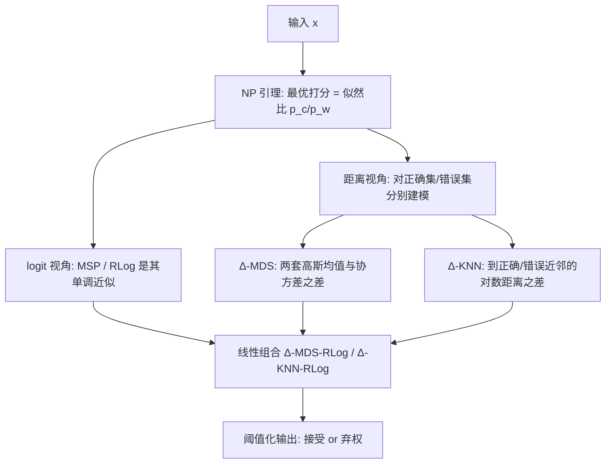

# Know When to Abstain: Optimal Selective Classification with Likelihood Ratios

**会议**: ICLR 2026  
**OpenReview**: [https://openreview.net/forum?id=RsfaFXBFzM](https://openreview.net/forum?id=RsfaFXBFzM)  
**代码**: [https://github.com/clear-nus/sc-likelihood-ratios](https://github.com/clear-nus/sc-likelihood-ratios)  
**领域**: 选择性分类 / 不确定性估计 / 学习理论  
**关键词**: Selective Classification, Neyman–Pearson Lemma, Likelihood Ratio, Covariate Shift, OOD Detection, VLM  

## 一句话总结
本文用统计学经典的 Neyman–Pearson 引理把"模型该不该弃权"重新表述成一个似然比检验，证明 MSP/RLog 等现有打分器其实都是这条似然比的近似，并据此设计出两个对"正确/错误预测"分别建模的距离打分器 ∆-MDS 与 ∆-KNN，在协变量偏移下显著降低选择性风险。

## 研究背景与动机
**领域现状**：选择性分类（selective classification）让模型在不确定的输入上"弃权"（abstain），把模糊样本交给人类专家，从而提升整体可靠性。主流是 post-hoc 方法——固定一个强分类器 $f$，再设计一个打分函数 $s(x)$，通过阈值化 $g(x)=\mathbb{1}[s(x)>\gamma]$ 决定接受还是弃权。常见打分器有最大 softmax 概率（MSP）、logit margin（RLog）、Mahalanobis 距离（MDS）、KNN 距离等，很多直接借自 OOD 检测。

**现有痛点**：尽管打分器五花八门，却缺一个统一的理论框架告诉你"什么才算最优的打分器"，更多是启发式拼凑；同时绝大多数评测都假设测试数据与训练同分布（i.i.d.），少数研究分布偏移的工作又只盯着引入新类别的**语义偏移**（semantic shift），而忽略了**协变量偏移**（covariate shift，输入外观变了但标签空间不变，如照片→油画的猫）。

**核心矛盾**：协变量偏移恰恰在现代 VLM 部署里最普遍——CLIP 这类模型标签集庞大可变，实际偏移几乎都是协变量型；但既有 SCOD（Selective Classification + OOD）方法把 ID 分类分布和 OOD 分布拆开建模再拼，本就是为语义偏移设计的，迁到协变量偏移既别扭又缺保证。

**本文目标**：给选择性分类提供一个"最优性"的统一定义，并据此推导对协变量偏移鲁棒的新打分器。**核心 idea**：把"分类器正确 vs 错误"看成两个相互竞争的假设 $H_0:C$（预测正确）与 $H_1:\neg C$（预测错误），那么最优弃权规则就是 Neyman–Pearson 引理给出的**似然比检验**——最优打分就是"正确密度"与"错误密度"之比 $s(x)=p_c(x)/p_w(x)$。

## 方法详解

### 整体框架
全文围绕一个支点展开：在给定弃权率（type I error）下，要让"错误接受率"（type II error）最小，NP 引理告诉你唯一最优的判别量是似然比 $p_c(x)/p_w(x)$，其中 $p_c,p_w$ 分别是分类器预测正确/错误样本的输入密度。由此文章做三件事——(1) 证明 MSP、RLog 这些 logit 打分器在特定假设下就是这条似然比的单调变换，因而本就"NP 最优"；(2) 因为 logit 法依赖分类器标定（calibration），转而在特征空间显式估计 $p_c$ 与 $p_w$，提出 ∆-MDS 和 ∆-KNN 两个距离打分器；(3) 把 logit 法和距离法线性组合，证明组合后仍是 NP 最优，取两者之长。关键巧思在于：$p_c/p_w$ 天然涵盖了分布偏移——无论样本是 ID 还是偏移的，只要分类器分对就计入 $p_c$、分错就计入 $p_w$，因此无需像 SCOD 那样区分 ID/OOD。

### 关键设计

**1. NP 引理把选择性分类锚定为似然比检验，并统一了现有打分器**：文章先把弃权决策写成假设检验——接受 $H_0$（预测正确）还是拒绝转向 $H_1$（预测错误）。NP 引理（Lemma 1）指出，在固定 type I error $\alpha_0$ 时，最小化 type II error 的最优接受域是 $A^*=\{z: p_0(z)/p_1(z)\geq\gamma(\alpha_0)\}$，于是最优打分就是 $s(x)=p_c(x)/p_w(x)$。配合 Corollary 1——似然比的任意**单调变换**（取对数、仿射）都保持排序、不改接受域，因而同样最优——文章给出可操作的"NP 最优"定义。基于此，Theorem 1 证明：若分类器对 top-1 正确性已标定（$P(C\mid x)=d_{(1)}(x)$），MSP 就是 $p_c/p_w$ 的单调变换；若再假设 softmax 质量集中在前两类（$\sum_{i\geq3}d_{(i)}\ll d_{(2)}$），logit margin RLog $=l_{(1)}-l_{(2)}$ 也是 NP 最优。这解释了为何 RLog 经验上常优于 MSP——它对温度缩放不变，天然抗误标定。

**2. ∆-MDS：对正确与错误预测各拟一套高斯，取 Mahalanobis 距离之差**：logit 法的命门是依赖标定，而现代网络普遍标定差。∆-MDS 改在特征空间下手——对每个类别维护两套统计量 $\{\mu_i^c,\Sigma^c\}$ 与 $\{\mu_i^w,\Sigma^w\}$，分别由"分类器预测对/错的训练样本"估计（真标签已知，估计很简单）。打分定义为两个 Mahalanobis 距离之差 $s_{\Delta\text{-MDS}}(x)=D_{\text{MDS}}(x;\mu^c,\Sigma^c)-D_{\text{MDS}}(x;\mu^w,\Sigma^w)$，含义直观：输入越靠近"正确区"、越远离"错误区"，分越高。Theorem 2 在 $Z\mid C\sim\mathcal{N}(\mu_i^c,\Sigma^c)$、$Z\mid\neg C\sim\mathcal{N}(\mu_i^w,\Sigma^w)$ 的高斯假设下证明它是 $p_c/p_w$ 的单调变换，故 NP 最优；高斯假设由高斯判别分析与 softmax 分类器的联系背书，适配标准监督模型。

**3. ∆-KNN：非参数版本，用到正确/错误近邻的对数距离之差**：当不想要高斯参数假设时，∆-KNN 把训练特征拆成"分对集 $A_c$"和"分错集 $A_w$"，对测试点 $z$ 取到两集第 $k$ 近邻的欧氏距离 $u_k,v_k$，打分为对数距离之差 $s_{\Delta\text{-KNN}}(x)=-\log u_k+\log v_k$。Theorem 3 证明在 $k\to\infty$、$k/N_c\to0$、$k/N_w\to0$ 的渐近条件下它是 NP 最优，且**不需要对 $p_c,p_w$ 的形式做参数假设**——代价是有限样本下渐近条件难满足。实践中用 top-$k$ 近邻的平均对数距离替代单一第 $k$ 近邻，更平滑、经验更好（附录论证平均版在标准假设下仍保 NP 最优）。

**4. 线性组合：logit 与距离打分相加，仍是 NP 最优**：logit 法吃分类器学到的决策边界，距离法吃特征空间的几何结构，二者互补。Lemma 2 表明若 $s_1,s_2$ 各自 NP 最优，则 $t(x)=s_1(x)+\lambda s_2(x)$ 对任意 $\lambda$ 仍是某个"倾斜乘积"似然比 $p_c^{(1)}(p_c^{(2)})^\lambda/[p_w^{(1)}(p_w^{(2)})^\lambda]$ 的单调变换，因而保持最优。实操里把距离打分（如 ∆-MDS）与 logit 打分（如 RLog）拼成 ∆-MDS-RLog；$\lambda$ 的简单配方是让 $s_1,s_2$ 量级平衡、谁也不压谁，$k$ 取 $[25,50]$ 为甜区，均可在验证集上选。

## 实验关键数据

### 主实验表格（DFN CLIP，ImageNet 及协变量偏移变体，AURC/NAURC，越低越好，AURC 为 $10^{-2}$ 尺度）

| Method | Avg(1K) AURC | Avg(1K) NAURC | Avg(all) AURC | Avg(all) NAURC |
|---|---|---|---|---|
| MSP | 11.5 | 0.479 | 8.43 | 0.387 |
| Energy | 24.8 | 1.09 | 21.5 | 1.15 |
| MDS | 13.9 | 0.619 | 11.3 | 0.569 |
| KNN | 13.1 | 0.567 | 9.83 | 0.474 |
| RLog | 7.39 | 0.239 | 5.67 | 0.200 |
| ∆-MDS | 7.81 | 0.263 | 6.50 | 0.276 |
| ∆-KNN | 7.32 | 0.235 | 5.89 | 0.225 |
| ∆-MDS-RLog | 6.51 | 0.193 | 5.12 | 0.177 |
| **∆-KNN-RLog** | **6.43** | **0.187** | **5.01** | **0.163** |

### 监督模型表格（EVA，全 1K 覆盖）

| Method | Avg(1K) AURC | Avg(1K) NAURC |
|---|---|---|
| MSP | 5.43 | 0.264 |
| MDS | 5.60 | 0.284 |
| KNN | 5.56 | 0.282 |
| RLog | 4.11 | 0.172 |
| ∆-MDS | 4.18 | 0.180 |
| **∆-MDS-RLog** | **3.86** | **0.157** |
| ∆-KNN-RLog | 4.00 | 0.166 |

### 关键发现
- **NP 假设在实践中成立**：从 MDS/KNN 升级到 NP 版 ∆-MDS/∆-KNN，CLIP 上平均 AURC 与 NAURC 约**降低 50%**，验证理论与实践吻合。
- **线性组合最强**：∆-KNN-RLog 在 CLIP 上 AURC/NAURC 综合最优；EVA 上 ∆-MDS-RLog 最优。RLog 作为单打分器排第三，依旧很强。
- **语言任务（Amazon Reviews + DistilBERT/LISA）**：∆-MDS-MSP / ∆-KNN-MSP 在 In-D 与协变量偏移上均优于各基线（如 In-D NAURC 0.354 vs MSP 0.368），说明框架跨模态有效。
- 距离法在文本任务上单独表现弱（MDS/KNN NAURC 0.7+），但与 logit 打分组合后立刻反超，印证两类信号互补。

## 亮点与洞察
- **理论统一性强**：用一条 NP 引理把 MSP、RLog、MDS、KNN 串成"似然比近似"的谱系，并给出可证明最优的扩展，把选择性分类从"打分器动物园"提升到有最优性定义的框架。
- **$(p_c,p_w)$ 抽象优雅**：不再区分 ID/OOD、语义/协变量偏移，所有偏移统一进"正确密度 vs 错误密度"，比 SCOD 拆分式建模简洁，对协变量偏移天然友好。
- **纯 post-hoc、模型无关**：不改架构、不重训，只用已知训练标签把训练集切成"分对/分错"两堆估计统计量，落地成本极低，且直接适配 CLIP 这类零样本 VLM。

## 局限与展望
- **理论假设较强**：∆-MDS 依赖特征高斯、∆-KNN 依赖 KNN 密度估计的渐近条件，有限样本下未必满足；作者也坦言这些假设是"为厘清与 NP 最优的联系"而非实践必须成立。
- **平均对数距离版偏离定理**：实践用的 top-$k$ 平均版与 Theorem 3 的单一第 $k$ 近邻形式不完全一致，最优性只在附录里"补充论证"。
- **标定问题被搁置**：logit 法的标定影响（温度缩放等）明确划在范围之外，组合打分里 logit 分支仍可能受其牵连。
- **聚焦协变量偏移**：语义偏移虽有附带评测，但框架主战场是协变量偏移；超参 $\lambda,k$ 仍需验证集调，未给免调方案。

## 相关工作与启发
- **reject option 的长历史**：从 Chow(1970) 的代价式拒识，到 SVM/最近邻的拒识扩展，再到 El-Yaniv & Geifman 形式化的 risk–coverage 框架，本文站在这条脉络上补齐"最优性"定义。
- **OOD 检测打分器**：MSP、MaxLogit、Energy、MDS、KNN 多源自 OOD 检测，本文揭示它们作为选择性打分器的最优性条件。
- **训练内置拒识**：SelectiveNet、Deep Gamblers、Self-Adaptive Training 把拒识塞进训练，需改架构联合训练；本文走 post-hoc 路线，正交且更易部署。
- **最接近的 RLog（Liang et al. 2024）**：同样研究偏移下的选择性分类并提出 RLog，本文以 NP 框架"反向解释"了 RLog 的有效性，并扩展到 VLM 与新打分器。
- **启发**：把"对/错"当两类显式建模、再用似然比统一打分，这个思路可迁移到 LLM 的弃答/置信度估计、检索增强里的"该不该检索"等更广的 abstain 场景。

## 评分
- **新颖性**: ⭐⭐⭐⭐ —— 用 NP 引理统一既有打分器并推导有最优性保证的新打分器，视角清晰，$(p_c,p_w)$ 抽象漂亮；扣分在单个组件（MDS/KNN 差分）技术上不算颠覆。
- **实验充分度**: ⭐⭐⭐⭐ —— 覆盖 CLIP/EVA/DistilBERT 三类模型、ImageNet 六种协变量偏移 + 文本任务，主/消融实验齐全；语言任务规模偏小、未涉更大 LLM。
- **写作质量**: ⭐⭐⭐⭐ —— 理论与方法衔接顺畅，定理-推论-打分器逐层推进，图示直观；公式密集，对统计背景较弱的读者有门槛。
- **价值**: ⭐⭐⭐⭐ —— 给选择性分类提供可证明最优的统一框架与即插即用打分器，对 VLM 部署下的可靠性很实用，代码开源。

<!-- RELATED:START -->

## 相关论文

- [\[ICLR 2026\] Practical Estimation of the Optimal Classification Error with Soft Labels and Calibration](practical_estimation_of_the_optimal_classification_error_with_soft_labels_and_ca.md)
- [\[ICLR 2026\] Preventing Model Collapse Under Overparametrization: Optimal Mixing Ratios for Interpolation Learning and Ridge Regression](preventing_model_collapse_under_overparametrization_optimal_mixing_ratios_for_in.md)
- [\[ICLR 2026\] An Efficient, Provably Optimal Algorithm for the 0-1 Loss Linear Classification Problem](an_efficient_provably_optimal_algorithm_for_the_0-1_loss_linear_classification_p.md)
- [\[ICLR 2026\] "Noisier" Noise Contrastive Estimation is (Almost) Maximum Likelihood](noisier_noise_contrastive_estimation_is_almost_maximum_likelihood.md)
- [\[ICLR 2026\] When Shift Happens - Confounding is to Blame](when_shift_happens_-_confounding_is_to_blame.md)

<!-- RELATED:END -->
