# Language Identification in the Limit with Computational Trace

**会议**: ICLR 2026  
**OpenReview**: [https://openreview.net/forum?id=1OAGf7ntSE](https://openreview.net/forum?id=1OAGf7ntSE)  
**代码**: 暂无（纯理论工作）  
**领域**: 学习理论 / 可学习性 / CoT 理论  
**关键词**: identification in the limit, Gold 模型, chain-of-thought, 计算轨迹, Chomsky 层级, 鲁棒可学习性  

## 一句话总结
本文把 Gold 1967 的"极限可识别"经典范式扩展为"带计算轨迹（CoT）的极限可识别"，证明只要给学习者每个正例的机器执行轨迹，**全体图灵机可识别语言都能在极限下被识别**（与 Gold 连正则语言都不可识别的著名负结果形成鲜明对比），并刻画了轨迹被对抗污染时 DFA / DPDA / TM 三档语言类各自能容忍的噪声上限，给出一个干净的"三分律"。

## 研究背景与动机

**领域现状**：用 Chain-of-Thought（CoT）轨迹去训练 LLM 已被反复证明能大幅提升能力，但"为什么 CoT 有用"的理论解释仍很薄弱。已有理论工作（Malach 2023、Joshi 2022、Altabaa 2025）主要从**统计学习**角度切入——把 CoT 看成降低样本复杂度的额外监督信号。

**现有痛点**：统计视角回答的是"需要多少样本"，却没回答一个更基础的问题——CoT 能不能帮模型学到**正确的世界模型（world model）**，即环境背后真正的"规则"。而要把"学到正确规则"形式化，最自然的工具是 Gold 的**语言极限可识别（identification in the limit）**：把每个语言看成某个世界里所有"事实"的集合，学习者看一串正例枚举，要在有限次错误后收敛到对该语言的正确描述。

**核心矛盾**：Gold 范式下几乎所有有趣的语言类都**不可识别**（Angluin 1980）——哪怕简单到只有 DFA 能识别的正则语言，由于学习者只看正例、永远拿不到反例，对手总能构造让它无限次犯错的枚举（经典硬实例 $\mathcal{L}=\{\mathbb{N}, L_1, L_2, \dots\}$，$L_i=\{1,\dots,i\}$）。

**本文目标**：把 Gold–Angluin 模型补上一条"CoT 通道"——学习者除了看正例 $x$，还能看到接受 $x$ 的固定机器 $M$ 在 $x$ 上的**完整执行轨迹** $c_M(x)$（状态序列 / 栈内容 / 纸带配置的逐步变化）。问：这条轨迹通道能把可识别的语言类扩大到什么程度？轨迹有噪声、被对抗污染时又能扛多少？

**核心 idea**：**【轨迹即证据】** 把计算轨迹从"逐步重建转移函数"升级为"对目标机器规模的证据"——观测到的状态数要么不断增长（只能发生有限次），要么就反过来证明目标机器状态数被观测状态数所界定，从而把无限的假设类塌缩成**有限语言类识别**问题。

## 方法详解

### 整体框架

本文是纯理论工作，骨架是"两套模型定义 + 两类定理"：先把 Gold 的极限识别（Definition 1）扩展成**带轨迹的极限识别**（Definition 3），再扩展成**轨迹被编辑距离污染的鲁棒识别**（Definition 4–5，按污染率分常数/递减/有限三档）；然后分别证明无噪声下的正面结果（Theorem 3.1：全体 TM 可识别）与有噪声下的三分律（Theorem 4.1/4.3/4.5：DFA / DPDA / TM 各自的容噪边界）。两套定理用的是两种截然不同的算法思路——无噪声靠"重建机器"，有噪声靠"轨迹当规模证据"。

```mermaid
flowchart TD
    A[Gold 极限识别<br/>只看正例 → 连正则语言都不可识别] --> B[带轨迹识别 Def.3<br/>正例 x + 执行轨迹 c_M&#40;x&#41;]
    B --> C["Thm 3.1 无噪声<br/>逐步重建机器&#40;子集不变式&#41;<br/>全体 TM 可识别"]
    B --> D[鲁棒识别 Def.4-5<br/>轨迹被编辑距离污染]
    D --> E["技术模板：轨迹当规模证据<br/>观测状态数增长 or 目标状态数有界<br/>→ 塌缩成有限类识别"]
    E --> F["Thm 4.1 DFA：常数污染率可识别"]
    E --> G["Thm 4.3 DPDA：递减率可/常数率不可"]
    E --> H["Thm 4.5 TM：有限误差可/递减率不可"]
```

### 关键设计

**1. 带轨迹的识别模型：把 CoT 形式化为机器执行轨迹。** 模型的关键不在于"给学习者更多字符串"，而在于给它一条**结构化的内部信息**。对机器 $M$ 和被接受的输入 $x\in L(M)$，定义轨迹 $c_M(x)$ 为 $M$ 接受 $x$ 时逐时刻配置的序列——对 DFA 就是访问过的状态序列（如识别"偶数个 1"的 DFA 在 $1010$ 上的轨迹是 $(q_{even},q_{odd},q_{odd},q_{even},q_{even})$），对 TM 则包含状态、纸带、读写头位置。学习者看到的枚举变成 $E_{\text{trace}}=\big((x_1,c_M(x_1)),(x_2,c_M(x_2)),\dots\big)$。本文刻意只给**正例的接受轨迹**（不给反例），这点与最接近的 Papazov & Flammarion 2025 关键不同——后者有反例，而有反例时识别会平凡化（直接输出最小一致语言）。这条设计把"CoT 帮模型学规则"翻译成了"轨迹帮学习者识别语言"。

**2. 无噪声下重建机器的"子集不变式"，证 TM 全可识别。** 在 DFA 的暖身证明里，学习者维护一台逐步生长的 DFA $M_t$：初始只有起始态和一个拒绝陷阱 $r$，所有未见过的转移都先指向 $r$；每来一条 $(x_t,c(x_t))$，就把轨迹里出现的新状态加入 $Q_t$、把轨迹尾部的接受态加入 $F_t$、并沿着轨迹把见过的转移 $(q,a)\to q'$ 覆盖进 $\delta_t$。这套构造维持两条性质：**子集不变式** $L(M_t)\subseteq K$（因为没见过的边一律导向拒绝陷阱，$M_t$ 永远比真机保守，绝不会多接受），以及**最终完备性**（真机所有"出现在某条接受计算上"的状态和边都是有限的，每条都会在有限步后被某个正例的轨迹覆盖，于是存在有限时刻 $t^\star$ 后 $M_t$ 在接受边上与真机 $M^*$ 完全一致）。两者合起来给出 $L(M_t)=K$。把同样的"保守重建"思路从有限控制推广到带纸带的图灵机，就得到主定理 Theorem 3.1：**全体 TM 可识别语言在带轨迹设定下都极限可识别**——这正是与 Gold 负结果最尖锐的反差，因为没有轨迹时连 DFA 类都不可识别。

**3. 有噪声下"轨迹当规模证据"的统一模板。** 一旦轨迹被对抗按编辑距离污染，第 2 点的逐步重建就崩了（污染会引入伪转移）。本文换了一套完全不同的算法模板：不再重建机器，而是把观测到的状态集 $Q_t$ 当作目标机器规模的证据。关键引理证明：**要么观测状态数持续增长（这只能发生有限次），要么所有"可接受状态"距离已观测状态集 $U=Q_{t'}$ 的图距离被一个仅依赖 $|U|$ 的量界住**。以 DFA 为例，Lemma 4.2 给出对任意接受态 $q$，$\mathrm{dist}_U(q)\le \max\big(\tfrac{2}{1-\alpha}|U|,\ \ell_\alpha\big)$；由于字母表大小为 2、出度有界，可接受状态总数被 $B_t=|Q_t|\cdot 2^{2|Q_t|/(1-\alpha)+\ell_\alpha}+1$ 界住。于是从某时刻起，假设类塌缩成一个**固定的有限语言族**，直接套用 Gold 的有限类识别（Fact 2.1，输出与历史一致的最小语言）即可收敛。这个"距离有界 → 有限类"的论证就是三分律的统一骨架。

**4. 跨 Chomsky 层级的三分律：容噪能力随机器复杂度递减。** 同一套模板套到三档机器上，因"距离有界"的证明难度不同而给出三种截然不同的容噪边界。**DFA（正则）**最强韧：常数污染率下仍可识别，哪怕 $0.999$ 比例的轨迹被破坏也行（Theorem 4.1）。**DPDA（确定上下文无关）**居中：任何常数比例污染都不可识别，但污染率递减时可识别（Theorem 4.3）——其"距离有界"证明最棘手，需把 DPDA 计算轨迹转成 Chomsky 范式（CNF）并界定 CNF 树规模，否则树太大就意味着太多未观测状态；不可能性方向则用 $L_i=\{a^nb^{2n/\alpha}:n\le i\}$ 这族语言，让对手抹掉前 $n$ 步轨迹使其退化回 Fact 2.2 的硬实例。**TM（递归可枚举）**最脆弱：连递减污染率都扛不住，只有**每条轨迹误差总数被绝对常数界住（有限误差）**时才可识别（Theorem 4.5）。直觉很清晰——机器越强、轨迹承载的信息越关键，对手破坏轨迹的杀伤力就越大。

## 实验关键数据

本文为纯理论工作，无数值实验。核心"结果"是一组可学习性定理，按机器类整理如下。

### 主结果：带轨迹识别 vs. Gold 原始设定

| 语言类 | 识别机器 | Gold 原设定（无轨迹） | 本文（完美轨迹） |
|---|---|---|---|
| 正则语言 | DFA | ❌ 不可识别（即便最简单类）| ✅ 可识别 |
| 确定上下文无关 | DPDA | ❌ 不可识别 | ✅ 可识别 |
| 递归可枚举 | TM | ❌ 不可识别 | ✅ 可识别（Theorem 3.1）|

### 鲁棒识别三分律：可容忍的污染程度

| 机器类 | 常数污染率 $\alpha\in(0,1)$ | 递减污染率 $o(1)$ | 有限误差（绝对常数 $C$）|
|---|---|---|---|
| DFA（正则）| ✅ 可识别（即便 $\alpha=0.999$）| ✅ | ✅ |
| DPDA（DCFG）| ❌ 不可识别（任意 $\alpha>0$，哪怕 $0.01$）| ✅ 可识别 | ✅ |
| TM（RE）| ❌ | ❌ 不可识别 | ✅ 当且仅当每例误差数有界 |

### 关键发现
- **轨迹是"质变"而非"量变"**：从"连 DFA 都不可识别"直接跳到"全体 TM 可识别"，说明 CoT 提供的不是更多样本，而是让学习者拿到了原本永远拿不到的结构信息。
- **容噪能力与机器复杂度负相关**：越强的机器（TM）越依赖轨迹的完整性，越弱的机器（DFA）越能从残缺轨迹里恢复——这是一个干净且反直觉的层级现象。
- **两套算法范式互补**：无噪声靠"保守重建机器 + 子集不变式"，有噪声靠"轨迹当规模证据 + 塌缩成有限类"，后者是绕开污染干扰的关键。
- **只用正例仍可识别**：在反例可平凡化识别的背景下，本文坚持只给正例接受轨迹，使结论真正刻画了"轨迹本身"的信息价值，而非反例带来的便利。

## 亮点与洞察
- **把"CoT 为何有用"接到可计算性/可学习性的经典脉络上**：不同于主流的统计样本复杂度视角，本文从"能不能学到正确世界模型"的可识别性角度回答，视角新颖且与 Gold–Angluin、Kleinberg–Mullainathan 的极限生成一脉相承。
- **结果形态极其干净**：一个正面主定理（全 TM 可识别）+ 一条跨 Chomsky 层级的三分律，定理之间结构对称、直觉清楚，是理论工作里少见的"好讲故事"。
- **"轨迹当证据"是可迁移的技术 insight**：把轨迹用作"目标机器规模的上界证据"而非"逐步重建素材"，这个视角的切换是整套鲁棒结果的技术核心，对后续噪声学习/生成问题可能有借鉴价值。
- **编辑距离污染模型贴近现实 CoT 失真**：部分可见、跳步、出错都统一成编辑距离，且区分常数/递减/有限三档，刻画力强。

## 局限与展望
- **渐近性、无定量速率**：所有结论都是"极限下"可识别，没给出识别需要多少时间/多少样本。作者自己点名这是首要的后续问题——希望在有 CoT 信息时给出可识别的定量时间界。
- **轨迹假设理想化**：轨迹被建模为某台固定机器的精确执行步骤，且学习者预先知道自己处于哪一档误差 regime（且知道相应常数 $\alpha,\ell_\alpha,C$），这与真实 LLM 的 CoT（自然语言、非确定、可能本身就错）差距明显。
- **只给正例、单机器**：模型限定只看正例接受轨迹、单一目标机器；Hanneke 2025 等已表明生成对有限并不封闭，带轨迹识别在并/混合语言类下会怎样仍未知。
- **与生成在极限的交叉未展开**：作者展望把 CoT 信息引入 Kleinberg–Mullainathan 的极限生成，看能否加速生成或改变 breadth/幻觉权衡，但本文未涉及。

## 相关工作与启发
- **Gold (1967) / Angluin (1979,1980)**：极限可识别的奠基与刻画，本文的直接出发点与对照负结果。
- **Kleinberg & Mullainathan (2024) 及后续（Li 2024、Kalavasis 2024、Charikar & Pabbaraju 2024 等）**：极限生成范式——把"识别"放宽为"生成未见正例"后所有可数语言类都可生成；本文是其"识别侧 + CoT"的姊妹方向。
- **Papazov & Flammarion (2025)**：最接近的工作，研究带反例 + 侧信息（如计算时间）的递归函数极限学习；本文强调只用正例 + 轨迹，结论本质不同。
- **CoT 统计理论（Malach 2023、Joshi 2022、Altabaa 2025）**：从样本复杂度/length complexity/CoT information 角度解释 CoT；本文与之正交互补（可计算性 vs. 统计）。
- **世界模型实证（Li 2023、Nanda 2023、Vafa 2024）**：用棋盘/城市地图任务测 LLM 能否学到世界模型，是本文"语言=世界事实集合"建模动机的来源。
- **启发**：本文提示"给模型可验证的中间计算轨迹"在理论上能跨越纯样本无法跨越的可学习性鸿沟；对设计可验证 CoT 监督、过程奖励（process reward）一类做法提供了"为什么轨迹质量比数量更重要"的理论注脚。

## 评分
- **新颖性**: ⭐⭐⭐⭐⭐ 首次把 CoT 形式化进 Gold 极限识别范式，用可学习性而非样本复杂度视角解释 CoT，并给出跨 Chomsky 层级的干净三分律，角度与结果都很原创。
- **实验充分度**: ⭐⭐⭐⭐ 纯理论工作，无数值实验属合理；定理覆盖完整、正反两面都给（可识别 + 不可能性硬实例），证明技术自洽，但渐近结果缺定量速率。
- **写作质量**: ⭐⭐⭐⭐⭐ 动机层层递进、定义清晰、用 DFA 暖身再上 TM，结果以"informal theorem + 三分律表"呈现，理论文章里少见的好读。
- **价值**: ⭐⭐⭐⭐ 为"CoT 为何有用"补上可计算性视角的理论基础，对理解过程监督/可验证推理有概念价值；但理想化假设与渐近性使其离实践指导尚有距离。

<!-- RELATED:START -->

## 相关论文

- [\[ICLR 2026\] Automata Learning and Identification of the Support of Language Models](automata_learning_and_identification_of_the_support_of_language_models.md)
- [\[ICLR 2026\] Computational Bottlenecks for Denoising Diffusions](computational_bottlenecks_for_denoising_diffusions.md)
- [\[ICLR 2026\] On the Computational Limits of AI4S-RL：A Unified $\varepsilon$-$N$ Analysis](on_the_computational_limits_of_ai4s-rl_a_unified_varepsilon-n_analysis.md)
- [\[ICLR 2026\] The Softmax Bottleneck Does Not Limit the Probabilities of the Most Likely Tokens](the_softmax_bottleneck_does_not_limit_the_probabilities_of_the_most_likely_token.md)
- [\[ICLR 2026\] Diffusion Language Models are Provably Optimal Parallel Samplers](diffusion_language_models_are_provably_optimal_parallel_samplers.md)

<!-- RELATED:END -->
