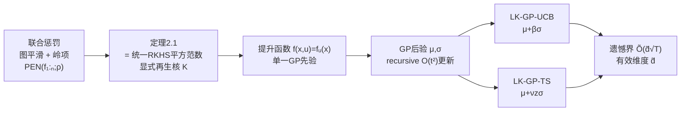

# Laplacian Kernelized Bandit

**会议**: ICLR 2026  
**OpenReview**: [https://openreview.net/forum?id=5majEbTAZa](https://openreview.net/forum?id=5majEbTAZa)  
**代码**: 未公开  
**领域**: 学习理论 / 在线学习 / 核化老虎机  
**关键词**: 多用户上下文老虎机, Gang of Bandits, 图同质性, RKHS, 高斯过程, 有效维度, 遗憾界  

## 一句话总结
本文把"图上多用户、奖励非线性"的 Gang-of-Bandits 问题，归结为在一个**统一多用户 RKHS** 里学单个"提升函数"，其再生核优雅地把图拉普拉斯与臂核融合为 $K((x,u),(x',u'))=[L_\rho^{-1}]_{u,u'}K_x(x,x')$，由此设计出有遗憾保证的 LK-GP-UCB / LK-GP-TS 算法。

## 研究背景与动机
- **领域现状**：图结构在序列决策里无处不在（用户/商品/传感器之间的相似性）。多用户上下文老虎机的经典范式是 Gang of Bandits（GOB），把 $n$ 个用户的奖励函数 $\{f_u\}$ 看成图上的平滑信号，用图拉普拉斯惩罚"粗糙度"来共享信息，从而比"每个用户单独学"更高效。
- **现有痛点**：GoB.Lin 等奠基工作都**假设奖励是线性的** $f_u(x)=\theta_u^\top x$，后续改进也基本停留在线性范式里。但推荐、个性化医疗等真实场景奖励往往是**非线性**的。单智能体核化老虎机虽能处理非线性，可一旦搬到"多用户 + 图"设定，已有做法只是**启发式地**把用户核与臂核做乘积（如 COOP-KernelUCB），建模目标与最终算法之间存在裂缝。
- **核心矛盾**：如何既刻画奖励对臂特征的**非线性**结构，又同时编码用户之间的**图同质性**（相连用户奖励相似），而且这套正则化要能导出**有理论保证**、可计算的探索算法——而不是拼凑的启发式核。
- **本文目标**：从第一性原理出发，给"用户奖励函数集合"设计一个有原则的联合惩罚（图平滑 + 个体复杂度），并证明它正好等价于某个统一空间里的范数，从而把多函数学习变成单函数学习，直接套用 GP 老虎机的成熟机器。
- **核心 idea**：**【统一核】** 联合惩罚 $\mathrm{PEN}(f_{1:n};\rho)$ 不是临时拼出来的正则项，而恰好是一个定义在 $\mathcal U\times\mathcal D$ 乘积域上的**单一 RKHS 的平方范数**，其再生核把图的格林函数 $L_\rho^{-1}$ 与臂核 $K_x$ 张量融合。

## 方法详解

### 整体框架
框架分三步：(1) 用"图平滑项 + 岭惩罚"组成对函数集合 $\{f_u\}$ 的联合惩罚；(2) 证明该惩罚等于乘积空间 $\mathcal H=\mathcal H_G\otimes\mathcal H_x$ 上提升函数 $f(x,u):=f_u(x)$ 的平方 RKHS 范数，并显式写出其再生核；(3) 在这个统一核上放高斯过程先验，用 GP 后验均值/方差驱动 UCB 与 Thompson Sampling 探索，并给出基于"有效维度"的遗憾界。

### 关键设计

**1. 联合惩罚：把"图同质 + 个体光滑"写成一个目标。** 作者要求一组理想的奖励函数既要在图上平滑（同质性），又要每个个体在 RKHS $\mathcal H_x$ 里低复杂度。两者被加性地揉进一个惩罚里——图平滑项用函数在 RKHS 里的平方距离度量相连用户的差异，再加一个标准岭项约束个体范数：
$$\mathrm{PEN}(f_{1:n};\rho)=\underbrace{\tfrac12\sum_{i,j}w_{ij}\|f_i-f_j\|_{\mathcal H_x}^2}_{\text{图平滑}}+\underbrace{\rho\sum_i\|f_i\|_{\mathcal H_x}^2}_{\text{岭}}=\sum_{i,j}[L_\rho]_{ij}\langle f_i,f_j\rangle_{\mathcal H_x},$$
其中 $L_\rho=L+\rho I$ 是正则化拉普拉斯。这个形式很关键：它把图结构（通过 $L_\rho$ 的非对角项耦合不同用户）和个体正则（对角的 $\rho$）统一进一个二次型，为下一步"它其实是个范数"埋下伏笔。

**2. 统一多用户核：拉普拉斯与臂核的张量融合（核心贡献）。** 定理 2.1 证明上面的惩罚正是乘积空间 $\mathcal H=\mathcal H_G\otimes\mathcal H_x$ 上"提升函数"$f(x,u):=f_u(x)$ 的平方 RKHS 范数，其中 $\mathcal H_G$ 的核是 $K_G(u,u')=[L_\rho^{-1}]_{u,u'}$。由此显式导出多用户再生核：
$$K((x,u),(x',u'))=[L_\rho^{-1}]_{u,u'}\,K_x(x,x').$$
直觉上 $K_x$ 度量臂之间的相似，$L_\rho^{-1}$（图的格林函数）度量用户之间的相似——$[L_\rho^{-1}]_{u,u'}$ 通过图上所有路径累积两用户的连接强度。配套的特征映射是 $\phi(x,u)=L_\rho^{-1/2}e_u\otimes\varphi(x)$。这一步的意义在于：原本"学 $n$ 个相关函数"被改写成"在一个良定义核空间里学单个函数"，既消除了启发式乘积核的随意性，也让后面所有 GP/核老虎机的成熟工具可以直接拿来用。

**3. 统一核上的 GP 探索：UCB 与 Thompson Sampling。** 在提升函数上放零均值 GP 先验 $f\sim\mathrm{GP}(0,K)$，给定历史后任意 $(x,u)$ 的后验是 $\mathcal N(\mu_{u,t},\sigma_{u,t}^2)$，均值与方差为
$$\mu_{u,t}(x)=k_t(x,u)^\top(K_t+\lambda I)^{-1}y_t,\quad \sigma_{u,t}^2(x)=K((x,u),(x,u))-k_t^\top(K_t+\lambda I)^{-1}k_t.$$
后验均值恰等于离线"核拉普拉斯正则回归（KLRR）"的解，把在线探索和批量学习目标接上了。两个决策规则随后水到渠成：LK-GP-UCB 选 $x_t=\arg\max_x\mu_{u_t,t-1}(x)+\beta_t\sigma_{u_t,t-1}(x)$（乐观面对不确定），LK-GP-TS 选 $x_t=\arg\max_x\mu+\nu_t z_t(x)\sigma$（概率匹配，$z_t\sim\mathcal N(0,1)$）。朴素后验更新需每步 $O(t^3)$ 求逆，作者用递推公式把均值/方差更新降到 $O(t^2)$，并用"小 $t$ 精确求逆、大 $t$ 切递推"的混合策略兼顾数值稳定与效率。

**4. 有效维度遗憾界：遗憾不随用户数、只随谱结构。** 置信界（定理 4.1）保留了精确的 $\log\det(I_t+\lambda^{-1}K_t)$ 项（不像经典做法进一步放缩成信息论量而变松），且不需要 $\lambda\ge1$ 的约束。由此定义**有效维度** $\tilde d=\frac{\log\det(I_T+K_T/\lambda)}{\log(1+TK_{\max}/\lambda)}$，它是被算法真正探索到的函数空间"维数"的稳健度量。最终两个算法都满足 $R_T=\tilde O(\tilde d\sqrt T)$，遗憾**既不随用户数 $n$ 也不随环境特征维度**，而是随 $\tilde d$。更妙的是谱分析：由 $K=K_G\otimes K_x$，其谱是两边特征值的两两乘积；在**完全图强同质**下 $L_\rho^{-1}$ 近似秩 1，"Head+Tail"分解（式 14）给出当 $T\le Cn$ 时 $\gamma_T^{\text{clique}}=O(1)$，即 $\tilde d=O(1/\log T)$，遗憾与 $n$ 无关——这是单用户设定里根本没有的现象。对 $k$ 个簇的情形则 $\tilde d=O(k/\log T)$，$\tilde d$ 实际上软计数了用户簇的数目。

## 实验关键数据

在合成环境上评测，固定噪声 $\sigma=0.1$、用户数 $n=20$，三个难度等级（易：10 臂/50% 可见/$T{=}1000$；中：20 臂/25%/$T{=}3000$；难：50 臂/10%/$T{=}5000$）。用户图由 Erdős–Rényi 或 RBF 随机图生成。

### 主实验设置与对比

| 维度 | 设置 |
|------|------|
| 提出方法 | LK-GP-UCB, LK-GP-TS |
| 基线 | GraphUCB, GoB.Lin, COOP-KernelUCB, GP-UCB, Pooled LinUCB, Per-User LinUCB |
| 奖励regime | Linear-GOB（线性，$\Theta=(I+\eta L)^{-1}\Theta_0$）；Laplacian-Kernel（非线性，按统一核 GP draw / representer draw 生成） |
| 评测指标 | 累积遗憾（cumulative regret），9 个数据环境 |

### 关键发现
- **非线性 regime 全面领先**：在 Laplacian-Kernel 两类设定（GP draw / representer draw）下，LK-GP-UCB / LK-GP-TS 始终是最优选择；GP draw 设定里永远排在最前。
- **representer draw 下唯一稳定亚线性**：该设定中本文两算法都是亚线性遗憾，而**多数基线难以达到亚线性**，因此长程下差距会持续拉开。
- **线性 regime 也有竞争力**：Linear-GOB 本是线性老虎机的主场，本文方法仍以明显间隔击败大多数基线，验证了"奖励真为线性时不吃亏"。
- **强同质下遗憾不随 $n$（理论 + 经验同时印证）**：图 1 显示完全图下信息增益 $\gamma_T$ 几乎不随 $n$ 增长（甚至略降），$\tilde d$ 增长远慢于 $(\log T)^d$，对应"秩坍缩"现象。
- **相似核选择验证**：对 COOP-KernelUCB 试了五种相似核，实验证实 $L_\rho^{-1}$ 是最优选择（经验 MMD 接近最优）；即便给它挑最好的核，LK-GP-UCB 仍持续更优。

## 亮点与洞察
- **"启发式核 → 第一性原理核"的范式升级**：把过去拍脑袋的"用户核 × 臂核"乘积，证明成了某个联合惩罚的唯一对应再生核 $L_\rho^{-1}K_x$，让建模目标与算法严丝合缝。
- **统一视角带来的杠杆**：一旦把多用户问题压成"单函数 + 单核"，整个 GP/核老虎机工具箱（后验、置信界、SupKernelUCB 改进）都能即插即用，理论与工程都省力。
- **谱坍缩的洞察**：强同质（完全图/少数簇）时核近似低秩，有效维度 $\tilde d$ 退化成"用户簇数 / $\log T$"，直接解释了"为什么共享图信息能让遗憾摆脱 $n$ 的依赖"。

## 局限与展望
- **实验全为合成数据**：仅在 ER/RBF 随机图 + 合成奖励上验证，缺真实推荐/医疗数据集与真实用户图的检验。
- **图需已知且静态**：方法假设用户图 $G$ 完全已知，未处理图未知、带噪、或随时间演化的情形。
- **遗憾界在无限臂下偏松 $\sqrt n$**：最坏情形（独立用户）下 $\tilde d\sqrt T$ 比独立学习的 $\sqrt{nT}$ 松一个 $\sqrt n$ 因子；作者指出在一致有限臂空间下用 SupKernelUCB 类技巧可达 $\sqrt{\tilde dT}$ 补回，但未在主算法中实现。
- **计算与超参**：即便递推更新到 $O(t^2)$，大规模/长时序仍偏重；$\lambda$ 采用了带谱比的调度、$\beta,\nu$ 需调，鲁棒性依赖调参。

## 相关工作与启发
- **Gang of Bandits 谱系**：GoB.Lin (Cesa-Bianchi 2013)、GraphUCB (Yang 2020) 把用户奖励建模成图上平滑线性信号；本文是其非线性 + 核化的自然推广。
- **核化/GP 老虎机**：GP-UCB (Srinivas 2009)、IGP-UCB (Chowdhury & Gopalan 2017)、SupKernelUCB (Valko 2013) 提供了单智能体的置信界与遗憾分析骨架，本文把它们抬到多用户乘积核上。
- **拉普拉斯正则与格林函数核**：Smola & Kondor (2003) 指出标量情形拉普拉斯正则诱导的核是图的（正则化）格林函数；本文证明该原理在带臂特征的上下文设定下依然成立。
- **启发**：把"多任务/多用户 + 结构先验"的问题统一成"乘积核上的单函数学习"是一种很可复用的还原范式，可能推广到联邦老虎机、协同过滤、图上贝叶斯优化等场景。

## 评分
- **新颖性**: ⭐⭐⭐⭐ — "联合惩罚 = 统一 RKHS 范数 + 显式融合核"把启发式做法上升为第一性原理，谱坍缩分析有洞见；但核心积木（拉普拉斯正则、GP-UCB、张量积核）都已有，属漂亮的整合而非全新机制。
- **实验充分度**: ⭐⭐⭐ — 9 个合成环境 + 多基线 + 相似核消融较系统，但全是合成数据、缺真实数据集与真实图，说服力受限。
- **写作质量**: ⭐⭐⭐⭐ — 从惩罚到核到算法到遗憾界逻辑顺畅，定理叙述清晰，谱分析的"Head+Tail"分解直观。
- **价值**: ⭐⭐⭐⭐ — 给非线性多用户老虎机提供了干净、可扩展且有遗憾保证的统一框架，理论贡献扎实，对后续协同/图结构序列决策有方法论价值。

<!-- RELATED:START -->

## 相关论文

- [\[ICLR 2026\] Bandit Learning in Matching Markets Robust to Adversarial Corruptions](bandit_learning_in_matching_markets_robust_to_adversarial_corruptions.md)
- [\[ICLR 2026\] Online Conformal Prediction with Adversarial Semi-bandit Feedback via Regret Minimization](online_conformal_prediction_with_adversarial_semi-bandit_feedback_via_regret_min.md)
- [\[ICML 2026\] Bandit Social Learning with Exploration Episodes](../../ICML2026/learning_theory/bandit_social_learning_with_exploration_episodes.md)
- [\[ICML 2026\] Cutting LLM Evaluation Costs with SySRs: A Bandit Algorithm that Provably Exploits Model Similarity](../../ICML2026/learning_theory/cutting_llm_evaluation_costs_with_sysrs_a_bandit_algorithm_that_provably_exploit.md)
- [\[NeurIPS 2025\] Efficient Kernelized Learning in Polyhedral Games Beyond Full-Information: From Colonel Blotto to Congestion Games](../../NeurIPS2025/learning_theory/efficient_kernelized_learning_in_polyhedral_games_beyond_full-information_from_c.md)

<!-- RELATED:END -->
