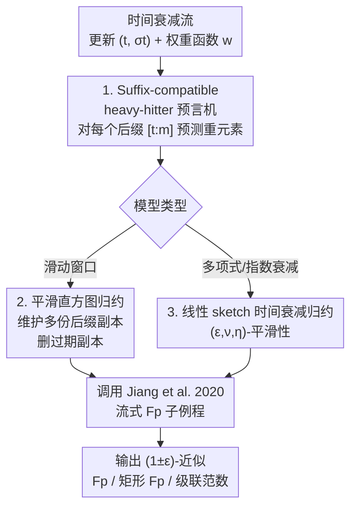

# Learning-Augmented Moment Estimation on Time-Decay Models

**会议**: ICLR 2026  
**OpenReview**: [https://openreview.net/forum?id=x0xBJxrVTy](https://openreview.net/forum?id=x0xBJxrVTy)  
**代码**: https://github.com/ndsoham/learning-augmented-fp-time-decay  
**领域**: 学习理论 / 流式算法 / Learning-Augmented Algorithms  
**关键词**: 时间衰减流, 矩估计, heavy-hitter 预言机, 平滑直方图, 滑动窗口

## 一句话总结
本文把"机器学习预测的 heavy-hitter 预言机"引入**时间衰减流模型**（含多项式衰减、指数衰减、滑动窗口），通过一个只需预测"流后缀"重元素的 **suffix-compatible 预言机** 加上**平滑性归约**，把已有的 learning-augmented 流式 $F_p$ 矩估计算法几乎无损地搬到了时间衰减场景，得到了空间近最优、可实现、并有形式化保证的算法。

## 研究背景与动机

**领域现状**：在数据流模型里，频率向量 $x \in \mathbb{R}^n$ 由一连串更新逐步累加，目标是用远小于数据规模的内存估计某个函数 $f(x)$，最经典的是 $F_p$ 矩 $\|x\|_p^p = \sum_i |x_i|^p$。对 $p \geq 2$，count-sketch 框架能用 $\tilde{O}(n^{1-2/p})$ 空间做 $(1\pm\varepsilon)$ 近似，而且这个界被证明在最坏情况下是紧的——也就是说当 $p$ 很大时几乎要 $\tilde{\Omega}(n)$ 空间，结论相当悲观。

**现有痛点**：近年的 learning-augmented 算法用 ML 模型提供"提示"来绕过最坏情况下界。Jiang et al. (2020) 证明：只要有一个能预测 heavy hitter 的预言机，$F_p$ 矩估计的空间就能降到 $\tilde{O}(n^{1/2-1/p})$——这是没有预言机时**可证明做不到**的。但几乎所有这类工作都只估计**整条流**的频率，完全没有考虑数据的**时效性**：现实中新数据更重要，旧数据因为隐私法规（如 GDPR 要求超期删除用户数据）甚至必须被丢弃。

**核心矛盾**：标准流的算法**不能直接**搬到时间衰减模型。唯一一个尝试在滑动窗口里做 learning-augmented 的工作 Shahout et al. (2024)（WCSS 算法）有两个硬伤：一是**没有任何形式化的空间复杂度保证**；二是出于技术原因它用了一个"下一次出现"预言机而非 heavy-hitter 预言机，而流式下界的难实例恰恰是关于识别 $L_p$ heavy hitter 的，所以这种预言机既不自然、又难说清能不能真正改进 sketch 技术，更无法推广到一般时间衰减模型。

**本文目标**：在一般时间衰减模型（多项式衰减、指数衰减，以及作为特例的滑动窗口）下，为 $F_p$ 频率、矩形 $F_p$ 频率、$(k,p)$-级联范数这几个基础问题给出空间近最优、可实现、有形式化保证的 learning-augmented 算法。

**切入角度**：作者观察到，时间衰减流文献里很多算法都建立在函数的**平滑性（smoothness）**之上——维护若干份跑在不同后缀上的流式算法副本，删掉那些已经"过期"的副本，只要被估函数满足平滑性，正确性就能传递。如果能把这套平滑性框架"白盒改造"成兼容预言机的版本，就能直接复用 Jiang et al. 的流式算法。

**核心 idea**：用**suffix-compatible heavy-hitter 预言机 + 平滑性归约**，把 learning-augmented 流式算法整体"转译"成时间衰减算法，而不重新设计一套复杂的差分估计器。

## 方法详解

### 整体框架

本文的核心是一个**归约框架**：不另起炉灶设计时间衰减专用算法，而是把已有的 learning-augmented **流式** $F_p$ 算法（Jiang et al. 2020）当作黑盒/白盒子例程，外面套一层基于平滑性的"副本管理"逻辑，再配一个被加强过的预言机，使整个组合在时间衰减场景下与无预言机时一样工作。

整条管线分两条平行路线：**滑动窗口**这个干净特例用 Braverman-Ostrovsky 的**平滑直方图**框架（Lemma 3.1）；**一般时间衰减**（多项式/指数衰减）则用一套基于线性 sketch 的更一般平滑性条件（Definition 5 + Theorem 3）。两条路线共用同一个关键前提——预言机必须是 suffix-compatible 的，即能对每个后缀流 $[t:m]$ 都回答 heavy-hitter 询问。

### 关键设计

**1. Suffix-compatible heavy-hitter 预言机：把"看整条流"放宽成"看所有后缀"**

时间衰减归约要正确，关键卡点在于：每删掉一份过期副本、每移动一次窗口，被处理的其实是流的某个**后缀** $[t:m]$，所以预言机不能只对整条流回答 heavy hitter，必须对所有后缀都能回答。本文把这个要求形式化为 suffix-compatible 预言机（Definition 2）：对每个 $t \in (0, m-1]$ 和对应的后缀频率向量 $x(t:m)$，预言机都能（以概率 $\geq 1-\delta$）回答某坐标是否为 heavy hitter。heavy hitter 的判据沿用 Jiang et al.：对 $F_p$，$x_i$ 是 heavy hitter 当且仅当 $|x_i|^p \geq \frac{1}{\sqrt{n}}\|x\|_p^p$。

这个设计的巧妙之处在于"放宽"二字。Shahout et al. (2024) 曾指出用 bloom filter 给**每个窗口**都做预测很困难，于是退而用了不自然的"下一次出现"预言机。本文点明：suffix-compatibility 并不需要对每个窗口预测，只需对**流的后缀**预测——这样的后缀只有 $m-W+1$ 个，是一个比"每个窗口"宽松得多的设定。实验也验证这种预言机能用一小部分流更新就轻松学到，从而绕开了前作的实现障碍，同时保留了"heavy-hitter 预言机"这一与流式下界对齐的自然形式。

**2. 平滑直方图归约：把流式算法直接转成滑动窗口算法**

对滑动窗口这个干净特例，本文借用 Braverman-Ostrovsky 的平滑直方图框架。一个函数 $f$ 称为 $(\alpha,\beta)$-平滑（Definition 4）：粗略地说，若两个频率向量 $x_A, x_B$（$B$ 是 $A$ 的后缀）当前的函数值已经足够接近——$f(x_B) \geq (1-\beta)f(x_A)$——那么再给两者追加**任意共同后缀** $C$ 之后，$f(x_{B\cup C}) \geq (1-\alpha)f(x_{A\cup C})$ 仍然成立，即接近性在后续更新下被保持。框架据此在不同后缀上维护多份流式算法副本，一旦两份副本的估计值靠得足够近就删掉较旧的那份，从而用很少的副本数覆盖整个窗口。

Lemma 3.1 把这套逻辑做成 learning-augmented 版本：给定一个用空间 $g(\varepsilon,\delta)$、每次更新 $h(\varepsilon,\delta)$ 操作、并查询 suffix-compatible 预言机的流式算法 ALG，就能得到一个滑动窗口算法 ALG′，以 $O\!\left(\frac{(g(\varepsilon,\delta')+\log n)\log n}{\beta}\right)$ 空间输出 $(1\pm(\alpha+\varepsilon))$-近似。配合 $F_p$ 的已知平滑性 $f$ 是 $(\varepsilon, \varepsilon^p/p^p)$-平滑（Lemma 3.3），把 Jiang et al. 的流式算法（Lemma 3.2，空间 $\tilde{O}(n^{1/2-1/p}/\varepsilon^4)$）代入，并用经典 median trick 把成功概率放大，最终得到 Theorem 1：滑动窗口 $F_p$ 估计的空间为

$$O\!\left(\frac{n^{1/2-1/p}}{\varepsilon^{4+p}}\cdot p^{1+p}\cdot \log^4 n \cdot \log\tfrac{p}{\varepsilon}\right).$$

值得注意的是，这个界**与窗口大小 $W$ 无关**，对常数 $p,\varepsilon$ 退化为 $\tilde{O}(n^{1/2-1/p})$，与 Jiang et al. 给出的下界 $\Omega(n^{1/2-1/p}/\varepsilon^{2/p})$ 在 $n$ 的指数上吻合，因此关于 $n$ 是近最优的。

**3. 一般时间衰减归约：用线性 sketch 平滑性覆盖多项式与指数衰减**

滑动窗口的权重函数是二值的（窗口内为 1、窗口外为 0），而一般时间衰减的权重 $w$ 是连续衰减的——多项式衰减 $w(\tau)=1/\tau^s$、指数衰减 $w(\tau)=s^\tau$。为覆盖这类模型，本文给出一套适配线性 sketch 的平滑性条件（Definition 5）：称 $w$ 与 $G$-矩函数 $G$ 是 $(\varepsilon,\nu,\eta)$-平滑，若 (1) $G((1+\eta)x)-G(x)\leq \frac{\varepsilon}{4}G(x)$（函数对输入轻微缩放不敏感）；(2) 存在 $m_\nu$ 使得 $\sum_{i\in[m_\nu,m]}w(i)\leq \nu$ 且 $G(x+\nu)-G(x)\leq\frac{\varepsilon}{4}G(1)$——也就是**所有比当前早 $m_\nu$ 步以上的更新都可以被安全忽略**，这正是时间衰减"旧数据可丢"的数学刻画。

Theorem 3 据此给出：任何用 $k$ 行线性 sketch 做 $(1+\varepsilon)$-近似 $G$-矩估计的流式算法，只要 $G,w$ 满足该平滑性，就能转成一般时间衰减算法，空间仅 $O\!\left(\frac{k}{\eta}\log n\log\frac{1}{\nu}\right)$，且只要预言机 suffix-compatible，该陈述对 learning-augmented 算法同样成立。把它作用在 $F_p$ 估计上即得多项式衰减下矩形 $F_p$ 的 $\tilde{O}(\Delta^{d(1/2-1/p)}/\varepsilon^{2+4/p})$ 空间界（Theorem 4）。和"推广 Woodruff-Zhou 差分估计器并加入 advice"这条在 $\varepsilon$ 上更优但极其复杂的路线相比，作者刻意选了这条**易于实现**的平滑性路线——因为引入 ML advice 的初衷本就是要好实现。

### 损失函数 / 训练策略

本文是理论 + 实证工作，无训练损失。预言机一侧，作者在附录 D 给出了学习这类 heavy-hitter 预言机的通用框架；实验中实际用了 CountSketch、LLM（ChatGPT/Gemini）和一个为 heavy-hitter 预测训练的 LSTM 三种 suffix-compatible 预言机实现。

## 实验关键数据

实验聚焦滑动窗口这一特例，比较非增强算法与其 learning-augmented 对应版本：AMS（Alon et al. 1999，做 $\ell_2$ 范数）对 AMSA，SS（Indyk-Woodruff 2005 的子采样，做 $\ell_3$ 范数）对 SSA。预言机用 CountSketch / LLM / LSTM。数据集为合成的二项偏斜分布、真实 CAIDA IP 流量、真实 AOL 用户查询。

### 主实验

| 数据集 | 任务 | 算法 | 估计/真值比 | 说明 |
|--------|------|------|-------------|------|
| CAIDA | $\ell_2$ 范数 | AMSA（增强） | 全程 $\leq 1.2$ | 误差曲线平、各窗口尺寸都贴近真值 |
| CAIDA | $\ell_2$ 范数 | AMS（基线） | 约 1.25 ~ 2.3 | 误差大且随窗口波动 |
| CAIDA | $\ell_3$ 范数 | SSA（3 种预言机） | 更贴近 1 | 三种预言机都有效增强 |
| AOL | $\ell_3$ 范数 | SSA vs SS | $W>125\text{k}$ 时 SSA 更准 | 低采样率/低内存下 SSA 优势最明显 |

### 消融 / 分析

| 配置 | 关键观察 | 说明 |
|------|---------|------|
| 变窗口尺寸 | AMSA 误差曲线平坦 | 增强算法在各窗口尺寸下都精确 |
| 变采样选择概率 | 低概率下 SSA 显著优于 SS | 增强在低空间设定下收益最大 |
| 三种预言机对比 | CS / LLM / LSTM 均有效 | 增强收益不依赖某种特定预言机 |
| 分布偏移 | 增强法稳健、scaling 退化 | 更新分布漂移时启发式 scaling 会掉点 |

### 关键发现
- **增强算法的"平坦误差曲线"是核心卖点**：AMSA/SSA 不仅平均更准，估计/真值比在各窗口尺寸下波动也小，说明它在不同窗口下都更可靠，而非碰巧某些窗口好。
- **低内存场景增强收益最大**：采样选择概率越低（内存越省），SSA 相对 SS 的优势越大——这恰好是 learning-augmented 想攻克的"省空间"痛点。
- **数据分布影响增益幅度**：AOL 数据更均匀，heavy hitter 不突出，SSA 相对 SS 的优势就不如在偏斜的 CAIDA 上明显，但仍更准。
- **对分布偏移稳健**：相比会因分布漂移而退化的 scaling 启发式，本文方法在更新分布变化时仍保持性能。

## 亮点与洞察
- **"放宽预言机需求"是破局点**：把"对每个窗口预测"降为"对每个后缀预测"，既绕开了前作的实现困难，又保住了与流式下界对齐的自然 heavy-hitter 形式——一个定义层面的松弛换来了可实现性 + 可证明性双赢。
- **归约而非重造**：不设计时间衰减专用复杂算法，而是把平滑性框架"白盒改造"成兼容预言机，从而把任意满足平滑性的 learning-augmented 流式算法**整批**搬进时间衰减/滑动窗口，$F_p$、矩形 $F_p$、级联范数一网打尽。
- **故意不追求 $\varepsilon$ 最优**：作者明说推广差分估计器能在 $\varepsilon$ 上更优，但因为太复杂、不好实现而放弃——"引入 ML advice 本来就是为了好实现"，这种工程理性的取舍在纯理论论文里很难得。
- 可迁移思路：任何"维护多份副本 + 删过期副本"的滑动窗口/时间衰减算法，都可以照此模式接入 ML 预言机，只需验证目标函数的平滑性 + 让预言机 suffix-compatible。

## 局限与展望
- **空间界在 $\varepsilon$ 上不是最优**：为了可实现性放弃了差分估计器路线，$\varepsilon$ 的指数（如 $1/\varepsilon^{4+p}$）比理论上能达到的更差。
- **级联范数对到达方式有限制**：多项式/指数衰减模型下计算 $(k,p)$-级联范数需要"按行到达"，只有滑动窗口才允许任意点更新（脚注 3），适用面有约束。
- **实验只覆盖滑动窗口**：理论覆盖多项式/指数衰减，但实证只做了滑动窗口的 $\ell_2/\ell_3$，一般衰减模型与级联范数的实际效率未直接验证。
- **依赖预言机质量**：分析基于预言机以概率 $1-\delta$ 正确，真实 LLM/LSTM 预言机在分布大幅偏移或对抗输入下的可靠性仍是开放问题。

## 相关工作与启发
- **vs Jiang et al. (2020)**：他们在**标准流**上用 heavy-hitter 预言机做 $F_p$ 估计，本文沿用同样自然的预言机，但通过平滑性归约把结果**推广到时间衰减**，并证明关于 $n$ 仍近最优——本文优势是覆盖了时效性场景，且把多个问题统一处理。
- **vs Shahout et al. (2024) WCSS**：他们也做 learning-augmented 滑动窗口，但用"下一次出现"预言机、无形式化空间保证、难推广。本文用更自然的 suffix-compatible heavy-hitter 预言机，给出形式化界，并能推广到一般时间衰减——既更严谨又更通用。
- **vs Woodruff-Zhou (2021a) 差分估计器**：那是一条在 $\varepsilon$ 依赖上更优的归约路线，本文权衡后选了更易实现的平滑直方图路线，牺牲 $\varepsilon$ 换实现性与简洁性。

## 评分
- 新颖性: ⭐⭐⭐⭐ 把 learning-augmented 首次系统地引入一般时间衰减模型，suffix-compatible 预言机的松弛很巧。
- 实验充分度: ⭐⭐⭐ 多数据集多预言机验证了滑动窗口，但一般衰减/级联范数缺实证。
- 写作质量: ⭐⭐⭐⭐ 动机层层递进，归约逻辑与已有下界对照清晰。
- 价值: ⭐⭐⭐⭐ 给出可实现 + 有保证的时间衰减矩估计框架，对隐私法规下的流式分析有现实意义。

<!-- RELATED:START -->

## 相关论文

- [\[ICLR 2026\] Finite-Time Convergence Analysis of ODE-based Generative Models for Stochastic Interpolants](finite-time_convergence_analysis_of_ode-based_generative_models_for_stochastic_i.md)
- [\[ICLR 2026\] Expressive Power of Implicit Models: Rich Equilibria and Test-Time Scaling](expressive_power_of_implicit_models_rich_equilibria_and_test-time_scaling.md)
- [\[ICLR 2026\] Decision-Theoretic Approaches for Improved Learning-Augmented Algorithms](decision-theoretic_approaches_for_improved_learning-augmented_algorithms.md)
- [\[ICLR 2026\] ATLAS: Alibaba Dataset and Benchmark for Learning-Augmented Scheduling](atlas_alibaba_dataset_and_benchmark_for_learning-augmented_scheduling.md)
- [\[ICLR 2026\] Online Rounding and Learning Augmented Algorithms for Facility Location](online_rounding_and_learning_augmented_algorithms_for_facility_location.md)

<!-- RELATED:END -->
