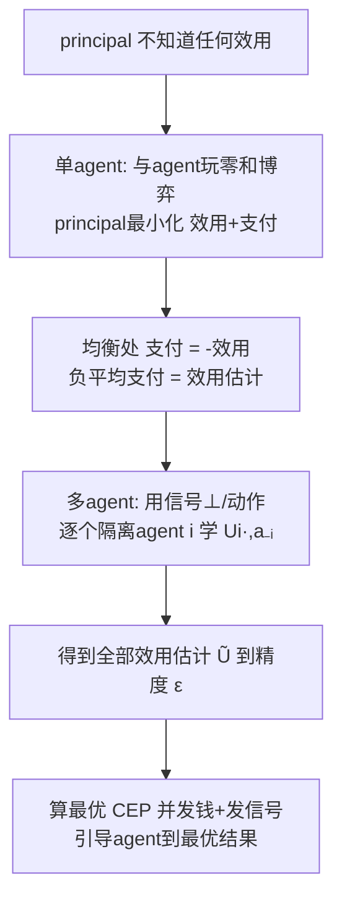

# Learning a Game by Paying the Agents

**会议**: ICLR 2026  
**OpenReview**: [https://openreview.net/forum?id=8yRtP2n8OK](https://openreview.net/forum?id=8yRtP2n8OK)  
**代码**: 待确认（纯理论论文，无代码）  
**领域**: 学习理论 / 算法博弈论  
**关键词**: 逆博弈论, 效用学习, 无悔学习, 支付机制, 信号设计, 引导无悔学习者, 零和博弈, 相关均衡  

## 一句话总结
一个 principal 在重复博弈中只观察无悔学习 agent 的行为、并通过"发钱 + 发信号"主动干预，就能在多项式轮数内把所有 agent 的效用函数（在策略等价意义下）学到任意精度 ε，并据此首次实现"不知道 agent 效用也能把任意无悔学习者引导到最优均衡"。

## 研究背景与动机
**领域现状**：博弈论的经典问题是"已知效用 → 预测行为"，而逆博弈论（inverse game theory）/ 揭示偏好学习（learning from revealed preferences）研究反向问题——"只看行为 → 推断效用"。

**现有痛点**：以往逆博弈论工作有两大限制。其一，几乎都假设观察到的行为是 **Nash 均衡行为**，但 Nash 均衡是 PPAD-hard 的，现实中 agent 未必会收敛到它；其二，大多是 **被动**问题——从一份固定的行为数据里反推效用，数据量天然不足，容易得到平凡的不可能性结论。而在 Stackelberg 博弈这条线里，若 principal 只能改自己的策略、不能付钱，已有强不可能性结果：不知道 agent 学习算法细节就学不到其效用。

**核心矛盾**：要把"逆博弈"做成可证可解，必须（1）放弃"agent 打均衡"这个不现实的假设、允许任意无悔算法；（2）从被动观察变成 **主动干预**。但主动干预面对一个棘手障碍——无悔算法的 **非遗忘性（non-forgetfulness）**：principal 过去付的钱会改变 agent 未来的行为，而且 agent 可能积累负 regret，导致接下来很多轮里"什么信息都读不出来"，二分查找之类的直觉方法直接失效。

**本文目标**：设计 principal 算法，在 **不知道 agent 效用、不知道 agent 学习算法细节** 的前提下，对 **任意无悔 agent**，用多项式轮数把博弈（在策略等价意义下）学到精度 ε；并把它当子程序，解决"未知效用下引导无悔学习者到最优结果"。

**核心 idea**：**[赋予 principal 付钱的权力]** 把 principal 与 agent 设计成一个 **零和博弈**——principal 选支付函数去 **最小化** agent 的总收益（效用+支付），agent 选策略去最大化它；该零和博弈的唯一均衡恰好让 principal 的支付等于 agent 效用的相反数，于是"负的平均支付"自然成了效用的精确估计。多 agent 情形再用 **信号** 把各 agent 的学习问题彼此隔离，归约回单 agent。

## 方法详解

### 整体框架
设 $n$ 个 agent、agent $i$ 有 $m_i$ 个动作、动作组合总数 $M=\prod_i m_i$。每轮 principal 先给每个 agent 一个支付函数 $P_i^t:A_i\to[0,B]$（加到该 agent 收益上，$U_i^t(a)=U_i(a)+P_i^t(a_i)$）并发信号 $s_i^t$；agent 看到信号后用任意（上下文）无悔算法选混合策略 $x_i^t$；principal 观察 $x^t$。由于无悔行为只依赖动作间的相对效用，效用最多只能学到 **策略等价**（差一个不依赖自身动作的项 $W_i(a_{-i})$），目标是输出 $\tilde U_i$ 使 $|U_i(a)+W_i(a_{-i})-\tilde U_i(a)|\le\varepsilon$。整条管线是"单 agent 零和博弈学效用 → 多 agent 用信号隔离 → 学完效用后做无先验引导"三层递进。

### 关键设计

**1. 零和博弈视角学单 agent 效用：让"负平均支付"自动逼近效用。** 把单 agent 效用看成向量 $u\in[-1,1]^m$（减去均值使 $\langle 1,u\rangle=0$），principal 在受限支付集 $P=\{p\in[0,2]^m:\langle 1,p\rangle=m\}$ 上选 $p$ 去最小化 agent 的总收益 $\langle u+p,x\rangle$，agent 选 $x\in\Delta(m)$ 去最大化它——记这个零和博弈为 $\Gamma_0$。关键引理证明 $\Gamma_0$ 的任意 ε-Nash 均衡里 principal 策略必为 $p=1-u+z$（$\|z\|_1\le 4m\varepsilon$）：因为取 $p=1-u$ 会让任何 $x$ 都得收益恰好 1，所以均衡下 agent 收益 $\le 1+\varepsilon$，从而 $p$ 必须紧贴 $1-u$。妙处在于 principal 收益对 $p$ 的梯度是 $-x$（**不依赖未知的 $u$**），于是 principal 可以在 **完全不知道效用** 的情况下跑投影梯度下降。Algorithm 1 每轮只做 $p^{t+1}\leftarrow\Pi_P[p^t-\eta x^t]$，返回 $-\frac1T\sum_t p^t$ 作为效用估计，正面绕开了非遗忘性：不需要 agent 立刻响应，只要双方都无悔，平均策略就收敛到均衡。

**2. 收敛速率与轮数复杂度：把 regret 界翻译成学习精度。** 既然无悔学习在零和博弈里平均收敛到 Nash，principal regret $R_0\le BG\sqrt T$（这里 $B\lesssim\sqrt m,\ G=1$），加上 agent 的 $C\sqrt T$ regret，平均对局是 $\frac{R_0+C\sqrt T}{T}$-Nash。代入引理得
$$\varepsilon=\|\bar p+u-1\|_\infty\le\|\bar p+u-1\|_1\lesssim 4m\cdot\frac{R_0+C\sqrt T}{T}\lesssim\frac{m}{\sqrt T}(C+\sqrt m).$$
解出 Algorithm 1 在 $T=O\!\big(\frac{m^3+C^2m^2}{\varepsilon^2}\big)$ 轮内 ε-学会单 agent 博弈（Theorem 4.2）。值得一提的是另一条用信号做二分查找的路线需要 $m\log(1/\varepsilon)$ 个信号、轮数带 $\log(1/\varepsilon)$ 因子，本设计反而 **不用信号** 就拿到更干净的 $1/\varepsilon^2$ 依赖。

**3. 用信号把多 agent 解耦回单 agent：⊥ 标记"正在学谁"。** 多 agent 的难点是各 agent 的 regret 会互相污染。设计令信号集 $S_i=A_i\cup\{\bot\}$：当要学 $U_i(\cdot,\bar a_{-i})$ 时，给 agent $i$ 发 $\bot$（表示"现在学你"），给其余每个 agent $j$ 发其应出的动作 $\bar a_j$ 并配大额支付 $2\cdot\mathbb I\{a_j=\bar a_j\}$ 诱导其服从。这样在 agent $i$ 的视角下，其他人几乎总在打 $\bar a_{-i}$，问题退化为单 agent 情形，直接复用 Algorithm 1。Algorithm 2 对每个 agent、每个 $\bar a_{-i}$ 跑一段，得到 $\tilde U_i(\cdot,\bar a_{-i})=-\frac1L\sum_\ell p^\ell$，总轮数 $\frac{\mathrm{poly}(M,C)}{\varepsilon^2}$（Theorem 4.3）。信号在这里 **不可或缺**：没有它，外层循环轮到 agent $n$ 时它可能已经积累了 $\Omega(T)$ 量级的负 regret，导致接下来很长一段"读不出任何信息"；按信号分桶的无悔保证（式 (1)）恰好把"被学时"的 regret 从历史 regret 里隔离出来。

**4. 无先验引导：先学博弈、再算最优 CEP、最后多付 2ε 兜底。** 引导（steering）问题原本假设 principal 知道博弈、知道想引导到的目标；本文不知道效用，于是改为直接最大化 principal 自己的目标 $F(T)=\frac1T\sum_t\mathbb E[U_0(\phi^t(s^t))-\sum_i P_i^t]$（效用减支付）。为此引入新解概念 **带支付的相关均衡 CEP**：$(\mu,P)$ 满足 IC 约束 $\mathbb E_{a\sim\mu}[U_i^P(a,\phi_i(a_i),a_{-i})-U_i^P(a,a)]\le\varepsilon$，最优值记 $F^*(\Gamma)$。论文证明 $F^*(\Gamma)$ 是 principal 能达到的 **紧上界**（Theorem 5.2，即便知道博弈也超不过 $F^*(\Gamma)+o(1/\sqrt T)$），并给出 Algorithm 3：先用 Algorithm 2 把效用学到 ε，再在估计博弈 $\tilde\Gamma$ 上算最优 CEP 并照着发钱发信号——因为效用有 ε 误差，须额外多付 $2\varepsilon$ 防止 agent 偏离。这样在 **无任何效用先验** 下仍能达到 $F(T)\ge F^*(\Gamma)-\mathrm{poly}(M,C)/T^{1/4}$（Theorem 5.3）。

## 实验关键数据
本文为纯理论工作，"实验"即一系列上界 / 下界定理。下面汇总核心结果。

### 主结果：学习与引导的复杂度

| 问题 | 结果 | 轮数 / 速率 |
|------|------|-------------|
| 单 agent 效用学习（Thm 4.2，Alg 1） | ε-学会 | $O\big(\frac{m^3+C^2m^2}{\varepsilon^2}\big)$，且不用信号 |
| 多 agent 效用学习（Thm 4.3，Alg 2） | ε-学会任意博弈 | $\mathrm{poly}(M,C)/\varepsilon^2$ |
| 引导（无效用先验，Thm 5.3，Alg 3） | $F(T)\ge F^*(\Gamma)-\mathrm{poly}(M,C)/T^{1/4}$ | 最优 CEP 值，速率 $T^{-1/4}$ |
| 上界紧性（Thm 5.2） | 即便已知博弈也超不过 $F^*(\Gamma)$ | $+o(1/\sqrt T)$ |

### 下界（与上界匹配性）

| 下界对象 | 结果（Thm 4.4） | 含义 |
|----------|----------------|------|
| ε-学会任意博弈所需轮数 | $\max\{\tilde\Omega(nM)\log\frac1\varepsilon,\ \frac{C^2}{4\varepsilon^2}\}$ | 信息论 + regret 两路下界 |
| 与上界差距 | 仅差 $M$ 上的多项式因子 | 不可能指数级改进任一参数依赖 |

### 关键发现
- **付钱是关键杠杆**：在不能付钱的 Stackelberg 设定下学 agent 效用有强不可能性；引入支付后，对任意无悔 agent、无需知道其算法细节即可学会，定性上突破了不可能性。
- **非遗忘性被零和博弈框架化解**：principal 梯度 $-x$ 不依赖未知效用，使"不知道效用也能跑梯度下降"成立，无需要求 agent 算法是遗忘的（forgetful）。
- **信号是多 agent 解耦的必要条件**：缺了 $\bot$/动作信号，agent 的负 regret 会跨阶段污染、令学习停摆。
- **可达 = 最优 CEP**：$F^*(\Gamma)$ 同时是可达值与紧上界，给出了引导问题首个精确刻画。

## 亮点与洞察
- **"逆博弈"问题被重新框成可解**：用"主动付钱 + 零和博弈"取代"被动观察均衡"，既绕开 Nash 的 PPAD-hardness，又对任意无悔算法成立。
- **简单到惊艳的核心机制**：principal 只是"每轮把支付向量沿 agent 策略的反方向挪一点"，最终负平均支付就是效用——一个梯度下降式更新承载了全部学习。
- **首批正面结果**：是已知第一个对任意无悔 agent 的效用学习正面结果，也是第一个"无效用先验引导任意无悔学习者"且给出最优值精确刻画的工作。
- **上下界几乎匹配**：除 $M$ 上的多项式因子外，复杂度被信息论 + regret 两路下界卡死，结论扎实。

## 局限与展望
- **多项式因子未优化**：上下界在 $M$ 上差多项式因子，未给出最优指数，留作开放问题。
- **局限于标准式博弈**：方法依赖"每轮观察到完整混合策略 $x^t$"，在扩展式博弈（只观察 on-path 动作）等设定下不直接适用。
- **多 agent 必须用信号**：单 agent 只靠付钱即可，但多 agent 仍需信号；"仅用付钱、不用信号"能否学多 agent 效用尚不清楚。
- **是否必须学完整效用**：学全效用需 $\tilde\Omega(nM)\log\frac1\varepsilon$ 轮，能否绕开这个瓶颈、不学全效用就完成引导，是有价值的方向。

## 相关工作与启发
- **逆博弈论 / 揭示偏好**（Beigman & Vohra 2006；Kuleshov & Schrijvers 2015）：本文把这条线从"被动 + 均衡假设"推进到"主动 + 任意无悔"。
- **引导无悔学习者**（Zhang et al. 2024）：本文去掉了"principal 已知博弈"的前提，并允许均衡下总支付非零（只要 principal 收益增益足够大）。
- **对抗无悔买家 / 玩家**（Braverman et al. 2018；Deng et al. 2019；Lin & Chen 2025）：这些工作多假设已知效用、单 agent、无支付；本文是多 agent、带支付、worst-case 无悔。
- **信息设计**（Kamenica & Gentzkow 2011）以及用信号学效用（Feng et al. 2022；Bacchiocchi et al. 2024）：前人多针对短视最优响应 agent，本文把信号与支付结合以应对任意无悔 agent。
- **启发**：对"如何从学习型 agent 身上反推偏好"（如机制设计、推荐系统、AI 对齐里对学习代理的诱导）提供了一个可证范式——**用激励的相反方向当探针**。

## 评分
- **新颖性**: ⭐⭐⭐⭐⭐ 把逆博弈重铸为 principal-agent 零和博弈，首次对任意无悔 agent 给出效用学习与无先验引导的正面结果，问题框架与技术都新。
- **实验充分度**: ⭐⭐⭐⭐ 纯理论工作，上界 + 紧下界 + 引导刻画形成闭环，唯多项式因子未收紧（无实证实验，符合理论论文定位）。
- **写作质量**: ⭐⭐⭐⭐⭐ 主线清晰，从单 agent 直觉到多 agent 信号解耦层层递进，关键引理与障碍（非遗忘性）讲解透彻。
- **价值**: ⭐⭐⭐⭐ 为"从学习型 agent 学偏好/引导其行为"奠定可证基础，对算法博弈论、机制设计、多代理对齐有较强延展性。

<!-- RELATED:START -->

## 相关论文

- [\[ICLR 2026\] Transfer Learning in Infinite Width Feature Learning Networks](transfer_learning_in_infinite_width_feature_learning_networks.md)
- [\[ICLR 2026\] Learning to Adapt: In-Context Learning Beyond Stationarity](learning_to_adapt_in-context_learning_beyond_stationarity.md)
- [\[ICLR 2026\] Sharp Asymptotic Theory for Q-Learning with LD2Z Learning Rate and Its Generalization](sharp_asymptotic_theory_for_q-learning_with_textttld2z_learning_rate_and_its_gen.md)
- [\[ICLR 2026\] Online Decision-Focused Learning](online_decision-focused_learning.md)
- [\[ICLR 2026\] Learning to Answer from Correct Demonstrations](learning_to_answer_from_correct_demonstrations.md)

<!-- RELATED:END -->
