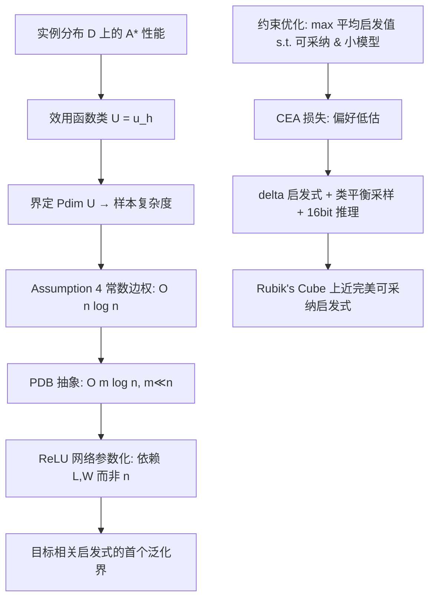

# Learning Admissible Heuristics for A*: Theory and Practice

**会议**: ICLR 2026  
**OpenReview**: [https://openreview.net/forum?id=WAQIxi7ifb](https://openreview.net/forum?id=WAQIxi7ifb)  
**代码**: 待确认（PDB 数据来自 HOG2 仓库 nathansttt/hog2）  
**领域**: 学习理论 / 启发式搜索（A* 可学习启发式）  
**关键词**: admissible heuristic, A* search, sample complexity, pseudo-dimension, generalization bound, pattern database, Rubik's Cube  

## 一句话总结
把"学习 A* 启发式函数"形式化为约束优化问题，一方面提出 Cross-Entropy Admissibility (CEA) 损失在训练中强制可采纳性（never overestimate），另一方面用伪维度（pseudo-dimension）给出依赖网络规模而非图规模的泛化样本复杂度界，在 Rubik's Cube 上学到近乎完美可采纳、且强于同尺寸压缩 PDB 的启发式。

## 研究背景与动机
- **领域现状**：A* 之类的启发式搜索算法依赖一个估计 cost-to-go 的启发式函数 $h$，只有当 $h$ **可采纳（admissible）**——即对所有状态 $h(v)\le h^*(v)$，永不高估真实最短路代价——时 A* 才保证返回最优解。传统可采纳启发式靠领域知识构造，典型代表是 **Pattern Database (PDB)**：把问题抽象到更小状态空间 $\phi(V)$，存下每个抽象状态到目标的精确距离，天然可采纳。
- **现有痛点**：近年用深度学习直接学启发式很流行（因为复杂域人工设计难、且数据驱动方法在类似任务上表现强），但学出来的 $h$ **几乎都丢掉了可采纳性**，从而失去最优性保证；同时这类方法对"学到的启发式能否泛化到训练数据之外的整张图"几乎没有理论保证。
- **核心矛盾**：搜索算法要的是"可采纳 + 有理论泛化保证"，而深度学习给的是"经验上强但既不可采纳也无泛化界"。已有理论工作（Sakaue & Oki 2022）只给出 GBFS/A* 的样本复杂度上下界 $O(n^2\log n)$ / $O(n\log(nW))$，界依赖**图规模 $n$**，对动辄 $10^{19}$ 状态的图毫无意义。
- **本文目标**：回答三个基础问题——学可采纳启发式需要多少样本（sample complexity）、什么是有效的训练损失、实践中能逼近最优启发式到何种程度。
- **核心 idea**：**(理论侧)** 用伪维度刻画 A* 性能函数类的复杂度，借助 PDB 抽象把界从图规模 $n$ 收紧到抽象图规模 $m$，再换成 ReLU 神经网络把界进一步收紧到**只依赖网络宽度/深度**；**(实践侧)** 提出 **CEA 损失**，把启发式学习当作有序分类任务，用非对称的概率质量重分配显式偏好"低估而非高估"，从而在训练中逼出近乎可采纳的解。

## 方法详解

### 整体框架
论文是"一套理论 + 一个训练框架"的双轨结构。理论轨：把 A* 在实例分布 $\mathcal D$ 上的性能（节点扩展数、运行时、或次优性）抽象成效用函数类 $\mathcal U=\{u_h\}$，通过界定 $\mathrm{Pdim}(\mathcal U)$ 得到泛化样本复杂度，并逐步引入"常数边权假设 → PDB 抽象 → 神经网络参数化 → 实例相关启发式"四个加强层把界收紧。实践轨：把可采纳启发式学习写成约束优化问题（最大化平均启发值，s.t. 不高估、模型尽量小），再用 CEA 损失 + delta 启发式 + 类平衡采样 + 后处理量化把它求解出来。

### 关键设计

**1. CEA 损失：把"宁可低估不可高估"写进分类目标。** 在常数边权假设下，每个整数启发值 $0,1,\dots,\ell$ 构成一个类别，启发式学习退化成有序分类。普通交叉熵 (CE) 只优化分类精度、对高估与低估一视同仁，因而学不出可采纳启发式。CEA 把损失改成非对称形式
$$\mathrm{CEA}=-\frac1N\sum_{i=1}^N\Big[\log\sum_{k=1}^{h^*_i}\big(\tfrac{k}{h^*_i}\big)^{\beta}p^{(i)}_k\Big]+\eta\big(-\log p^{(i)}_{h^*_i}\big).$$
第一项只把概率质量分配到**不超过真值的类别** $k\le h^*_i$，权重 $(k/h^*_i)^\beta$ 随 $k$ 远离真值而衰减——$\beta$ 越小越偏向可采纳（把质量推向更低的类），$\beta$ 越大启发式越强（质量集中在接近真值处）。第二项是缩放系数 $\eta\ll1$ 的 CE 惩罚，把分布往真值类锐化，避免模型即便大部分质量落在可采纳类、却仍给某个高估类较高概率。可以证明该损失的**唯一全局最优**在 $p^{(i)}_{h^*_i}=1$ 处取得，同时满足可采纳与最大平均启发值。

**2. 用伪维度把样本复杂度从图规模收紧到网络规模。** 关键观察是：A* 的性能只通过 OPEN 表里 $f(v)=g(v)+h(v)$ 的选点决定，因此可把 $\mathbb R^n$ 的启发式空间离散成有限个"同性能区域"。Lemma 1 指出只要任意两点的启发差相同（$h(v_i)-h(v_j)=h'(v_i)-h'(v_j)$）则 A* 行为不变；配合常数边权下 $g$ 至多取 $n$ 个值，Theorem 1 得到 $\mathrm{Pdim}(\mathcal U)=O(n\log n)$。换 PDB 抽象后（抽象图规模 $m\ll n$）Theorem 2 收紧到 $O(m\log n)$；再把 $h$ 实现为 ReLU 网络并定义只含必要状态的表示函数 $\mathrm{Rep}(I)$，Theorem 6 给出 $\mathrm{Pdim}(\mathcal U)=O\big(LW\log(U+\ell)+W\log(\ell|B|(L+1))\big)$——界主要由网络层数 $L$、参数量 $W$、规模 $U$ 决定，**不再随图规模爆炸**；Theorem 7 进一步给出**目标相关（goal-dependent）启发式的首个泛化界**。

**3. 用"可重开节点的次优性上界"把泛化误差锚定到可计算量。** 论文不直接界一般性能，而是聚焦**期望次优性** $u_h(x)=C_h(x)-C^*(x)$。Theorem 3 证明：当 A* 允许从 CLOSED 重开节点时，次优性被最优路径上的最大不可采纳量界住，
$$C_h(x)-C^*(x)\le\max_{v\in P_{\mathrm{opt}}}\big[h(v)-h^*(v)\big]:=\Psi_h(x),$$
比此前"沿最优路径累加 inconsistency"的界更紧。再对不可采纳函数类 $\hat{\mathcal U}=\{\Psi_h\}$ 求 $\mathrm{Pdim}(\hat{\mathcal U})=O(n\log n)$，即可把期望次优性整体界成"经验不可采纳 + $\tilde O(\hat H\sqrt{(n+\log\frac1\delta)/N})$"，给出一条从可观测训练量直接控制泛化的链路。

**4. delta 启发式 + 类平衡采样 + 后处理量化：让框架在严重类不均衡下落地。** PDB 启发值分布极度不均（6-edge PDB 中 86% 状态落在 class 7、8），高值类一旦被高估极易在低值状态上破坏可采纳。论文用 **delta 启发式** $h_\Delta$：不直接存大 PDB，而存一个小 base PDB 加上差值 $\Delta=h_{\mathrm{large}}-h_{\mathrm{base}}$，推理时 $h_{\mathrm{large}}(s)=h_{\mathrm{base}}(s)+\Delta(s)$，显著拉平类分布。训练时按类内均匀、跨类按规模成比例采 mini-batch，避免模型过拟合最密集类；推理用 16-bit 精度做后处理压缩降低每次查询延迟（8-bit 量化精度损失过大被弃用）。

## 实验关键数据

设置：3×3 Rubik's Cube，四个 PDB（8-Corner、$\Delta(6,4)$-Edge、6-Edge、7-Edge，均来自 HOG2），ResNet 风格网络。对比 CEA 损失 vs CE 损失 vs min-compression 压缩 PDB，三者占用同等内存。最关键指标是**高估率（overestimation rate）**，越接近 0 越可采纳。

### 主实验表格（学习启发式 vs 压缩 PDB）

| 启发式类型 | Pattern | 平均启发值 | 高估率 | 模型大小(MB) | 压缩比 |
|---|---|---|---|---|---|
| NN + CEA | 7-edge | 7.45 | $2\times10^{-5}$ | 3.75 | 68.12× |
| NN + CE | 7-edge | 8.44 | $1.4\times10^{-2}$ | 3.75 | 68.12× |
| 压缩 PDB | 7-edge | 6.83 | 0 | 3.65 | 70× |
| NN + CEA | 8-corner | 8.76 | $3\times10^{-7}$ | 1.89 | 23.32× |
| NN + CE | 8-corner | 8.76 | $2\times10^{-3}$ | 1.89 | 23.32× |
| 压缩 PDB | 8-corner | 6.84 | 0 | 1.91 | 23× |
| NN + CEA | 6-edge | 6.92 | $9\times10^{-5}$ | 1.95 | 10.91× |
| NN + CE | 6-edge | 7.46 | $9\times10^{-2}$ | 1.95 | 10.91× |
| 压缩 PDB | 6-edge | 6.68 | 0 | 1.93 | 11.03× |
| NN + CEA | $\Delta(6,4)$-edge | 1.31 | $3\times10^{-6}$ | 3.20 | 6.65× |
| NN + CE | $\Delta(6,4)$-edge | 1.89 | $15\times10^{-2}$ | 3.20 | 6.65× |
| 压缩 PDB | $\Delta(6,4)$-edge | 1.05 | 0 | 3.04 | 7× |

### 消融 / 进一步实验

| 维度 | 结果 |
|---|---|
| 8-corner 极限压缩 | 在保持可采纳与精度的前提下达到 **51× 压缩**（相对原始 PDB） |
| 8-corner 搜索强度 | 用学到的模型做搜索，生成节点数 **不到** 同尺寸压缩 PDB 启发式的一半 |
| CEA vs CE 高估率 | 各 PDB 上 CEA 的高估率约比 CE **小 $10^4$ 倍** |
| 泛化误差 vs N | 随训练实例数 N（百万级）增加，8-corner 上的泛化误差单调下降，趋势与理论界一致 |

### 关键发现
- CEA 在 8-corner PDB 上学到**完全可采纳**启发式且平均启发值与原 PDB 持平（信息无损），$\Delta(6,4)$-Edge 也近乎完全可采纳；6/7-edge 仅剩几千个高估状态。
- 同等内存下，CEA 的平均启发值（搜索引导强度的代理）在所有 PDB 上都显著高于 min-compression 压缩 PDB，说明学习压缩比经典压缩保留了更多信息。
- CE 损失从根本上不适合学可采纳启发式：它把高估/低估同等对待，必然产生高高估率。

## 亮点与洞察
- 把一个看似纯工程的问题（学 A* 启发式）同时从**优化（CEA 损失）**和**统计学习理论（伪维度样本复杂度）**两侧打通，理论与实践互相印证。
- 抓住"A* 性能只依赖启发式诱导的排序"这一结构性事实，把泛化界从图规模 $n$ 一路收紧到抽象规模 $m$、再到网络规模 $L,W$，绕开了组合空间天文数字的诅咒。
- Theorem 3 的"可重开节点 → 次优性被最优路径上最大不可采纳量界住"是个干净且更紧的结果，把抽象的泛化误差锚定到训练中可直接度量的 $\Psi_h$。
- delta 启发式 + 类平衡采样的组合，务实地解决了 PDB 极端类不均衡这一会直接破坏可采纳性的落地障碍。

## 局限与展望
- 大量理论结果依赖 **Assumption 4（所有边权为常数 $c_0$）**，这让启发式学习恰好退化成有序分类；非均匀边权（一般路径规划、规划域）下分析与 CEA 形式都需重做。
- 实验只在单一域 **Rubik's Cube** 的若干 PDB 上验证，缺少滑块谜题、规划基准、真实路径规划等多域证据；"目标相关启发式"虽给了理论界但未充分实证。
- CEA 引入 $\beta,\eta$ 两个需逐模型调的超参（虽附录给了通用调参流程），admissibility 与 strength 的权衡仍需人工把握。
- 6/7-edge 上仍残留几千个高估状态，即"近可采纳"而非严格可采纳，用于需要严格最优性保证的场景时仍需额外处理（如配合可采纳兜底）。

## 相关工作与启发
- 直接承接 **Sakaue & Oki (2022)** 对 GBFS/A* 样本复杂度的伪维度分析，把其推广到"可采纳启发式 + PDB 抽象 + 神经网络 + 目标相关"四个方向并普遍收紧界。
- 与放弃理论保证、只追经验性能的深度启发式（DeepCubeA 等 Agostinelli 系工作、神经 A*）形成对照：本文坚持可采纳/最优性这条"搜索算法要的保证"。
- delta 启发式承自 Sturtevant et al. (2017)，PDB 压缩承自 Felner/Helmert 系工作，把经典启发式搜索工具与现代深度学习训练管线缝合。
- 启发：当"模型 = 大数据集的有损压缩器"时，损失函数的**非对称设计**（这里偏好低估）是把硬约束（可采纳性）注入学习的有效手段，这一思路可迁移到任何"宁可某一侧出错"的约束学习问题。

## 评分
- **新颖性**: ⭐⭐⭐⭐⭐ 首次系统地把可采纳启发式学习同时在优化（CEA）与样本复杂度（依赖网络规模的界、目标相关启发式首个泛化界）两侧打通，理论贡献扎实且新。
- **实验充分度**: ⭐⭐⭐ 在 Rubik's Cube 四个 PDB 上的对比、消融与泛化误差曲线都到位且说服力强，但仅单域、缺多基准与目标相关启发式的实证，是明显短板。
- **写作质量**: ⭐⭐⭐⭐ 理论铺陈层层递进、假设交代清楚、定理与实验呼应紧密；公式偏密，对非搜索/学习理论背景读者门槛较高。
- **价值**: ⭐⭐⭐⭐ 给"学习启发式"这一长期缺理论根基的方向提供了可采纳性与泛化的双重抓手，对启发式搜索、规划、神经符号结合都有参考价值。

<!-- RELATED:START -->

## 相关论文

- [\[ICML 2026\] Performative Learning Theory](../../ICML2026/learning_theory/performative_learning_theory.md)
- [\[ICLR 2026\] Sharp Asymptotic Theory for Q-Learning with LD2Z Learning Rate and Its Generalization](sharp_asymptotic_theory_for_q-learning_with_textttld2z_learning_rate_and_its_gen.md)
- [\[ICLR 2026\] Does the Data Processing Inequality Reflect Practice? On the Utility of Low-Level Tasks](does_the_data_processing_inequality_reflect_practice_on_the_utility_of_low-level.md)
- [\[ICLR 2026\] Why Less is More (Sometimes): A Theory of Data Curation](why_less_is_more_sometimes_a_theory_of_data_curation.md)
- [\[ICLR 2026\] Theory of Scaling Laws for In-Context Regression: Depth, Width, Context and Time](theory_of_scaling_laws_for_in-context_regression_depth_width_context_and_time.md)

<!-- RELATED:END -->
