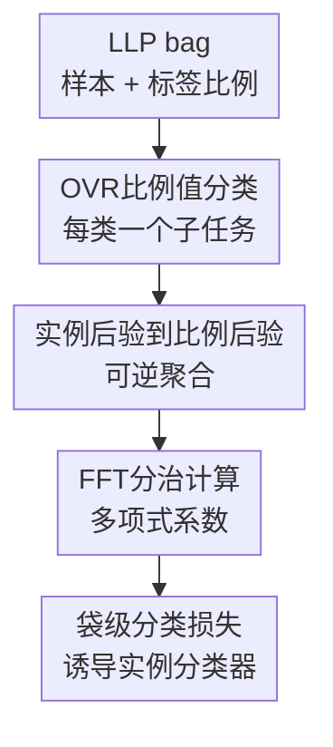

# Learning from Label Proportions via Proportional Value Classification

**会议**: ICLR2026  
**OpenReview**: [https://openreview.net/forum?id=JkFBc9anLi](https://openreview.net/forum?id=JkFBc9anLi)  
**论文**: OpenReview conference paper  
**代码**: https://github.com/TianhaoMa5/ICLR2026_LLP-PVC  
**领域**: 弱监督学习 / Learning from Label Proportions / 学习理论  
**关键词**: 标签比例学习, 弱监督学习, 比例值分类, 过平滑, FFT聚合

## 一句话总结
本文把 Learning from Label Proportions 中的“匹配袋内平均预测”改写成一个袋级比例值分类任务，通过可逆的实例后验聚合与 FFT 加速计算，让模型在只看标签比例的情况下学到更尖锐的实例级分类器，并在多种袋构造策略上显著优于现有 LLP 方法。

## 研究背景与动机
**领域现状**：Learning from Label Proportions（LLP）研究的是一种典型弱监督场景：训练数据不是逐样本标签，而是一组组 bag，每个 bag 只知道各类标签比例。例如一个地区的投票比例、一个医学队列的疾病占比，或者一批图像里每类样本的数量占比。学习目标仍然是普通的实例级分类器，也就是测试时要给单个样本预测类别。

**现有痛点**：主流 LLP 方法常用 proportion matching。做法很直接：把一个 bag 里所有实例的模型输出取平均，然后让这个平均向量接近给定的标签比例。这个损失形式简洁，也有理论支撑，但它没有真正要求每个实例预测得有区分度。只要平均值对上，模型可以把同一个 bag 内的所有样本都预测成相近的软分布。

**核心矛盾**：LLP 的监督信号天然是聚合的，而最终任务却是实例级的。比例匹配只约束一阶平均量，因此容易出现“平均正确、个体模糊”的过平滑问题。论文中的训练曲线也显示，PM 的训练实例平均归一化熵长期较高，对应测试准确率明显受损。

**本文目标**：作者希望保留 LLP 只使用袋级比例标注的设定，同时让训练目标更直接地约束实例级后验分布。具体来说，方法要解决三个子问题：如何从比例标注构造一个更有判别性的监督任务；如何把袋级比例值后验和实例级分类器输出联系起来；如何在 bag size 较大时避免指数级枚举所有标签序列。

**切入角度**：本文的关键观察是，给定一个类 $k$，一个 bag 中该类正例个数其实是一个离散比例值。与其让模型回归比例均值，不如把“这个 bag 里有多少个类 $k$ 样本”当成一个 $(m+1)$ 类分类问题。这个袋级分类问题的后验并不是凭空来的，它可以由每个实例属于类 $k$ 的后验概率聚合得到。

**核心 idea**：用 proportional value classification（PVC）替代直接比例匹配，把标签比例变成袋级离散分类目标，再通过一个由实例后验诱导的可逆聚合层训练实例级分类器。

## 方法详解

### 整体框架
LLP-PVC 的输入仍然是 LLP 数据集 $D=\{(B_i,\alpha_i)\}_{i=1}^n$，其中 $B_i=[x_1,\ldots,x_m]$ 是一个 bag，$\alpha_i$ 是这个 bag 的类别比例。方法对每个类别做 one-versus-rest（OVR）分解，把多类 LLP 转成 $q$ 个二分类子问题；对类别 $k$ 来说，$\alpha_k$ 表示 bag 内正例比例，对应的正例个数是 $m\alpha_k$。

接着，作者不再让平均预测直接拟合 $\alpha_k$，而是构造比例值标签 $\tilde{\alpha}_k=m\alpha_k+1\in\{1,2,\ldots,m+1\}$。模型先对每个实例输出 $f_k(x_j)$，表示实例 $x_j$ 属于类别 $k$ 的概率；然后通过聚合函数 $g_k(B)$ 计算这个 bag 对每个比例值的概率，最后用交叉熵或 MSE 让 $g_k(B)$ 分类到真实比例值 $\tilde{\alpha}_k$。

### 关键设计
**1. OVR比例值分类：把比例监督变成离散袋级分类**

多类 LLP 中可能的比例向量数量为 $\binom{m+q-1}{q-1}$，每个比例向量还对应大量潜在标签序列，直接对完整比例向量建模会非常昂贵。LLP-PVC 先用 OVR 把类别 $k$ 视为正类，其他类别都视为负类，于是每个实例的隐藏标签变成 $\tilde{y}^k_j\in\{0,1\}$，原始比例中的 $\alpha_k$ 就是正类比例。

在这个二分类子问题里，比例值只有 $m+1$ 种：正例个数可以是 $0,1,\ldots,m$。论文把真实目标写成 $\tilde{\alpha}_k=m\alpha_k+1$，并训练一个 bag-level classifier $g_k(B)=[g_{k,1}(B),\ldots,g_{k,m+1}(B)]$ 去预测这个离散比例值。这样做的好处是监督目标不再只是“平均值接近多少”，而是要求模型把整个正例个数分布放到正确位置上，信号比单点均值更丰富。

**2. 实例后验到比例后验：用多项式系数保留实例级区分度**

PVC 的核心不是额外加一个随意的 bag encoder，而是把 $g_k(B)$ 明确定义为实例级分类器 $f_k$ 的聚合结果。对一个长度为 $m$ 的 bag，所有二进制标签序列共有 $2^m$ 种；某个序列的概率可由各实例后验相乘得到，例如第 $r$ 个二进制序列的概率为 $\prod_{j=1}^m p(\tilde{y}^k_j=b_j^{(r-1)}\mid x_j)$。比例值 $l$ 的概率就是所有 Hamming weight 为 $l-1$ 的序列概率之和。

论文把这个关系写成

$$
g_{k,l}(B)=\sum_{r=1}^{2^m} q_{r,l}\prod_{j=1}^{m} f_k(x_j)^{b_j^{(r-1)}}(1-f_k(x_j))^{1-b_j^{(r-1)}}.
$$

更直观地看，它等价于把每个实例贡献一个一次多项式 $F_{k,j}(z)=f_k(x_j)z+(1-f_k(x_j))$，再把 $m$ 个多项式相乘：

$$
G_k(z)=\prod_{j=1}^m F_{k,j}(z)=\sum_{t=0}^m c_{k,t}z^t.
$$

其中系数 $c_{k,t}$ 正是“bag 中有 $t$ 个正例”的概率，也就是 $g_{k,t+1}(B)$。这个设计比比例匹配强在：$g_k(B)$ 不只包含平均正例概率，还包含所有正例个数的分布形状。论文进一步证明，这个聚合在集合意义下是可逆的，给定 $g_k(B)$ 就能唯一确定 bag 内实例输出集合 $\{f_k(x_j)\}_{j=1}^m$，因此它不会像平均池化那样把实例差异轻易抹掉。

**3. 过平滑缓解理论：最优 PVC 会诱导尖锐实例预测**

在使用交叉熵或 MSE 这类 proper loss 时，袋级最优分类器 $g_k^*$ 会恢复真实比例值后验 $p(\tilde{\alpha}_k\mid B)$。结合前面的可逆聚合定理，论文证明由 $g_k^*$ 诱导出的实例级分类器满足 $\{f_k^*(x_j)\}_{j=1}^m=\{p(\tilde{y}^k_j=1\mid x_j)\}_{j=1}^m$。如果实例标签是确定性的，则这些输出会落在 $\{0,1\}$ 上。

这个结论正好对准 PM 的失败模式。PM 的均值约束允许所有实例输出同一个软比例，例如一个 $30\%$ 正例的 bag 中每个样本都输出 $0.3$，损失仍可能很小；PVC 则要求整个正例个数分布匹配真实比例值，且聚合输出能反推出实例输出集合，因此最优解倾向于更判别、更低熵。论文还给出了估计误差界：经验风险最小化得到的分类器与最优风险之间的差距为 $\bar{O}(q\sqrt{dm^3/n})$，其中 $d$ 是函数类的 pseudo-dimension，$n$ 是 bag 数。

**4. FFT分治聚合：把指数枚举变成可并行的 $O(m\log m)$ 计算**

朴素计算 $g_k(B)$ 需要枚举 $2^m$ 个标签序列，实际不可用。作者利用多项式乘法的结构，把问题转成求 $\prod_j F_{k,j}(z)$ 的系数。每个一次多项式先补零成长度 $m+1$ 的系数向量 $[1-f_k(x_j),f_k(x_j),0,\ldots,0]$，再做离散傅里叶变换（DFT）。

分治过程每一层把频域向量两两逐元素相乘，奇数剩余项保留到下一层；经过 $\lceil\log_2(m+1)\rceil$ 层后得到最终频域表示，再用逆 DFT 恢复系数 $c_{k,0},\ldots,c_{k,m}$。动态规划式 count loss 的时间复杂度为 $O(m^2)$，而这个 GPU 友好的频域分治在 wall-clock 复杂度上为 $O(m\log m)$，且 bag 内和 batch 内都能充分并行。

### 一个完整示例
假设一个 bag 有 $m=2$ 个样本，针对类别 $k$，模型给出 $f_k(x_1)=0.8$、$f_k(x_2)=0.3$。此时比例值共有三种：0 个正例、1 个正例、2 个正例，对应 $\tilde{\alpha}_k=1,2,3$。

LLP-PVC 会计算三个概率：0 个正例的概率为 $(1-0.8)(1-0.3)=0.14$；1 个正例的概率为 $(1-0.8)0.3+0.8(1-0.3)=0.62$；2 个正例的概率为 $0.8\times0.3=0.24$。因此 $g_k(B)=[0.14,0.62,0.24]$。如果真实比例是 $\alpha_k=1/2$，目标就是第二个比例值，训练会提高“恰有一个正例”的概率，而不是只要求两个输出均值等于 $0.5$。

这个例子也解释了为什么 PVC 比 PM 更细。PM 只看 $(0.8+0.3)/2=0.55$，和 $0.5$ 的差距很小；PVC 则看完整的正例个数分布，并通过这个分布反向塑造两个实例的后验，使模型更愿意给一个样本高置信、另一个样本低置信，而不是把二者都推向同一个中间值。

### 损失函数 / 训练策略
训练时，网络共享表示层，并为每个类别使用独立的 OVR 分类头 $f_1,\ldots,f_q$。每个 mini-batch 中的 bag 前向后，先得到所有实例在每个类别上的二分类输出，再用 FFT 聚合算法得到各类别的 $g_k(B)$。总损失是所有类别的 PVC 损失之和：

$$
\frac{1}{n}\sum_{k=1}^{q}\sum_{i=1}^{n} L(g_k(B_i),\tilde{\alpha}_{i,k}).
$$

论文主要讨论交叉熵和 MSE 两类损失，并在实现中为数值稳定对概率做 clipping，候选最小值包括 $10^{-12}$、$10^{-30}$、$10^{-80}$、$10^{-200}$。实验使用 SGD、cosine scheduler，K-MNIST/F-MNIST 采用 LeNet-5，SVHN/CIFAR-10 采用 ImageNet 预训练 ResNet-18。

## 实验关键数据

### 主实验
论文在 K-MNIST、F-MNIST、SVHN、CIFAR-10 四个数据集上测试，并覆盖 Random Bag、Cluster Bag、$\alpha$-First Bag 三种袋构造策略。下表选取 Random Bag 中最能体现大 bag 过平滑差异的 bag size 128 结果。

| 数据集 | 指标 | LLP-PVC | 之前最好方法 | 提升 |
|--------|------|---------|--------------|------|
| K-MNIST, Random Bag, $m=128$ | Accuracy | 96.36 ± 0.16 | EasyLLP-flood 63.87 ± 1.26 | +32.49 |
| F-MNIST, Random Bag, $m=128$ | Accuracy | 87.17 ± 0.16 | DSQ 75.82 ± 0.82 | +11.35 |
| SVHN, Random Bag, $m=128$ | Accuracy | 93.60 ± 0.76 | ROT 50.88 ± 1.45 | +42.72 |
| CIFAR-10, Random Bag, $m=128$ | Accuracy | 76.01 ± 0.97 | DSQ 51.35 ± 0.64 | +24.66 |

在 Cluster Bag 下，LLP-PVC 同样保持稳定。例如 CIFAR-10 在 $m=128$ 时达到 78.36 ± 0.50，而 ROT 为 61.14 ± 0.92、PM 为 58.67 ± 0.53。SVHN 在 Cluster Bag、$m=128$ 时达到 93.89 ± 0.65，明显高于 ROT 的 58.33 ± 1.17。

在 $\alpha$-First Bag 下，优势仍然明显。K-MNIST 在 $m=128$ 时 LLP-PVC 为 96.03 ± 0.11，而 EasyLLP-flood 为 64.41 ± 2.03；CIFAR-10 在 $m=128$ 时 LLP-PVC 为 76.36 ± 0.34，而 ROT 为 57.28 ± 0.69。

### 消融实验
论文没有给传统意义上“去掉某模块”的逐项消融，但提供了执行时间分析、动态规划版本对比和大 bag 结果，这些可以看作对计算设计与稳定性的分析。

| 配置 | 关键指标 | 说明 |
|------|----------|------|
| LLP-PVC + FFT | K-MNIST $m=32$ 每 epoch 1.80 秒；CIFAR-10 $m=32$ 每 epoch 2.93 秒 | 运行时间接近 PM/DSQ/EasyLLP 等 $O(1)$ 基线 |
| LLP-PVC (DP) | 图中随 bag size 增大迅速变慢，$m=512$ 时比 FFT 版本慢一个数量级以上 | 说明 $O(m^2)$ 动态规划不适合大 bag |
| UUM / Count Loss | K-MNIST $m=16$ 起无法在合理时间内得到结果；Count Loss 在 $m=8$ 已需 172.34 秒 | 阶乘或组合复杂度在多类大 bag 中不可扩展 |
| LLP-PVC 大 bag | CIFAR-10 Random Bag $m=256$ 为 69.21 ± 1.65；SVHN $m=256$ 为 90.74 ± 2.32 | 在更大 bag 下仍比多数基线更抗退化 |

### 关键发现
- LLP-PVC 的优势会随着 bag size 增大而更明显，因为大 bag 中比例匹配更容易把实例预测平均化，而 PVC 的正例个数分布约束仍能保留实例差异。
- 三种 bag 构造策略都有效，说明方法不依赖“bag 内实例 i.i.d.”这一较强假设；论文只要求 bag 本身 i.i.d.，允许 bag 内相关性。
- 运行时间几乎不比普通比例匹配慢，核心原因是多项式乘法全程在 GPU 频域并行完成，而不是逐 bag 串行枚举标签序列。
- EasyLLP 在 Cluster Bag 上常出现接近随机甚至崩溃的结果，反映出负风险项和 i.i.d. 假设在非随机袋构造下会变得脆弱。

## 亮点与洞察
- 最关键的亮点是把“标签比例”从回归目标改造成分类标签。这个转化看似简单，但它改变了监督信号的粒度：从一个平均向量变成正例个数的完整后验分布。
- 多项式系数视角非常漂亮。它把 bag 内所有可能标签序列的求和，压缩成求乘积多项式的系数，使得理论、实现和直觉都能对齐。
- 过平滑分析抓住了 LLP 的核心痛点。很多 LLP 方法在经验上靠正则化或伪标签补救，而本文直接解释为什么均值约束会丢掉实例差异，并给出 PVC 聚合的可逆性保证。
- FFT 分治让方法从“理论上更强”变成“实际可训练”。如果没有这一点，PVC 仍会受困于 $2^m$ 序列空间，难以作为通用 LLP 损失使用。
- 这个思路可迁移到其他 aggregate supervision 场景，例如从计数、直方图、排名分布或群体统计学习实例级模型。只要聚合量能写成实例后验的结构化组合，就可能设计比均值匹配更强的训练目标。

## 局限与展望
- 理论中的最优恢复结论依赖模型类足够灵活、proper loss、以及某些概率边界假设。实际深度网络优化可能仍会受到局部最优、初始化和数值稳定性的影响。
- FFT 聚合适合“正例个数”这类一维比例值。多类联合比例向量如果不做 OVR 分解，组合空间仍然很大；OVR 虽然高效，但可能丢失类别之间的联合约束信息。
- 实验主要覆盖图像分类基准和合成 bag 构造策略。真实应用中的 bag 可能由复杂选择机制产生，比例标注也可能有噪声，论文尚未系统评估带噪比例或偏置采样下的鲁棒性。
- 大 bag size 到 $m=512$、$m=1024$ 时，LLP-PVC 也会在 CIFAR-10 上明显退化，说明当单个 bag 的监督过粗时，仅靠比例值分类仍不足以完全恢复实例级结构。
- 未来可以考虑把 PVC 和差分隐私、比例噪声建模、类别相关结构建模结合起来，也可以探索不只恢复 OVR 边缘分布、而是更直接利用多类联合比例信息的版本。

## 相关工作与启发
- **vs PM**: PM 直接匹配 bag 平均预测和标签比例，优点是简单、可扩展，缺点是允许所有实例输出相同软比例。LLP-PVC 改为预测离散比例值分布，因此对实例后验形状约束更强。
- **vs DSQ**: DSQ 也是 proportion matching 的变体，具有乐观收敛率，但限制于 MSE 类目标。LLP-PVC 可使用交叉熵或 MSE，并且从正例个数后验而非均值误差出发。
- **vs EasyLLP / GeneralUPM**: 这些方法通过无偏风险估计连接 LLP 和实例级风险，但负风险项可能导致过拟合或训练不稳定。LLP-PVC 避免负损失风险，实验中在非随机 bag 构造下更稳。
- **vs Count Loss**: Count Loss 同样关注计数式弱监督，并可不依赖 bag 内 i.i.d.，但多类扩展和大 bag 计算成本很高。LLP-PVC 用 OVR 与 FFT 聚合保留了计数后验思想，同时具备大 bag 可扩展性。
- **启发**: 对弱监督学习而言，关键不只是“有没有无偏风险”，还要看监督信号是否会在聚合时抹掉实例差异。设计聚合损失时，尽量保留可逆或近似可逆的信息，比单纯匹配低阶统计量更可靠。

## 评分
- 新颖性: ⭐⭐⭐⭐⭐ 把 LLP 的比例标注重构为 PVC，并用多项式可逆聚合解释过平滑，问题切入很新。
- 实验充分度: ⭐⭐⭐⭐⭐ 覆盖四个数据集、三种 bag 构造、多种 bag size，并补充运行时间和大 bag 分析。
- 写作质量: ⭐⭐⭐⭐ 理论链条完整，方法图和算法清晰，但证明附录较长，部分复杂度讨论对非理论读者略重。
- 价值: ⭐⭐⭐⭐⭐ 对弱监督 LLP 是一个很实用的基础损失改进，既有理论动机，也能直接接入现有神经网络训练流程。

<!-- RELATED:START -->

## 相关论文

- [\[ICLR 2026\] Conformal Prediction for Long-Tailed Classification](conformal_prediction_for_long-tailed_classification.md)
- [\[ICLR 2026\] Softmax is not Enough (for Adaptive Conformal Classification)](softmax_is_not_enough_for_adaptive_conformal_classification.md)
- [\[ICLR 2026\] A Statistical Theory of Overfitting for Imbalanced Classification](a_statistical_theory_of_overfitting_for_imbalanced_classification.md)
- [\[ICLR 2026\] Random Label Prediction Heads for Studying Memorization in Deep Neural Networks](random_label_prediction_heads_for_studying_memorization_in_deep_neural_networks.md)
- [\[ICLR 2026\] Resurfacing the Instance-only Dependent Label Noise Model through Loss Correction](resurfacing_the_instance-only_dependent_label_noise_model_through_loss_correctio.md)

<!-- RELATED:END -->
