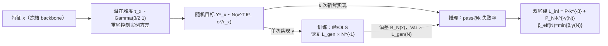

# Learning Shrinks the Hard Tail: Training-Dependent Inference Scaling in a Solvable Linear Model

**会议**: ICLR 2026  
**OpenReview**: [https://openreview.net/forum?id=KUNywR7nQx](https://openreview.net/forum?id=KUNywR7nQx)  
**代码**: 待确认  
**领域**: learning theory  
**关键词**: 神经标度律, inference-time compute, pass@k, 实例难度异质性, 可解线性模型, 算力分配  

## 一句话总结
本文用一个可解析的"潜在实例难度（LID）"线性微调模型，证明 pass@k 失败率的幂律指数 $\beta_{\text{eff}}(N)$ 是**训练相关**的——它随训练样本量 $N$ 增大而上升，最终饱和到由难度分布尾部决定的内禀上限 $\beta$，从而把训练侧标度律和推理侧标度律在一个闭式框架里统一起来。

## 研究背景与动机
- **领域现状**：神经标度律研究分成两条几乎不相交的线。训练侧用谱衰减、岭回归等工具刻画泛化损失 $L_{\text{gen}}$ 随 $N$、参数量 $P$ 的幂律下降；推理侧（test-time compute）则关注 best-of-N、重复采样、pass@k 在固定模型下随采样次数 $k$ 带来的增益。
- **现有痛点**：两条线各说各话。推理侧的理论模型通常孤立地分析推理过程，把模型当成"已训好的黑箱"，没有把"训练进展（$L_{\text{gen}}$ 的下降）"和"推理标度（pass@k 曲线的斜率）"显式耦合起来。一个基本问题悬而未决——**训练做到什么程度，会怎样改变推理时算力的回报？**
- **核心矛盾**：真实数据存在**实例级难度异质性**——有些图像标签本就模糊（标注者分歧大），有些推理题本就更难（输出方差大）。同质噪声假设忽略了这点，而恰恰是这种异质性同时支配了两个阶段：训练时每个输入只观测到一个含噪实现，推理时却要拿模型预测去匹配多次新鲜实现。
- **本文目标**：构造一个"刻意简单但可解析"的最小模型，把训练与推理通过"实例难度"这一根轴显式串起来，给出可证伪的闭式预测，并指明 test-time compute 何时有用、能走多远、如何依赖训练。
- **核心 idea**：**【难度异质 + 单尾→双尾】** 给每个实例配一个从重尾分布抽取的潜在精度 $\tau_x$（"易度"）来控制其目标方差；训练只看一个实现退化为岭/OLS 回归恢复经典泛化标度，而推理侧的单次成功概率分布会获得**两个正则变化尾部**——一个由难度分布决定的内禀尾（指数 $\beta$），一个由有限 $N$ 模型偏差决定的有限尾（指数 $\gamma(N)\propto 1/L_{\text{gen}}(N)$），二者混合给出 $\beta_{\text{eff}}(N)=\min\{\beta,\gamma(N)\}$。

## 方法详解

### 整体框架
全文围绕一个"末层线性微调 + 随机标签"的可解模型展开：冻结预训练 backbone 得到特征 $x\in\mathbb{R}^d$，只学一个线性头 $x^\top\theta$；每个实例带一个潜在精度 $\tau_x$ 控制目标围绕均值 $x^\top\theta^*$ 的方差。训练阶段每个输入只观测到一次实现 $y$，于是问题退化成岭/OLS 回归并恢复经典的 $L_{\text{gen}}$-$N$ 标度律；推理阶段用"完美验证器"做 pass@k：对每个测试输入抽 $k$ 次新鲜实现，问是否至少有一次落在预测的容差 $\delta$ 内。把训练侧的偏差分布喂进推理侧的失败概率，就推出一条连接两端的"双尾混合律"。

### 关键设计

**1. 潜在实例难度（LID）生成过程：把"难度"做成可解析的重尾先验。** 模型核心是给每个实例 $x$ 独立抽一个潜在精度 $\tau_x\sim\mathrm{Gamma}(\beta/2,\,1)$，再让目标 $Y^*_x\sim\mathcal N(x^\top\theta^*,\,\sigma_\eta^2/\tau_x)$。$\tau_x$ 越小方差越大、实例越"难"，而参数 $\beta$ 恰好控制 $\tau_x$ 在零点附近的质量：$\Pr(\tau_x\le t)\asymp t^{\beta/2}$。作者特意指出，所有支配推理标度的结论只依赖这个**近零尾指数**，换成同尾指数的其他分布结果不变——Gamma 只是为了解析方便。特征谱也设成幂律 $\sigma_j^2\propto j^{-(1+\alpha)}$ 以贴合实际的良性特征区。这一步把"实例异质难度"这个模糊概念压缩成了两个可调指数 $\beta$（难度尾）和 $\alpha$（特征谱），为后面的闭式推导铺路。

**2. 训练侧退化为岭/OLS，恢复经典双区标度。** 因为训练每个输入只看一个实现，岭目标 $L_{\text{train}}(\hat\theta)=\frac1N\sum_i(y_i-x_i^\top\hat\theta)^2+\lambda\|\hat\theta\|_2^2$ 的最小化就是标准闭式解 $\hat\theta_\lambda=(N^{-1}X^\top X+\lambda I_d)^{-1}N^{-1}X^\top y$。在有限平均目标方差假设（$\beta>2$，使有效噪声 $\sigma_{\text{noise}}^2=\sigma_\eta^2\mathbb E[1/\tau_x]=2\sigma_\eta^2/(\beta-2)$ 有限）下，高维岭/OLS 工具直接适用：过参数区（$N<d$）$L_{\text{gen}}(N)\propto P_N N^{-\alpha}$ 由谱指数主导；欠参数区（$N\gg d$）$L_{\text{gen}}(N)\propto\sigma_\eta^2\mathbb E[1/\tau_x]\,d/N$ 回到经典 $1/N$ 速率，中间 $N\approx d$ 出现 double descent 峰。关键是这个 $L_{\text{gen}}(N)$ 同时决定了实例偏差 $B_N(x):=x^\top\hat\theta_\lambda-x^\top\theta^*$ 的分布方差（$\mathrm{Var}[B_N(x)]\asymp L_{\text{gen}}(N)$），成为连接两端的桥梁。

**3. 双尾混合律：训练偏差制造一个"人造硬尾"。** 推理时第 $j$ 次试验误差 $e_j=B_N(x)-\eta_j$，单次失败概率 $p(x,\tau_x)$ 经小容差展开为 $1-p=\frac{\sqrt2}{\sqrt\pi}\frac{\delta}{\sigma_\eta}\sqrt{\tau_x}\exp\!\big(-\frac{B_N(x)^2\tau_x}{2\sigma_\eta^2}\big)$。对 $\tau_x$ 的 Gamma 先验和 $B_N(x)$ 的高斯分布做 Tauberian / Laplace–Stieltjes 变换分析，得到核心定理：

$$L_{\text{inf}}(k;N)=\tilde P\,k^{-\beta}+\tilde P_N(N)\,k^{-\gamma(N)}\big(1+o(1)\big),\qquad \gamma(N)=\Theta\!\Big(\frac{1}{\mathrm{Var}[B_N(x)]}\Big)=\Theta\!\Big(\frac{1}{L_{\text{gen}}(N)}\Big).$$

第一项是只由难度尾 $\beta$ 决定、再训也压不下去的内禀尾；第二项是有限 $N$ 偏差制造的修正——当模型均值误差还很大时，许多本不算难（$\tau_x$ 中等）的点会"表现得像硬例子"，形成一个**人造硬尾**。这正是"learning shrinks the hard tail"的机理：训练驱使 $L_{\text{gen}}(N)\downarrow$，$\gamma(N)\uparrow$，人造硬尾消失。

**4. 训练相关有效指数与算力分配规则。** 在固定 $k$ 窗口里取局部对数斜率，得到推论 $\beta_{\text{eff}}(N)=\min\{\beta,\gamma(N)\}+o(1)$，即观测到的 pass@k 斜率随 $N$ 单调逼近内禀 $\beta$，经验上拟合为饱和曲线 $\beta_{\text{eff}}(N)=\beta-\frac{\Delta}{1+c_\beta N^\nu}$。把训练律和推理律合到一个固定算力预算 $C=Nc_N+kc_k$ 下最小化 $L_{\text{tot}}=R\,L_{\text{gen}}(N)+L_{\text{inf}}(k;N)$，最优条件比常数-$\beta$ 情形多出一个 $-\beta'_{\text{eff}}(N)\ln\big((C-\tilde N)/c_k\big)$ 的对数修正项：当 $\beta_{\text{eff}}(N)$ 还在上升（$\beta'_{\text{eff}}>0$）时，这一项**抬高了训练的边际收益**，把最优分配推向更大的 $N$。于是给出直观规则——**先投训练直到 $\beta_{\text{eff}}(N)$ 接近 $\beta$（斜率饱和），之后再把算力转去多做推理尝试**。

## 实验关键数据

### 主实验（合成 LID 仿真，Fig. 1）

| 现象 | 预测 | 仿真验证 |
|------|------|----------|
| 训练泛化 $L_{\text{gen}}(N)$ | $N\gg d$ 时 $\propto N^{-1}$，含 double descent | 与 $N^{-1}$ 参考线吻合，$N\approx d$ 处见峰 |
| 推理 $L_{\text{inf}}(k;N)$ | 渐近斜率 $-\beta$ | $N$ 越大斜率越陡，趋近 $k^{-2.5}$（$\beta=2.5$） |
| 有效指数 $\beta_{\text{eff}}(N)$ | 随 $N$ 上升并饱和于 $\beta$ | 拟合 $\nu=1.62$，平台落在 $\beta=2.5$ |

（参数 $\lambda=10^{-9}$, $\sigma_\eta=10^{-3}$。）

### 真实数据代理实验

| 实验 | 设置 | 关键观测 |
|------|------|----------|
| CIFAR-10H（Fig. 3） | 冻结 ResNet-18，线性头微调；人类标注分歧当作实例噪声 | $L_{\text{gen}}$ 在 $N\approx d$ 转折后 $\sim 1/N$；$\beta_{\text{eff}}(N)$ 由 ~0.16 上升饱和到 $\beta\approx0.27$ |
| GSM8K 师生蒸馏（Fig. 4） | Flan-T5-XL 教师→Flan-T5-small 学生，LoRA(r=8)，$N\in[10,6309]$ | 严格 greedy 训练损失随 $N$ 缓降；$L_{\text{inf}}(k;N)$ 变陡，$\hat\beta_{\text{eff}}(N)$ 上升后饱和 |

### 关键发现
- **两个指数职能不同**：$\beta$ 是难度分布固有、训练无法改进的"天花板"；$\gamma(N)$ 是有限 $N$ 罚项，随训练消失。
- **算力分配会随训练阶段移动**：在有限 $N$、$\beta_{\text{eff}}$ 仍上升的区域，最优策略比常数-$\beta$ 基线更偏向投训练（Fig. 2 等高线明显向大 $N$ 偏移）。
- **机理在偏离理想假设时依然稳健**：CIFAR-10H 的经验难度分布并非严格 Gamma、$\tau_x$ 与 $x$ 也未必独立，但训练相关的推理指数现象照样出现。

## 亮点与洞察
- **把两套标度律缝在一根轴上**：用"实例难度异质性"这一物理上自然的量，把训练侧 $L_{\text{gen}}$ 和推理侧 pass@k 显式耦合，填补了"训练进展如何塑造推理标度"的理论空白。
- **可证伪的闭式预测**：双尾混合律、$(N,k)$ 平面上的交叉面、饱和的 $\beta_{\text{eff}}(N)$ 曲线、即使斜率饱和后前因子仍随 $N$ 改善——这些都是可在仿真和真实数据上对照检验的定量结论。
- **"硬尾收缩"是个很有画面感的物理图像**：训练把误差质量从"看似难"的大量实例上挤走，只留下真正内禀难的少数实例，直到不可约的实例随机性接管，推理指数饱和。
- **给 test-time compute 划了边界**：明确指出推理算力的回报有上限（由 $\beta$ 封顶），且这个上限的逼近速度取决于训练——为"先训练还是先多采样"提供了原理性依据。

## 局限与展望
- **模型刻意简化**：末层线性回归 + 固定特征 + 高斯目标，离真实自回归 LLM 的 pass@k（抽模型输出而非目标实现）有距离；作者在附录论证两种随机性只影响常数不影响指数，但这是渐近意义下的等价。
- **$\tau_x$ 与 $x$ 独立、Gamma 先验**都是为解析方便所设；允许相关性、换其他重尾分布主要影响常数与交叉位置而非指数，但真实分布的具体形态仍需更系统验证。
- **真实数据代理偏"小规模"**：CIFAR-10H 线性头、GSM8K 小学生蒸馏都属可控玩具设置；GSM8K 的训练损失因数值尺度不一而不稳定，只能看趋势。
- **展望**：把分析推广到非线性/多层、把"完美验证器"换成带噪验证器、以及在真实大模型 best-of-N 上检验"先训后采"的分配规则，都是自然的下一步。

## 相关工作与启发
- **泛化标度律**（Kaplan 2020; Hestness 2017; Maloney 2022; Bahri 2021 等）提供了本文训练侧的 $L_{\text{gen}}$-$N$ 基础；高维岭/OLS 与 double descent 分析（Bartlett 2020; Hastie 2020; Belkin 2019）是训练侧推导的工具。
- **推理时算力标度**（Snell 2024; Brown 2024）确立了 pass@k / best-of-N 的经验增益；已有理论（Levi 2024; Schaeffer 2025）多孤立分析推理，本文的差异点正是把训练进展显式接进来。
- **标签异质性 / 标注分歧**（Peterson 2019 CIFAR-10H; Northcutt 2021; Arpit 2017）为"实例难度"提供了真实世界的对应物，也是本文真实数据代理实验的来源。
- **启发**：对做 test-time scaling 的工程实践，这篇给了一个清晰的心智模型——pass@k 斜率不是模型固有常数，而会随你训得多好而变陡；在斜率饱和前，多花的训练算力比直觉更值钱。

## 评分
- **新颖性**: ⭐⭐⭐⭐⭐ 首次给出连接训练进展与推理标度的可解析模型，"训练相关 pass@k 指数 + 双尾律"是干净而原创的理论贡献。
- **实验充分度**: ⭐⭐⭐ 仿真精准验证了全部预测，但真实数据仅 CIFAR-10H 线性头与 GSM8K 小模型蒸馏两个玩具代理，规模与代表性有限。
- **写作质量**: ⭐⭐⭐⭐ 动机—模型—定理—验证的链条清晰，"硬尾收缩"的物理图像表达到位，公式与结论对应明确。
- **价值**: ⭐⭐⭐⭐ 为 train-vs-inference 算力分配提供了有原理依据的规则，对理解 test-time compute 的边界有实际指导意义。

<!-- RELATED:START -->

## 相关论文

- [\[ICLR 2026\] Resurfacing the Instance-only Dependent Label Noise Model through Loss Correction](resurfacing_the_instance-only_dependent_label_noise_model_through_loss_correctio.md)
- [\[ICLR 2026\] Best-of-Majority: Minimax-Optimal Strategy for Pass@k Inference Scaling](best-of-majority_minimax-optimal_strategy_for_passk_inference_scaling.md)
- [\[ICLR 2026\] Variational Inference for Cyclic Learning](variational_inference_for_cyclic_learning.md)
- [\[ICLR 2026\] How hard is learning to cut? Trade-offs and sample complexity](how_hard_is_learning_to_cut_trade-offs_and_sample_complexity.md)
- [\[ICLR 2026\] Scaling Laws and Spectra of Shallow Neural Networks in the Feature Learning Regime](scaling_laws_and_spectra_of_shallow_neural_networks_in_the_feature_learning_regi.md)

<!-- RELATED:END -->
