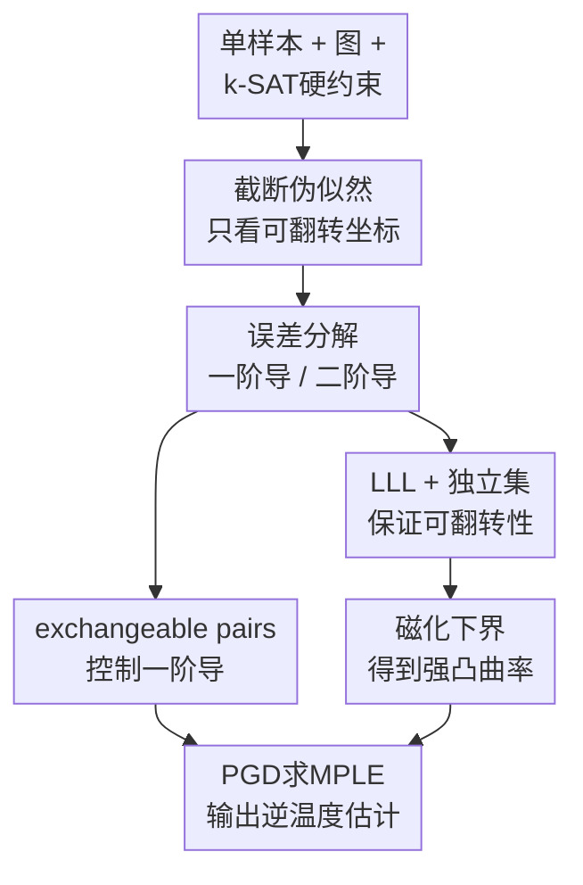

# Learning the Inverse Temperature of Ising Models under Hard Constraints using One Sample

**会议**: ICLR2026  
**OpenReview**: [https://openreview.net/forum?id=DyDTtBUBEd](https://openreview.net/forum?id=DyDTtBUBEd)  
**论文**: [OpenReview](https://openreview.net/forum?id=DyDTtBUBEd)  
**代码**: 无  
**领域**: 学习理论 / 图模型 / 统计学习  
**关键词**: Ising模型、逆温度估计、硬约束、伪似然、单样本学习  

## 一句话总结
这篇论文研究在已知有界度图和 k-SAT 硬约束截断集合下，如何仅凭一个样本估计 Ising 模型的逆温度参数，并证明基于最大伪似然的投影梯度算法能以近线性时间达到 $O(\Delta^3 / \sqrt{n})$ 的一致性误差。

## 研究背景与动机
**领域现状**：Ising 模型是马尔可夫随机场里最经典的一类模型，用图 $G=(V,E)$ 描述变量之间的成对相互作用，用逆温度 $\beta$ 控制自旋配置的相关强度。过去单样本估计已经形成了一条比较清楚的路线：给定一张图和一个来自 Ising 分布的配置 $\sigma$，用最大伪似然估计器（MPLE）恢复 $\beta$，在无截断、支持集完整的情形下可以得到一致估计。

**现有痛点**：真实系统经常不是“所有配置都可行”。空间转录组、通信信道分配、网络多播等场景里，某些组合会被硬规则直接禁止，分布只落在一个可行集合 $S \subseteq \{\pm 1\}^n$ 上。这样的截断会把超立方体切成很多不连通的小岛，普通 Ising 模型里依赖 Glauber dynamics、log-Sobolev 或 Dobrushin 条件的集中工具不再好用；即使只有一个样本，也很难判断这个样本附近是否有足够多的可翻转邻居来支撑伪似然曲率。

**核心矛盾**：单样本估计需要从一个局部配置里挤出全局参数信息，而硬约束又恰好会破坏局部可动性。如果某个坐标翻转后不再满足约束，那么这个坐标对条件似然没有贡献；如果大量坐标都不可翻转，伪似然目标可能几乎没有曲率，最大化它也就无法稳定定位真实 $\beta^*$。

**本文目标**：作者把截断集合写成一个有界变量度的 k-SAT 公式 $\Phi$ 的满足赋值集合，研究在图最大度 $\Delta$、公式变量度 $d$、子句长度 $k$ 之间满足什么条件时，可以从单个样本中一致估计逆温度。更具体地说，论文需要同时回答三个问题：伪似然梯度在真实参数处是否足够小，伪似然 Hessian 是否足够大，最大化伪似然能否用多项式、最好近线性的算法完成。

**切入角度**：本文的观察是，硬约束真正伤害估计的地方不是“约束存在”本身，而是样本附近的一步 Hamming 邻居太少。若能证明在 k-SAT 公式足够“宽”的条件下，典型样本仍有线性数量的 flippable 坐标，并且这些坐标的局部磁化 $m_i(\sigma)$ 不会整体塌掉，那么伪似然的二阶导数就能保留下来。

**核心 idea**：用最大伪似然把单样本逆温度估计转化为一维凸优化，再用 Lovász Local Lemma、独立集构造和 exchangeable pairs 同时控制硬约束下的可翻转性与伪似然导数。

## 方法详解

### 整体框架
本文处理的是一个已知图结构的参数估计问题。输入包括单个样本 $\sigma \in S$、图 $G$ 的邻接矩阵 $A$、表示截断集合 $S$ 的 k-SAT 公式 $\Phi$，输出是逆温度 $\beta^*$ 的估计值 $\hat{\beta}$。方法表面上很简单：枚举哪些坐标可翻转，写出负 log-pseudolikelihood，求它在区间 $[-B,B]$ 内的最小点；真正的工作在于证明这个目标在截断支持上仍然足够有信息。

形式上，截断 Ising 模型为

$$
\Pr_{\beta,S}(\sigma)=\frac{1}{Z_{\beta,S}}\exp(\beta \sigma^\top A\sigma)\mathbf{1}\{\sigma \in S\}.
$$

对一个坐标 $i$，若 $(\sigma_i,\sigma_{-i})$ 与 $(-\sigma_i,\sigma_{-i})$ 都在 $S$ 中，就称 $i$ 是 flippable。只有这些坐标会进入伪似然目标，因为不可翻转坐标在截断条件下的条件概率退化为 1。设 $F(\sigma)$ 为所有可翻转坐标，局部磁化为 $m_i(\sigma)=\sum_j A_{ij}\sigma_j$，负 log-pseudolikelihood 写成

$$
\phi(\beta;\sigma)=\sum_{i\in F(\sigma)}\left[\log\left(\exp(-\beta m_i(\sigma))+\exp(\beta m_i(\sigma))\right)-\beta m_i(\sigma)\sigma_i\right].
$$

算法层面，论文用投影梯度下降在 $[-B,B]$ 上优化归一化目标 $n^{-1}\phi(\beta;\sigma)$。理论层面，作者先证明估计误差可由一阶导和二阶导夹住，再分别证明 $\phi_1(\beta^*;\sigma)$ 规模为 $O(\sqrt{n})$，而 $\phi_2(\beta;\sigma)$ 在整个参数区间内至少为 $\Omega(n/\Delta^3)$ 量级。两者合并后得到 $|\hat{\beta}-\beta^*|=O(\Delta^3/\sqrt{n})$。

### 关键设计
**1. 截断伪似然：只让真正可翻转的坐标贡献信息**

硬约束下最容易犯的错误，是继续把普通 Ising 的所有单点条件概率都拿来相乘。本文没有这样做，而是显式区分可翻转与不可翻转坐标：如果翻转 $i$ 后仍满足 k-SAT 公式，那么 $i$ 的条件概率仍有标准 logistic 形态；如果翻转后违反约束，那么在截断分布里该坐标的条件概率已经被约束固定，对估计 $\beta$ 没有可用曲率。

这个处理让伪似然目标准确对齐截断支持的局部几何。对 $i\in F(\sigma)$，条件概率由 $m_i(\sigma)$ 和 $\beta$ 决定，梯度与 Hessian 分别包含

$$
\phi_1(\beta;\sigma)=\sum_{i\in F(\sigma)}m_i(\sigma)(\tanh(\beta m_i(\sigma))-\sigma_i),
$$

$$
\phi_2(\beta;\sigma)=\sum_{i\in F(\sigma)}\frac{m_i(\sigma)^2}{\cosh^2(\beta m_i(\sigma))}.
$$

这两个式子也暴露了全文的技术核心：一阶导要集中到较小规模，二阶导要靠足够多的 flippable 坐标和非零磁化撑起来。换句话说，论文不是重新发明估计器，而是证明经典 MPLE 在硬约束局部支持上仍然没有失效。

**2. 导数夹逼：把估计一致性压缩成一阶小、二阶大的问题**

论文使用一维凸优化里非常干净的一步：由于 $\hat{\beta}$ 是 MPLE，目标在 $\hat{\beta}$ 处的一阶导为 0；沿着 $\beta^*$ 到 $\hat{\beta}$ 的线段做积分，可以得到

$$
|\hat{\beta}-\beta^*|\leq \frac{|\phi_1(\beta^*;\sigma)|}{\min_{\beta\in(-B,B)}\phi_2(\beta;\sigma)}.
$$

这个式子把复杂的统计估计问题拆成两个可验证的局部性质。第一项 $|\phi_1(\beta^*;\sigma)|$ 表示真实参数处伪似然梯度偏离 0 的随机波动；第二项表示目标曲率是否足够强，防止不同 $\beta$ 在单样本上看起来几乎一样。作者用 exchangeable pairs 控制一阶导方差，得到高概率 $O(\sqrt{n})$ 上界；更难的是二阶导，因为它依赖硬约束下有多少坐标还能翻。

这个设计的价值在于它没有试图估计配分函数 $Z_{\beta,S}$，也没有要求在截断集合上采样或遍历所有满足赋值。所有统计证明都围绕局部条件概率展开，最终算法只需要单个样本的局部磁化和对 k-SAT 公式的满足性检查。

**3. LLL 与独立集：在破碎支持集里找回足够多的一步邻居**

为了让 Hessian 不退化，作者必须证明典型样本附近有很多 flippable 坐标。困难在于 Ising 相互作用会引入长程相关，k-SAT 截断又会让支持集碎裂，普通独立同分布或快速混合工具都靠不住。论文的做法是构造一个图上的独立集 $I$，并要求 $I$ 在每个 k-SAT 子句里覆盖一个线性比例的变量。

具体来说，作者用随机排列生成独立集：一个顶点若在其邻居中排序最大，就被选入 $I$。距离至少 3 的顶点选择事件相互独立，因此可以对每个子句中相互两跳分离的变量使用 Chernoff bound，再用对称 Lovász Local Lemma 排除“某个子句被 $I$ 覆盖太少”的坏事件。由此得到一个条件：当

$$
k>10\Delta^3(1+\log(dk\Delta^2))
$$

时，存在独立集 $I$，使得把 $V\setminus I$ 条件化后，剩下公式仍保留足够长的子句。这个独立集不是算法输出的重点，而是证明里的支架：它把原本带相互作用的 Ising 模型局部化成更接近产品分布的结构，从而能分析每个坐标是否仍可翻转。

在主定理里，作者需要更强的子句长度条件，大致为

$$
k\geq \frac{4\Delta^3(1+\log(d^2k+1))}{\log(1+\exp(-2B))}.
$$

这个条件随着 $B$、$\Delta$、$d$ 变大而变苛刻，直观上也合理：低温、强相关或约束更密时，必须让每个子句更“宽”，才能保证硬约束不会把单点翻转空间彻底堵死。

**4. 强凸曲率与 PGD：把理论下界转成近线性估计算法**

有了 flippability 还不够，Hessian 中每一项还乘着 $m_i(\sigma)^2$。若大量可翻转坐标的局部磁化接近 0，目标曲率仍可能很弱。论文进一步通过条件期望和 coupling 论证，证明磁化平方在可翻转事件下能贡献一个与 $\Delta$、$d$、$k$ 有关的正下界，最终得到高概率二阶导下界

$$
\phi_2(\beta;\sigma)\geq \frac{n\exp(-B)}{\Delta^3(8kd)^2}
$$

（常数和分母形式以原文定理为准）。这一步把“硬约束下有局部邻居”升级为“伪似然目标在参数方向上强凸”。

算法上，作者在区间 $[-B,B]$ 内运行投影梯度下降。先扫描所有坐标，检查翻转后是否仍满足 $\Phi$，得到 $F(\sigma)$；再迭代更新

$$
\beta_{t+1}=\Pi_{[-B,B]}\left(\beta_t-\eta\nabla n^{-1}\phi(\beta_t;\sigma)\right).
$$

由于归一化目标的梯度 Lipschitz 常数可控，强凸参数约为 $\Omega(1/\Delta^3)$，条件数为 $O(\Delta^3)$。把优化精度设到统计误差以下即可，整体复杂度为 $O(\Delta^3 n\log n)$，在有界度图上就是近线性时间。

### 损失函数 / 训练策略
这篇论文没有神经网络训练，也没有经验风险最小化意义上的 loss；它的“训练目标”就是截断模型上的负 log-pseudolikelihood。核心优化策略是 projected gradient descent，初始化 $\beta_0=0$，步长取 $\eta=1$，每次更新后投影回 $[-B,B]$。停止条件是归一化梯度大小降到 $1/\sqrt{n}$ 以下，因为继续优化到更高精度也不会突破单样本统计误差。

伪代码可概括为三步。第一步，对每个坐标 $i$ 检查 $(-\sigma_i,\sigma_{-i})$ 是否仍满足 k-SAT 公式，收集 $F(\sigma)$。第二步，用 $F(\sigma)$ 中的坐标计算梯度

$$
-\frac{1}{n}\sum_{i\in F(\sigma)}m_i(\sigma)(\sigma_i-\tanh(\beta_t m_i(\sigma))).
$$

第三步，按 PGD 更新并投影。论文强调该算法不需要枚举截断集合 $S$，因此即使 $S$ 在 $2^n$ 中极小，只要能检查 k-SAT 满足性并计算局部磁化，就能运行估计器。

## 实验关键数据

### 主实验
这是一篇理论论文，没有常规数据集 benchmark；“主实验”对应的是主定理给出的可估计条件、误差率和运行时间。下面把论文的核心结论按可读形式整理出来。

| 设定 | 条件 / 假设 | 结论 | 含义 |
|------|-------------|------|------|
| 截断 Ising 单样本估计 | 已知图 $G$，最大度 $\Delta=o(n^{1/6})$，$A_{ij}=\pm 1/\Delta$，$\beta^*\in(-B,B)$ | 存在 MPLE 估计器 $\hat{\beta}$ | 图结构已知，只估计逆温度 |
| k-SAT 硬约束 | $S$ 是变量度至多 $d$ 的 k-SAT 公式满足赋值集合，$k$ 满足 $\Omega(\Delta^3\log(d^2k))$ 级别条件 | 硬约束下仍可一致估计 | 子句足够长时，局部可翻转性不会消失 |
| 统计误差 | 单个样本 $\sigma\sim \mu_{G,\beta^*,S}$ | $|\hat{\beta}-\beta^*|\leq c\Delta^3/\sqrt{n}$，高概率成立 | 在固定 $\Delta$ 下误差随 $n$ 消失 |
| 计算复杂度 | PGD 优化归一化伪似然 | $O(\Delta^3 n\log n)$ | 有界度图上近线性时间 |

从结论看，本文最关键的数量关系是 $\Delta$。它同时进入可估计条件、强凸参数和最终误差率：图越稠密，单个坐标的局部依赖越复杂，独立集和 flippability 证明越困难，算法条件数也越差。作者要求 $\Delta=o(n^{1/6})$，从而保证 $\Delta^3/\sqrt{n}=o(1)$。

### 消融实验
论文没有做经验消融，但理论证明本身可以拆成若干必要模块；少掉其中任意一个，主定理都无法闭合。

| 证明模块 | 关键指标 / 结论 | 如果去掉会发生什么 |
|----------|-----------------|--------------------|
| 伪似然导数误差分解 | $|\hat{\beta}-\beta^*|\leq |\phi_1(\beta^*)|/\min\phi_2$ | 无法把估计一致性转化为可证明的局部导数条件 |
| exchangeable pairs 控制一阶导 | $|\phi_1(\beta^*;\sigma)|=O(\sqrt{n})$ 高概率成立 | 真实参数处梯度可能随机偏得太远，MPLE 位置无法保证 |
| LLL + 独立集保证 flippability | 典型样本有足够多可翻转坐标 | Hessian 的求和支撑可能太小，伪似然目标退化 |
| 磁化平方下界 | $\phi_2(\beta;\sigma)=\Omega(n/\Delta^3)$ 量级 | 即使坐标可翻转，也可能没有足够曲率区分不同 $\beta$ |
| PGD 优化分析 | $O(\Delta^3 n\log n)$ 时间达到统计精度 | 只有存在性结果，缺少可执行估计算法 |

### 关键发现
- 硬约束不是绝对障碍；真正需要的是样本附近仍有足够多的一步可行邻居。k-SAT 子句越长，变量越不容易被某个子句“卡死”，这给单点条件概率留下了统计信息。
- 伪似然的优势在这里很明显：它绕开了截断配分函数 $Z_{\beta,S}$，只依赖局部翻转检查和局部磁化。对 $S$ 极小或不连通的情形，这比试图估计全局似然现实得多。
- 依赖 $\Delta^3$ 是结果里最重的代价。它既来自独立集覆盖和两跳邻域控制，也来自曲率下界和优化条件数；作者在结论中也把削弱这个依赖列为未来问题。
- 本文处理所有 $\beta\in O(1)$，包括低温和可能超过临界阈值的区域。这一点重要，因为很多无截断分析依赖的快速混合或集中工具正是在低温区失效。

## 亮点与洞察
- 最大的亮点是把硬约束下的“局部可移动性”变成可证明对象。flippable 坐标这个概念很自然，但要在非产品、低温、截断的 Ising 分布下证明它线性存在，需要把 k-SAT 公式结构、图独立集和 LLL 拼在一起。
- 论文很好地复用了 MPLE 的经典思想，却没有停在“套用伪似然”层面。它清楚指出截断后普通支持集上的条件概率会退化，因此必须只在可翻转坐标上构造目标，这个细节决定了理论是否自洽。
- 技术上有一个很漂亮的视角：硬约束会让 Glauber dynamics 在全局上非遍历，但本文并不需要让链混合，而是只证明样本局部有足够多可行的一步翻转。这是从“全局采样困难”退到“局部统计信息仍存在”的有效降维。
- 对其他截断图模型也有启发。只要能找到类似的局部可翻转事件、证明局部曲率不塌，就可能把单样本伪似然估计推广到更多带组合约束的马尔可夫随机场。

## 局限与展望
- 结果依赖较强的结构假设：图必须连通、最大度满足 $\Delta=o(n^{1/6})$，边权幅度固定为 $1/\Delta$，截断集合必须由有界变量度的 k-SAT 公式表示。真实图模型里的异质边权和更一般约束还没有覆盖。
- k-SAT 子句长度条件偏强，特别是包含 $\Delta^3$、$d$ 和 $B$ 的依赖。低温或约束密集时，要求子句足够长才保证可翻转性，这可能限制了理论在非常紧约束系统中的适用性。
- 论文没有给出经验模拟来展示有限样本常数大小。主定理是渐近高概率结果，实际 $n$ 多大时 PGD 估计会稳定、$k$ 条件有多保守，还需要实验或更细的常数分析。
- 当前只估计单一逆温度 $\beta$，图结构和交互矩阵已知。更贴近机器学习的任务通常还要同时学习结构、边权或外场项；这些扩展在截断支持上会明显更难。
- 作者提出的后续问题包括：随机 Hamiltonian 是否能缓解 $\Delta$ 依赖，未截断图模型里的 logistic regression 技巧能否迁移到硬约束场景，以及能否同时去掉 $\Delta=o(n^{1/6})$ 假设并改进一致性速率。

## 相关工作与启发
- **vs Chatterjee / Besag 的单样本 MPLE**: 经典路线在完整支持的 Ising 模型上用伪似然估计逆温度，本文继承这个估计器思想，但把条件概率重写到截断支持上，并额外证明硬约束下的曲率不会消失。
- **vs Dagan et al. 的无截断 Ising 学习**: Dagan 等工作可借助完整超立方体上的集中和混合性质分析伪似然；本文面对的是不连通甚至碎裂的截断集合，因此必须换成 LLL、独立集和 exchangeable pairs 的局部证明。
- **vs Galanis et al. 的截断产品分布学习**: Galanis 等处理的是截断 Boolean product distribution，变量本身没有 Ising 相互作用；本文多了一层图依赖，既要处理 k-SAT 约束相关性，也要处理 Ising 模型内部相关性。
- **vs 硬核模型 / 图着色等硬约束学习**: 那些模型通常围绕特定组合结构展开，本文则给出一个更一般的“k-SAT 表示截断集合 + 伪似然估计参数”的框架，对带逻辑约束的图模型有更直接的抽象意义。

## 评分
- 新颖性: ⭐⭐⭐⭐☆ 把单样本 Ising 逆温度估计推进到 k-SAT 硬约束截断场景，问题设定和证明组合都比较新。
- 实验充分度: ⭐⭐☆☆☆ 理论证明扎实，但没有数值实验或模拟验证，有限样本表现只能从定理间接判断。
- 写作质量: ⭐⭐⭐⭐☆ 主线清楚，导数分解和 flippability 证明路线交代充分；部分常数条件和附录证明较密，需要读者有概率方法背景。
- 价值: ⭐⭐⭐⭐☆ 对统计学习理论、图模型和带组合约束的概率推断都有参考价值，尤其适合后续研究更一般的截断 MRF 单样本估计。

<!-- RELATED:START -->

## 相关论文

- [\[ICLR 2026\] How hard is learning to cut? Trade-offs and sample complexity](how_hard_is_learning_to_cut_trade-offs_and_sample_complexity.md)
- [\[ICLR 2026\] A Sharp KL Convergence Analysis for Diffusion Models under Minimal Assumptions](a_sharp_kl_convergence_analysis_for_diffusion_models_under_minimal_assumptions.md)
- [\[ICLR 2026\] Tokenisation over Bounded Alphabets is Hard](tokenisation_over_bounded_alphabets_is_hard.md)
- [\[ICLR 2026\] Subquadratic Algorithms and Hardness for Attention with Any Temperature](subquadratic_algorithms_and_hardness_for_attention_with_any_temperature.md)
- [\[ICLR 2026\] Physics-informed learning under mixing: How physical knowledge speeds up learning](physics-informed_learning_under_mixing_how_physical_knowledge_speeds_up_learning.md)

<!-- RELATED:END -->
