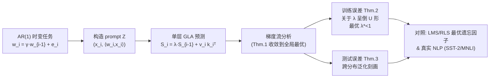

# Learning to Adapt: In-Context Learning Beyond Stationarity

**会议**: ICLR 2026  
**OpenReview**: [https://openreview.net/forum?id=giA3v1Lo0G](https://openreview.net/forum?id=giA3v1Lo0G)  
**代码**: 待确认  
**领域**: learning_theory  
**关键词**: in-context learning, gated linear attention, non-stationarity, recency bias, gradient flow, linear regression  

## 一句话总结
本文给出了**非平稳（时变）回归**下 in-context learning 的首个理论刻画：证明门控线性注意力（GLA）通过一个可学习的遗忘因子 $\lambda$ 实现"可学习的近因偏置"，在回归权重随一阶自回归过程漂移时，训练/测试误差都严格低于标准线性注意力，且最优 $\lambda<1$。

## 研究背景与动机

**领域现状**：近年大量理论工作开始揭开 in-context learning（ICL）的机制黑箱，主流结论是——线性注意力可以在前向计算中隐式模拟"一步梯度下降"，从而在监督回归任务上实现 ICL（Akyürek 2022、von Oswald 2023、Zhang 2024 等）。这条线把"架构组件"与"它隐式执行的学习算法"对应了起来。

**现有痛点**：几乎所有这些分析都建立在一个强假设上——**任务分布是平稳的**，即 prompt 中所有样本和 query 共享同一个固定的回归权重 $w$。但现实中的时间序列预测、流式数据、自然语言都是**非平稳**的：目标函数随时间演化，越近的样本越相关（近因偏置）。在这种场景下标准线性注意力常常失效，于是 GLA、RetNet、Mamba-2 等带门控/状态衰减的变体被提出并取得了好效果，但**为什么门控有用，缺乏严格的 ICL 理论解释**。

**核心矛盾**：平稳假设下"线性注意力≈一步 GD"的优雅结论，无法解释门控机制在非平稳序列上的经验优势——理论与实践之间存在一道鸿沟。

**本文目标**：在可严格分析的非平稳回归模型下，刻画 GLA 相对标准线性注意力的优势，并把它解释为一种内生的、可学习的适应能力。

**核心 idea**：**用一阶自回归过程建模非平稳性**——让回归权重 $w_i=\gamma w_{i-1}+e_i$ 随 token 缓慢漂移；在此模型上证明 GLA 的遗忘因子 $\lambda$ 充当**可学习的记忆衰减**，等价于自适应滤波里的最优遗忘因子，从而把"门控有用"翻译成"近因偏置能逼近时变最优预测器"。

## 方法详解

### 整体框架
本文不提出新模型，而是搭一个"可解析的玩具世界"来分析现有架构：用 AR(1) 过程生成时变线性回归任务（权重逐 token 漂移），把单层 GLA 写成对历史 token 外积的指数加权累加，再用梯度流分析其训练动态、训练误差与测试误差，最后把结论与经典自适应滤波（LMS/RLS）和真实 NLP 任务对照。下图给出分析骨架。

### 关键设计

**1. 一阶自回归非平稳任务模型：把"时变"变成可解析的对象。** 现有 ICL 理论都假设 prompt 内权重固定 $w$，本文则让每个位置的标签由各自的权重生成 $y_i=\langle w_i,x_i\rangle$，并令权重沿随机游走演化 $w_i=\gamma w_{i-1}+e_i$，其中 $0<\gamma\le 1$ 是自回归系数（控制时间相关性），$e_i\sim\mathcal N(0,\sigma_e^2 I)$ 是漂移噪声。$\gamma\to1$ 退化回经典平稳设定，$\gamma$ 越小任务漂移越剧烈。配合 $x_i\sim\mathcal N(0,\Lambda)$、$w_0\sim\mathcal N(0,\sigma_w^2 I)$ 的高斯假设，这个模型既保留了非平稳的本质，又让训练/测试误差能写出**精确闭式**而非松上界——这是后续所有定理能"算到底"的前提，也直接对应信号处理里广泛使用的随机游走模型。

**2. GLA = 指数加权累加 = 可学习的近因偏置。** 把单层 GLA 的状态递推 $S_i=\lambda S_{i-1}+v_i k_i^\top$ 展开，query 位置的输出可写成对历史 token 外积的**指数加权求和**：
$$o_{n+1}=W_V\Big(\sum_{i=1}^{n+1}\lambda^{\,n+1-i} z_i z_i^\top\Big)W_K^\top W_Q\, z_{n+1}.$$
关键观察是：当 $\lambda=1$ 时权重退化为均匀累加 $\sum z_i z_i^\top=ZZ^\top$，GLA 就**精确退化为标准线性注意力**；而 $\lambda<1$ 让越久远的 token 被 $\lambda^{n+1-i}$ 几何衰减地"遗忘"。因此 GLA 相对线性注意力的全部增量，就浓缩在这一个**可学习的记忆衰减/近因偏置**上——它正是非平稳序列最需要的归纳偏置。作者为了可分析进一步用了单一全局 $\lambda$（而非原版 GLA 的逐 token 数据相关门控），并把 $W_Q,W_K$ 合并为 $W_{KQ}$，论证最终预测只依赖 $W_V$ 的末行与 $W_{KQ}$ 的前 $d$ 列。

**3. 梯度流收敛到闭式全局最优。** 在 Assumption 1 的初始化（$W_V,W_{KQ}$ 取特定低秩结构、尺度 $\sigma$ 足够小）下，定理 1 证明：即便任务非平稳，对总体损失做梯度流仍**收敛到全局最小**，且最优解有显式表达 $\lim_{t\to\infty}W_{KQ}\propto \tilde\Lambda^{-1}$，其中 $\tilde\Lambda$ 是由 $\lambda,\gamma$ 和噪声统计量决定的"有效协方差"。这个闭式解把全局最优的位置直接参数化为 $\lambda,\gamma$ 的函数，是后面算误差的支点；当 $\lambda=\gamma=1,\sigma_e^2=0$ 时它精确退回平稳设定（Zhang 2024）的已知结论，说明本文是其严格推广。

**4. 训练误差关于 $\lambda$ 呈倒 U 形 → 最优 $\lambda^*<1$。** 把全局最优代回，定理 2 给出训练误差的精确表达式；在 $\Lambda=I$、$d$ 较大的特例下可约化为 $\xi(\lambda)=D_1^2/D_2$。作者分两种 regime（信号主导 $\sigma_e\ll\sigma_w$、长序列噪声主导）证明 $\xi(\lambda)$ 在 $(0,\gamma)$ 上单调增、在 $(\gamma,1)$ 上单调减——即误差对 $\lambda$ 呈**倒 U 形**，最优遗忘因子取在 $\lambda^*<1$ 而非 $\lambda=1$。这给"为什么要遗忘、遗忘多少"一个定量答案：漂移越快（$\gamma$ 越小）越该多遗忘。值得注意的是，尽管 $\lambda,\gamma$ 在公式里结构对称，最优却**不一定**取 $\lambda=\gamma$，因为噪声项与 $\tilde\Lambda^{-1}$ 的 trace 项之间存在微妙平衡。定理 3 进一步把分析延伸到训练/测试分布不同（序列长度、动态、分布都可变）的泛化误差，并指出由于任务演化噪声的存在，测试误差**存在不可约下界**——这恰恰是 GLA 软性整合历史信息相对硬参数更新（LMS/RLS）的价值所在。

## 实验关键数据

### 主实验：合成 AR(1) 回归 + 真实 NLP

| 设定 | 对比 | 关键结果 |
|------|------|----------|
| 单层 GLA，变 $\gamma,\lambda$（$d{=}10,n{=}100$） | 不同 $\lambda$ | 训练/测试损失随 $\lambda$ 呈倒 U 形，最优 $\lambda^*<1$；$\gamma$ 越小、噪声影响越大，越需要合适的 $\lambda$（验证 Thm.2/3） |
| 单层 GLA vs LMS / RLS（序列长 1000，1 万次 MC） | 经典自适应滤波 | GLA 训练误差更低；如 $\gamma{=}0.8$ 时 LMS=0.264、RLS=0.256，GLA 更低，且权重跨序列共享、无需逐序列重训 |
| GatedLinearGPT2 vs LinearGPT2（SST-2 情感分类，$K{\in}\{1,5,10,15,20\}$ demos） | 线性注意力 | $\lambda{=}0.9$ 的 GLA 在准确率与置信度上均明显优于 LA |
| GatedLinearGPT2 vs LinearGPT2（MNLI 自然语言推理，$K{\in}\{1,3,5,7,10\}$） | 线性注意力 | GLA 一致地获得更高准确率与置信度 |

### 消融：网络深度

| 变量 | 现象 | 结论 |
|------|------|------|
| GLA 层数（$\gamma{=}0.95$） | 层数增加，训练/测试性能持续提升 | 多层 GLA 像多个不同时间尺度的自适应滤波器叠加，可同时捕捉短期波动与长期趋势 |
| 收敛性（单层最优 $\lambda$ / 多层 $\lambda{=}0.85$） | 单层与多层均呈线性收敛 | 门控机制稳定了跨层梯度传播（多层收敛理论留待将来） |

### 关键发现
- **遗忘是有最优量的**：最优 $\lambda^*$ 显著小于 1，且随任务漂移加剧（$\gamma$ 减小）而减小——理论与实验一致。
- **门控 = 隐式自适应滤波**：单层 GLA 在 AR(1) 上的行为对应一个自适应滤波器，但因权重跨序列共享、表达力更高，误差低于需逐序列重训的 LMS/RLS。
- **漂移越剧烈差距越大**：随 $\gamma$ 从 0.8 升到 0.975，LMS/RLS 误差快速恶化（如 RLS 在 $\gamma{=}0.975$ 升至 1.29），而 GLA 凭跨序列共享与门控仍保持更低误差，体现其在强非平稳下的鲁棒性。
- **结论迁移到真实语言任务**：在 SST-2 / MNLI 上把 GPT-2 的 softmax 注意力换成 GLA 即胜过线性注意力，说明"非平稳→需要近因门控"的洞察不止于玩具模型。
- **测试误差有不可约下界**：任务演化噪声使 $\mathbb E[(\tilde y_{m+1}-y_{m+1})^2]$ 天然非零，这正解释了为何需要软性门控来逼近（而非追求零误差）。
- 实验用随机高斯初始化即复现理论预测，说明定理对初始化的限制在实践中并非必要。

## 亮点与洞察
- **把"门控为什么有用"翻译成一句可证明的话**：门控 $=$ 可学习的记忆衰减 $=$ 近因偏置，恰好是非平稳序列的最优归纳偏置；$\lambda=1$ 时严格退化为线性注意力，使得"GLA vs LA"的比较干净可解。
- **倒 U 形误差曲线**是最漂亮的定量结论：它告诉你"既不能不遗忘（$\lambda{=}1$），也不能遗忘过头"，最优点由任务漂移速度决定，与自适应滤波里最优遗忘因子/步长的经典直觉完全对齐。
- **架起 ICL 与自适应信号处理两个社区的桥**：GLA 用前向计算"隐式自适应"，而 LMS/RLS 靠显式参数更新——同一个最优遗忘因子现象，两种实现，提供了理解非平稳学习的新视角。
- **多时间尺度解释多层增益**：每层 GLA 是一个特定时间尺度的自适应滤波器，堆叠即同时建模短期波动与长期趋势，这为"为什么深度 GLA 更适合非平稳序列"给出了直观且可验证的说法。

## 局限与展望
- **非平稳模型较窄**：只分析了一阶自回归（随机游走）漂移，未覆盖高阶动态、对抗性缓变等更一般的时变结构。
- **多层 GLA 缺理论**：多层一致更好且线性收敛是实验观察，但"多层如何捕捉多时间尺度漂移"尚无严格刻画。
- **简化了门控**：用单一全局 $\lambda$ 替代原版逐 token 数据相关门控，便于分析但与实际 GLA 有差距。
- **优化景观待解**：随机高斯初始化即收敛全局最优（即便违反理论初始化条件），暗示存在良性景观，但缺少证明。
- **未与状态空间模型横比**：分析与实验聚焦 GLA vs 线性注意力，未把 Mamba-2、RetNet 等同类衰减机制纳入统一理论框架，留作推广方向。

## 相关工作与启发
- **平稳 ICL 理论**（Garg 2022、Akyürek 2022、von Oswald 2023、Zhang 2024、Mahankali 2023、Ahn 2023）：奠定了"线性注意力≈一步（预条件）GD"的范式，本文把它从 $\gamma{=}1$ 推广到 $\gamma<1$ 的非平稳设定，并以前者为特例。
- **GLA 的优化视角**（Li 2024b/2025）：将 GLA 解释为加权预条件 GD，但仍限于平稳回归；本文补上了非平稳那一块。
- **自适应滤波**（Sayed 2011 等 LMS/APA/RLS）：经典理论同样指出固定 $\gamma$ 下存在最优步长/遗忘因子，本文证明 GLA 的 $\lambda$ 扮演了同样的角色，给"线性注意力变体设计"提供了信号处理式的指导原则。
- **启发**：设计长序列/流式架构时，"该保留多少历史"不是越多越好，而应随数据非平稳程度自适应——这为门控/状态衰减类模型（RetNet、Mamba-2、RWKV）的超参选择提供了理论直觉。

## 评分
- 新颖性: ⭐⭐⭐⭐ 首次给出非平稳 ICL 的严格理论，并把门控解释为可学习近因偏置，填补了平稳假设的空白。
- 实验充分度: ⭐⭐⭐ 合成实验精确验证倒 U 形与收敛性，并迁移到 SST-2/MNLI；但真实任务规模有限、未与更强的状态空间模型横向对比。
- 写作质量: ⭐⭐⭐⭐ 动机、定理、信号处理类比层层递进，闭式结论与直觉对应清晰。
- 价值: ⭐⭐⭐⭐ 为门控/衰减类长序列架构的设计与超参（遗忘因子）选择提供了可证明的理论依据。

<!-- RELATED:START -->

## 相关论文

- [\[ICLR 2026\] Transformers with Endogenous In-Context Learning: Bias Characterization and Mitigation](transformers_with_endogenous_in-context_learning_bias_characterization_and_mitig.md)
- [\[ICLR 2026\] On learning linear dynamical systems in context with attention layers](on_learning_linear_dynamical_systems_in_context_with_attention_layers.md)
- [\[ICLR 2026\] Quantum Machine Learning Advantages Beyond Hardness of Evaluation](quantum_machine_learning_advantages_beyond_hardness_of_evaluation.md)
- [\[ICLR 2026\] Understanding In-Context Learning on Structured Manifolds: Bridging Attention to Kernel Methods](understanding_in-context_learning_on_structured_manifolds_bridging_attention_to_.md)
- [\[ICLR 2026\] Towards a Theoretical Understanding of In-Context Learning: Stability and Non-i.i.d. Generalisation](towards_a_theoretical_understanding_of_in-context_learning_stability_and_non-iid.md)

<!-- RELATED:END -->
