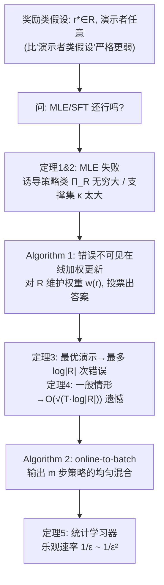

# Learning to Answer from Correct Demonstrations

**会议**: ICLR 2026  
**arXiv**: [2510.15464](https://arxiv.org/abs/2510.15464)  
**OpenReview**: [https://openreview.net/forum?id=69fIHgLjyH](https://openreview.net/forum?id=69fIHgLjyH)  
**代码**: 暂无（纯理论论文）  
**领域**: 学习理论 / 模仿学习 / 上下文老虎机  
**关键词**: 模仿学习, 学徒学习, 上下文老虎机, SFT, 极大似然, 奖励类假设  

## 一句话总结
这篇论文把 LLM 的 SFT 形式化为"上下文老虎机里从最优演示做模仿学习"，证明只要**奖励模型**（哪些答案算对）属于低复杂度类（而非演示者策略属于低复杂度类）就够了——这是更弱的假设；并指出极大似然/SFT 在此假设下会失败，转而给出一个一遍在线算法，样本复杂度只与奖励类的对数基数有关、且在演示最优时享有 $1/\varepsilon$ 的"乐观速率"。

## 研究背景与动机

**领域现状**：很多现实任务（数学题、写代码、推荐）都属于"一个问题有海量等价正确答案，给一个就够"的结构，可形式化为上下文老虎机：上下文 $x$ 是问题、动作 $y$ 是答案、奖励 $r^\star(x,y)\in\{0,1\}$ 标记对错。LLM 的监督微调（SFT）正是这种设定——在"问题+专家好答案"对上训练，目标是答得和专家一样好。

**现有痛点**：学界处理"从演示学习"的主流套路是假设**演示者策略** $\tilde\pi$ 落在一个低容量策略类 $\Pi$ 里，从而用极大似然估计（MLE，等价于 log-loss 最小化，也正是 SFT 在做的事）。这套路要求 $\log|\Pi|$ 小且演示者精确落在类内，意味着你得**建模具体某个学生怎么写出解题过程**，而不只是"什么样的解才算对"。这个假设太强、也不自然。

**核心矛盾**：作者主张真正该建模的是**奖励**（什么答案算对）而不是**演示者风格**。一道 IMO 金牌题的正确解集 $\sigma^\star(x)$ 大到无法想象（解法、措辞、空格、标点都能变），匹配某个专家的生成分布既不可能也无必要——能产出**任意一个**正确解就够。于是目标应是纯奖励驱动的价值竞争，而非分布匹配：
$$V_{r^\star}(\hat\pi)\ \ge\ V_{r^\star}(\tilde\pi)-\varepsilon,\qquad V_r(\pi)=\mathbb{E}_{x\sim D}\mathbb{E}_{y\sim\pi(\cdot|x)}[r(x,y)].$$

**本文目标**：把"演示者类假设"换成更弱的"**奖励类假设**"（$r^\star\in\mathcal R$，$\tilde\pi$ 任意），并问：MLE 还行吗？如果不行，该用什么算法、要多少样本？

**核心 idea**：**（1）放弃分布匹配，改做奖励对冲**——在整个奖励类 $\mathcal R$ 上同时保证表现好，从而对真实的 $r^\star$ 也好；**（2）用一遍在线"错误不可见"更新规则**取代 log-loss 最小化，把样本复杂度压到 $O(\log|\mathcal R|/\varepsilon)$（最优演示）到 $O(\log|\mathcal R|/\varepsilon^2)$（任意演示）之间平滑过渡。

## 方法详解

### 整体框架
论文先在理论上把"奖励类假设"和"演示者类假设"作对比（证明前者在最优演示下严格更弱），再证明 MLE 在奖励类假设下会失败，最后给出一个在线加权投票算法 + online-to-batch 转换得到统计学习器。核心算法在每一步对所有奖励函数维护权重，按"投票多数"出答案，再根据演示和自己的预测调权——但关键在于它**根本不知道自己有没有答错**（错误不可见）。

### 关键设计

**1. 奖励类假设严格弱于演示者类假设：把"建模对错"和"建模风格"分开。** 论文的概念基石是区分两类可实现性假设：奖励类假设要求未知奖励 $r^\star\in\mathcal R\subseteq[0,1]^{X\times Y}$（演示者 $\tilde\pi$ 任意）；演示者类假设要求 $\tilde\pi\in\Pi$（奖励任意）。当演示者最优时，奖励类假设会**诱导**出一个演示者类 $\Pi_{\mathcal R}=\{$ 所有支撑在 $\sigma_r(x)$ 上的策略 $\}$，但即便 $|\mathcal R|$ 很小，只要每个上下文有 $\ge 2$ 个正确答案，$|\Pi_{\mathcal R}|$ 就可以是无穷大。直观上 $\log|\mathcal R|$ 对应"奖励模型的参数量"（$N$ 个 32-bit 浮点参数则 $\log|\mathcal R|\le 32N$），而把"哪些答案算对"建模成一个 transformer 远比把"某个专家怎么写答案"建模成策略要自然——这就是把广度（无穷多正确答案）从假设里剥离出去的关键。

**2. 为什么 MLE/SFT 会失败：分布匹配在奖励类假设下根本做不到。** MLE 的全部威力来自它能以 $O(\log|\Pi|/m)$ 的速率在 Hellinger 距离上克隆演示者分布（命题 1），但这恰恰是奖励类假设拒绝提供的。论文构造了极简反例：二元答案 $Y=\{0,1\}$、奖励类 $\mathcal R=\{r_0,r_{01}\}$，其中 $r_0$ 只认 $0$ 对、$r_{01}$ 认 $0,1$ 都对。若真值 $r^\star=r_0$，演示者永远给 $0$，但 $r_{01}$ 也和数据一致，于是 MLE 在没见过的上下文上可能输出 $1$ 而彻底失败（定理 1，$|\mathcal R|=|Y|=2$ 即可）。即便换成基数匹配的策略类 $\Pi_{\mathcal R}=\{\pi_r=\mathrm{Unif}(\sigma_r(x))\}$，由于正确答案支撑集大小 $\kappa$ 可指数级巨大，MLE 也只能保证 $1/\kappa$ 的命中概率，价值可任意接近 $0$（定理 2）。结论：分布匹配在奖励类假设下不可能，任何想要低价值次优性的方法都必须**绕开**分布匹配。

**3. 错误不可见的在线加权更新（Algorithm 1）：在"不知道自己错没错"的情况下做奖励对冲。** 这是全文核心算法。对每个 $r\in\mathcal R$ 维护权重 $w^{(t)}(r)$（初始为 $1$），每一轮收到 $x_t$ 后输出加权投票的答案
$$\hat y_t:=\arg\max_{y\in Y}\sum_{r\in\mathcal R}w^{(t)}(r)\,r(x_t,y),$$
然后收到一个（保证正确但可能与 $\hat y_t$ 无关的）演示 $y_t$。二元最优演示下（$\gamma=1$）的更新规则是：把与演示矛盾的 $r$（$r(x_t,y_t)\ne 1$）权重清零；若 $r$ 认演示对、但**没投票支持** $\hat y_t$（$r(x_t,\hat y_t)\ne 1$）则权重翻倍；其余不变。妙处在于：哪怕学习器根本不知道 $\hat y_t$ 对不对，这个"给没帮上忙的 $r$ 加权"的操作就足以让错误数指数衰减——每次犯错都意味着投反对票的总权重至少占一半被翻倍，而总权重单调不增，于是错误数 $\le\log|\mathcal R|$（定理 3）。

**4. 软化更新 + online-to-batch，把"最多 log|R| 次错误"升级为带乐观速率的统计保证。** 为处理实值奖励和**次优**演示者，硬更新换成软更新
$$w^{(t+1)}(r)\leftarrow w^{(t)}(r)\,(1+\gamma)^{r(x_t,\ast)-r(x_t,\hat y_t)}\,(1-\gamma)^{r(x_t,\ast)-r(x_t,y_t)},$$
按次优程度连续地增/减权重，得到遗憾界 $J_r^\star(T)-\hat J_r(T)\le(1+2\gamma)(J_r^\star(T)-\tilde J_r(T))+\log|\mathcal R|/\gamma$（定理 4，最优演示时退化为定理 3）。再用 online-to-batch 转换（Algorithm 2：输出 $m$ 步各策略 $\hat\pi_t$ 的均匀混合 $\hat\pi_{o2b}$）得到统计学习器。最终的"乐观速率"（定理 5）是全文卖点：以 $\Delta$ 记演示者次优性，价值次优性约为
$$V_r(\tilde\pi)-V_r(\hat\pi_{o2b})\lesssim\sqrt{\frac{\Delta\,\log|\mathcal R|}{m}}+\frac{\log|\mathcal R|}{m},$$
即最优演示（$\Delta=0$）享有快速的 $1/\varepsilon$ 样本复杂度，最坏情形退化到 $1/\varepsilon^2$，全程**不依赖** $|Y|$ 或正确集大小 $|\sigma^\star(x)|$。相比之下 Syed & Schapire (2007) 适配到上下文老虎机只能给 $1/\varepsilon^2$，且本文是一遍在线、分析自洽、并允许任意自适应的演示。

## 实验关键数据

本文是纯理论论文，没有数值实验，"实验关键数据"即理论样本复杂度的对比与保证。

### 主结果：两类假设下 MLE 与本文学习器的样本复杂度对比

| 学习规则 | 低基数 $\Pi$ 假设 | 低基数 $\mathcal R$ 假设 |
|---|---|---|
| **MLE** | $\sqrt{\Delta\log|\Pi|/m}+\log|\Pi|/m$（最优，命题 1） | **可能学不会**（定理 1、2） |
| **本文学习器** | $\log|\Pi|/m$（推论 2） | $\sqrt{\Delta\log|\mathcal R|/m}+\log|\mathcal R|/m$（定理 5） |

灰色慢项随演示者次优性 $\Delta$ 在 $1/\sqrt m$（最坏）与 $1/m$（最优）之间插值。核心结论：在最优演示下，**低基数 $\mathcal R$ 是比低基数 $\Pi$ 严格更弱的假设**。

### 核心定理一览

| 定理 | 内容 | 速率 |
|---|---|---|
| 定理 1/2 | MLE（在 $\Pi_{\mathcal R}$ 或 $\bar\Pi_{\mathcal R}$ 上）在简单二元奖励类上失败 | $V_{r^\star}(\hat\pi_{mle})\le\epsilon$，任意 $m$ |
| 定理 3 | Algorithm 1（$\gamma=1$，最优演示）的在线错误界 | $\le\log|\mathcal R|$ 次错误 |
| 定理 4 | Algorithm 1（一般实值奖励 + 任意演示）遗憾界 | $O(\sqrt{T\log|\mathcal R|})$ |
| 定理 5 | online-to-batch 统计保证（乐观速率） | $1/\varepsilon$（最优）~ $1/\varepsilon^2$（任意） |

### 关键发现
- **错误不可见仍能学**：即使学习器从不知道自己单步答对没有，只靠"总有一个正确演示"，错误数仍能控到 $\log|\mathcal R|$。
- **与答案空间无关**：样本复杂度不含 $|Y|$ 和 $|\sigma^\star(x)|$，因此能应对"正确答案指数级多"的真实场景。
- **乐观速率**：演示越接近最优、$\Delta$ 越小，越快地从 $1/\varepsilon^2$ 过渡到 $1/\varepsilon$。

## 亮点与洞察
- **重新定位了 SFT 该假设什么**：把"建模演示者风格"换成"建模奖励/对错判据"，一句话点破了为什么 LLM 后训练里分布匹配既不必要也不可达。
- **"错误不可见在线学习"是个漂亮的设定**：和传统上下文老虎机不同，学习器看不到自己的奖励、只收到一个无关的正确演示，却仍能保证少犯错，分析简洁优雅。
- **乐观速率把最优/次优演示统一在一个算法里**：靠单一步长 $\gamma$ 调度，理论上同时拿下两端。
- **更广的适用性**：通过把整段 token 序列视作单个动作，结论可推广到确定性转移的 MDP 与自回归语言生成。

## 局限与展望
- **只覆盖有限奖励类**：所有界都用 $\log|\mathcal R|$ 表述，但很多自然奖励类（广义线性、低秩双线性、transformer 打分）是连续参数化的无穷类，可学习性与样本复杂度的刻画仍待解决。
- **计算不可行**：样本复杂度对数级，但朴素实现的时间/空间与 $|\mathcal R|$ 线性、即随参数量指数级，缺少可落地的启发式简化。
- **离实际 SFT 还有距离**：实践中该用什么奖励类 $\mathcal R$、如何利用预训练得到的 $\pi_\theta$ 构造 $\mathcal R$、reward-hedging 何时真能优于行为克隆，都还是开放问题。

## 相关工作与启发
- **学徒/模仿学习**：Abbeel & Ng (2004)、Syed & Schapire (2007) 是直接前身；本文相当于把 Syed & Schapire 适配到单步上下文老虎机，并改进为一遍在线、带乐观速率、允许自适应演示。
- **从演示做密度估计/MLE**：Foster et al. (2024) 给出 MLE 在演示者类假设下的紧速率，是本文命题 1 的基础与对照。
- **LLM 后训练视角**：把 SFT 看作上下文老虎机里的模仿学习，与 DPO（Rafailov et al., 2023）等把整段回答当单个动作的研究一脉相承；pass@k 扩展（附录 F）在最优演示下 minimax 最优。
- **启发**：对正在做 LLM 对齐/SFT 的人，这篇提供了一个反直觉但重要的视角——当"正确答案集"巨大时，别再追求克隆专家分布，而应围绕"对错判据"做奖励对冲；这可能孕育出有别于行为克隆的新后训练范式。

## 评分
- **新颖性**: ⭐⭐⭐⭐⭐ 把"奖励类假设 vs 演示者类假设"这一区分讲透，并证明前者严格更弱、MLE 在其下失败，是对 SFT 理论基础的实质性重构。
- **实验充分度**: ⭐⭐⭐ 纯理论论文，无数值实验；但定理体系完整、反例构造精巧、速率紧致，理论"实验"充分。
- **写作质量**: ⭐⭐⭐⭐⭐ 动机—反例—算法—保证的叙事极清晰，Table 1 的对比和 Figure 1 的在线协议把抽象设定讲得很直观。
- **价值**: ⭐⭐⭐⭐ 为"该如何理解和改进 LLM 的 SFT"提供了新理论框架与算法原型，长远启发大；但当前算法计算不可行、且只覆盖有限类，落地仍需后续工作。

<!-- RELATED:START -->

## 相关论文

- [\[ICLR 2026\] Transfer Learning in Infinite Width Feature Learning Networks](transfer_learning_in_infinite_width_feature_learning_networks.md)
- [\[ICLR 2026\] Learning to Adapt: In-Context Learning Beyond Stationarity](learning_to_adapt_in-context_learning_beyond_stationarity.md)
- [\[ICLR 2026\] Sharp Asymptotic Theory for Q-Learning with LD2Z Learning Rate and Its Generalization](sharp_asymptotic_theory_for_q-learning_with_textttld2z_learning_rate_and_its_gen.md)
- [\[ICLR 2026\] Online Decision-Focused Learning](online_decision-focused_learning.md)
- [\[ICLR 2026\] Variational Inference for Cyclic Learning](variational_inference_for_cyclic_learning.md)

<!-- RELATED:END -->
