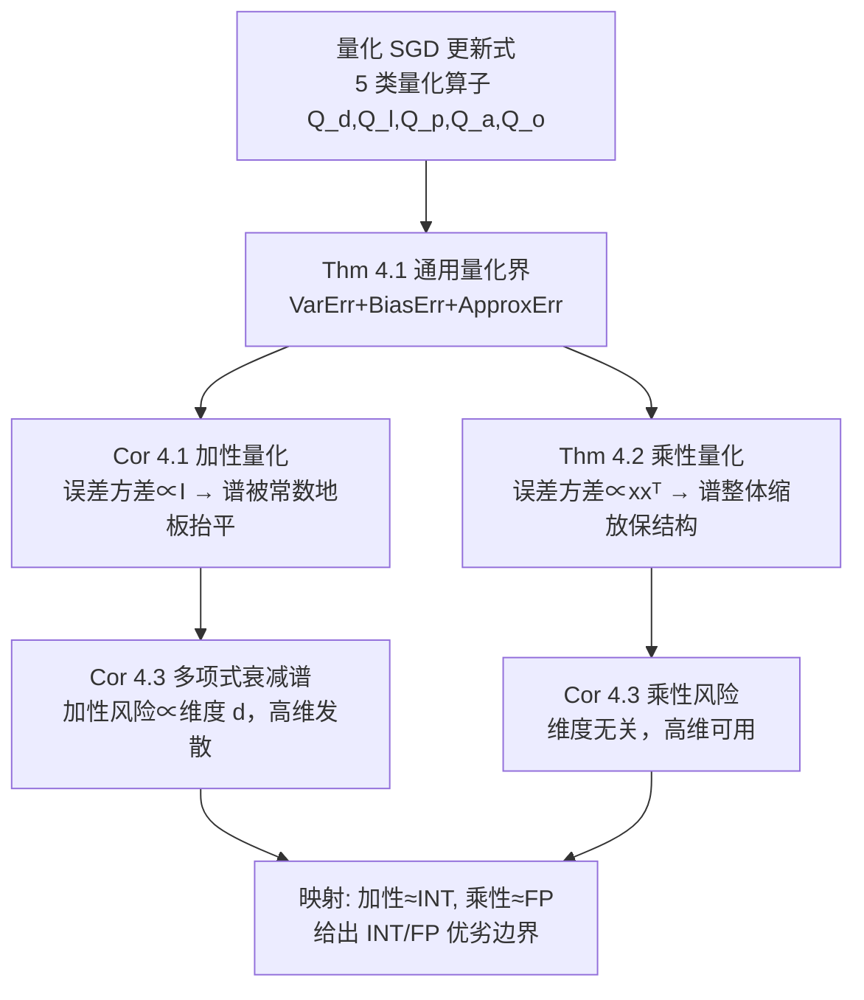

# Learning under Quantization for High-Dimensional Linear Regression

**会议**: ICLR 2026  
**OpenReview**: [https://openreview.net/forum?id=eUjUReZoYR](https://openreview.net/forum?id=eUjUReZoYR)  
**代码**: 待确认  
**领域**: 学习理论 / 量化训练  
**关键词**: 低比特量化, 高维线性回归, SGD, 超额风险界, 加性量化, 乘性量化  

## 一句话总结
本文给出了第一个系统刻画"量化如何影响学习性能"的理论框架——在高维线性回归 + 有限步 SGD 设定下，对数据/标签/参数/激活/梯度五类量化目标推导出精确的超额风险上界，并证明加性量化（对应 INT）会污染数据谱、乘性量化（对应 FP）则保留谱结构，从而在高维下更优。

## 研究背景与动机

**领域现状**：低比特量化已成为训练大模型不可或缺的技术，随之兴起的"量化 scaling law"研究试图刻画模型规模、数据量、比特位宽之间的权衡（Kumar 2024 把位宽当作离散精度度量，Sun 2025 把 FP 的指数位/尾数位分开建模，Chen 2025 给出统一 scaling law）。

**现有痛点**：理论侧严重滞后于实践。已有量化优化器的理论工作（De Sa 2015、Alistarh 2017 的 QSGD、Markov 2023）几乎都只关心**训练损失的收敛性**，而忽略了更根本的问题——量化到底如何影响模型的**学习/泛化性能**？最接近的 Zhang et al. (2022) 用 NTK 分析了量化两层网络的泛化，但三点受限：只考虑参数量化、局限于 lazy-training 区域、无法给出关于样本量/维度/量化误差的显式泛化界。

**核心矛盾**：量化误差、模型维度、数据量三者如何耦合并共同作用于**population risk**，至今缺乏严格刻画。而真实硬件用的 INT 和 FP 两种量化格式误差结构完全不同，但理论上没人说清它们各自的优劣边界。

**本文目标**：以高维线性回归作为可解析的 testbed，对五类量化目标统一建模，推导出关于全谱特征值、样本量、量化误差的精确超额风险界 $\mathcal{E}(w_N)=L(w_N)-L(w^*)$，并据此比较 INT 与 FP 在不同维度/批量下的优劣。

**核心 idea**：**「区分两类量化误差模型」**——把量化误差按条件二阶矩的结构分成 *加性*（误差方差 $\propto I$，对应固定 bin 长的 INT）与 *乘性*（误差方差 $\propto xx^\top$，随信号幅度缩放，对应 value-aware 的 FP），由此揭示二者对数据谱的截然不同影响。

## 方法详解

### 整体框架
本文不提算法，而是为下式的"量化 SGD"建立超额风险理论。每步对一个 batch $(X_t,y_t)$ 做更新
$$w_t = w_{t-1} + \gamma \tfrac{1}{B} Q_d(X_t)^\top Q_o\!\big(Q_l(y_t) - Q_a(Q_d(X_t)Q_p(w_{t-1}))\big),$$
其中 $Q_d,Q_l,Q_p,Q_a,Q_o$ 分别是对数据特征、标签、参数、激活、输出梯度的独立量化算子，输出取迭代平均 $\bar w_N$。分析路线是：先在通用量化下把超额风险拆成 **方差误差 + 偏差误差 + 近似误差**（Theorem 4.1），再把加性/乘性两种误差结构代入得到可解释的精确界（Corollary 4.1 / Theorem 4.2），最后在多项式衰减谱下做对比（Corollary 4.3）并映射回 INT vs FP。

### 关键设计

**1. 加性 vs 乘性量化的误差结构定义：把硬件格式抽象成两类条件方差。** 在无偏量化假设 $\mathbb{E}[Q_i(u)|u]=u$ 之上，本文按量化误差的条件二阶矩结构把量化分为两类：乘性量化满足 $\mathbb{E}[(Q(x)-x)(Q(x)-x)^\top|x]=\epsilon\,xx^\top$，误差正比于数据自身的外积、随幅度缩放；加性量化满足 $\mathbb{E}[(Q(x)-x)(Q(x)-x)^\top|x]=\epsilon I$，误差方差在各坐标上恒定。这一区分有坚实的硬件依据：INT8/INT16 用固定 bin 长，误差与数值大小基本无关，对应加性；FP8（如 E4M3）通过指数+尾数位实现 value-aware 的 bin 长，误差随数值幅度缩放，对应乘性。整篇理论的全部差异最终都追溯到这两个误差模型。

**2. 通用量化的三段式超额风险界：分离"谱失真"与"噪声放大"。** Theorem 4.1 在量化数据协方差 $H^{(q)}=\mathbb{E}[Q_d(x)Q_d(x)^\top]$ 及其有效维度 $k^*=\max\{k:\lambda_k^{(q)}\ge \tfrac{1}{N\gamma}\}$ 之上，把 $\mathbb{E}[\mathcal{E}(w_N)]$ 上界拆成方差、偏差、近似三项。关键结论是量化的作用分两路：**数据量化**通过改变 $H^{(q)}$ 的谱来影响方差/偏差项，并额外引入近似误差 ApproxErr（刻画全精度最优 $w^*$ 与量化空间最优 $w^{(q)*}$ 之间的差距）；而**参数/激活/梯度量化**则统一放大了有效噪声方差
$$\sigma_G^{(q)2}=\tfrac{\sigma^2+\sup_t\mathbb{E}[\epsilon_t^{(o)}\epsilon_t^{(o)\top}]+\mathbb{E}[\epsilon_t^{(a)}\epsilon_t^{(a)\top}]}{B}+\alpha_B\sup_t\mathbb{E}\,\mathrm{tr}(H^{(q)}\epsilon_{t-1}^{(p)}\epsilon_{t-1}^{(p)\top}).$$
当量化误差趋零时，该界**精确退化**为 Zou et al. (2023) 的全精度结果，说明框架与经典理论自洽；且无偏假设下参数/激活/梯度量化只进方差项、不进偏差项。

**3. 加性量化：批量平均能压住激活/梯度噪声，却被"噪声地板"抬平谱。** Corollary 4.1 显示，加性下激活和梯度量化误差 $\epsilon_a,\epsilon_o$ 与标签噪声 $\sigma^2$ 一样被 $1/B$ 因子抑制——这是因为加性误差方差恒定、与数据无关，激活/梯度噪声项 $\tfrac{1}{B^2}\mathbb{E}[X_q^\top\epsilon\epsilon^\top X_q]$ 中的数据依赖被中和掉。但代价是数据量化在整个谱上加了一个固定常数 $\epsilon_d$，相当于给尾部特征值设了一道**噪声地板**，阻止其继续衰减、谱被抬平，导致高维尾部子空间累积大量风险；而参数量化 $\epsilon_p$ 因为夹在 $X_q^\top X_q$ 之间仍保留数据依赖，故 $\epsilon_p$ 的放大正比于 $\mathrm{tr}(H)$、与批量无关。

**4. 乘性量化：谱被整体缩放而非抬平，高维下天然占优。** Theorem 4.2 通过直接分析（而非套用通用界）给出更紧的乘性结果。其结构性优势在于误差随信号幅度缩放，相当于把整个谱乘以 $(1+\epsilon_d)$ 的**线性变换**，不改变特征值的相对分布、保留谱衰减性质，因此 ApproxErr 仅为 $\tfrac{\epsilon_d}{1+\epsilon_d}\|w^*\|_H^2$。但有一个反向代价：激活/梯度噪声 $\epsilon_a,\epsilon_o$ 与 $\|w^*\|_H^2$ 耦合且**不随 $1/B$ 衰减**（因为乘性误差本身依赖信号、与数据结构纠缠），即加大批量在乘性下反而收紧不了这部分要求。Corollary 4.2/4.3 据此给出维持全精度性能 $R_0$ 所需的量化误差条件，并在多项式衰减谱 $\lambda_i\asymp i^{-a}$ 下证明：加性风险显式依赖维度 $d$、$d\to\infty$ 时发散；乘性风险**维度无关**，无穷维设定下仍可用。最终映射回硬件——令 $\epsilon_{\text{add}}\approx 2^{-2b}$（INT 位宽 $b$）、$\epsilon_{\text{mul}}\approx 2^{-2m}$（FP 尾数位 $m$）——得到 FP 在 $md\ge bd-\tfrac{a}{2}\log_2 d$ 时更优、即 FP 即便尾数位比 INT 位宽少 $\tfrac{a}{2}\log_2 d$ 仍能胜出，凸显 FP 在高维下的优势。

## 实验关键数据

实验用高斯最小二乘合成模型验证理论：协方差谱 $\lambda_i=i^{-2}$，真值 $w^*[i]=1$，噪声 $\sigma^2=1$，constant-stepsize SGD + 迭代平均。

### 主实验（Q1：量化级别的影响，固定 d=200, B=1）

| 量化方案 | 量化级别 $\varepsilon$ | 超额风险表现 |
|---|---|---|
| 乘性（FP-like） | 0 / 1e-3 / 5e-3 / 1e-2 | 各级别下都**基本保持**全精度泛化性能 |
| 加性（INT-like） | 0 / 1e-3 / 5e-3 / 1e-2 | 随 $\varepsilon$ 增大性能**逐渐退化** |

### 消融（Q2：维度的影响，固定 $\varepsilon$=0.01, B=1）

| 量化方案 | 维度 $d\in\{50,100,200,400\}$ | 超额风险表现 |
|---|---|---|
| 乘性（FP-like） | 50→400 | 高维下泛化性能**仍被保持** |
| 加性（INT-like） | 50→400 | 随 $d$ 增大性能**显著恶化** |

### 关键发现
- **B=1 时加性需要更严的量化级别**才能追平全精度，验证了 Corollary 4.2 中加性数据量化的谱依赖严格约束。
- **加性对维度敏感、乘性维度无关**，与 Corollary 4.3 的多项式谱结论（加性风险 $\propto d$ 在高维发散）完全吻合。
- 理论与数值实验双向印证：乘性（FP）在高维更鲁棒，加性（INT）受益于批量平均但谱失真致命。
- 风险曲线随样本量 $N$ 增大而下降，且乘性各曲线几乎重合于全精度基线，直观展示了"谱保结构"带来的近似无损学习。

## 亮点与洞察
- **第一个把"量化目标"细分到五类（数据/标签/参数/激活/梯度）并给出显式超额风险界的理论工作**，填补了"量化只分析训练损失收敛"的空白。
- **加性 vs 乘性的二分法**是全篇的灵魂——一个简洁的条件二阶矩结构差异，最终统一解释了 INT/FP 的所有性能分歧，并能定量给出 $md$ vs $bd$ 的选择边界，对实际选位宽有直接指导意义。
- 框架与 Zou et al. (2023) 的全精度结果**精确自洽**（误差趋零即退化），可信度高。
- 揭示了一个反直觉点：批量平均对加性量化的激活/梯度噪声是"解药"，但对乘性量化基本无效——因为乘性噪声与信号纠缠。

## 局限与展望
- 仅限**线性回归 + 无偏量化**假设；真实低比特训练常用有偏量化（如带 clipping/saturation），文中坦言框架"可扩展"但未给出有偏情形的界。
- 假设矩阵运算在全精度下完成、量化只作用于结果，与真实硬件中累加也低精度的情形有差距。
- 量化级别 $\epsilon$ 与位宽的映射（$\epsilon\approx 2^{-2b}$）是粗略近似，未考虑动态范围/溢出等实际因素。
- 实验仅为合成高斯数据，缺少真实数据集或神经网络上的验证。

## 相关工作与启发
- **高维线性回归 SGD 理论**：直接建立在 Zou et al. (2023) 的 dimension-free 有限样本分析之上，并继承 Bartlett 2020 / Tsigler & Bartlett 2023 的 ridge 回归超额风险刻画。
- **量化理论**：与 De Sa 2015、Alistarh 2017 (QSGD)、Faghri 2020、Markov 2023 等"收敛性"工作互补——后者关心训练损失，本文关心泛化；后训练量化误差界（Lybrand & Saab 2021、Zhang 2023/2025）则是另一条线。
- **scaling law 的线性模型理论**：受 Lin et al. (2024; 2025)、Bahri 2024、Bordelon 2024 启发，把多项式谱 + 最优先验的分析范式引入量化场景。
- **启发**：把"误差结构"而非"误差大小"作为分析量化优劣的核心抓手，这一视角可推广到更复杂模型（如两层网络、Transformer）或有偏量化、混合精度训练的理论分析。

## 评分
- **新颖性**: ⭐⭐⭐⭐⭐ 首个对五类量化目标给出显式泛化界、并从误差结构层面统一解释 INT/FP 优劣的理论框架，切入角度新且基础。
- **实验充分度**: ⭐⭐⭐ 合成实验干净地验证了两条核心结论，但仅限高斯线性模型，缺真实数据/网络验证（本就是理论文，可理解）。
- **写作质量**: ⭐⭐⭐⭐ 逻辑链条清晰（通用界→两类特例→谱分析→硬件映射），符号体系完整，可解释性强；公式密集，对非理论读者门槛偏高。
- **价值**: ⭐⭐⭐⭐ 为"选 INT 还是 FP、选多少位宽"提供了首个有理论依据的定量判据，对低精度训练实践与后续量化 scaling law 理论都有奠基意义。

<!-- RELATED:START -->

## 相关论文

- [\[NeurIPS 2025\] Transfer Learning for Benign Overfitting in High-Dimensional Linear Regression](../../NeurIPS2025/learning_theory/transfer_learning_for_benign_overfitting_in_high-dimensional_linear_regression.md)
- [\[ICLR 2026\] High-dimensional Analysis of Synthetic Data Selection](high-dimensional_analysis_of_synthetic_data_selection.md)
- [\[ICLR 2026\] Improved High-Dimensional Estimation with Langevin Dynamics and Stochastic Weight Averaging](improved_high-dimensional_estimation_with_langevin_dynamics_and_stochastic_weigh.md)
- [\[ICLR 2026\] Larger Datasets Can Be Repeated More: A Theoretical Analysis of Multi-Epoch Scaling in Linear Regression](larger_datasets_can_be_repeated_more_a_theoretical_analysis_of_multi-epoch_scali.md)
- [\[ICLR 2026\] Physics-informed learning under mixing: How physical knowledge speeds up learning](physics-informed_learning_under_mixing_how_physical_knowledge_speeds_up_learning.md)

<!-- RELATED:END -->
