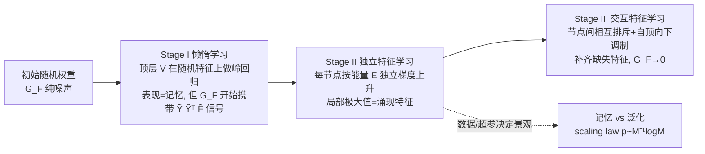

# $\mathbf{Li_2}$：刻画特征涌现与延迟泛化动力学的理论框架

**会议**: ICLR 2026  
**OpenReview**: [https://openreview.net/forum?id=ceIBRhJpUr](https://openreview.net/forum?id=ceIBRhJpUr)  
**代码**: [github.com/yuandong-tian/understanding](https://github.com/yuandong-tian/understanding/tree/main/ssl/real-dataset/cogo)  
**领域**: 学习理论 / 优化动力学  
**关键词**: grokking, 延迟泛化, 特征学习, 梯度动力学, 能量函数, 群表示论, scaling law  

## 一句话总结
本文提出 $\mathbf{Li_2}$ 框架，从两层非线性网络的梯度动力学第一性原理出发，把 grokking（延迟泛化）拆成"懒惰学习→独立特征学习→交互特征学习"三阶段，证明独立阶段恰好是一个能量函数 $E$ 的梯度上升、其局部极大值就是涌现的特征，并由此推出记忆/泛化边界的可证 scaling law。

## 研究背景与动机
- **领域现状**：grokking 现象（模型先过拟合训练集、继续训练后突然泛化）已被大量实证研究，已有解释包括 effective theory、记忆/泛化电路效率、把权重衰减当贝叶斯先验等。
- **现有痛点**：这些工作大多停留在对经验现象的"事后描述"，要么依赖极宽网络（NTK / mean-field 区，隐层权重几乎不动），要么靠经验观测划分阶段（如 Nanda 等的三阶段是纯经验的）。**几乎没有人从权重上的梯度动力学细节去解释 grokking 到底如何发生**。
- **核心矛盾**：要解释泛化，恰恰需要隐层权重发生实质更新（脱离 NTK 区），但这会让分析变得非凸、难以刻画；同时还要回答"会涌现什么特征、在什么条件下涌现、和训练梯度怎么挂钩"这三个一直悬而未决的问题。
- **本文目标**：建立一个**既能刻画特征涌现的种类与条件、又始终紧贴梯度动力学**的数学框架，对结构化输入（群算术任务）给出可证的特征结构与 scaling law。
- **核心 idea**：**回传梯度 $G_F$ 的"泄漏"结构是 grokking 的根因**——懒惰学习阶段顶层先拟合随机特征（表现为记忆），但回传到隐层的梯度 $G_F$ 同时悄悄携带了目标标签信息，且其特定结构（$G_F\propto\tilde Y\tilde Y^\top\tilde F$）让每个隐节点能**独立**地按一个能量函数 $E$ 做梯度上升，从而涌现可泛化特征。

## 方法详解

### 整体框架
研究对象是两层网络 $\hat Y=\sigma(XW)V$ 配 $\ell_2$ 损失。核心量是回传到隐层激活 $F=\sigma(XW)$ 的梯度 $G_F=-\partial J/\partial F=P^\perp_1(Y-FV)V^\top$（$P^\perp_1$ 是沿样本维去均值的投影）。整篇围绕 $G_F$ 的结构演化，把训练拆成三阶段并逐一给出定理。

### 关键设计

**1. 懒惰学习阶段：泄漏梯度 $G_F$ 的双相结构（Stage I）。** 训练初期 $W$、$V$ 都是零均值随机量，$G_F$ 纯噪声；但隐层激活 $F$ 基本不动、只有顶层 $V$ 在学，于是可把 $F$ 当固定值分析。Proposition 1 证明在小初始化（顶层初始化尺度 $\alpha\ll1$）下，初期 $G_F(t)=t\,\tilde Y\tilde Y^\top\tilde F+O(\alpha)+O(\alpha t)+O(t^2)$，即**被携带标签信息的信号项 $\tilde Y\tilde Y^\top\tilde F$ 主导**；当 $V$ 收敛到岭回归解 $V_{\text{ridge}}=(\tilde F^\top\tilde F+\eta I)^{-1}\tilde F^\top\tilde Y$ 时，$G_F$ 指数收敛到由权重衰减 $\eta$ 决定的不动点。Lemma 1 进一步在大宽度下把它化简成 $G_F(+\infty)\propto\eta\,\tilde Y\tilde Y^\top\tilde F$。这个统一出现的 $\tilde Y\tilde Y^\top\tilde F$ 项就是后续特征学习的发动机。由此还得到一个实用推论——把顶层 $V$ 直接**零初始化**（zero-init），可让 $G_F$ 一开始只剩信号项，加速特征学习（多层、数据稀缺时加速可达 $10\times$）。

**2. 独立特征学习恰是能量函数 $E$ 的梯度上升（Stage II）。** 因为 $G_F\propto\tilde Y\tilde Y^\top\tilde F$ 的第 $j$ 列只依赖第 $j$ 个节点 $w_j$，$K$ 个节点的动力学**完全解耦**：$\dot w_j=X^\top D_j g_j,\ g_j\propto\tilde Y\tilde Y^\top\sigma(Xw_j)$。Theorem 1 证明这正是能量函数
$$E(w_j)=\tfrac12\big\|\tilde Y^\top\sigma(Xw_j)\big\|_2^2$$
的梯度上升——它本质是输入 $X$ 与目标 $\tilde Y$ 之间的**非线性典型相关分析（CCA）**。于是"每个节点学到的特征"被刻画为 $E$ 的局部极大值。关键洞察：若 $\sigma$ 线性，$E$ 只有一个全局极大（退化为 LDA，在群任务上因类均值相同而失效）；**正是非线性让 $E$ 出现多个局部极大，每个对应一个有意义、可泛化的特征**。

**3. 用群表示论完整刻画局部极大与可泛化性。** 在群算术任务（给 $h_1,h_2$ 预测 $h_1h_2$，如模加 $\bmod M$）上，借助正则表示的不可约分解 $R_h=Q(\bigoplus_k\bigoplus_r C_k(h))Q^*$，Theorem 2 **完整刻画**了 $E$ 的所有局部极大：形如 $w^*=[u;\pm Pu]$（$P$ 是群逆算子），落在某个 $d_k$ 维实/复不可约表示子空间内，能量值 $E^*=M/8d_k$ 或 $M/16d_k$，彼此不连通，且"没有别的局部极大"。对模加（Abelian 群）这退化为**单频 Fourier 基**（Corollary 2），与实证中 grokking 学到 Fourier 表示一致。Theorem 3 进一步证明这些特征能完整重构 $\tilde Y$，且只需 $K=2M-2$ 个节点，远比纯记忆所需的 $M^2$ 个高效。

**4. 记忆/泛化边界的可证 scaling law。** 不必用全部 $M^2$ 个样本——Theorem 4 通过检验局部极大的**稳定性**证明：只要均匀采 $n\gtrsim d_k^2 M\log(M/\delta)$ 个样本，经验能量 $\hat E$ 就能保住可泛化的局部极大。于是泛化所需训练数据比 $p:=n/M^2=O(M^{-1}\log M)$，给出清晰的相变边界（实验 Fig. 5 几乎完美吻合）。反之（Theorem 5）当数据只覆盖单一目标时，$E$ 的全局极大退化为记忆解（power 激活→focused 记忆，ReLU/SiLU 等→spreading 记忆）。这从第一性原理解释了"记忆电路/泛化电路"、临界数据比、ungrokking 等经验现象：**是数据分布改变了 $E$ 的景观，决定权重落入泛化还是记忆的盆地**。

**5. 交互阶段：排斥、自顶向下调制与 Muon（Stage III）。** 当 $W$ 脱离随机初始化、$B:=(\tilde F^\top\tilde F+\eta I)^{-1}\propto I$ 的近似失效后，节点开始耦合：Theorem 6 证明激活相似的两个节点会**互相排斥**（鼓励多样性）；Theorem 7（top-down modulation）证明若隐层只学了部分不可约表示子集 $S$，$G_F$ 会自动改变景观、使 $E_S$ 只在**缺失**的特征上保留局部极大，逼模型补齐；Theorem 8 证明 **Muon 优化器**（把梯度 SVD 后取 $U V^\top$）能重新平衡各方向更新——已被占据的局部极大方向被折扣掉，从而强制探索新方向，把"学全所有局部极大"所需节点数从 $T_0$ 降到约 $L$。这是首个在特征学习视角下解释 Muon 为何有效的分析。

## 实验关键数据

### 主实验：scaling law 验证

| 任务 | 设置 | 理论预测 | 实证结果 |
|------|------|----------|----------|
| 模加泛化/记忆相变 | $M=23\sim127$, $K=2048$, lr=5e-4, wd=2e-4 | $p\sim M^{-1}\log M$ | 相变边界与虚线高度吻合（test acc 0→1 清晰跳变） |
| 重构所需节点数 | Abelian 群 | $K=2M-2$ | 远小于记忆所需 $M^2$ |
| 样本量阈值 | $d_k$ 维不可约 | $n\gtrsim d_k^2M\log M$ | Fig. 5 复合/素数 $M$ 均匹配 |

### 关键现象（消融）

| 对照 | 现象 | 对应理论 |
|------|------|----------|
| 有/无权重衰减（$\eta$=2e-4 vs 0） | 仅有 wd 时 epoch≈100 处 $\|G_F\|$ 增大并触发 grokking；$\eta=0$ 不 grok | Lemma 1：$G_F\propto\eta$ |
| 权重更新 $\Delta W$ 余弦距离 | 先 $V$（输出层）大更新，后 $W$（隐层）大更新 | 两阶段懒惰→独立 |
| $\tilde F^\top\tilde F$、$P^\perp_1FF^\top$ | 全程近似对角（误差 ≤8%） | 独立特征学习假设成立 |
| 学习率（小 vs 大） | 小 lr 留在泛化盆地→gsol；大 lr 收敛到 $E$ 更高的 ngsol（记忆） | 半 grokking 边界 |
| zero-init vs 普通初始化 | $M=41/89/127$ 均加速；多层数据稀缺时加速达 $10\times$ | Eqn. 3 信号项 |

### 关键发现
- 权重衰减、学习率、样本量三者通过改变 $G_F$ 与 $E$ 的景观共同塑造 grokking。
- 框架可扩展到多层网络，并顺带解释**残差连接为何有用**：$G_{\text{res},1}=\sum_l G_l$ 中 $G_L$ 是远更干净的信号，避免底层梯度被多次随机重加权/剪枝稀释。

## 亮点与洞察
- **把"经验三阶段"升级为"可证三阶段"**：Nanda 等的三阶段是观测出来的，本文用 $G_F$ 的结构演化给出第一性原理刻画。
- **能量函数 $E$ 是全篇枢纽**：一句"独立动力学=$E$ 的梯度上升"把"会涌现什么特征"转化为"$E$ 有哪些局部极大"，再用群表示论彻底解出。
- **scaling law 不是拟合出来的，而是从景观稳定性推出来的**，且与实验吻合。
- **统一解释一堆经验谜题**：记忆/泛化电路、临界数据比、ungrokking、任务多样性、Muon 有效性、residual 有用性，都成了景观变化的自然推论。

## 局限与展望
- **群结构假设较强**：能量 $E$ 的推导对任意输入成立，但**局部极大的完整刻画依赖输入具有群结构**（群算术任务），对一般结构化输入（如自然语言、图像）尚未给出。
- **不含阶段间过渡时间的分析**：三阶段被分别刻画，但"何时从一个阶段切到下一阶段"的转换时长未建模。
- **多层 Stage III 留作未来工作**：深层网络的自顶向下调制只给了定性方向。
- 不同激活导致 focused/spreading 记忆，其在大规模设置下的影响仍待验证。

## 相关工作与启发
- **grokking 解释谱系**：effective theory（Liu 2022）、记忆/泛化电路效率（Varma 2023）、贝叶斯先验视角（Millidge 2022）、宽网络分析（Barak/Rubin）——本文从梯度动力学层面统一解释。
- **特征学习理论**：与 Tian (2023) 的对比损失能量函数呼应，但本文的 $E$ 局部极大结构更清晰可解。
- **群表示论 × 模加 grokking**：延续 Nanda/Gromov/Power 对 Fourier 表示的观察，给出"为何必然是 Fourier 基"的证明。
- **超 NTK / mean-field**：明确指出 $K\to\infty$ 时 $G_F\to0$（NTK 区无特征学习），本文研究"$K$ 大但不至于无穷"的特征学习区。
- **启发**：能量函数视角 + 表示论分解，可能是分析其它结构化任务（排列、矩阵群、product 群）涌现特征的通用范式；zero-init、Muon 的理论支撑也提示了实用的训练加速手段。

## 评分
- **新颖性**: ⭐⭐⭐⭐⭐ 首个从梯度动力学第一性原理把 grokking 三阶段全部证明出来，并用能量函数+群表示论完整刻画涌现特征，理论原创性极高。
- **实验充分度**: ⭐⭐⭐⭐ 在多个 $M$、群类型上验证 scaling law 相变与各阶段现象，与理论吻合良好；但限于群算术合成任务，缺真实大规模数据验证。
- **写作质量**: ⭐⭐⭐⭐ 三阶段叙事清晰、定理环环相扣、图 1/2 直观；但定理密集、群表示论部分对非理论读者门槛较高。
- **价值**: ⭐⭐⭐⭐⭐ 把一堆 grokking 经验谜题统一为景观变化的推论，并给出 Muon/residual/zero-init 的理论解释，对理解深度网络泛化机制有奠基意义。

<!-- RELATED:START -->

## 相关论文

- [\[ICLR 2026\] Robustness of Probabilistic Models to Low-Quality Data: A Multi-Perspective Analysis](robustness_of_probabilistic_models_to_low-quality_data_a_multi-perspective_analy.md)
- [\[ICLR 2026\] Transfer Learning in Infinite Width Feature Learning Networks](transfer_learning_in_infinite_width_feature_learning_networks.md)
- [\[ICLR 2026\] Mitigating the Curse of Detail: Scaling Arguments for Feature Learning and Sample Complexity](mitigating_the_curse_of_detail_scaling_arguments_for_feature_learning_and_sample.md)
- [\[ICLR 2026\] FACT: a first-principles alternative to the Neural Feature Ansatz for how networks learn representations](fact_a_first-principles_alternative_to_the_neural_feature_ansatz_for_how_network.md)
- [\[ICLR 2026\] Two-Layer Convolutional Autoencoders Trained on Normal Data Provably Detect Unseen Anomalies](two-layer_convolutional_autoencoders_trained_on_normal_data_provably_detect_unse.md)

<!-- RELATED:END -->
