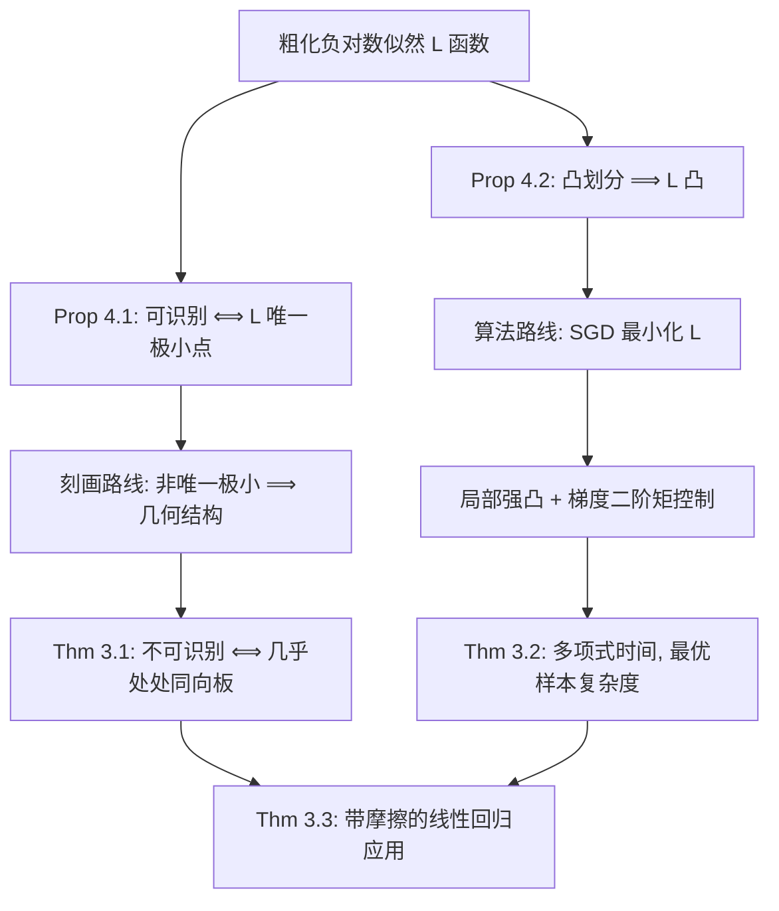

# Mean Estimation from Coarse Data: Characterizations and Efficient Algorithms

**会议**: ICLR 2026  
**OpenReview**: [https://openreview.net/forum?id=XV8hoBrPJ6](https://openreview.net/forum?id=XV8hoBrPJ6)  
**代码**: 待确认  
**领域**: 学习理论 / 统计估计  
**关键词**: 粗化数据, 高斯均值估计, 可识别性, 凸划分, 随机梯度下降, 对数似然  

## 一句话总结
本文彻底解决了凸划分下"粗化高斯均值估计"的两个开放问题——给出了可识别性的几何刻画（不可识别 ⟺ 几乎所有划分集合是同向"板"），并提供了首个匹配最优样本复杂度的多项式时间算法。

## 研究背景与动机

**领域现状**：现实中大量数据既非"完全缺失"也非"精确观测"，而是被**粗化（coarsening）**——观测者只看到一个包含真值的集合，而非真值本身。这源于测量取整（评分 4.7 被记为 5，只知道真值落在 $[4.5, 5.5)$）、传感器精度限制、以及经济系统中的市场摩擦（价格在"惰性带"内不调整，只知道无摩擦真值落在某个区间）。统计学界（Heitjan & Rubin 等）为此建立了丰富的"粗化数据"建模理论，但**计算高效的算法长期缺位**。

**现有痛点**：本文聚焦最基础的任务——从粗化样本估计高斯均值 $\mu^\star$（协方差为单位阵）。先前关键工作 Fotakis et al. (2021) 证明了：若划分含非凸集合则估计 NP-hard，因此必须限定**凸划分**；在凸且可识别的前提下，存在样本高效（$\tilde O(d/\varepsilon^2)$ 样本）的方法，但该方法用的是 $\exp(d/\varepsilon)$ 大小 $\varepsilon$-网上的暴力搜索，**计算不可行**。这留下两个开放问题。

**核心矛盾**：(Q1) 究竟**哪些凸划分**才是可识别的（即 $\mu^\star$ 能被唯一恢复）？这是纯信息论问题，此前只有零散例子而无统一刻画。(Q2) 在可识别凸划分下，是否存在**多项式时间**算法，还是存在统计-计算鸿沟（statistical-to-computational gap）？

**本文目标**：同时回答 Q1 与 Q2，彻底厘清凸划分下粗化高斯均值估计的计算复杂度边界。

**核心 idea**：**【几何刻画 + 凸优化】** 把可识别性归结为粗化负对数似然 $L(\cdot)$ 是否有唯一极小点，再用最优传输与方差缩减不等式证明"不可识别 ⟺ 几乎所有集合是同向板"；同时利用 $L$ 的凸性，把暴力搜索换成在对数似然上做的随机梯度下降（SGD），辅以局部强凸与梯度二阶矩控制两项关键技术，得到首个多项式时间算法。

## 方法详解

### 整体框架
两条主线都以**粗化负对数似然**为枢纽：$L(\mu) := \mathbb{E}_{P\sim N_{\mathcal P}(\mu^\star, I)}[-\log N_{\mathcal P}(\mu, I; P)]$，其中 $N_{\mathcal P}(\mu, I; P)=\int_P N(\mu, I; x)\,dx$ 是真值落入集合 $P$ 的概率。两个支柱性命题驱动全文：**Prop 4.1** —— 划分可识别 $\Longleftrightarrow$ $L(\cdot)$ 有唯一极小点（且该极小点恒为 $\mu^\star$）；**Prop 4.2**（Fotakis et al. 2021）—— 凸划分使 $L(\cdot)$ 凸。于是"刻画可识别性"等价于"刻画 $L$ 何时唯一极小"，而"高效估计"等价于"高效找到凸函数 $L$ 的极小点"。

### 关键设计

**1. 似然视角下的可识别性等价刻画：从信息论到优化几何。** 全文的起点是一个简洁等式：对任意 $\mu\neq\mu^\star$，$L(\mu)-L(\mu^\star)=\mathrm{KL}(N_{\mathcal P}(\mu^\star)\,\|\,N_{\mathcal P}(\mu))\ge 2\,d_{\mathrm{TV}}(N_{\mathcal P}(\mu^\star), N_{\mathcal P}(\mu))^2$（用了对数似然的标准性质与 Pinsker 不等式）。这意味着：当且仅当存在 $\mu\neq\mu^\star$ 使粗化分布完全重合（即 TV 距离为 0，不可识别）时，$L$ 在 $\mu^\star$ 之外还有第二个极小点。这一步把"无穷样本下能否区分 $\mu^\star$"的纯信息论问题，翻译成"凸函数 $L$ 的极小点是否唯一"的优化几何问题，为后续两条路线提供共同语言。

**2. 同向"板"是不可识别性的充要几何特征（Thm 3.1）。** 本文给出可识别性的完整几何刻画：凸划分 $\mathcal P$ 关于 $\mu^\star$ **不可识别**，当且仅当存在单位向量 $v$ 使**几乎每个** $P\in\mathcal P$ 都是方向 $v$ 上的**板（slab）**——即沿 $v$ 平移不变（$x\in P\Rightarrow x+tv\in P,\ \forall t$）的无界集合。直观上"平行板"显然不可识别（沿 $v$ 平移均值不改变粗化分布），难的方向是证明其**必要性**。证明分两步：先由 $L$ 的凸性推出存在单位向量 $u$ 满足 $u^\top\nabla^2 L(\mu^\star)u=0$，代入 Hessian 公式得 $\mathbb{E}_{P}[\mathrm{Var}_{x\mid x\in P}(u^\top x)]=1$；**Step I** 用高斯方差缩减不等式（Hargé 2004）知每个条件方差 $\le 1$，故期望为 1 迫使几乎所有 $P$ 满足 $\mathrm{Var}_{x\mid x\in P}(\langle u,x\rangle)=1$；**Step II** 结合方差缩减（Vempala 2010）证明投影 $y=u^\top x$ 在截断后仍服从高斯，再用 **Prékopa–Leindler 不等式**断定这只有当 $P$ 形如 $\{t\cdot u\}\times C_P$（即方向 $u$ 上的板）时才可能。这里"几乎每个"的限定不可省——零体积的非板集合不影响 TV 距离。该刻画还顺带说明：可识别性**与 $\mu^\star$ 无关**（要么对所有 $\mu^\star$ 可识别，要么都不），且取整产生的轴对齐网格因每个盒子有界（非板）而天然可识别。

**3. 局部强凸：把"函数值最优"翻译成"参数接近"。** SGD 只能保证找到 $\hat\mu$ 使 $L(\hat\mu)\le L(\mu^\star)+\varepsilon$，但若 $L$ 不强凸，$\hat\mu$ 仍可能离 $\mu^\star$ 很远；而 $L$ 在此设定下并非处处强凸。本文证明 $L$ 在 $\mu^\star$ **小邻域内局部强凸**：借助信息保持的定量版本（$\alpha$-information preservation，要求 $d_{\mathrm{TV}}(N_{\mathcal P}(\mu^\star), N_{\mathcal P}(\mu))\ge\alpha\, d_{\mathrm{TV}}(N(\mu^\star), N(\mu))$）与两高斯 TV 距离的下界，得到 $L(\mu)-L(\mu^\star)\ge 2\alpha^2 d_{\mathrm{TV}}(N(\mu), N(\mu^\star))^2\ge\min\{\Omega(\alpha^2),\ \Omega(\alpha^2\|\mu-\mu^\star\|_2^2)\}$。这保证在 $\mu^\star$ 附近函数值的次优可直接转化为参数距离的接近，使 SGD 的输出成为合格估计。注意此处不能直接跑投影 SGD——因为我们并不知道 $\mu^\star$，没有落在该小球内的起点。

**4. 梯度二阶矩控制：用高斯集中性驯服无界集合。** 实现 SGD 还需界定随机梯度的二阶矩。梯度形如 $\nabla L(\mu)=\mu-\mathbb{E}_{P\sim N_{\mathcal P}(\mu^\star)}\mathbb{E}_{N(\mu, I, P)}[x]$，其内外期望取的均值不同，二者最远可达 $P$ 的直径，故当划分含无界集合时梯度范数可能爆炸。关键招数是利用高维高斯的强集中性：$m$ 个 i.i.d. 标准高斯样本以极高概率落入半径 $O(1)$ 的 $L_\infty$ 盒内，因此对每个观测集合 $P$，取 $R=D+O(\log(md/\delta))$ 即可以 $1-\delta$ 置信度断言真值落在 $P\cap B_\infty(0,R)$。在此高概率事件下把每个 $P$ 替换为它与盒子的交，构造一个**有界半径的"局部划分"**（Appendix B.1），在其上界住梯度矩并推出算法，最后再证明任意凸划分都能**归约**到这一特例（Appendix B.4/B.5）。这正是相比 Fotakis et al. 暴力搜索的核心算法创新。

## 实验关键数据

本文为纯理论工作，无实证实验，下面以表格汇总核心理论结果。

### 主结果：复杂度对比

| 方法 | 样本复杂度 | 计算复杂度 | 适用范围 |
|------|-----------|-----------|---------|
| Fotakis et al. (2021) | $\tilde O(d/\varepsilon^2)$（$\alpha=\Omega(1)$ 时） | $\exp(d/\varepsilon)$ 暴力网格搜索，**不高效** | 凸 + $\alpha$-可识别 |
| **本文 (Thm 3.2)** | $\tilde O\!\big(\tfrac{dD^2}{\alpha^4}+\tfrac{d}{\alpha^4\varepsilon^2}\big)$ | **多项式时间**（关于 $m$ 与编码比特数） | 凸 + $\alpha$-可识别 |

当 $\alpha=\Omega(1)$ 且暖启动 $D=O(1)$ 时，本文在 $\tilde O(d/\varepsilon^2)$ 时间内得到 $\varepsilon$-精度估计，**样本复杂度与 Fotakis et al. 持平且计算高效**，证明该问题不存在统计-计算鸿沟。

### 理论贡献清单

| 结果 | 内容 | 解决的开放问题 |
|------|------|---------------|
| Thm 3.1 | 凸划分不可识别 ⟺ 几乎处处为同向板 | Q1（可识别性刻画） |
| Thm 3.2 | 首个多项式时间、匹配最优样本复杂度的算法 | Q2（计算高效性） |
| Thm 3.3 | 带市场摩擦的线性回归：$\|\hat w-w^\star\|_2^2\le\tilde O(d/(\alpha^4 n))$ | 算法的经济学应用 |

### 关键发现
- **可识别性 = 几何无板性**：判定一个凸划分是否可识别，归结为检查是否存在统一方向使几乎所有集合沿该方向平移不变；轴对齐网格（取整）天然可识别。
- **可识别性与均值无关**：难度纯粹来自粗化结构而非具体高斯分布。
- **可识别 ≠ 样本高效**：纯可识别只是信息论保证，定量估计还需更强的 $\alpha$-信息保持条件。
- **方法可拓展**：算法直接推广到"划分混合（mixtures of partitions）"模型，复杂度不变。

## 亮点与洞察
- **彻底闭环**：把 Fotakis et al. (2021) 遗留的两大开放问题（Q1 刻画 + Q2 高效性）一次性完整解决，确立了凸划分下问题的复杂度边界。
- **方法论可迁移**：可识别性证明把**最优传输 + 方差缩减不等式（Hargé/Vempala）+ Prékopa–Leindler 不等式**组合起来，作者明确指出这一工具组合有望推广到其他粗化估计问题。
- **统一视角**：用对数似然的"唯一极小点 ⟺ 可识别"把信息论刻画与凸优化算法统一在同一函数上，结构优雅。
- **经典问题的现代推广**：把一维的 Sheppard 修正（1897）推广到高维、非均匀凸划分，并补上了识别性的统计极限刻画。
- **落地应用**：将 1959 年 Rosett 提出的"市场摩擦下线性回归"框定为粗化问题，给出样本与计算双高效算法，连接了机器学习与计量经济学。

## 局限与展望
- **限定单位协方差与凸划分**：算法只覆盖 $N(\mu^\star, I)$ 与凸划分；非凸划分已知 NP-hard，未知协方差、一般高斯族的高效估计仍待探索。
- **依赖暖启动与 $\alpha$ 参数**：复杂度按 $1/\alpha^4$ 退化，且需 $\|\mu^\star\|_\infty\le D$ 的范围先验；$\alpha$ 极小或无暖启动时实际开销可能很大。
- **仅理论无实证**：未提供合成/真实数据上的实验验证，算法在有限样本下的实际表现与数值稳定性未知。
- **限于均值估计**：仅处理一阶矩，协方差/高阶矩或更一般分布参数的粗化估计仍是开放方向；作者建议的"最优传输 + 方差缩减"工具链可作为后续切入点。

## 相关工作与启发
- **粗化数据学习**：承接 Heitjan & Rubin 等统计学经典，与 Fotakis et al. (2021)（样本高效但计算不可行）最直接对话；Diakonikolas et al. (2025) 给出粗标签下的 SQ 下界，Kalavasis et al. (2025) 将 Roy (1951) 模型框为非凸但结构化的粗化问题。
- **Sheppard 修正**：本文是其高维、非均匀凸划分的现代推广，并补全识别性刻画。
- **缺失数据 vs 粗化数据**：粗化是介于"完全观测"与"完全缺失"之间的中间态，本文清晰界定了二者的本质区别。
- **启发**：对任何"只观测到含真值的集合"的任务（评分取整、传感器分箱、价格惰性带），都可借鉴"对数似然唯一极小 ⟺ 可识别 + SGD 求解 + 高斯集中性界梯度"的范式；几何上"是否存在统一平移不变方向"是判定能否恢复参数的快速直觉。

## 评分
- **新颖性**: ⭐⭐⭐⭐⭐ 完整解决两个公认开放问题，识别性的几何刻画与"最优传输+方差缩减+Prékopa–Leindler"工具组合均具原创性。
- **实验充分度**: ⭐⭐⭐ 纯理论工作，定理与复杂度分析严谨完备，但无任何实证/数值验证。
- **写作质量**: ⭐⭐⭐⭐⭐ 问题动机清晰，从信息论到优化几何的过渡自然，证明概览层次分明易读。
- **价值**: ⭐⭐⭐⭐ 确立了一个基础统计问题的复杂度边界，工具链可迁移，并连接 ML 与计量经济学的实际应用，对学习理论社区有持久参考价值。

<!-- RELATED:START -->

## 相关论文

- [\[ICLR 2026\] Revisiting Active Sequential Prediction-Powered Mean Estimation](revisiting_active_sequential_prediction-powered_mean_estimation.md)
- [\[ICLR 2026\] Efficient Testing for Correlation Clustering: Improved Algorithms and Optimal Bounds](efficient_testing_for_correlation_clustering_improved_algorithms_and_optimal_bou.md)
- [\[ICLR 2026\] Tight Bounds for Schrödinger Potential Estimation in Unpaired Data Translation](tight_bounds_for_schrodinger_potential_estimation_in_unpaired_data_translation.md)
- [\[ICLR 2026\] Efficient Turing Machine Simulation with Transformers](efficient_turing_machine_simulation_with_transformers.md)
- [\[ICLR 2026\] Information Estimation with Discrete Diffusion](information_estimation_with_discrete_diffusion.md)

<!-- RELATED:END -->
