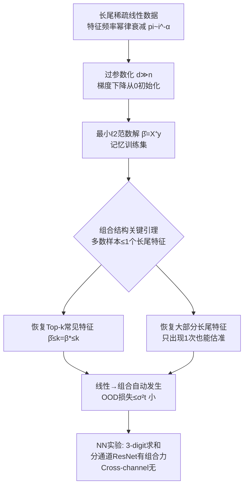

# Memorizing Long-tail Data Can Help Generalization Through Composition

**会议**: ICLR 2026  
**OpenReview**: [https://openreview.net/forum?id=UBoCMU5iYV](https://openreview.net/forum?id=UBoCMU5iYV)  
**代码**: [https://github.com/mhy-666/long-tail-memorization-composition](https://github.com/mhy-666/long-tail-memorization-composition)  
**领域**: 学习理论 / 泛化理论  
**关键词**: 记忆化, 长尾数据, 组合泛化, 过参数化, 最小范数解, OOD 泛化  

## 一句话总结
在一个过参数化的线性模型里证明：记忆只出现过一次的长尾特征，配合模型自带的"组合"能力，就能对训练中从未同时见过的长尾特征组合做出正确预测——并在改造版 MNIST/Omniglot 上验证这一直觉对神经网络也成立，且组合能力依赖网络架构。

## 研究背景与动机

**领域现状**：经典统计学习理论认为记忆训练数据（尤其是噪声/随机标签）会损害泛化，但深度网络反复打脸——它们能记住随机标签却仍泛化良好。两条解释线索逐渐成型：一是隐式正则化 / 良性过拟合（benign overfitting），训练过程和架构偏好某些泛化好的解；二是 Feldman (2020) 与 Feldman & Zhang (2020) 提出的"记忆长尾"视角——真实数据是长尾分布，记住稀有样本能捕捉独特子概念，当测试样本与某个训练样本相似时网络更可能预测对。

**现有痛点**：Feldman 这套"测试-训练相似性"的解释有个天花板——它只能覆盖"测试样本长得像某个见过的训练样本"的情况。但大模型展现的一个更惊人的性质是**组合（composition）**：把训练中学到的两块以上信息拼起来，去完成训练里压根没出现过的任务。这类样本和任何单个训练样本都不相似，相似性论证彻底失效。

**核心矛盾**：记忆长尾特征和组合能力直觉上应该是协同的——一个会组合的模型可以把两个分别记住的长尾特征拼成训练分布里概率极低的新组合。但此前没有理论刻画"记忆 + 组合"如何联手带来 OOD 泛化，也不清楚这种协同在什么条件下成立。

**本文目标**：在尽可能简单的模型上把"记忆长尾 + 组合 → OOD 泛化"这件事讲清楚、证出来，并检验这个直觉能否延伸到神经网络。

**核心 idea**：**用线性模型让组合"自动发生"**——线性模型 $f(x)=\langle\beta,x\rangle$ 一旦把若干特征的系数 $\beta_i$ 各自学准，任意这些特征的组合就自动预测得准。于是只要证明**过参数化下的最小 $\ell_2$ 范数解（它会记忆训练集）能恢复出绝大多数长尾特征的系数**，组合泛化就是免费的副产品。关键技术挑战是长尾特征出现次数极少（甚至只 1 次），标准浓度不等式失效，作者转而**挖掘数据矩阵的组合结构**：在合适的幂律衰减下，绝大多数样本至多只含一个长尾特征。

## 方法详解

### 整体框架

论文是一篇"理论为主、实验佐证"的工作。理论部分设定一个长尾特征的稀疏线性数据模型，用从 0 初始化的梯度下降得到最小范数插值解（即记忆解），证明它能恢复常见特征 + 大部分长尾特征，从而同时给出 in-distribution 测试损失和 OOD（组合）损失的上界（区分无噪/有噪两种情形）。实验部分先在线性模型上复现理论曲线，再迁移到"预测 3 个 MNIST 数字之和"的组合任务上，对比不同 ResNet 聚合架构，并用 Omniglot 单次样本 + weight decay 开关来隔离"记忆"这一因素。

### 关键设计

**1. 长尾稀疏线性数据模型：把"长尾 + 组合"塞进可分析的形式。** 每个数据 $x\in\{0,1,-1\}^d$ 的第 $i$ 维独立地以概率 $p_i$ 非零（再随机翻符号），频率按 $p_1\ge p_2\ge\cdots\ge p_d$ 排列，并常假设幂律衰减 $p_i=\min\{1,\,s\cdot i^{-\alpha}/Z_\alpha\}$。这样每个样本约 $s$-稀疏（$\mathbb{E}\|x\|_2^2\approx s$），前 $k$ 维是高频"常见特征"、其余是低频"长尾特征"。标签 $y=\langle\beta^*,x\rangle+\xi$，$\xi\sim\mathcal N(0,\sigma^2)$。这个模型的妙处在于：因为预测器也是线性的，"对一个特征子集学准 → 对该子集任意组合预测准"是天然成立的，于是**组合泛化被显式地约化成了特征系数恢复问题**，而长尾结构又恰好对应"有些 $\beta_i$ 的证据极其稀少"的硬骨头。

**2. 最小范数插值解作为"记忆"的数学化身。** 在过参数化 $d\gg n$ 下，对平方损失 $L(\beta)=\frac1n\|X\beta-y\|^2$ 从 0 初始化跑梯度下降，收敛到最小 $\ell_2$ 范数解 $\hat\beta=(X^\top X)^\dagger X^\top y$。无噪 $\sigma=0$ 时它精确插值（记住）全部训练数据；有噪时虽未必达到 0 训练损失，但仍是范数最小的全局极小。作者用它来精确刻画"记忆"，从而能问一个干净的问题：一个把训练集都记住的解，到底能不能在没见过的长尾组合上泛化？

**3. 组合结构引理：绕开失效的浓度不等式。** 核心障碍是常见特征频率可低至 $p_k=\tilde\Theta(1/n)$ 量级、长尾特征更稀，方差巨大，标准浓度界根本压不住。作者的破局点是直接分析数据矩阵 $X$ 的组合结构：在合适的幂律衰减下证明**绝大多数样本至多含一个长尾特征**（Lemma 6/7）。具体地，存在 $\Theta(n(1-p_{>k}))$ 个样本只用到 $k$ 个常见特征，足以在 $k<n$ 时唯一确定常见部分 $\hat\beta_{\le k}=\beta^*_{\le k}$；一旦常见特征定下来，那些"只和常见特征同现、不与其他长尾特征同现"的长尾特征 $\hat\beta_i$ 也能被精确恢复——哪怕它在训练里只出现过 1 次。这把"恢复几乎所有出现过的特征"做实，恢复特征集 $\hat F$ 的占比高达 $1-\Theta(\max\{p_k/p_{>k},\,p_{>k}^2\ln^2 d\})$。

**4. 从特征恢复到 in/OOD 双重保证（区分无噪与有噪）。** 把特征恢复结果代回去就得到泛化界。无噪情形（Theorem 2/3）：测试损失 $\lesssim p_{>k}+\frac{k\ln^4 d}{n^2 p_{>k}}+\cdots$，幂律下化简为 $\tilde O\big(s(\ln^2 d/ns)^{1-1/\alpha}\big)$；更关键的是 OOD 保证——对任意由恢复特征集 $\hat F$ 里子集构成的强制同现分布 $D_{\tilde F}$（即人为让若干长尾特征在每个测试样本都非零，模拟"训练里从未同时出现"的组合），损失同样被压到这个小量。Theorem 1 的口语版即：若测试样本是 $t$ 个各自只出现过一次的长尾特征的组合，最小范数解的 OOD 损失至多 $\sigma^2 t$。有噪情形（Theorem 4/5）需要更强的尾部衰减假设（$\alpha=2+c_\alpha$）来保证"每个样本至多一个长尾特征"，核心论证变成：若某长尾特征只在一个样本里出现，则该样本训练损失为 0、该特征能被估准（误差到噪声量级 $\sigma$），测试损失约 $\Theta(\sigma^2 k/n)$。

## 实验关键数据

### 线性模型验证（Figure 1）

设 $n=1000,\,d=10000,\,s=5,\,np_k=10,\,\beta^*_i=i^{-0.1}$，50 次平均。结论与理论吻合：

| 观测项 | 现象 | 对应理论 |
|--------|------|----------|
| 长尾特征误差 vs 噪声 | 误差大致正比于噪声 $\sigma$ | Thm 1：只出现 1 次的长尾特征误差略大于噪声 |
| 常见特征误差 | $\alpha$ 不太小时学得好 | Thm 2 |
| in/OOD 测试损失 | $\alpha$ 较大时都很小；$\sigma=0$ 与 $0.05$ 曲线几乎重合 | Thm 2/3/4/5 |
| $\alpha=1$（衰减太慢） | in/OOD 损失与特征误差均升高 | 长尾特征出现略多，破坏分析依赖的组合结构 |

### 神经网络组合任务（Figure 2 + Table 1）

任务：3 张 MNIST 数字图沿通道堆叠（$3\times28\times28$），预测三数之和；数字按 Zipf 分布（'0' 最常见，'9' 最稀）；测试样本强制含至少一个 '9'（其余两位从 0-4 采样），且测试用的 '9' 训练中从未见过。训练集 32,000 样本（数字 0 出现 77,435 次，8 出现 955 次）。

**架构对比（Figure 2）**：分通道独立过 ResNet-18 再聚合的 **Sum / Linear / 2-layer** 三种模型都在含 '9' 的 OOD 测试上表现良好——尽管 '9' 罕见、本身没学好，说明模型靠记忆的 '9' 实例做了组合。而把 3 张图当彩色通道一起喂、从第一层就混信息的 **Cross-channel** 模型测试损失显著更差，证明组合能力依赖架构。

**记忆隔离实验（Table 1）**：训练里掺入 10 张 Omniglot 图（每类 1 张，各只出现 1 次，标 0-9），测试样本含两张 Omniglot 图（训练中从未同时出现、且在欧氏/嵌入距离上都不接近任何训练样本）。用 weight decay 开关切换"记忆/不记忆"：

| 模型 | WD=0（记忆）Test/Train | WD=0.5（不记忆）Test/Train |
|------|------------------------|----------------------------|
| Sum | 0.1760 / 0.0004 | 2.8744 / 0.0245 |
| Linear | 0.1662 / 0.0004 | 1.5539 / 0.0505 |
| 2-layer | 0.1351 / 0.0010 | 0.6447 / 0.0264 |
| Cross-channel | 22.9671 / 0.0023 | 23.6506 / 0.0375 |

### 关键发现
- 记忆只出现一次的极稀样本，配合组合架构，能在"两张 Omniglot 同现"这种与任何训练样本都不相似的测试上保持低损失；一旦加 weight decay 关掉记忆，训练损失只略升、测试损失却暴涨数倍到十几倍。
- Cross-channel 无论是否记忆都表现极差（test loss 22+），坐实"组合能力是架构属性，记忆只在有组合力的架构上才发挥作用"。
- 线性理论的定性预测（长尾误差正比噪声、$\alpha$ 太小破坏结构）在仿真中如实出现。

## 亮点与洞察
- **把"组合"约化成"特征恢复"是全文最聪明的一招**：选线性模型不是为了简单，而是因为线性让组合天然成立，从而把一个模糊的能力问题变成可证的代数恢复问题。
- **真正的技术贡献在组合结构引理**，而非泛化界本身：在频率低到浓度不等式失效的区间，用"多数样本至多含一个长尾特征"的组合论证替代浓度，是处理极稀有特征的可复用工具。
- **给"记忆为何必要"提供了组合视角的新解释**：Feldman 用相似性解释记忆的价值，本文把它推进到"记忆是组合长尾特征的前提"，覆盖了相似性论证够不着的 OOD 组合区。
- **架构依赖性是一个干净且有冲击力的实证**：同样 ResNet-18，聚合方式（分通道 vs 混通道）直接决定有没有组合力，提示组合是结构归纳偏置而非单纯容量问题。

## 局限与展望
- 理论严格只覆盖**线性设定**，神经网络部分仅靠小网络监督任务的直觉延伸，二者之间有明显 gap。
- 任务非常 toy（3 数字求和、Omniglot 单样本），离真实大模型的组合泛化还很远。
- 作者自己点出反例：当长尾特征与其他特征/标签**伪相关**或被**误标**时，记忆反而会损害组合——本文只讲了记忆的正面作用，负面边界未刻画。
- 有噪情形需要更强的尾部衰减假设（$\alpha=2+c_\alpha$）才能维持"每样本至多一个长尾特征"，假设强度与现实长尾的契合度存疑。

## 相关工作与启发
- **良性过拟合 / 隐式正则化**（Belkin 2019, Bartlett 2020, Hastie 2022）：解释记忆为何不伤泛化；本文的最小范数解分析正建立在这套过参数化线性框架上，但回答的是"记忆如何主动帮组合"。
- **记忆长尾**（Feldman 2020；Feldman & Zhang 2020）：最直接的前作，论证记忆对长尾近优泛化的必要性；本文是其自然延伸，把"记忆→相似样本预测"升级为"记忆→长尾特征组合"。
- **组合泛化**（Lake & Baroni SCAN, Kim & Linzen CoGS, Fodor & Pylyshyn）：提供了组合能力的评测与争论背景；本文不发新 benchmark，而是聚焦记忆与组合的理论连接。
- **启发**：对做长尾/稀有类学习的人，这暗示不要一味用强正则压记忆——在具备组合归纳偏置的架构里，保留对稀有样本的记忆可能是 OOD 组合泛化的必要条件；架构设计上"先分别编码再聚合"比"早期混合"更利于组合。

## 评分
- **新颖性**: ⭐⭐⭐⭐ 首次在可证框架里把"记忆长尾 + 组合 → OOD 泛化"联系起来，组合结构引理是新的技术工具，视角新颖。
- **实验充分度**: ⭐⭐⭐ 线性仿真与理论吻合、NN 实验设计巧妙（架构对比 + weight decay 隔离记忆很干净），但任务偏 toy、规模小，缺真实大模型验证。
- **写作质量**: ⭐⭐⭐⭐ 动机递进清晰，理论与实验对应明确，把"为什么选线性"讲得很透。
- **价值**: ⭐⭐⭐⭐ 为"记忆何时有益、组合从何而来"提供了干净的理论支点，对理解大模型组合行为有启发意义，尽管离实践尚远。

<!-- RELATED:START -->

## 相关论文

- [\[ICLR 2026\] Optimizing Data Augmentation through Bayesian Model Selection](optimizing_data_augmentation_through_bayesian_model_selection.md)
- [\[ICLR 2026\] Covariate-Guided Clusterwise Linear Regression for Generalization to Unseen Data](covariate-guided_clusterwise_linear_regression_for_generalization_to_unseen_data.md)
- [\[ICLR 2026\] Critical Attention Scaling in Long-Context Transformers](critical_attention_scaling_in_long-context_transformers.md)
- [\[ICLR 2026\] Escaping Model Collapse via Synthetic Data Verification: Near-term Improvements and Long-term Convergence](escaping_model_collapse_via_synthetic_data_verification_near-term_improvements_a.md)
- [\[ICLR 2026\] Provable Separations between Memorization and Generalization in Diffusion Models](provable_separations_between_memorization_and_generalization_in_diffusion_models.md)

<!-- RELATED:END -->
