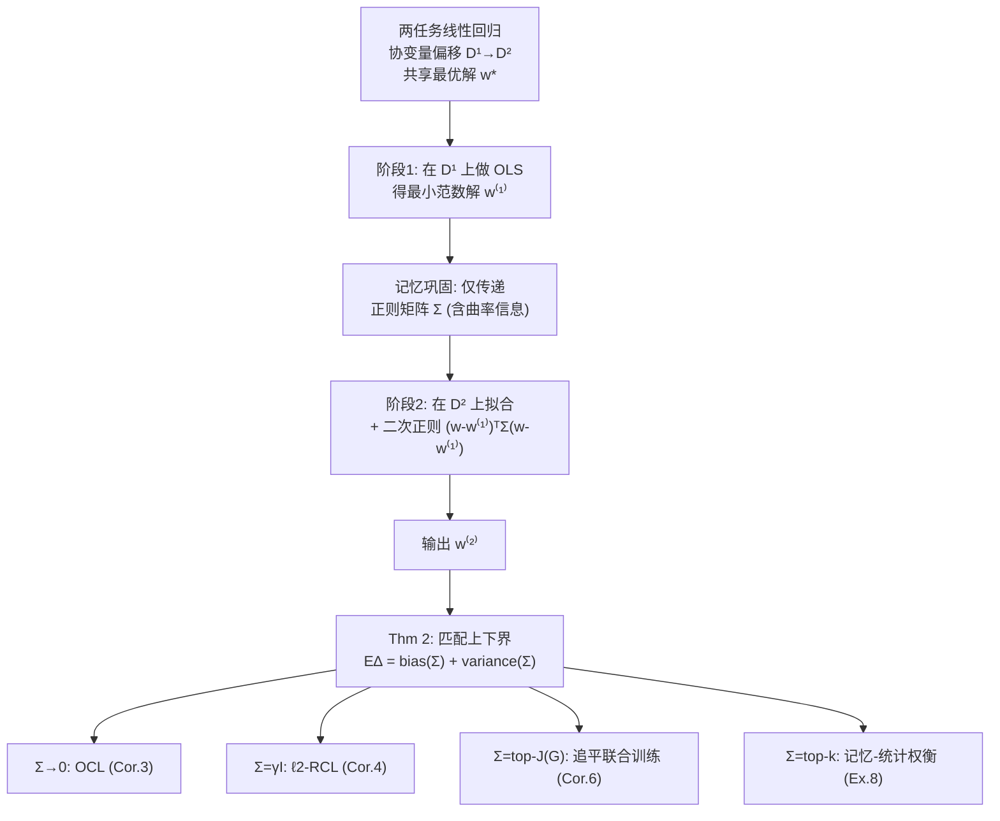

# Memory-Statistics Tradeoff in Continual Learning with Structural Regularization

**会议**: ICLR 2026  
**OpenReview**: [https://openreview.net/forum?id=qfEqXJnlB4](https://openreview.net/forum?id=qfEqXJnlB4)  
**代码**: 待确认  
**领域**: 学习理论 / 持续学习  
**关键词**: 持续学习, 灾难性遗忘, 结构正则化, 线性回归, 随机设计, 过量风险, 记忆-统计权衡  

## 一句话总结
在两任务线性回归的随机设计下，本文为"基于前一任务 Hessian 的广义 $\ell_2$ 结构正则化"算法给出了匹配的过量风险上下界，首次从理论上揭示了持续学习中**记忆复杂度（正则化矩阵的秩/向量数）与统计效率之间存在可证明的权衡**：用更多向量记住旧任务曲率就能逼近联合训练的精度，用得越少则越容易灾难性遗忘。

## 研究背景与动机

**领域现状**：持续学习（CL）让模型顺序地学习一串任务，但受限于长期记忆，agent 不能把所有旧数据存下来做联合训练。结构正则化（EWC、MAS、SI 等）是缓解灾难性遗忘最主流的一类方法：它存一个 PSD 重要性矩阵（近似旧任务参数的 Hessian/Fisher），在学新任务时用二次正则项约束"重要参数"不要偏离太多。

**现有痛点**：完整重要性矩阵的存储是 $O(d^2)$，对神经网络不可承受，于是实践中用对角近似、K-FAC、sketching 等手段压缩。经验上大家观察到"近似越精确（越占内存）→ CL 性能越好"，但这只是经验规律——**理论上从没有人把"记忆开销"和"统计性能"显式地联系起来**。已有的 CL 理论（Evron 2022、Li 2023、Zhao 2024）要么只分析固定内存的特定正则器，要么只停留在优化层面、或对输入数据做了过强假设（固定设计），无法刻画输入分布随机性。

**核心矛盾**：记得越多越准，但内存越贵。这个"记忆-统计"权衡到底是经验巧合，还是有一条可证明的定量边界？现有理论答不上来。

**本文目标**：在两任务线性回归 + 协变量偏移 + 随机设计（one-hot / Gaussian）下，给出结构正则化 CL 算法过量风险的**匹配上下界**，把内存大小作为显式变量写进风险公式里。

**核心 idea**：**[随机设计 + 广义正则器]** 提出统一的广义 $\ell_2$ 正则化持续学习（GRCL），用一个可由用户指定、与数据协方差可交换的 PSD 矩阵 $\Sigma$ 当正则器；当 $\Sigma\to 0$ 退化为普通 CL（OCL），$\Sigma=\gamma I$ 退化为 $\ell_2$-RCL。通过把 $\Sigma$ 的"不同特征向量个数"定义为记忆复杂度，风险界就成了 $\Sigma$ 的函数，权衡自然浮现。

## 方法详解

### 整体框架
本文不是提算法，而是搭一套理论分析框架：设定两任务线性回归在协变量偏移下的随机设计，把 OCL / $\ell_2$-RCL / 联合训练统一成"广义 $\ell_2$ 正则化 CL（GRCL）"的特例，然后对 GRCL 的联合过量风险 $\Delta(w^{(2)})=R(w^{(2)})-\min R$ 同时给出 bias 项与 variance 项的匹配上下界，再用这套界去推导三件事：OCL/$\ell_2$-RCL 何时灾难性遗忘、GRCL 何时能追平联合训练、以及内存与风险之间的定量权衡曲线。

### 关键设计

**1. 问题设定：协变量偏移下的随机设计 + 共享最优解，把"输入随机性"放进遗忘分析。** 两任务数据各 $n$ 条，分别来自分布 $D^{(1)},D^{(2)}$，协方差矩阵 $G=\mathbb{E}_{D^{(1)}}[xx^\top]$、$H=\mathbb{E}_{D^{(2)}}[xx^\top]$，并假设两者可交换（不失一般性取对角）。关键的现实化假设是用**随机设计**（输入向量随机采样）取代以往工作的固定设计——这样才能把"输入分布的随机性"纳入遗忘刻画。再假设两任务共享一个最优参数 $w^*$（过参数化网络确实能同时解多任务，假设温和），从而把分析聚焦在协变量偏移本身、而非标签冲突。评价指标是联合过量风险 $\Delta(w^{(2)})=R_1(w^{(2)})+R_2(w^{(2)})-\min R$。

**2. GRCL：用一个可调 PSD 矩阵 $\Sigma$ 统一所有正则化 CL，把"记忆"参数化。** 两阶段流程——阶段一对 $D^{(1)}$ 做普通最小二乘得最小范数估计 $w^{(1)}$；记忆巩固阶段只把正则矩阵 $\Sigma$（连同曲率信息）传过去；阶段二在拟合 $D^{(2)}$ 的同时加二次正则 $(w-w^{(1)})^\top \Sigma (w-w^{(1)})$ 约束模型别偏离旧解太多。妙处在于 $\Sigma$ 既是正则器又是"内存账本"：**记忆复杂度被定义为 $\Sigma$ 里不同特征向量的个数**（即 $\Sigma$ 的秩 $k$）。$\Sigma\to 0$ 时退化为只传一个向量 $w^{(1)}$ 的 OCL，$\Sigma=\gamma I$ 时退化为多传一个标量 $\gamma$ 的 $\ell_2$-RCL，于是整条"低内存→高内存"谱系被一个公式覆盖。

**3. 匹配上下界（Theorem 2）：把 bias/variance 写成 $\Sigma$ 与 $(G,H,\sigma^2,n)$ 的显式函数。** 在 one-hot 设计（输入采自自然基，$P(x^{(1)}=e_i)=\mu_i$，$P(x^{(2)}=e_i)=\lambda_i$）下，证明 $\mathbb{E}\Delta(w^{(2)})\asymp \text{bias}+\text{variance}$，其中
$$\text{bias}\asymp \big\langle (G+H)(I-G)^n\big(\Sigma^2(\Sigma+H)^{-2}+(I-H)^n\big),\, w^*w^{*\top}\big\rangle,$$
variance 项同样写成含 $\Sigma^2(\Sigma+H)^{-2}$ 的内积形式。"matching upper and lower bounds"意味着这不是松的估计，而是紧到常数倍的刻画——遗忘到底有多严重、正则器能挽回多少，都被这个公式定死了。这是后续所有推论的母定理。

**4. 三条推论把权衡讲透：失败、追平、与中间地带。** ① **灾难性遗忘（Cor.3/4 + Ex.5）**：OCL 只有 $o(n)$ 误差需要 $\sum_{i\in K}\mu_i/\lambda_i + n^2\sum_{i\in J\cap K^c}\mu_i\lambda_i=o(n)$；当主导特征上 $G,H$ 特征值错配（如 $\mu_1=1,\lambda_1=1/n$）时 $\mathbb{E}\Delta=\Omega(1)$ 常数级遗忘，$\ell_2$-RCL 也存在解不了的反例。② **追平联合训练（Cor.6）**：只要取 $\Sigma=\mathrm{diag}(\gamma_i)$，对 $\mu_i\ge 1/n$ 取 $\gamma_i=\mu_i$、其余取 0（即用大小为 $|J|$ 的正则器抓住 $G$ 所有大于 $1/n$ 的 top 特征），就有 $\mathbb{E}\Delta(w^{(2)})\lesssim \mathbb{E}\Delta(w_{\text{joint}})$，彻底消除遗忘。③ **记忆-统计权衡（Ex.8）**：当 $G$ 谱为幂律 $\mu_i=i^{-\alpha}$、取 top-$k$ 正则时，
$$\mathbb{E}\Delta(w^{(2)})\lesssim \mathbb{E}\Delta(w_{\text{joint}})\cdot\Big(1+\frac{n}{k^\alpha}\Big),$$
即风险比随内存 $k$ 增大以 $n/k^\alpha$ 的速率下降，到 $k=\sqrt[\alpha]{n}$ 时追平联合训练——这正是"多记一点曲率，少遗忘一点"的可证明定量曲线。

## 实验关键数据

数值实验在 Gaussian 设计（$x^{(1)}=G^{1/2}z^{(1)}$，$z\sim\mathcal{N}(0,I)$）下验证理论，任务取自 Wu 2022 / Li 2023，维度 $d=200$，每点取 20 次独立运行的经验均值。

### 主实验：随样本量收敛（Figure 1a）

| 算法 | 内存 | 随 $n$ 增大的过量风险 |
|------|------|----------------------|
| 联合训练 JL | 全量 | 随 $n$ 持续下降（基准下界） |
| OCL | 仅 1 向量 $w^{(1)}$ | **卡在常数**（灾难性遗忘） |
| GRCL, $k=1$ | 1 个特征向量 | 部分缓解，仍高于 JL |
| GRCL, $k=5$ | 5 个特征向量 | **追平 JL 的收敛速率** |

### 消融：随内存大小变化（Figure 1b，固定 $n=5000$）

| 内存大小 $k$ | GRCL 过量风险 |
|------|------|
| 小（接近 OCL） | 高，接近 OCL 的常数遗忘 |
| 中等 | 随 $k$ 单调下降 |
| $k\le 15$ | **达到联合训练性能** |

### 关键发现
- **遗忘是"内存不足"的直接后果**：OCL 只传一个向量，遇到主导特征错配就常数级遗忘；这与理论 Ex.5/Ex.7 完全吻合。
- **存在可证明的权衡曲线**：内存 $k$ 越大风险越低，且下降率 $n/k^\alpha$ 由数据谱的幂律指数 $\alpha$ 决定——谱衰减越快（$\alpha$ 越大），少量内存就够追平联合训练。
- **结构正则化能逼近"作弊上界"**：GRCL 在仅用 $k\le 15$（远小于 $d=200$）的内存下就追平了能同时访问两任务的联合训练，说明曲率感知的正则化确实是 CL 的关键。

## 亮点与洞察
- **第一篇把"内存"写进 CL 风险公式的理论工作**：以往 CL 理论都固定内存分析特定正则器，本文用 $\Sigma$ 的秩 $k$ 当显式变量，让"记忆-统计权衡"从经验观察升级为可证明的定量律。
- **匹配上下界而非单边估计**：bias/variance 都给了紧到常数倍的上下界，因此能严格区分"OCL 必败"与"GRCL 可救"，而不是模糊地说"正则化有帮助"。
- **统一视角**：OCL、$\ell_2$-RCL、联合训练全是 GRCL 在不同 $\Sigma$ 下的特例，一个定理覆盖整条内存谱系，结构清晰。
- **可操作的设计启示**：理论直接给出"该记哪些方向"——抓住 $G$ 中大于 $1/n$ 的 top 特征（即 $|J|$ 个主曲率方向）就能消除遗忘，为实践中"该把内存花在哪"提供了原则性指导。
- **额外的 Gaussian 设计洞察**：把无正则结果推广到 Gaussian 设计后发现，遗忘不仅来自主导特征差异，**尾部特征的细微差异也能引发灾难性遗忘**，这是 one-hot 设定看不到的新现象。

## 局限与展望
- **仅两任务线性回归**：核心定理（Thm 2 的 GRCL 匹配界）只在 one-hot 设计的两任务线性回归下成立；多任务和 Gaussian 设计下 GRCL 的完整上下界因技术障碍尚未给出（只补了 OCL 的界）。
- **强结构假设**：要求 $G,H$ 可交换、共享最优解 $w^*$、well-specified 高斯噪声同方差——虽然作者论证这些假设温和且可推广，但离真实神经网络仍有距离。
- **NTK 才连到神经网络**：对一般神经网络的延伸停留在 NTK regime，未触及特征学习阶段的遗忘。
- **展望**：把记忆-统计权衡推广到 replay（episodic memory 大小）与 projection（GPM 子空间秩）等其他 CL 范式，作者明确指出这是激动人心的开放方向；以及把匹配界做到 Gaussian / 多任务 / 真实非线性网络。

## 相关工作与启发
- **结构正则化 CL**：EWC（Kirkpatrick 2017）、MAS（Aljundi 2018）、SI、K-FAC（Ritter 2018）、sketching（Li 2023）——本文为这一整类"存重要性矩阵"的方法提供了统一的理论解释，并解释了"近似越精确越好"的经验规律本质就是"内存换统计效率"。
- **CL 理论**：Evron 2022（固定设计、只到优化层面）、Li 2023（固定设计两任务 $\ell_2$-RCL）、Zhao 2024（固定设计统计性能）——本文用随机设计纳入输入随机性，并首次显式刻画内存-性能关系，是这条线上的关键推进。
- **良性过拟合/随机设计回归**：Hsu 2012、Bartlett 2020、Zou 2021、Wu 2022 的随机设计分析工具被借来刻画 CL 的 bias-variance，启发在于"持续学习的遗忘"本质可以用过参数化线性回归的谱分析语言精确表达。
- **启发**：对实践者，"该把有限内存花在数据协方差的 top 主曲率方向上"是可直接迁移的原则；对理论者，把"内存"显式参数化为正则器的秩，是研究其他 CL 范式权衡的可复用范式。

## 评分
- **新颖性**: ⭐⭐⭐⭐⭐ 首次把记忆复杂度写进 CL 过量风险公式并给出匹配上下界，将"记忆-统计权衡"从经验观察提升为可证明定律，视角新颖。
- **实验充分度**: ⭐⭐⭐ 作为理论论文，数值实验（Fig.1a/b）干净地验证了收敛与权衡两条主结论，但规模小（$d=200$、合成数据），真实 CL 数据集结果放在附录、说服力有限。
- **写作质量**: ⭐⭐⭐⭐ 定义—定理—推论—反例—权衡的逻辑链条清晰，OCL/RCL/GRCL 统一视角组织得当；但公式密集、符号繁多，对非理论读者门槛较高。
- **价值**: ⭐⭐⭐⭐ 为整类结构正则化 CL 方法提供了原则性解释和"该记哪些方向"的设计指导，并开辟了"内存-性能权衡"这一可推广到 replay/projection 的研究范式，理论价值高。

<!-- RELATED:START -->

## 相关论文

- [\[ICLR 2026\] Variational Deep Learning via Implicit Regularization](variational_deep_learning_via_implicit_regularization.md)
- [\[ICLR 2026\] Understanding the Dynamics of Forgetting and Generalization in Continual Learning via the Neural Tangent Kernel](understanding_the_dynamics_of_forgetting_and_generalization_in_continual_learnin.md)
- [\[ICLR 2026\] PAC-Bayes Bounds for Cumulative Loss in Continual Learning](pac-bayes_bounds_for_cumulative_loss_in_continual_learning.md)
- [\[ICLR 2026\] Statistical and Structural Identifiability in Representation Learning](statistical_and_structural_identifiability_in_representation_learning.md)
- [\[ICLR 2026\] Multi-Synaptic Cooperation: A Bio-Inspired Framework for Robust and Scalable Continual Learning](multi-synaptic_cooperation_a_bio-inspired_framework_for_robust_and_scalable_cont.md)

<!-- RELATED:END -->
