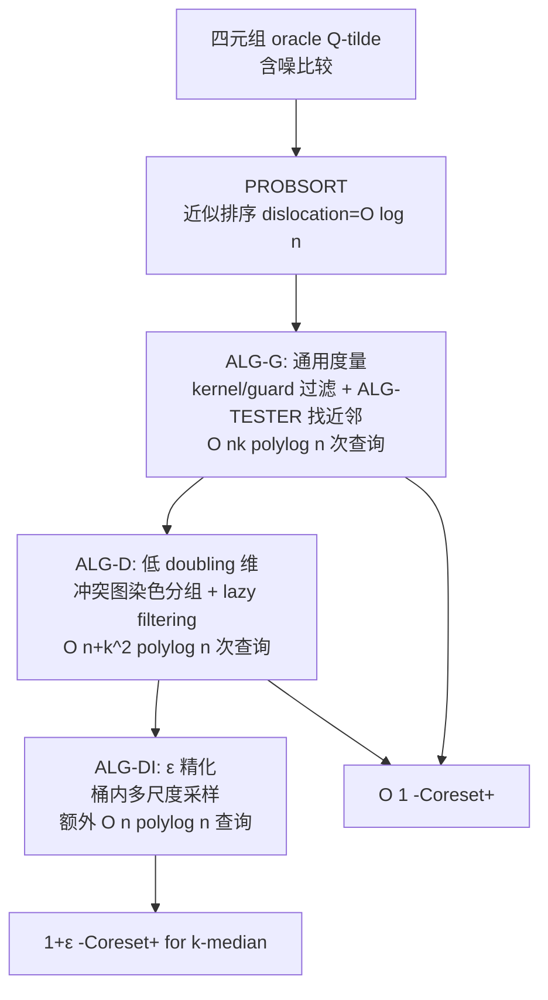

# Metric $k$-Clustering using only Weak Comparison Oracles

**会议**: ICLR 2026  
**OpenReview**: [https://openreview.net/forum?id=KmMEQOtXAy](https://openreview.net/forum?id=KmMEQOtXAy)  
**代码**: 待确认  
**领域**: learning theory  
**关键词**: 聚类, k-median/k-means, coreset, 四元组比较 oracle, 含噪比较, doubling dimension, 查询复杂度  

## 一句话总结
仅靠一个会出错的"四元组比较 oracle"（回答"A 到 B 近，还是 C 到 D 近"），无需任何真实距离，就能用 $O(nk\,\mathrm{polylog}\,n)$ 次查询为 $k$-median/$k$-means 构造常数近似的 Coreset+，并在低维（bounded doubling dimension）下进一步把近似比改进到 $1+\varepsilon$。

## 研究背景与动机
**领域现状**：经典 $k$-clustering（$k$-center / $k$-median / $k$-means）都假设能精确计算任意两点的距离。但在图像、文本等复杂数据上，人工设计一个能反映"语义相似"的距离函数本身就很难，即便有了距离，逐对求值也可能代价高昂。于是出现了一条用 **oracle 替代距离** 的研究线：oracle 抽象了机器学习模型或人类反馈，只提供关于点对相对距离的部分信息。

**现有痛点**：纯比较模型（R-model，只有四元组 oracle）下，Galhotra et al. (2024) 证明了即使 oracle 完全无噪，$k$-median/$k$-means 也无法得到任何 $o(n)$ 近似——光靠比较信息根本不够。为绕开这个不可能性，后续工作（Galhotra 2024、Raychaudhury 2025）引入了 **RM-model**：在四元组 oracle 之外，额外允许一个返回精确距离的"强 oracle"。

**核心矛盾**：这个强距离 oracle 在实践中往往**根本不存在**或代价极高（求精确距离本身可能是 NP-hard），而且现有算法必须把距离查询和比较查询**交织**调用，形成计算瓶颈。

**本文目标**：彻底丢掉距离 oracle，问"只有一个会出错的四元组 oracle，聚类最好能做到什么程度？"。作者先在附录证明了一个下界——R-model 下任何 $o(n)$ 近似算法都至少需要 $2k-1$ 个中心，说明"恰好 $k$ 个中心"不可能，必须放宽中心数。

**核心 idea**：**用近似排序桥接"比较"与"距离"**——四元组 oracle 本质是个含噪比较器，作者把含噪排序（dislocation $O(\log n)$）+ 递归采样 coreset 框架缝合起来，输出 $O(k\,\mathrm{polylog}\,n)$ 个中心 + 一个映射，使总聚类代价在最优的常数倍内（即 **Coreset+**），全程只用四元组比较。

为什么这事不平凡：在 R-model 里我们连"$v$ 的最近样本是谁"都无法直接算——含噪排序只保证 rank 大致正确，错排两点的真实距离比例完全没有保证。论文要做的就是在"只有相对顺序、且顺序还会出错"的极弱信息下，把经典 coreset 框架里每一步对距离的依赖逐个替换成可靠的比较原语。

## 方法详解

### 整体框架
目标是构造 **Coreset+**：一个中心集 $C\subseteq V$（$|C|=O(k\,\mathrm{polylog}\,n)$）加一个映射 $M:V\to C$，使 $\sum_{v\in V} d(v,M(v))\le O(1)\cdot \mathrm{OPT}^p_k$。骨架是一个经典的递归采样过程：每轮采样 $\Theta(k\,\mathrm{polylog}\,n)$ 个点 $S$，按"到 $S$ 的最近邻距离"给点排序，删掉前半部分的一个常数比例，递归到剩余点，最后把各轮采样并起来即得 coreset。难点在于 R-model 下既不能算最近邻、也不能精确排序，作者用三个递进算法把这套流程在"只有含噪比较"下跑通。

### 关键设计

**1. PROBSORT 与 ALG-TESTER：把含噪比较转成可用的"距离判别"。** 直接用四元组 oracle 排序只能拿到**最大位错 $O(\log n)$** 的近似序（Lemma 2.1，源自 Geissmann et al. 2025，$\phi<1/4$ 时 $O(n\log n)$ 次查询），它能保证 rank 大致对，却对"错排的两条边谁真的更短"毫无保证。作者的关键观察是：当满足特定结构条件（两条边都长于各自 kernel 半径 $r_s$、且已知哪个 kernel 更小）时，可以设计 ALG-TESTER，用对较小 kernel 的若干次比较来判断 $d(s_1,v_1)<d(s_2,v_2)$，并且当两距离相差超过 2 倍时高概率正确。这等价于**模拟出一个对抗噪声 $\mu=1$ 的四元组 oracle**——而对抗噪声下可以用 ADVSORT（QuickSort 变体）得到 $O(1)$-sorted 序列。于是 ALG-TESTER 成为把"弱的概率比较"升级成"强的常数近似排序"的核心齿轮。

**2. KERNEL/GUARD 双采样过滤：在没有距离时定位"近邻锚点"。** ALG-G 每轮取两个样本 $S^{(1)}_i$（大小 $\Theta(k\log^2 n)$）和 $S^{(2)}_i$（大小 $\Theta(k\log^3 n)$）。对 $S^{(1)}_i$ 中每个 $s$，用 PROBSORT 排序 $E(S^{(1)}_i,S^{(2)}_i)$ 后切出两组各 $\Theta(\log n)$ 个点：**kernel** $\mathrm{KERNEL}_i(s)$ 和 **guard** $\mathrm{GUARD}_i(s)$，满足 kernel 严格比 guard 离 $s$ 近、且两者在 rank 上都极接近 $s$。然后对每个待处理点 $v$ 计算与 guard 的"接近度计数" $\mathrm{PCOUNT}_s(v)=\sum_{g\in\mathrm{GUARD}_i(s)}\mathbf{1}\{\tilde Q(\{s,v\},\{s,g\})\text{ 判 }d(s,v)\le d(s,g)\}$，把那些对某个 $s$ 计数过半的（即太靠近样本的）点过滤掉。过滤保证以高概率保留至少 $\tfrac35|V_i|$ 的点，且留下的点都比 kernel 半径 $r_s$ 远——这恰好满足 ALG-TESTER 触发条件，使后续找近邻能像对抗 oracle 一样工作，从而给每个点找到 4-近似最近邻。整套 ALG-G 用 $O(nk\,\mathrm{polylog}\,n)$ 次查询得到 $O(1)$-Coreset+（Theorem 3.1）。

**3. 冲突图染色 + lazy filtering：低维下把查询从 $nk$ 降到 $n+k^2$。** ALG-D 针对 bounded doubling dimension。它不再对所有点做全局过滤+找近邻（那要 $O(nk)$），而是先把 $S^{(1)}_i$ 内部"互相太近"的点连边构成冲突图 $G_i$，证明 $G_i$ 是 $O(\log n)$-degenerate，于是贪心染色把 $S^{(1)}_i$ 拆成 $\chi_i$ 个"类内两两不近"的颜色类。对每个颜色类复用 Raychaudhury et al. (2025) 的近邻数据结构求近邻，oracle 仍由 ALG-TESTER 模拟；为避免对"太近的点"误判，采用**惰性过滤**：每次 ALG-TESTER 被调用时才即时算接近度，发现太近就丢弃，从而省掉昂贵的全局过滤步。整体只需 $O((n+k^2)\,\mathrm{polylog}\,n)$ 次查询（Theorem 3.2）。

**4. 桶内多尺度采样：把常数近似精化到 $1+\varepsilon$。** ALG-DI 接收 ALG-G/ALG-D 产出的 Coreset+，对每个中心 $s$ 及其映射点集 $U_s$，把点按到 $s$ 的距离做几何分桶（外半径每次翻倍，$O(\log n)$ 个桶）。低维下若能命中每个桶就能改进近似，但没有距离无法精确分桶；作者改为在 $O(1)$-sorted 序（无需额外查询，直接从 ANN 排序中提取）上**多步后缀采样**：先从 $U_s$ 采样，再从后一半采、再后四分之一……以高概率命中所有相关距离尺度，再用 PROBSORT 重建映射 $M^+$。仅需额外 $O(n\,\mathrm{polylog}\,n)$ 次查询，即得 $k$-median 的 $\varepsilon$-Coreset+（Theorem 3.3）。

## 实验关键数据
这是理论论文，实验只是 Python 上的"概念验证"。模拟概率噪声 $\phi=0.15$（oracle 0.85 概率答对），算法和 baseline 都只能通过 oracle 访问数据。Baseline = 直接套用 Generic 算法但**无条件相信** oracle 的每个答案。

### 主实验：合成数据（$k=5$, $10^4$ 点）

| 方法 | $k$-means 代价 |
|------|---------------|
| Optimal（k-means++ on ground truth） | $2.9\times10^4$ |
| **Ours** | $3.1\times10^4$（约偏离最优 7%） |
| Baseline | $4\times10^5$（超最优 >1200%） |

构造出的 coreset 仅 **187 个点**，相比原始 $10^4$ 点压缩约 98%。

### 真实数据（Adult ~50k→采样 2k；Credit ~30k→采样 2k）

| 设置 | Ours | Baseline |
|------|------|----------|
| 变 $k\in\{4,...,8\}$ | 始终贴近最优 | 比 Ours 高 2.5–4 倍 |
| 变噪声 $\phi\in\{0.05,...,0.25\}$ | 代价几乎与 $\phi$ 无关，贴近最优 | 代价随 $\phi$ 显著上升 |

### 关键发现
- **对噪声鲁棒**：本文方法的代价基本不随 $\phi$ 变化，与理论保证一致；baseline 因盲信 oracle 在高噪声下迅速崩坏。
- **映射质量是核心**：实验主要验证 Coreset+ 的"点→中心映射"——只要映射对，把 NP-hard 的聚类负担转移到几百个代表点上即可。
- **可视化直观**：合成数据上本文找到的中心几乎与真实中心重合，而 baseline 因错误映射漏掉了部分簇，定性图与定量代价一致。
- **压缩比可观**：$10^4$ 点压到 187 个 coreset 点（约 98% 缩减），后续聚类只需在这个小集合上做。

## 亮点与洞察
- **打掉了距离 oracle 这根拐杖**：此前认为 R-model 下 $k$-median/$k$-means 必须借助精确距离 oracle，本文首次证明只用含噪四元组比较也能拿常数近似（代价是放宽到 $O(k\,\mathrm{polylog}\,n)$ 个中心，且有 $2k-1$ 中心下界佐证这是必要的）。
- **"近似排序 ↔ 对抗 oracle"的桥接技巧**：ALG-TESTER 通过 kernel/guard 结构，把弱的概率比较在局部"升格"成对抗噪声 oracle，再喂给 ADVSORT 拿常数近似——这个把含噪比较转成可用排序原语的思路很可迁移。
- **LLM 时代的接口契合**：四元组查询"A 像 B 还是 C 像 D"天然适配 LLM/embedding 服务/众包，论文给出了把低成本含噪 oracle 系统性接入可扩展聚类的范式。
- **near-optimal 查询复杂度**：通用度量 $O(nk\,\mathrm{polylog}\,n)$、低维 $O((n+k^2)\,\mathrm{polylog}\,n)$，与 RM-model 下需借助距离 oracle 的已有最好结果在对数因子内持平，却完全无需距离信息。

## 局限与展望
- **不是恰好 $k$ 个中心**：输出 $O(k\,\mathrm{polylog}\,n)$ 个中心 + 映射，最终拿 $k$ 个中心仍需在加权 coreset 上跑 k-means++（实验里这一步又假设了距离 oracle）。
- **实验偏弱**：仅 2D 合成 + 两个表格数据集、采样到 2000 点，没有真实 LLM oracle、没有大规模/高维真实验证，polylog 常数因子在实践中的影响未评估。
- **持久性等假设较强**：oracle 假设噪声独立、每条边对答案固定（persistence）、$\phi<1/4$，真实 LLM 的噪声未必满足。
- **常数因子与维度退化**：doubling 维下的改进依赖维度为常数，$\mathrm{polylog}\,n$ 隐藏的常数在高维或大 $k$ 时可能吞掉理论优势，论文未做这方面的实证刻画。
- **展望**：推广到层次聚类、sum-of-radii、MST 等目标，扩展到非度量图、三元组 oracle 及其他误差模型。

## 相关工作与启发
- **R-model 起点**：Addanki et al. (2021) 最早研究纯比较下的 $k$-center（但需最优簇规模 $\Omega(\sqrt n)$）。
- **不可能性与 RM-model**：Galhotra et al. (2024) 证明无距离则无 $O(1)$ 近似，引入弱-强 oracle 框架；Raychaudhury et al. (2025) 把强 oracle 调用降到 $O(\mathrm{polylog}\,n)$，并给出 doubling 维下 $O((n+k^2)\,\mathrm{polylog}\,n)$ 比较——本文正是接着把强 oracle 彻底去掉。
- **含噪排序**：Braverman-Mossel、Geissmann 等系列工作给出 $\phi<1/4$ 时 $O(n\log n)$ 查询、$O(\log n)$ 位错的排序保证，是 PROBSORT 的理论基石。
- **同期弱-强框架**：Bateni et al. (2024) 用另一种弱 oracle（高概率返回真实距离、否则任意值）研究 $k$-clustering 与 MST；Braverman et al. (2025a) 在同框架下研究 coreset——本文的不同点在于弱 oracle 只给"相对比较"而非任何数值。
- **启发**：当下游任务（聚类/排序/检索）只需"相对顺序"而非绝对数值时，用含噪比较 oracle + 近似排序原语替代精确度量，是把昂贵 LLM/人类反馈接入经典算法的通用模板。

## 评分
- **新颖性**: ⭐⭐⭐⭐⭐ 首次在纯含噪比较模型下为 $k$-median/$k$-means 拿到常数近似，去掉了此前被认为必需的距离 oracle，并配下界，理论贡献扎实。
- **实验充分度**: ⭐⭐ 仅概念验证级实验，缺真实 LLM oracle、大规模与高维验证，最后一步还偷偷用了距离 oracle。
- **写作质量**: ⭐⭐⭐⭐ technical overview 把三层算法的动机与衔接讲得清楚，记号规范；但主文大量证明压进附录，正文偏密。
- **价值**: ⭐⭐⭐⭐ 为"用 LLM/众包做相对比较 → 驱动可扩展聚类"提供了带保证的算法范式，方法论可迁移到其他只需相对顺序的任务。

<!-- RELATED:START -->

## 相关论文

- [\[ICLR 2026\] Does Weak-to-strong Generalization Happen under Spurious Correlations?](does_weak-to-strong_generalization_happen_under_spurious_correlations.md)
- [\[ICLR 2026\] Bi-Criteria Metric Distortion](bi-criteria_metric_distortion.md)
- [\[ICLR 2026\] Strong Correlations Induce Cause Only Predictions in Transformer Training](strong_correlations_induce_cause_only_predictions_in_transformer_training.md)
- [\[ICLR 2026\] Sublinear Spectral Clustering Oracle with Little Memory](sublinear_spectral_clustering_oracle_with_little_memory.md)
- [\[ICML 2026\] Matroid Algorithms Under Size-Sensitive Independence Oracles](../../ICML2026/learning_theory/matroid_algorithms_under_size-sensitive_independence_oracles.md)

<!-- RELATED:END -->
