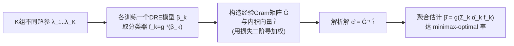

# Minimax-Optimal Aggregation for Density Ratio Estimation

**会议**: ICLR 2026  
**OpenReview**: [https://openreview.net/forum?id=gDxJK8yvZU](https://openreview.net/forum?id=gDxJK8yvZU)  
**代码**: 待确认  
**领域**: 学习理论 / 密度比估计  
**关键词**: density ratio estimation, model aggregation, minimax-optimal rates, hyperparameter selection, RKHS, self-concordant loss, domain adaptation  

## 一句话总结
针对密度比估计（DRE）对超参数极度敏感的痛点，本文提出一种把多个不同超参训练出来的模型**线性聚合**的算法，通过最小化 Bregman 散度的上界得到解析的聚合权重，理论上**无需预知密度比光滑度**即可达到 minimax-optimal 收敛率，在 DRE 基准与大规模域适应任务上超过交叉验证与模型平均。

## 研究背景与动机
- **领域现状**：密度比 $\beta(x):=p(x)/q(x)$ 是统计与机器学习的基础量——由 Neyman–Pearson 引理，最优统计检验本质就是密度比上的阈值判决，因此 DRE 广泛用于分布漂移检测、散度估计、异常检测、能量模型、生成模型和域适应等。一大类 DRE 方法可统一写成在某个 Bregman 散度 $B_F(\beta, g(f))$ 下的风险最小化。
- **现有痛点**：DRE 的精度对超参数（尤其是正则化参数 $\lambda$、核带宽）极度敏感，选错就会拖垮收敛率与实测性能。更糟的是，像 Kernel Mean Matching（KMM）这类方法**根本无法用直接的交叉验证（CV）来调参**；实际工程里人们最后总是攒下一串不同超参训练出来的模型，却只能从中"选一个"。
- **核心矛盾**：已有理论（Zellinger et al. 2023; Gruber et al. 2024）证明，**只有当超参恰好取在最优配置时**才能拿到快收敛率——可"如何在没有真值 $\beta$ 的情况下选到那个最优超参"本身就是个未解的难题。模型选择（select-the-best）和现有的模型平均/集成，都无法保证：哪怕样本量 $M+N\to\infty$，对一串次优模型的聚合仍达到快速率。
- **本文目标**：不再"选一个"，而是把整串模型**最优地聚合**起来，使得聚合结果在理论上达到 minimax-optimal 率，且对未知光滑度自适应（adaptive，无需先验）。
- **核心 idea**：**[聚合而非选择]** 训练 $\bigl\{f_k\bigr\}$ 后求解聚合 $\sum_k\alpha_k f_k$，使其逼近的目标是最小化聚合估计与真值之间 Bregman 散度的一个**可解析求解的上界**，从而既能超过串中最好的单模型，又自动继承自洽损失（self-concordant）理论给出的最优率。

## 方法详解

### 整体框架
把 DRE 等价转写为二分类问题（样本带标签 $y\in\{-1,1\}$ 标记来自 $p$ 还是 $q$），则密度比估计器 $\beta=g(f)$ 由分类器 $f$ 经单调链接函数 $g$ 恢复。方法分两步：先用 $K$ 组不同超参各训练一个 DRE 模型 $\beta_k$ 并取出对应分类器 $f_k=g^{-1}(\beta_k)$；再在这 $K$ 个 $f_k$ 张成的线性空间里，最小化聚合估计与真分类器 $f_H$ 之间在合适范数下的距离，得到**解析解形式的聚合权重** $\hat\alpha=\hat G^{-1}\hat r$。

### 关键设计

**1. 把"聚合误差"转成可优化的范数上界——奠定整个方法的目标函数。** 真正想压小的是聚合估计 $\hat\beta$ 与真值 $\beta$ 之间的 Bregman 散度 $B_F(\beta,\hat\beta)$，但它不可直接优化。作者沿用 Menon & Ong (2016) 与 Marteau-Ferey et al. (2019) 的结果，将其相对最优模型的超出部分上界为一个范数平方：$B_F(\beta,\hat\beta)-B_F(\beta,g(f_H))\le 2\,\|g^{-1}(\hat\beta)-f_H\|^2$，其中范数取决于 $F$ 与 $g$。于是问题化归为在 $\{f_k\}$ 张成的子空间里找最接近 $f_H$ 的点：$\min_{\alpha\in\mathbb R^K}\bigl\|\sum_k\alpha_k f_k-f_H\bigr\|^2$。这一步的价值在于：它**同时**带来解析解、相对 $n$-fold CV 的算力优势，以及 minimax-optimal 率三重好处。

**2. 二次目标的解析解 $\alpha=G^{-1}r$——让聚合权重一步算出。** 上面的目标是关于 $\alpha$ 的凸二次型 $L(\alpha)=\sum_{k,j}\alpha_k\alpha_j\langle f_k,f_j\rangle-2\sum_k\alpha_k\langle f_k,f_H\rangle+\langle f_H,f_H\rangle$，令 $\partial L/\partial\alpha=0$ 立即给出闭式解 $\alpha=G^{-1}r$，其中 Gram 矩阵 $G=(\langle f_k,f_j\rangle)$、向量 $r=(\langle f_k,f_H\rangle)$。由于真分类器 $f_H$ 在二分类化后恰对应标签 $y\in\{-1,1\}$，把连续内积离散化为经验和后即得 Algorithm 1：$\hat G$ 与 $\hat r$ 都用损失的二阶导 $\nabla^2\ell(y,f(x))$ 作权重在样本上求平均，而 Hessian 项**可解析算出、不增加额外计算开销**。一个关键的"保底"性质是：聚合至少不差于选择——$\min_{\alpha\in\mathbb R}\|\sum_k\alpha_kf_k-f_H\|^2\le\min_{\alpha\in\{0,1\}}\|\cdots\|^2\le\min_k\|f_k-f_H\|^2$，所以聚合可恢复出**任何单个模型都给不出**的密度比（如 Fig. 1 中三条单模型都逼近不好、聚合却逼近得很好）。

**3. 自洽损失 + 源/容量条件下的 minimax-optimal 率——本方法的理论内核。** 真正区分本文与一般"模型平均"的，是它在 RKHS + Tikhonov 正则 $f^\lambda=\arg\min_f\{B_F(\beta,g(f))+\tfrac\lambda2\|f\|_H^2\}$ 下给出了收敛率证明。借助学习理论标准的源条件（source condition，参数 $r\in(0,\tfrac12]$）、容量条件（capacity condition，参数 $\alpha\ge1$）以及损失的**伪自洽性**（pseudo self-concordance，$|\ell'''_y|\le\ell''_y$，Example 1 的 KuLSIF/Exp/SQ/LR 均满足），Theorem 1 证明：取一列 $\{\lambda_k\}$ 训练 $\hat f^{\lambda_k}$ 后聚合，有 $B_F(\beta,\hat\beta)-B_F(\beta,g(f_H))\le C(M+N)^{-\frac{2r\alpha+\alpha}{2r\alpha+\alpha+1}}$。这正是该问题的 minimax-optimal 率，且**自适应于未知光滑度**——据作者所述是 DRE 参数选择问题上**首个可证 minimax-optimal** 的结果，相较 Zellinger et al. (2023) 不再依赖启发式固定常数。

**4. 用经验 Hessian 估计不可见范数——把理论落地为算法。** 上界里的范数 $\|f\|_{H_\lambda(f_H)}=\|H_\lambda(f_H)^{1/2}f\|_H$ 依赖期望 Hessian $H(f)=\mathbb E[\nabla^2\ell(y,f(x))]$，而我们只有来自 $\rho$ 的有限样本、无法直接访问该范数。方法用经验 Hessian $\hat H_\lambda(f)=\tfrac1{M+N}\sum\nabla^2\ell+\lambda I$ 与经验风险最小化器 $\hat f^\lambda$ 来近似，从而把内积 $\langle f_k,f_j\rangle$ 实现为用二阶导加权的经验和——这也解释了 Algorithm 1 中 $\hat G,\hat r$ 为何带 $\nabla^2\ell(y,f_1(x))$ 权重。正是这种"解析 Hessian、零额外开销"的设计，使方法既适用于 RKHS 方法也适用于神经网络，并且能用到 KMM 这类 CV 失效的场景。

## 实验关键数据

### 主实验：几何数据集（已知密度比，二倍 Bregman 误差，越低越好）
在 50 维高斯混合构造的 10 个数据集上，对 4 种 DRE 方法（KuLSIF / Exp / LR / SQ）比较"CV 选模型" vs "本文聚合"，按数据集平均：

| 方法 | Cross-Validation | Aggregation (Ours) |
|---|---|---|
| KuLSIF | 11.205 | **10.683** |
| Exp | 13.392 | **11.529** |
| LR | 11.400 | **11.002** |
| SQ | 11.810 | **11.348** |

四种 DRE 方法、全部 10 个数据集上，聚合一致优于其 CV 选模型的对应版本。

### 对比模型平均/集成（KuLSIF，几何数据集平均）

| 方法 | KuLSIF | Exp | LR | SQ |
|---|---|---|---|---|
| Cross Validation | 11.205 | 13.392 | 11.400 | 11.810 |
| Bayesian Model Averaging | 11.119 | 12.972 | 11.397 | 11.785 |
| Super Learner | 11.009 | 12.386 | 11.320 | 11.658 |
| **Aggregation (Ours)** | **10.683** | **11.529** | **11.002** | **11.348** |

### 消融实验

| 消融 | 设置 | 结论 |
|---|---|---|
| Ablation 1 | 深度网络 LR（DeepLR），调正则以外的超参 | 全部数据集上聚合优于 CV 基线 |
| Ablation 2 | KMM 调核带宽（CV 不可用） | 聚合一致优于 median heuristic 基线（误差从 ~17–21 降到 ~13–18） |
| Ablation 3/4 | 对比 Raza&Samothrakis 平均、BMA、Super Learner，并增加模型数 | 模型数增多时基线严重退化/不稳，本文方法保持鲁棒 |
| Ablation 5 | 逐步增大高斯混合维度 | CV 随维度升高退化，本文方法维持稳健 |

### 关键发现
- **域适应（MiniDomainNet / Amazon Reviews / 时间序列）**：训练 9000+ 神经网络、约 500 个超参选择任务；把 DRE 聚合接到 7 种 DA 方法（MMDA/CoDATS/DANN/CDAN/DSAN/DIRT/AdvSKM）上，几乎所有方法与模态下聚合都优于 CV 版本，并在 MiniDomainNet 与 Amazon Reviews 上**刷新 SOTA**（超过 Dinu et al. 2023）。
- **算力更省**：相比 10-fold CV，需训练的模型数少一个 $n$-fold 因子（图 2 左）。
- **权重可解释**：更准的 KuLSIF 估计器被分配更大权重（附录 Fig. 3 左）。

## 亮点与洞察
- **"选最好"到"最优聚合"的范式转换**：保底不等式 $(7)$ 说明聚合在连续情形下至少不差于选择，且能造出任何单模型都给不出的密度比——把一堆"次优模型"变废为宝。
- **理论与算法少见地一致**：minimax-optimal 率的证明落到一个有解析解、Hessian 可解析、零额外开销的算法上，而非只停留在 bound。
- **自适应未知光滑度**：无需先验知道密度比的光滑度就拿到最优率，且不依赖启发式常数，是相对前作的实质进步。
- **覆盖 CV 失效场景**：KMM 这类无法用 CV 调参的方法也能用本法调带宽，扩大了适用面。

## 局限与展望
- **理论假设较强**：minimax-optimal 率依赖 RKHS、源条件、容量条件与伪自洽损失等学习理论标准假设；Ablation 1/2（深度网络、KMM）虽实证有效，但已落在理论保证之外。
- **well-specified 假设**：分析假定问题良定（$f_H=\arg\min_f R(f)$），对模型误设（misspecification）下的行为未给理论刻画，噪声影响仅在附录讨论。
- **聚合空间受限于候选**：聚合是在已训练的 $K$ 个模型张成的线性子空间内进行，若候选模型整体偏差，聚合上限也受限；如何主动设计候选超参序列尚待探讨。
- **计算的 Gram 求逆**：$K$ 很大时 $\hat G^{-1}$ 的数值稳定性与规模化值得进一步关注。

## 相关工作与启发
- **DRE 统一框架**：Sugiyama et al. (2012b)、Menon & Ong (2016) 把 KuLSIF/Exp/SQ/LR 等统一为 Bregman 散度下的风险最小化（二分类等价形式），是本文方法的基础。
- **自洽损失的快率理论**：Bach (2010)、Marteau-Ferey et al. (2019)、Beugnot et al. (2021) 的自洽/广义自洽损失分析，以及 Zellinger et al. (2023)、Gruber et al. (2024) 把它扩展到 DRE，是收敛率证明的工具来源；本文相对 Zellinger 2023 去掉了启发式常数依赖。
- **模型平均/集成对照**：相较 Bayesian Model Averaging、Super Learner、Raza & Samothrakis 等平均/集成策略，本文证明它们无法保证对次优模型序列的快率，而聚合可以——为"理论保证的集成"提供了范例。
- **启发**：把"超参选择"重构为"在候选张成空间里的最优投影"这一思路，可推广到其他对超参敏感、又缺乏可监督验证信号的无监督/自监督估计问题。

## 评分
- **新颖性**: ⭐⭐⭐⭐ — DRE 参数选择上首个可证 minimax-optimal 的聚合方法，"选择→聚合"的视角清晰且有理论支撑。
- **实验充分度**: ⭐⭐⭐⭐ — 9000+ 网络、约 500 个选择任务，覆盖几何基准、三模态域适应与 5 组消融，并刷新两项 SOTA；理论外场景（深度/KMM）也做了实证。
- **写作质量**: ⭐⭐⭐⭐ — 从动机、等价转写、上界、解析解到收敛率层层递进，记号严谨；定理常数与证明放附录，正文可读。
- **价值**: ⭐⭐⭐⭐ — 解决 DRE 实践中的真实痛点（超参敏感、CV 失效），方法零额外开销、可解析、可即插到现有 DRE/DA 流程。

<!-- RELATED:START -->

## 相关论文

- [\[ICLR 2026\] A Minimum Variance Path Principle for Accurate and Stable Score-Based Density Ratio Estimation](a_minimum_variance_path_principle_for_accurate_and_stable_score-based_density_ra.md)
- [\[ICLR 2026\] Score-Based Density Estimation from Pairwise Comparisons](score-based_density_estimation_from_pairwise_comparisons.md)
- [\[ICLR 2026\] Best-of-Majority: Minimax-Optimal Strategy for Pass@k Inference Scaling](best-of-majority_minimax-optimal_strategy_for_passk_inference_scaling.md)
- [\[ICLR 2026\] Practical Estimation of the Optimal Classification Error with Soft Labels and Calibration](practical_estimation_of_the_optimal_classification_error_with_soft_labels_and_ca.md)
- [\[ICLR 2026\] Decision Aggregation under Quantal Response](decision_aggregation_under_quantal_response.md)

<!-- RELATED:END -->
