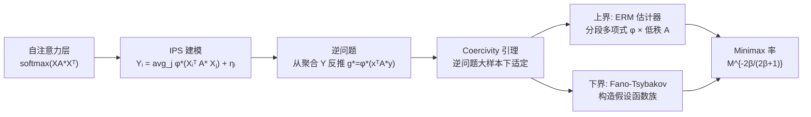

# Minimax Rates for Learning Pairwise Interactions in Attention-Style Models

**会议**: ICLR 2026  
**OpenReview**: [https://openreview.net/forum?id=7Gfheg6seM](https://openreview.net/forum?id=7Gfheg6seM)  
**代码**: 待确认  
**领域**: learning_theory  
**关键词**: 注意力机制, minimax 率, 非参数估计, 交互粒子系统, 样本复杂度, 维度灾难  

## 一句话总结
本文把单层注意力建模为交互粒子系统的逆问题，证明从聚合输出中学习两两交互函数 $g^\star(x,y)=\phi^\star(x^\top A^\star y)$ 的 minimax 率为 $M^{-\frac{2\beta}{2\beta+1}}$，且在低秩条件下该率与嵌入维度 $d$、token 数 $N$、矩阵秩 $r$ 全部无关——从统计意义上解释了注意力机制为何能规避维度灾难。

## 研究背景与动机
**领域现状**：Transformer 的注意力本质上是对 token 之间两两相似度做加权平均，但理论上我们只观测到聚合后的输出，看不到产生它的底层交互结构。现有理论工作大多局限在简化设定——线性/随机特征注意力、softmax 注意力的高维极限、或假设 token 之间相互独立且各向同性，并没有触及"从聚合观测里反推一般非线性交互函数"这一核心问题。

**现有痛点**：注意力机制把激活函数（softmax/ReLU/sigmoid 等）和权重矩阵 $W_QW_K^\top$ 复合在一起，二者既不可分别辨识、又共同决定输出。"极端 token 现象"（某些 token 拿到不成比例的高权重）促使人们用各种激活替代 softmax，说明根本不存在一个普适最优激活，因此分析**一般交互函数**才有意义。但这个反问题既非局部（输出是对所有粒子的平均）、又非凸（同时估计矩阵和函数），现成的非参数估计工具难以直接套用。

**核心矛盾**：一方面我们想知道学到 token 级交互需要多少样本、收敛率怎样依赖维度/token 数/平滑度；另一方面这个交互函数生活在 $2d$ 维空间，朴素非参数估计会遭遇维度灾难，与注意力的经验高效形成尖锐反差。

**本文目标**：给出从聚合观测中估计 $g^\star$ 的最优（matching upper/lower）minimax 收敛率，并精确刻画它对 $d$、$r$、$N$ 的依赖。

**核心 idea**：**把注意力视作交互粒子系统（IPS）的逆问题**——token 是"粒子"，自注意力聚合粒子间两两交互；交互函数 $g^\star(x,y)=\phi^\star(\langle x,y\rangle_{A^\star})$ 是未知激活 $\phi^\star$ 与未知矩阵 $A^\star$ 的复合。这一视角不再要求 token 独立各向同性，而是允许依赖、各向异性的数据。

## 方法详解

### 整体框架
论文围绕一个**单层注意力 = N 个交互粒子**的统计模型展开：观测 $Y_i=\frac{1}{N-1}\sum_{j\ne i}\phi^\star(X_i^\top A^\star X_j)+\eta_i$，目标是从 $M$ 组 i.i.d. 样本 $\{(X^m,Y^m)\}$ 中恢复两两交互函数 $g^\star$。整条分析链是「建模 → 证逆问题适定（coercivity）→ 上界（经验风险最小化达到 $M^{-2\beta/(2\beta+1)}$）→ 下界（Fano-Tsybakov 配匹配率）→ 数值验证」。

### 关键设计

**1. 注意力↔IPS 的桥接：把不可辨识的两个未知物打包成一个交互函数。** 论文不去分别估计 query/key 矩阵和激活，而是注意到 $\mathrm{softmax}(QK^\top/\sqrt{d_k})=\mathrm{softmax}(XA^\star X^\top)$，其中 $A^\star=W_QW_K^\top/\sqrt{d_k}$，于是把"激活 + 矩阵"复合成单个标量核 $g^\star(x,y)=\phi^\star(x^\top A^\star y)$。这一步绕开了 $\phi^\star$ 与 $A^\star$ 各自不可辨识的难题——我们只要求恢复二者的复合 $g^\star$。前向算子写成 $R_g[X]_i=\frac{1}{N-1}\sum_{j\ne i}g(X_i,X_j)$，模型就成了 $Y_i=R_{g^\star}[X]_i+\eta_i$，一个对 $g^\star$ **非局部**依赖的反问题：输出是对所有 token 对的平均，没有任何单点的 $g^\star$ 值被直接观测到。

**2. Coercivity 条件：用 token 的可交换性把非局部逆问题"撬"成适定。** 反问题的核心障碍是非局部性——能否从平均值里唯一稳定地反解出 $g^\star$。作者引入并证明 coercivity 引理（Lemma 3.4）：在 token 可交换（Assumption A1）下，$\frac{1}{N-1}\|g-g^\star\|_{L^2_\rho}^2\le \mathcal{E}_\infty(g)-\mathcal{E}_\infty(g^\star)$，即风险差能从下方控制住函数误差。这保证了大样本极限下逆问题良定。这里的探索测度 $\rho$ 定义在 token 对 $(x,y)$ 上，度量数据对参数空间的覆盖程度；与以往 IPS 文献只估计平移不变的径向核不同，本文交互因矩阵 $A^\star$ 存在而**非平移不变**，是真正的 $2d$ 维函数。

**3. 经验风险最小化器达到上界：分段多项式 × 低秩矩阵的双参数化。** 估计器取 $\hat g_M=\hat\phi(\langle x,y\rangle_{\hat A})$，在函数类 $\mathcal{G}^s_{r,K_M}$ 上做经验风险最小化：$\phi$ 用定义在 $K_M$ 个等分小区间上的 $s$ 次分段多项式 $\Phi^s_{K_M}$ 表示，$A$ 限制在秩 $\le r$ 的矩阵类 $\mathcal{A}_d(r,\bar a)$ 内。Theorem 3.1 证明当 $rd\le (M/\log M)^{1/(2\beta+1)}$ 时，$\mathbb{E}\|\hat g_M-g^\star\|_{L^2_\rho}^2\lesssim M^{-\frac{2\beta}{2\beta+1}}$。证明把 Györfi 等人为多指标投影追踪开发的技术推广到本设定，并攻克三个难点：非局部依赖、把噪声从有界放宽到 sub-Gaussian（误差三分解 $T_1+T_2+T_3$）、以及给秩 $\le r$ 矩阵类做覆盖数估计（Lemma B.3）。

**4. 误差的"参数 + 非参数"分解，揭示维度只进低阶项。** 核心洞察是总误差由两部分构成：估计 $\phi^\star$ 带来的**非参数项** $M^{-\frac{2\beta}{2\beta+1}}$（只依赖平滑度 $\beta$），以及估计 $A^\star$ 带来的**参数项**（依赖 $d,r$）。当低秩条件 $rd\le(M/\log M)^{1/(2\beta+1)}$ 成立时，参数项被非参数项压制，主导项与 $d$ 无关——这就是"规避维度灾难"的统计来源。

**5. Fano-Tsybakov 下界：先固定 $A^\star$ 把问题降到估计 $\phi^\star$。** 为得到与上界匹配的下界，作者先用 Lemma 4.1 把对所有 $g^\star=\phi^\star(x^\top A^\star y)$ 取上确界，归约为固定 $A^\star$ 后只对 $\phi^\star$ 取上确界——通过把 $\|\hat g-g^\star\|^2_{L^2_\rho}$ 从下方用 $\|\hat\psi-\phi^\star\|^2_{L^2_{p_U}}$ 控制，其中 $U_{ij}=X_i^\top A^\star X_j$。再用 Fano-Tsybakov 方案构造一族假设函数 $\{\phi_{k,M}\}$（Lemma 4.2）：彼此在 $L^2_{p_U}$ 中 $2s_{N,M}$-分离、而诱导分布的 KL 散度增长缓慢。最终 Theorem 4.4 给出 $\inf_{\hat g}\sup_{g^\star}\mathbb{E}\|\hat g-g^\star\|^2_{L^2_\rho}\gtrsim c_0 N^{-\frac{2\beta}{2\beta+1}}M^{-\frac{2\beta}{2\beta+1}}$，与上界匹配（差一个对数因子），从而确定了 minimax 率。

## 实验关键数据

### 主实验（验证率与维度无关）
作者用 B-spline 表示真值激活 $\phi^\star$（$p$ 次 B-spline 是 $C^{p-1}$，degree 直接控制平滑度），先最小二乘拟合 $\phi^\star$ 再用 MLP 近似以支持对 $A^\star$ 的反向传播。

| 设定 | 观测 | 理论预期 |
|------|------|----------|
| 嵌入维度 $d\in\{1,5,30\}$ | log-log 收敛曲线斜率近乎平行、都接近 $-2\beta/(2\beta+1)$ | 收敛率独立于 $d$ |

### 消融实验（验证率随平滑度变化）

| B-spline degree $P$ | 经验斜率 | 理论斜率 |
|---------------------|----------|----------|
| $P=3$ | $\approx -0.81$ | $-0.80$ |
| $P=8$ | $\approx -0.899$ | $-0.933$ |

### 关键发现
- 在 $d\in\{1,5,30\}$ 三个量级下收敛斜率几乎重合，直接印证主导项不依赖嵌入维度，注意力模型确实规避了维度灾难。
- 平滑度 $\beta$ 越大（B-spline degree 越高），log-log 斜率越陡，经验值与理论值 $-2\beta/(2\beta+1)$ 吻合到小数点后两位，说明 minimax 率完全由激活函数的 Hölder 平滑度决定。

## 亮点与洞察
- **统计视角解释注意力的高效**：第一次把"注意力为什么不怕高维"落到 minimax 率上——不是优化或表达力层面的直觉，而是非参数估计意义下的硬结论：主导误差项只看激活的平滑度。
- **打包不可辨识量**：不去纠结 $\phi^\star$、$A^\star$ 各自不可辨识，转而估计它们的复合 $g^\star$，是绕开非凸辨识难题的漂亮一招。
- **放宽数据假设**：突破了 token 独立、各向同性的常见限制，允许依赖、各向异性数据，更贴近真实序列里 token 强相关的情形。
- **参数/非参数误差分解**：清晰地把维度依赖隔离到参数项，并给出它被压制的精确条件 $rd\le(M/\log M)^{1/(2\beta+1)}$，对"低秩 KQ 矩阵为何有益"给出统计解释。

## 局限与展望
- **对数因子的 gap**：上界比下界多一个 $(\log M)^{\frac{2\beta}{2\beta+1}+4\max(2\beta,1)}$ 因子，作者承认这是方法的局限——在标准回归或 $A$ 为常数的简单设定可去掉，但本问题同时对 $A$ 和 $\phi$ 优化、非凸，现有去对数技术难以套用。
- **单层 + 单头**：分析局限在单层注意力的两两交互，多层（跨层动力学）、多头、以及 value 矩阵的作用都未纳入。
- **理想化估计器**：上界由经验风险最小化器（在分段多项式 + 低秩矩阵类上）给出，是统计极限而非可高效计算的算法；数值实验里也要先 B-spline 最小二乘再 MLP 近似，离实际训练流程有距离。
- **静态而非训练动力学**：刻画的是样本复杂度/可学性，不直接说明 SGD 等优化能否到达该最优估计器。

## 相关工作与启发
- **神经网络作为动力系统 / IPS**：Neural ODE（Chen et al. 2018）、Geshkovski et al.（2023/2025）把 token 看作交互粒子、研究聚类现象——但这些都聚焦 token 沿深度的动力学，没有触及"估计两两交互"的学习理论，本文正好补上这一空白。
- **注意力可学性**：线性/随机特征注意力（Wang/Lu/Marion 等）、softmax 注意力高维极限（Troiani/Cui 等）、shallow ViT 训练（Li et al. 2023）——大多限定具体架构或假设 token 独立，本文转向一般交互函数 + 依赖数据。
- **经典非参数估计**：单指标模型 $f(w^\top x)$（Gaïffas & Lecué 2007）、投影追踪（Györfi et al. 2006）、深 ReLU 网络近最优率（Schmidt-Hieber 2020）——本文把投影追踪技术推广到"非局部 + 参数/非参数混合"的注意力设定。
- **启发**：把一个看似"黑箱"的机制（注意力）映射到有成熟工具的框架（IPS 逆问题 + 非参数统计），是分析现代架构理论性质的通用范式；而"误差分解定位维度依赖"的思路，可迁移到其他怀疑能规避维度灾难的结构化模型上。

## 评分
- **新颖性**: ⭐⭐⭐⭐⭐ 首次从 IPS 逆问题视角给出注意力学习两两交互的紧 minimax 率，并证明率与维度无关，视角与结论都很新。
- **实验充分度**: ⭐⭐⭐ 数值实验干净地验证了"独立于 $d$"和"随 $\beta$ 变化"两个核心预言，但仅为合成数据上的率验证，规模与真实性有限（理论为主的论文可接受）。
- **写作质量**: ⭐⭐⭐⭐ 问题动机、建模桥接、上下界论证层次清晰，假设交代充分；证明细节较重，对非该领域读者门槛偏高。
- **价值**: ⭐⭐⭐⭐ 为"注意力为何高效/不怕高维"提供了坚实的统计学解释，对理解注意力本质和指导训练（如低秩 KQ）有理论意义。

<!-- RELATED:START -->

## 相关论文

- [\[ICLR 2026\] Poly-attention: a general scheme for higher-order self-attention](poly-attention_a_general_scheme_for_higher-order_self-attention.md)
- [\[ICLR 2026\] Score-Based Density Estimation from Pairwise Comparisons](score-based_density_estimation_from_pairwise_comparisons.md)
- [\[ICLR 2026\] Understanding In-Context Learning on Structured Manifolds: Bridging Attention to Kernel Methods](understanding_in-context_learning_on_structured_manifolds_bridging_attention_to_.md)
- [\[ICLR 2026\] On learning linear dynamical systems in context with attention layers](on_learning_linear_dynamical_systems_in_context_with_attention_layers.md)
- [\[ICLR 2026\] Learning Correlated Reward Models: Statistical Barriers and Opportunities](learning_correlated_reward_models_statistical_barriers_and_opportunities.md)

<!-- RELATED:END -->
