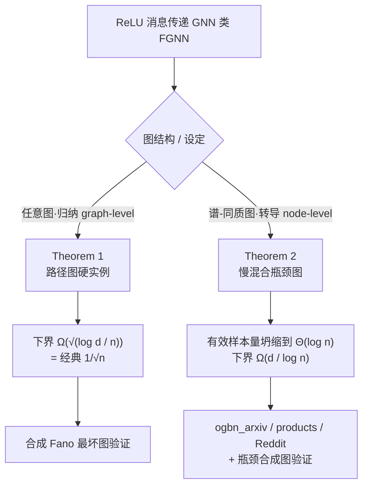

# Minimax Sample Complexity of Graph Neural Networks: Lower Bounds and Structural Effects

**会议**: ICLR 2026  
**OpenReview**: [https://openreview.net/forum?id=P2GIT8LpV2](https://openreview.net/forum?id=P2GIT8LpV2)  
**代码**: 待确认  
**领域**: learning theory  
**关键词**: GNN, 极小极大下界, 样本复杂度, 谱-同质性, Fano不等式, 有效样本量  

## 一句话总结
本文为 ReLU 消息传递 GNN 建立了两条极小极大（minimax）下界：任意图上误差不快于经典的 $\sqrt{\log d / n}$，而在"强同质 + 弱谱扩张"的谱-同质性条件下，转导式节点预测的误差只能慢到 $d/\log n$——揭示出真实图任务的样本复杂度主要由图拓扑（而非神经架构）决定。

## 研究背景与动机
**领域现状**：前馈/卷积网络的极小极大分析已相当成熟，ReLU 网络的泛化误差按经典的 $1/\sqrt{n}$ 衰减；非参回归在光滑性假设下也有收敛保证。但 GNN 的统计基础仍很薄弱——已有工作多停留在 VC 维（随深宽爆炸）、PAC-Bayes 稳定性界、表达力上界，**泛化的下界几乎空白**。

**现有痛点**：GNN 打破了前馈理论赖以成立的独立性假设——节点样本通过边相关，消息传递把图上相距很远的区域耦合在一起，于是"统计上独立的有效观测数"可能远小于带标签节点数。这意味着 GNN 的样本复杂度无法从标准深度学习理论直接推得。

**核心矛盾**：多数已有理论只覆盖**归纳式（graph-level）**设定——每个训练样本是独立的图；但 ogbn_arxiv、ogbn_products、Reddit 等真正常用的基准都是**转导式（node-level）**——只观测一张固定的图，标注其中一部分节点，要求模型在同一图结构上泛化。独立图近似经典样本，而慢混合图上采集的节点标签可能高度冗余，两种设定的统计难度天差地别。

**本文目标**：对归纳和转导两种设定都给出严格的极小极大下界，回答"GNN 何时遵循经典 $1/\sqrt{n}$、何时被图的结构性质卡死"。

**核心 idea**：**[信息论下界]** 用 Fano 不等式 + 打包集（packing set）构造硬实例族，证明任何估计器都无法突破的统计壁垒；**[谱-同质性]** 引入"小拉普拉斯谱隙 $\lambda_2 \le \kappa/\log n$ + 强标签同质"这一结构条件，把有效样本量从 $n$ 坍缩到 $\Theta(\log n)$，从而得到比 $1/\sqrt{n}$ 更慢的 $d/\log n$ 率。

## 方法详解

### 整体框架
论文是纯理论 + 验证性实验：先用信息论工具证两条下界（Theorem 1 归纳式、Theorem 2 转导式），再用真实/合成图验证真实任务落在哪个 regime。两条定理覆盖互补的图结构与架构假设。

### 关键设计
**1. 假设界定与函数类：把"哪类 GNN、哪类图"框死。** 论文研究 $L$ 层 ReLU 消息传递网络，每层更新为 $h_i^{(\ell+1)} = \phi\big(W^{(\ell)}\,\mathrm{Agg}_{j\in N(i)} h_j^{(\ell)} + B^{(\ell)} h_i^{(\ell)}\big)$，$\phi=\max\{0,\cdot\}$。函数类 $F_{\text{GNN}}(v_s, L)$ 由两条假设约束：(A1) 输入无关、1-跳置换不变的聚合（SUM/MEAN/归一化邻接），(A2) 逐层 Lipschitz/变差预算 $\sum_\ell (\|W^{(\ell)}\|_1 + \|B^{(\ell)}\|_1) \le v_s$（$\ell_1$ 范数促稀疏）。Theorem 1 依赖 (A1)，因此**排除注意力类**（GAT、graph transformer 的混合权重依赖隐特征，违反 A1）；而 Theorem 2 只需邻接局部性 + 算子有界，故可推广到邻接掩码注意力。

**2. 归纳式最坏情形下界（Theorem 1）：路径图把信息流卡到最慢。** 在任意图、graph-level 设定下，作者证明 $R^{\text{graph}}_n(F_{\text{GNN}}) \ge K_{\text{new}}\,\frac{\sigma v_s}{L}\sqrt{\frac{\log d}{n}}$。证明走经典 Fano 路线：在**路径（链）图**上变动第一层权重 $W^{(0)}$ 构造一个常权 Varshamov–Gilbert 码，使打包集的对数基数 $\log M \ge C_A v_s^2 \log d / (L^2 \epsilon^2)$；高斯回归下 KL 散度被 $2\epsilon^2/\sigma^2$ 控制，代入固定半径 Fano 不等式并对 $\epsilon^2$ 优化即得结果。路径图的妙处在于每个节点度数 $\le 2$，最小连通性制造瓶颈、让消息传递最慢、深度成为主导因子——在最稀疏结构上证出硬度，就为所有可容许的图认证了这条普适最坏率。其样本量含义是 $n \ge K_{\text{new}}^2 \sigma^2 v_s^2 L^2 \log d / \epsilon^4$，比参数模型（$n\ge \sigma^2/\epsilon^2$）需要的数据多得多。

**3. 谱-同质性条件：用谱隙刻画"有效样本量坍缩"。** 设归一化拉普拉斯 $\mathcal{L} = I - D^{-1/2}AD^{-1/2}$，其第二小特征值 $\lambda_2(\mathcal{L})$ 度量扩张性。条件 $\lambda_2(\mathcal{L}) \le \kappa/\log n$ 表示弱扩张、慢混合：由 Cheeger 型关系，小谱隙意味着存在稀疏割把稠密社区分开，强同质（社区内紧密相连）+ 弱扩张（社区间边少）让消息"卡在社区内部"传不出去。在转导设定下这一困难被放大——所有节点特征都可见但只有部分标签，慢混合使带标签节点高度相关、消息传递邻域大量重叠，**平均每 $O(\log n)$ 个标签才贡献一份真正新的信息**，于是有效独立样本数只有 $\Theta(\log n)$。这是 Theorem 2 比 $1/\sqrt{n}$ 更慢的物理根源。

**4. 转导式结构感知下界（Theorem 2）：有效样本量决定 $d/\log n$ 率。** 在满足谱-同质性的图上，node-level 转导风险满足 $R^{\text{node}}_{(n,G)}(F_{\text{GNN}}) \ge \frac{\sigma^2 v_s^2}{\Gamma L^2}\cdot\frac{d}{\log n}$。证明思路：在慢混合下找出 $K=\Theta(\log n)$ 个感受野几乎不重叠的"良好分离"节点，在这 $K$ 个节点上用常权码字构造打包集，使两个只在一个 block 上不同的函数既满足 $\ell_1$ 预算又有 $(v_s/LK)^2\Delta$ 量级的分离度，而高斯噪声让其分布间 KL 散度只有 $1/K$ 量级；对这个 $K$-block 打包用固定半径 Fano 即得风险下界 $\propto d/K = d/\log n$。其样本量含义是 $n \ge \exp(\sigma^2 v_s^2 d / (\Gamma L^2 \epsilon^2))$——关于 $1/\epsilon^2$ 是**指数级**，远差于多项式率。若谱-同质性失效（$\lambda_2$ 大、强扩张），独立性论证崩溃，分析退回 Theorem 1 的 $\sqrt{\log d/n}$ 率。

## 实验关键数据
实验定位为"概念验证"：核心证据是**比值诊断（ratio diagnostics）**——若 $\mathrm{Err}(n)/\text{rate}(n)$ 随 $n$ 近似恒定，说明经验误差吻合该理论率。曲线拟合只作次要证据。

### 结构验证表（Theorem 2 条件）
对每个数据集计算 $\lambda_2$、同质性，以及统一证书常数 $\kappa_0 := \max_{n\in N}\lambda_2(\mathcal{L})\log n$，验证 $\lambda_2 \le \kappa_0/\log n$。

| 数据集 | 谱隙 $\lambda_2$ | $\kappa_0$ | 同质性 |
|---|---|---|---|
| ogbn_arxiv | 0.2112 | 2.5428 | 0.6551 |
| ogbn_products_50k | 0.9201 | 9.9557 | 0.7956 |
| Reddit_50k | 0.9683 | 10.4769 | 0.7748 |
| WorstCase_Bottleneck_20k | 1.0359 | 10.2586 | 0.3164 |

三个真实图都落在 Theorem 2 的结构 regime；瓶颈合成图按构造紧贴不等式，而 Fano 最坏合成图则违反它（构成真正的 Theorem-1 型最坏情形）。

### 比值诊断（主证据）
- **合成 Fano 最坏图**：$\mathrm{Ratio}_1(n)=\mathrm{Err}/\sqrt{\log d/n}$ 基本恒定且接近 1，$\mathrm{Ratio}_2(n)=\mathrm{Err}/(d/\log n)$ 随 $n$ 持续下降——精确验证 $\sqrt{\log d/n}$ 率。
- **三个真实数据集（GCN/GAT/GraphSAGE）**：$\mathrm{Ratio}_2(n)$ 在 2–3 个数量级的 $n$ 上几乎平直，$\mathrm{Ratio}_1(n)$ 持续（常常陡峭）上升——真实 GNN 任务遵循 Theorem 2 的 $d/\log n$。
- **瓶颈合成图压力测试**：$\mathrm{Ratio}_2$ 稳定、$\mathrm{Ratio}_1$ 陡升，镜像真实数据，证明 $d/\log n$ 率在谱-同质结构下是紧的。

### 关键发现
- **经验常数 $C^\star$ 稳定**：$\mathrm{Err}/(d/\log n)$ 的平台值在 ogbn_arxiv 约 15–25、ogbn_products_50k 约 18–22、Reddit_50k 约 10–20、瓶颈合成图约 8–12，跨多个数量级稳定，说明误差在受控常数因子内正比于 $d/\log n$。
- **曲线拟合不可靠**：$1/\log n$ 仅在 13 个"架构×数据集"组合中的 3 个里是最佳拟合模型，印证作者把比值诊断而非拟合作为主证据的判断。

## 亮点与洞察
- **填补 GNN 泛化下界空白**：此前 GNN 理论多是上界（VC/覆盖数/PAC-Bayes），本文给出难得的极小极大**下界**，认证了"再丰富的假设类也躲不掉"的统计障碍。
- **把"有效样本量坍缩"说清楚了**：用谱隙 $\lambda_2 \le \kappa/\log n$ 量化"慢混合 → 邻域重叠 → 标签冗余 → 每 $\log n$ 个标签才一份新信息"，给出 $\Theta(\log n)$ 有效样本量这一干净的物理图像。
- **理论与实践对得上**：真实基准被诊断为统统落在 $d/\log n$ 的结构 regime，而非教科书式的 $1/\sqrt{n}$——这本身就是对"图拓扑而非架构主导样本复杂度"的有力支持。
- **两定理的假设互补**：Theorem 1 用 (A1) 排除注意力，Theorem 2 改用局部性 + 算子有界从而能覆盖邻接掩码注意力（GAT），覆盖面更广。

## 局限与展望
- **只有下界、无匹配上界**：论文证明了误差"快不过"某率，但未给出"达到该率"的算法上界，因此"紧不紧"主要靠经验常数 $C^\star$ 的稳定性来佐证，理论上的双向夹逼尚缺。
- **架构假设较强**：(A1) 输入无关聚合排除了标准注意力；Theorem 2 对注意力的推广也需额外范数条件，距离覆盖现代 graph transformer 仍有距离。
- **实验是"概念验证"规模**：真实集只取 3 个、合成集 2 个，且 ogbn_products/Reddit 都截到 50k；曲线拟合自承不可靠，主要靠比值诊断的视觉稳定性。
- **谱-同质性的可操作性**：条件 $\lambda_2 \le \kappa/\log n$ 含一个未定常数 $\kappa$，实际判定靠数据集级 $\kappa_0$ 证书，是否对所有真实图都"非平凡成立"需更大规模验证。

## 相关工作与启发
- **承接前馈极小极大框架**：把 Golestaneh et al. (2024) 的 ReLU 网络 $1/\sqrt{n}$ 极小极大分析推广到任意图输入，且不依赖强光滑/独立性假设。
- **与表达力上界互补**：Franks et al. (2024)、Pellizzoni et al. (2024) 通过节点个体化/位置编码刻画"能达到什么"（上界），本文刻画"无论如何躲不掉什么"（下界），二者从两端夹住 GNN 学习问题。
- **信息论工具**：Fano 不等式、Varshamov–Gilbert 界、高斯回归 KL 公式——给后续想证 GNN/结构化数据下界的工作提供了可复用的打包构造范式。
- **启发**：样本复杂度的"瓶颈即谱隙"视角提示，设计 GNN 基准或采样策略时应显式考虑图的混合时间与同质性，而非默认每个标注节点都是一份独立样本。

## 评分
- **新颖性**: ⭐⭐⭐⭐ 首次给出 ReLU 消息传递 GNN 的转导式极小极大下界，并用谱-同质性把"有效样本量坍缩"形式化，视角新颖。
- **实验充分度**: ⭐⭐⭐ 比值诊断设计巧妙且证据一致，但数据集规模有限、缺匹配上界、曲线拟合自承不可靠，属概念验证级别。
- **写作质量**: ⭐⭐⭐⭐ 动机—定理—直觉—验证的脉络清晰，对"为何转导更难"的物理解释到位，证明草图可读。
- **价值**: ⭐⭐⭐⭐ 填补 GNN 泛化下界空白，"图拓扑主导样本复杂度"的结论对理解真实基准与设计结构感知理论有实际指导意义。

<!-- RELATED:START -->

## 相关论文

- [\[ICLR 2026\] Near-Optimal Sample Complexity Bounds for Constrained Average-Reward MDPs](near-optimal_sample_complexity_bounds_for_constrained_average-reward_mdps.md)
- [\[ICLR 2026\] Tractability via Low Dimensionality: The Parameterized Complexity of Training Quantized Neural Networks](tractability_via_low_dimensionality_the_parameterized_complexity_of_training_qua.md)
- [\[ICLR 2026\] How hard is learning to cut? Trade-offs and sample complexity](how_hard_is_learning_to_cut_trade-offs_and_sample_complexity.md)
- [\[ICLR 2026\] Mitigating the Curse of Detail: Scaling Arguments for Feature Learning and Sample Complexity](mitigating_the_curse_of_detail_scaling_arguments_for_feature_learning_and_sample.md)
- [\[ICLR 2026\] Variance-Dependent Regret Lower Bounds for Contextual Bandits](variance-dependent_regret_lower_bounds_for_contextual_bandits.md)

<!-- RELATED:END -->
