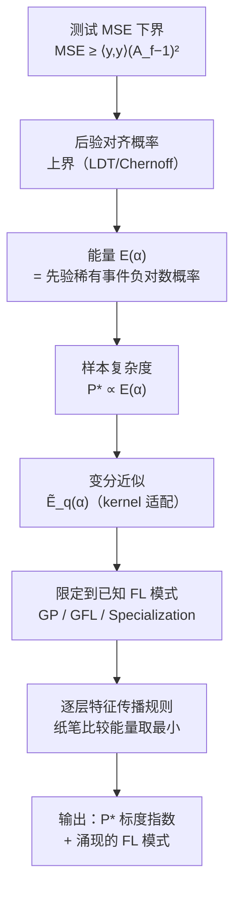

# Mitigating the Curse of Detail: Scaling Arguments for Feature Learning and Sample Complexity

**会议**: ICLR 2026  
**OpenReview**: [https://openreview.net/forum?id=Lexn2TAw59](https://openreview.net/forum?id=Lexn2TAw59)  
**代码**: 待确认  
**领域**: 学习理论 / 特征学习  
**关键词**: 特征学习, 样本复杂度, 贝叶斯神经网络, 标度律, 大偏差理论, 变分近似  

## 一句话总结
用统计物理的"标度分析"思路给贝叶斯神经网络做近似——不再求解高维非线性方程的精确解，而是用纸笔级的能量比较，预测各种特征学习模式（specialization、GFL 等）在什么数据量/宽度尺度下涌现，以及最小可学样本量 $P^*$ 的标度指数。

## 研究背景与动机

**领域现状**：深度学习理论里有两个硬骨头——理解特征学习（feature learning, FL）的机制，以及刻画富表示（rich regime）下网络的隐式偏置。目前主流的富 FL 理论（kernel 方法、Saad-Solla 类 teacher-student、贝叶斯统计力学）都把问题写成高维非线性自洽方程，必须靠计算密集的数值求解才能拿到结果。

**现有痛点**：作者称之为"细节的诅咒"（curse of detail）。架构、激活函数、数据分布、训练协议任何一个选择都会影响结果，想要一套同时精确照顾所有细节、又有真正预测力的理论几乎不可能。退而求其次的"可解 toy model"路线，其可解性本身是一种脆弱的精调性质，导致 toy model 与真实复杂设定之间始终留着一道很大的可解释性鸿沟。即便把现有 FL 框架推广到深层网络，计算复杂度也会高到无法导出直观的标度律，更别提跨架构统一比较。

**核心矛盾**：精确求解 = 计算不可行 + 不可跨设定迁移；而我们真正想要的往往只是**标度指数**（scaling exponent），而非精确数值。论文借统计物理的经验类比：积分 $\int_{-\infty}^{\infty} g(x/P)\,dx$ 里 $g(\cdot)$ 必须精调才能算精确值，但换元立刻看出它对任意 $g$ 都线性标度于 $P$——预测"怎么随尺度变"远比预测"具体是多少"容易且鲁棒。

**本文目标**：建立一个**启发式**框架，仅用纸笔计算就能从第一性原理预测贝叶斯神经网络的样本复杂度 $P^*$ 的标度，以及不同架构、不同尺度下会涌现哪种 FL 模式。

**核心 idea**：**把样本复杂度问题转化为"先验中出现强对齐这一稀有事件的能量"**。通过对齐度（alignment）把测试 MSE 下界化，再用大偏差理论（LDT）的速率函数 $E(\alpha)$ 把"先验里随机网络恰好学好的概率"量化成一个能量；由于精确 $E(\alpha)$ 不可解，用变分 + 几种已知 FL 模式作为候选，比较各模式能量取最小者，既得到 $P^*$ 标度又得到涌现的 FL 模式。

## 方法详解

### 整体框架

框架的逻辑链是"界 → 近似 → 启发式"三段递进：先把测试误差经 Cauchy–Schwarz 下界化为对齐度 $A_f$，再把"后验里学好的概率"用先验里稀有事件的负对数概率（即能量 $E(\alpha)$）上界化，于是最小样本量 $P^* \propto E(\alpha)$；由于 $E(\alpha)$ 精确不可算，引入变分近似 $\tilde E_q(\alpha)$；最后把变分候选限制在文献里已知的几种"特征学习模式"上，用纸笔级标度规则比较各模式能量，取最小者作为预测。

### 关键设计

**1. 对齐度下界 + 能量化样本复杂度：把"学不学得会"翻译成稀有事件概率。** 论文定义对齐度 $A_f := \langle f, y\rangle / \langle y, y\rangle$ 衡量网络函数与目标的成比例程度，由 Cauchy–Schwarz 给出 $\int (f-y)^2 d\mu_x \ge \langle y,y\rangle (A_f-1)^2$，于是 $A_f \approx 1$ 是成功学习的必要条件。关键一步是对后验对齐概率取对数后得到 $\log \Pr_\pi[A_f \ge \alpha] < Pk/(2\kappa) + \log \Pr_{p_0}[A_f \ge \alpha]$，其中 $k$ 是唯一依赖训练集的 $O(1)$ 量。由于先验里随机网络几乎不可能强对齐，$\log \Pr_{p_0}[A_f \ge \alpha]$ 对大 $\alpha$ 极负，必须有足够大的数据项才能抵消，从而 $P \gtrsim -2\kappa \log \Pr_{p_0}[A_f \ge \alpha]/k$。再用 Chernoff 不等式定义**能量** $E(\alpha) = -\log \inf_{t>0} e^{-t\alpha}\mathbb{E}_{p_0}[e^{tA_f}]$，得到 $P^* \propto E(\alpha)$。这一步的物理意义是：先验里出现强对齐的网络是统计离群点，它之所以离群恰恰是因为内部涌现了模仿 FL 的结构——所以这个界天然与 FL 绑定。

**2. 变分近似把不可解能量降到可算：用 Feynman–Bogoliubov 不等式 + 高斯 ansatz。** 直接算 $E(\alpha)$ 在多数感兴趣的情形里计算不可行。论文先把累积分布关联到密度，证明大对齐时 $E(\alpha) \approx -\log p_{A_f}(\alpha)$，再用统计力学技术把 $p_{A_f}(\alpha)$ 写成对预激活 $h$ 的路径积分，其中各层核 $\tilde K_{l-1}$ 依赖上一层预激活。引入哈密顿量 $H_{p,\alpha}(h)$ 和涨落配分函数 $Z_{A_f}(h)$ 后，用 Feynman–Bogoliubov 不等式对 $E(\alpha)$ 取上界：$E(\alpha) \approx \min_{q_\alpha}(\mathbb{E}_{h\sim q_\alpha}[\log(Z_{A_f}/Z_{q,\alpha})] + \tilde E_q(\alpha))$。论文论证 $\alpha \approx 1$ 时对数项相对 $\tilde E_q$ 是次主导，于是 $E(\alpha) \approx \tilde E_{q^*}(\alpha)$。取逐层解耦的高斯变分 ansatz $q(h) = \prod_l \prod_i q_{l,i}(h^l_i)$（均值 $\mu_{l,i}$、方差 $Q_{l,i}$），最终变分能量化为 $\tilde E_q \propto \sum_l \sum_i \Delta_{l,i} + a_y$，其中 $\Delta_{l,i}$ 来自近似核与真实核之差，$a_y = \langle y, K_{L-1}, y\rangle^{-1}$ 来自强制 $\alpha \approx 1$。

**3. 三种特征学习模式作为变分候选：把"千变万化的 FL"压缩成可枚举的离散选项。** 变分原则上允许任意 $q$，但论文聪明地把候选限制在文献里已被反复研究的三种逐层/逐神经元模式上，通过在层间和同层不同神经元间组合，就能覆盖很广的现象：（1）**GP（高斯过程/lazy）**——$h_{l,i} \sim N(0, K_{l-1})$，所有层都取此即退化为 NNGP，无 FL；（2）**GFL（高斯特征学习）**——预激活仍是零均值高斯，但协方差沿某个特征 $\Phi^l_*$ 方向被放大因子 $D$：$Q_{l,i}(x,x') = K_{l-1}(x,x') + D\langle\Phi^l_*, K_{l-1}, \Phi^l_*\rangle \Phi^l_*(x)\Phi^l_*(x')$；（3）**Specialization（专门化）**——某神经元以比例常数 $\mu_{l,i}$ 锁定到特征 $\Phi^l_*$，分布塌缩成锐峰 $\delta[\langle h^l_i, \Phi^l_*\rangle - \mu_{l,i}]$。比较各组合的 $\tilde E_q$ 取最小者，最小化模式即网络为实现强对齐而涌现的 FL。

**4. 逐层特征传播的纸笔规则：让能量比较真正可手算。** 由于每层变分能量依赖上一层的核，必须知道某层选定的模式如何改变下一层核的谱。论文提出三条启发式 claim：（i）**神经元专门化制造谱尖峰**——$M$ 个神经元专门化于 $\Phi^l_*$ 时，下层核出现新主导谱分量，其 RKHS 范数放大为 $O(N_l/M)$（用 Sherman–Morrison 把秩-1 更新做近似）；（ii）**放大特征制造放大的高阶特征**——若 $\Phi^l_*$ 特征值被放大 $D$（$\lambda_* \to \lambda_* D$），其 $m$ 次幂 $(\Phi^l_*)^m$ 在下游核里被抬升 $D^m$；（iii）**lazy 层保持特征相对尺度**——无 FL 时正规化 lazy 层近似保持上层谱（即 claim (ii) 取 $D=1$）。由此得到 FCN 的传播规则：专门化层给出 $\langle\Phi, K_l^{-1}, \Phi\rangle \propto [\sum_i \mu^2_{i,l}/N_l]^{-1}$，GFL 层给出 $\langle(\Phi^l_*)^m, K_l^{-1}, (\Phi^l_*)^m\rangle \propto (D\lambda_*)^{-m}$。有了这两条规则，三层网络各 FL 模式的能量就能像查表一样手算出来（见实验 Table 1）。

## 实验关键数据

论文不追求 SOTA，而是验证启发式预测的标度指数是否与精确理论（LDT）/数值实验吻合，覆盖两/三层 FCN（ReLU、Erf 激活）、注意力头、CNN，含 teacher-student、回归、分类。

### 主实验：三层 FCN 的能量表（Table 1，目标 $y=\mathrm{He}_3(w_*\cdot x)$）

| 特征模式（第一层/第二层） | $\Delta_1$ | $\Delta_2$ | $a_y$ | 最小化参数 | 变分能量 $\tilde E$ |
|---|---|---|---|---|---|
| GP-GP | 0 | 0 | $d^3$ | — | $d^3$ |
| GP-Specialization | 0 | $M_2 d$ | $N_2/M_2$ | $M_2=\sqrt{N_2/d}$ | $\sqrt{N_2 d}$ |
| Specialization-Magnetization | $M_1 d$ | $N_1\beta/M_1$ | $N_2/\beta$ | $\beta=(N_2^2/N_1 d)^{1/3}$, $M_1=(N_2 N_1/d^2)^{1/3}$ | $(N_1 N_2 d)^{1/3}$ |

关键结论：非 GP 模式在比例极限（$N_1 \propto N_2 \propto d$）下都给出 $P^*/\kappa \propto d$，但实现机制不同——Sp.-Mag. 的样本复杂度随 $N_1^{1/3}$ 增长（随宽度变差），而 GP-Specialization 不随 $N_1$ 变，故更优；GP-GP 仅在 $d > N_2^5$ 时才占优，否则 FL 必然涌现。

### 标度验证（Fig. 2 / Fig. 3）

| 架构 | 目标 | 预测 $P^*$ 标度 | 验证结果 |
|---|---|---|---|
| 两层 Erf FCN | $\mathrm{He}_3$ | $P^* \propto d$ | 理论与实验一致；专门化神经元数 $\propto \sqrt{N/d}$ 线性吻合（Fig. 2c） |
| 两层 CNN（非重叠 patch） | — | $P^* = d^{3/4}$ | 复现 Ringel et al. (2025) 指数 |
| 三层 Erf FCN | $\mathrm{He}_3$ | $P^* \propto d$ | 对齐曲线随 $P/d$ 坍缩到单一曲线（Fig. 3a），$d\to\infty$ 转变更锐 |
| Softmax 注意力头 | 立方目标 | $P^* \propto \sqrt{L d^3}$ | 对齐随 $P/\sqrt{Ld^3}$ 坍缩（Fig. 3b），$L$ 为上下文长度 |

### 关键发现
- **对齐曲线坍缩**：当横轴取 $P/P^*_{\text{预测}}$ 时不同 $d$ 的对齐曲线坍缩成一条，直接证实样本复杂度标度预测正确。
- **FL 模式转变可预测**：增大 $N_1$ 会触发从 Sp.-Mag. 到 GP-Specialization 的模式切换，第一层专门化神经元数先按 $(N_1/d)^{1/3}$ 增长直到第二层接管（Fig. 3c），框架准确预测了这一转变点。
- **超出现有解析水平**：注意力头 $P^*\propto\sqrt{L}$ 的预测被作者认为超出当前精确理论可及范围。

## 亮点与洞察
- **"预测标度比预测数值容易"这一统计物理直觉被系统工程化**：把深度学习理论从"求解高维方程"降维成"比较几个能量表达式"，纸笔即可完成，极大降低了第一性原理分析的门槛。
- **FL 机制与样本复杂度统一在一个变分能量里**：最小化能量的模式同时给出"会涌现哪种 FL"和"要多少样本"，两个看似独立的问题被同一框架捕获。
- **稀有事件视角很优雅**：把"网络能学好"理解为"先验里出现一个模仿 FL 结构的统计离群点"，自然地把样本复杂度与 LDT 速率函数挂钩，也解释了为何这个界天然绑定 FL。
- **跨架构可比性**：同一套传播规则覆盖 FCN/CNN/注意力，让不同架构的标度律第一次能在统一语言下比较。

## 局限与展望
- **启发式而非定理**：三条传播 claim 是经验合理化而非严格证明，普适性与跨架构推广留给未来。
- **CNN/Transformer 仍受限**：更一般的 CNN、完整 Transformer 的特征传播，以及 superposition 式多特征相互作用尚未处理。
- **只覆盖平衡态**：框架基于贝叶斯（平衡）网络，未涉及学习动力学；而贝叶斯收敛可能很慢，预测训练早期 FL 涌现会更有用。
- **小 ridge / mean-field 下界可能空洞**：$\kappa \to 0$ 或 mean-field 标度时过拟合涌现，论文猜想需保持 $\kappa = O(1)$ 并引入 effective ridge 思想，但该猜想本身未证。

## 相关工作与启发
- **延续贝叶斯统计力学 FL 谱系**：建立在 Li & Sompolinsky、Rubin et al.、Seroussi et al.、Barbier et al. 等核更新/混合高斯/神经元专门化工作之上，把它们抽象成可枚举的三种模式。
- **呼应神经标度律**：与 Kaplan et al. (2020)、Hestness et al. (2017) 的经验幂律学习曲线、以及 Yang et al. 的 μP 超参迁移同属"标度更鲁棒"的方法论家族，但本文从第一性原理给出标度指数。
- **与 grokking 的潜在联系**：specialization 作为一阶相变涌现（Rubin et al. 2024）被关联到 grokking，暗示 FL 模式转变与 grokking 机制相关。
- **启发**：对想做机制可解释性的人，这套"能量最小化选模式"提供了一个把经验观察到的 circuit/特征结构与第一性原理标度连接的桥梁。

## 评分
- **新颖性**: ⭐⭐⭐⭐⭐ 把统计物理的标度分析方法论系统迁移到 FL/样本复杂度，方法论层面的原创性高，且做出超出现有解析水平的注意力头预测。
- **实验充分度**: ⭐⭐⭐⭐ 覆盖 FCN/CNN/注意力多架构、多任务，标度预测与实验/LDT 精确解多处吻合（曲线坍缩很有说服力）；但都是 toy/合成 Hermite 目标，未触及真实数据。
- **写作质量**: ⭐⭐⭐⭐ 逻辑链（Fig.1）清晰，能量表（Table 1）一目了然；但统计力学符号密集，对非统计物理背景读者门槛较高。
- **价值**: ⭐⭐⭐⭐ 为深度学习理论提供一个低成本、可跨架构的标度分析工具，有望加速机制可解释性与第一性原理理论的对接；局限于平衡态与 toy 设定使其当前更偏理论工具而非实用指南。

<!-- RELATED:START -->

## 相关论文

- [\[ICLR 2026\] Scaling Laws and Spectra of Shallow Neural Networks in the Feature Learning Regime](scaling_laws_and_spectra_of_shallow_neural_networks_in_the_feature_learning_regi.md)
- [\[ICLR 2026\] How hard is learning to cut? Trade-offs and sample complexity](how_hard_is_learning_to_cut_trade-offs_and_sample_complexity.md)
- [\[ICLR 2026\] Near-Optimal Sample Complexity Bounds for Constrained Average-Reward MDPs](near-optimal_sample_complexity_bounds_for_constrained_average-reward_mdps.md)
- [\[ICLR 2026\] Transfer Learning in Infinite Width Feature Learning Networks](transfer_learning_in_infinite_width_feature_learning_networks.md)
- [\[ICLR 2026\] Minimax Sample Complexity of Graph Neural Networks: Lower Bounds and Structural Effects](minimax_sample_complexity_of_graph_neural_networks_lower_bounds_and_structural_e.md)

<!-- RELATED:END -->
