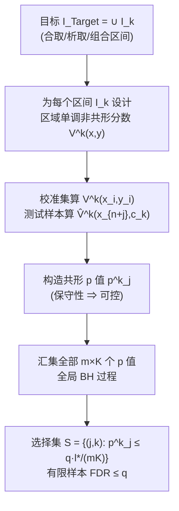

# Multi-Condition Conformal Selection

**会议**: ICLR 2026  
**OpenReview**: [https://openreview.net/forum?id=giL8Q1V26J](https://openreview.net/forum?id=giL8Q1V26J)  
**代码**: [https://github.com/hqy-new/mccs-iclr26](https://github.com/hqy-new/mccs-iclr26)  
**领域**: 学习理论 / 共形预测 / 多重假设检验  
**关键词**: Conformal Selection, FDR Control, Conformal p-value, Benjamini–Hochberg, Multi-Condition Selection  

## 一句话总结
把只能处理单阈值 `y > c` 的共形选择（conformal selection）推广到「合取条件 `c1 < y < c2`」和「析取条件 `y < c1 或 y > c2`」等多条件场景，通过设计**区域单调**的非共形分数 + **全局 BH 过程**，在有限样本下严格控制 FDR。

## 研究背景与动机
- **领域现状**：在药物筛选、精准医疗、LLM 输出对齐等资源受限场景里，需要从海量候选中挑出满足特定标准的子集，且要在有限样本下控制假发现率（FDR）。cfBH（Jin & Candès, 2023）把这一选择问题建模成多重假设检验：用共形 p 值（conformal p-value）刻画每个测试样本满足条件的证据强度，再用 Benjamini–Hochberg（BH）过程控 FDR。
- **现有痛点**：cfBH 及其后续工作（WCS 处理协变量漂移、mCS 推广到多元响应）都把假设限定为**单一条件** `y > c`。但真实需求往往是多条件的——「类药性」要求化合物 logP 落在**中等区间**（合取条件 `c1 < y < c2`），早期预警系统要在指标**过高或过低时**都触发（析取条件 `y < c1 或 y > c2`）。
- **核心矛盾**：一个看似自然的做法是对每个边界单独跑一次 cfBH，再用**集合交/并**拼接结果（Inter-cfBH / Union-cfBH）。但本文证明（Corollary 3.1）这会因**误差累积**破坏 FDR 控制：交集选择中一个假发现需要两个过程同时出错，这种乘性结构在选择集变小时反而抬高 FDR；并集选择中误差则是加性累积，分子重复计入假发现而分母因 `S1`、`S2` 相关无法等比增长，同样导致 FDR 膨胀。
- **本文目标**：在合取、析取及其任意组合（含多区间、多元响应）下，建立**有限样本 FDR 严格可控**的共形选择框架。
- **核心 idea**：**「为每个目标区间定制一个区域单调的非共形分数，把所有 (样本, 条件) 对的 p 值汇到一起做一次全局 BH」**——用区间专属打分保证 p 值的保守性（conservativeness），用全局排序的 BH 把多条件统一进单一检验框架，从根上避免拼接式方法的误差累积。

## 方法详解

### 整体框架
MCCS（Multi-Condition Conformal Selection）把目标写成若干区间的并 $I_{Target}=\bigcup_{k=1}^{K} I_k$，每个 $I_k$ 是单侧无界或有界开区间。算法分三步：(1) 为每个目标区间 $I_k$ 设计满足**区域单调**的非共形分数 $V^k(x,y)$；(2) 在校准集上算 $V^k(x_i,y_i)$、在测试样本上用阈值代入算 $\hat V^k_{n+j}$，进而得到每个 (样本 $j$, 条件 $k$) 对的共形 p 值 $p^k_j$；(3) 把全部 $m\times K$ 个 p 值汇集做**一次全局 BH**，输出选择集 $S=\{(j,k): p^k_j \le q\cdot l^*/(mK)\}$。

### 关键设计

> **共形 p 值的构造（贯穿三块设计的公共基座）**：当响应可观测时 oracle p 值为
> $$p^*_j=\frac{\sum_{i=1}^n \mathbf 1\{V_i<V_{n+j}\}+U_j\big(1+\sum_{i=1}^n\mathbf 1\{V_i=V_{n+j}\}\big)}{n+1}$$
> 但测试响应 $y_{n+j}$ 不可观测，故用阈值代入的 $\hat V_{n+j}=V(x_{n+j},c_k)$ 替换 $V_{n+j}$，得到实际可算的 $p_j$。只要分数区域单调，$p_j$ 就保守，BH 即可控 FDR——这是后面所有设计共享的底座。

**1. 区域单调的非共形分数：让合取条件也满足保守性。** 共形选择能控 FDR 的命门是 p 值的**保守性** $P(p_j\le\alpha,\ j\in H_0)\le\alpha$，而这要求非共形分数满足**区域单调**（regional monotonicity）：对目标区域外的 $y'$ 有 $V(x,y')\le V(x,y)$。单阈值时这很容易，但合取条件 $I_k=(c_{kL},c_{kR})$ 的「双侧夹逼」让普通分数失效。本文设计的分数对落在区间内的样本给**低分**以促进选择——当 $y\in(c_{kL},c_{kR})$ 时取 $M-\min(\hat\mu(x)-c_{kL},\ c_{kR}-\hat\mu(x))$，否则取 $\max(c_{kL}-\hat\mu(x),\ \hat\mu(x)-c_{kR})$，其中 $\hat\mu$ 是预测器、$M$ 是一个大常数（$M>2\sup_x\max(|c_{kL}-\hat\mu(x)|,|\hat\mu(x)-c_{kR}|)$）。这个 $M$ 不只是为了拉开区间内外的分数差以保证单调，它还（Proposition 4.1 + Appendix A.2）让算法在渐近 FDR 表达式里能**收紧 BH 阈值的不等式**、把实际 FDP 推得更贴近名义水平 $q$。该命题把 cfBH 中单条件的渐近 FDR/Power 刻画推广到了合取条件。

**2. 全局 BH 过程：用统一检验框架处理析取条件。** 析取条件 `y<c1 或 y>c2` 的关键不是改分数而是**怎么用 BH**。朴素做法对每个边界单独 BH 再取并会误差累积，本文改成**全局**：把所有 $m\times K$ 个 p 值 $\mathcal P=\{p^k_j\}$ 汇到一起升序排列 $p_{(1)}\le\cdots\le p_{(NUM)}$（$NUM=mK$），找最大的 $l^*$ 使 $p_{(l^*)}\le q\cdot l^*/NUM$，再选出 $S=\{(j,k): p^k_j\le q\cdot l^*/NUM\}$。由于把所有假设塞进**一个**多重检验框架，FDR 控制直接由 cfBH 的有限样本定理（在交换性下）保证，彻底回避了拼接式方法的误差膨胀。

**3. 任意组合与多元响应的统一推广。** 单侧无界区间被视为「一端为无穷」的合取条件特例——例如左无界 $I_k=(-\infty,c_{kR})$ 的分数写成 $V^k(x,y)=M\cdot\mathbf 1\{y<c_{kR}\}+\hat\mu(x)$，右无界对称。于是合取（定制分数）+ 析取（全局 BH）这两块拼起来就能覆盖任意多区间组合。更重要的是 **Corollary 4.1** 证明了**目标区间相互重叠也不破坏 FDR 控制**——使用者可以直接指定多个目标区间而无需做显式的相交检查。多元响应下，合取条件的目标变成内外边界 $\partial R_{inner},\partial R_{outer}$ 之间的环形区域，分数改用到边界的距离 $dis(\cdot)$（Algorithm 4），而全局 BH 本身与响应维度无关，可直接套用。**Theorem 4.1** 给出最终保证：只要 $V^k$ 区域单调且分数条件交换，对任意 $q\in(0,1)$，Algorithm 3 的输出满足 $\text{FDR}\le q$。

## 实验关键数据

### 主实验：与基线对比（名义 FDR = 0.3）
理想方法应让实测 FDR 尽量贴近但**不超过** 0.3，同时保持高 Power。

| 方法 | 合取-单变量 FDR | 合取-单变量 Power | 析取-单变量 FDR | 析取-单变量 Power |
|------|------|------|------|------|
| Int / Uni（交/并） | 0.3766 ❌超标 | 0.9397 | 0.3766 ❌超标 | 0.9720 |
| Int-B / Uni-B（Bonferroni） | 0.1081（过保守） | 0.6005 | 0.1569（过保守） | 0.9224 |
| Ind（指示器） | 0.2013 | 0.2126（极低） | 0.2290 | 0.0000 |
| **MCCS（本文）** | **0.2874** | **0.9756** | **0.2848** | **0.9515** |

朴素集合操作（Int/Uni）一致超过名义水平，验证了误差累积的 Corollary 3.1；Bonferroni 版过度保守、Power 大跌；Ind 法 Power 极低。MCCS 把 FDR 稳稳压在名义水平上下，同时维持最高的 Power。多元响应（维度 30）下结论一致。

### 消融 / 鲁棒性实验

| 实验 | 设置 | 结论 |
|------|------|------|
| 6 种组合任务（含相交区间） | Task1–6，$q$ 从 0.05 到 0.5 | FDR 全程精准受控，相交区间不破坏控制（印证 Corollary 4.1） |
| 噪声鲁棒性 | Task5，Ns=0.1/0.5/0.9 | Power 随噪声轻微下降但稳健，FDR 始终贴近 0.3 |
| 大区间数 $K$ | $K$=10/20/40 | $K$ 增大时 Power 略降（0.99→0.90）、FDR 更保守，符合多重检验阈值 $q\cdot l/(mK)$ 收缩的预期 |

### 真实数据应用（名义 FDR 0.3）

| 任务 | 模态 | FDR | Power |
|------|------|------|------|
| nlp-A / nlp-B（毒性内容中危样本） | 文本 | 0.291 / 0.289 | 0.575 / 0.512 |
| cv-A / cv-B（NYU 深度区间，ResNet/ViT） | 视觉 | 0.261 / 0.293 | 0.892 / 0.814 |
| vqa-A / vqa-B（人类一致性置信区间，BLIP+Ridge） | 多模态 | 0.263 / 0.285 | 0.589 / 0.726 |

### 关键发现
- 拼接式（交/并）方法在多条件下**必然**超 FDR，Bonferroni 修正又过保守，凸显了「为多条件量身设计」的必要性。
- MCCS 在文本、视觉、多模态乃至多分类（CIFAR-10/100 选单类/多类/相似类）上都保持 FDR 紧贴名义水平且 Power 可用，证明框架的通用性与可扩展性。
- 区间贡献分析显示，被选样本在各区间上的分布与全体测试样本一致——选择偏向某区间反映的是该区间更强的统计证据（数据分布固有差异），而非算法偏差。
- $q$ 从 0.05 扫到 0.5 时 FDR 始终随名义水平线性贴合，说明控制是「全谱有效」而非仅在 0.3 一点调优。

## 亮点与洞察
- **诊断到位**：先用 Corollary 3.1 + Remark 把「交集 = 乘性误差、并集 = 加性误差」这件事讲清楚，再对症下药，逻辑闭环漂亮。
- **两块拼图各司其职**：合取靠「定制区域单调分数」，析取靠「全局 BH」，而单侧/无界/多区间/多元都被归约成这两块的组合，框架简洁且每步都有有限样本保证。
- **重叠区间免检查**（Corollary 4.1）这一性质在工程上很实用——用户能随手叠区间而不必担心相交带来 FDR 失控。

## 局限与展望
- **多元合取下 Power 偏低**：Table 1 中多元合取 MCCS 的 Power 只有 0.5348，明显低于单变量的 0.9756，说明高维环形目标区域的选择效率仍有提升空间。
- **大 $K$ 的保守性代价**：区间数增大时 BH 阈值 $q\cdot l/(mK)$ 收缩导致 Power 下降，多区间精细划分的场景下需权衡。
- **依赖交换性假设**：与所有共形方法一样，理论保证建立在 i.i.d./交换性之上，分布漂移下需结合加权（如 WCS）思路，本文未深入。
- **非共形分数依赖 $\hat\mu$ 质量**：分数构造用到预测器 $\hat\mu(x)$，模型预测越准选择效率越高，但 FDR 控制本身与模型好坏解耦（这是优点也意味着差模型下 Power 会受限）。
- **常数 $M$ 的取值偏经验**：$M$ 需大于一个与预测器相关的上界才能保证单调与收紧 FDR，文中给的是充分条件，实际最优取值仍依赖数据规模，缺乏自适应选取策略。

## 相关工作与启发
- **共形预测（CP）**：Vovk et al. 的共形预测给出有限样本覆盖保证，但只构造预测集、不直接控 FDR，因此无法直接用于选择问题——这正是 CS 框架要弥合的鸿沟。
- **cfBH（Jin & Candès, 2023）**：把 CP 原理接到选择任务、用共形 p 值 + BH 控 FDR 的奠基工作，本文的单条件特例与渐近刻画都建立在它之上。
- **WCS / mCS（Bai et al., 2025b）**：WCS 用倾向性加权处理协变量漂移；mCS 推广到多元响应并引入区域单调的概念，本文的多元扩展与区域单调定义直接承袭 mCS，但把判据从单条件升级为合取条件。
- **启发**：把「多条件」统一归约成「多区间的并 + 全局 BH」是个可复用的范式——任何需要在结构化目标上做带 FDR 保证选择的任务（多目标药物筛选、区间型异常检测、多标准 LLM 输出过滤）都可以套这个模板。

## 评分
- **新颖性**: ⭐⭐⭐⭐ 首次把共形选择系统性推广到合取/析取/任意组合的多条件场景，区域单调分数设计 + 全局 BH 的组合是清晰的新贡献，但单点创新建立在 cfBH/mCS 之上，属扎实的延伸而非全新范式。
- **实验充分度**: ⭐⭐⭐⭐ 模拟（基线对比、6 任务、噪声、大 K、区间贡献分析）+ 真实数据（NLP/CV/VQA/多分类）覆盖全面，FDR 与 Power 双指标对照清楚；多元合取 Power 偏低暴露得也诚实。
- **写作质量**: ⭐⭐⭐⭐ 问题动机—失败诊断—方法—理论—实验的脉络顺畅，公式与算法伪代码完整，定理/推论各有定位；个别记号（如 Algorithm 2/3 引用）略有混淆。
- **价值**: ⭐⭐⭐⭐ 多条件带 FDR 保证的选择在药物筛选、风险预警、LLM 对齐等资源受限场景有直接落地价值，重叠区间免检查等性质对实用者很友好。

<!-- RELATED:START -->

## 相关论文

- [\[ICLR 2026\] Singleton-Optimized Conformal Prediction](singleton-optimized_conformal_prediction.md)
- [\[ICLR 2026\] High-dimensional Analysis of Synthetic Data Selection](high-dimensional_analysis_of_synthetic_data_selection.md)
- [\[ICLR 2026\] Optimizing Data Augmentation through Bayesian Model Selection](optimizing_data_augmentation_through_bayesian_model_selection.md)
- [\[ICLR 2026\] Conformal Prediction for Long-Tailed Classification](conformal_prediction_for_long-tailed_classification.md)
- [\[ICLR 2026\] Distribution-informed Online Conformal Prediction](distribution-informed_online_conformal_prediction.md)

<!-- RELATED:END -->
