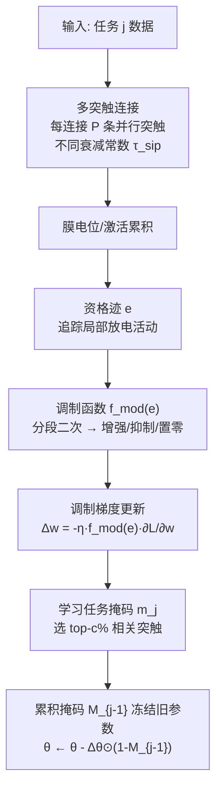

# Multi-Synaptic Cooperation: A Bio-Inspired Framework for Robust and Scalable Continual Learning

**会议**: ICLR 2026  
**OpenReview**: [https://openreview.net/forum?id=KjxS4AgFol](https://openreview.net/forum?id=KjxS4AgFol)  
**代码**: 待确认  
**领域**: 持续学习 / 类脑计算 / 灾难性遗忘  
**关键词**: 持续学习, 多突触协同, 资格迹, 突触可塑性, SNN, 灾难性遗忘, 任务顺序鲁棒性  

## 一句话总结
受生物神经元"同一对轴突-树突间存在多条并行突触"启发，本文提出 MSCN：在**固定网络结构**内用多条并行突触提升表征容量，再用基于资格迹（eligibility trace）的局部活动调制突触可塑性，从而在不动态扩容的前提下缓解灾难性遗忘，并显著增强对任务顺序的鲁棒性。

## 研究背景与动机
**领域现状**：持续学习要求模型按序学习多个任务且不遗忘旧知识，主流方法分三类——回放（rehearsal）、正则化（regularization）、结构（architecture）。其中结构类方法因能为每个任务分配子网络、可实现"零遗忘"而备受关注，典型做法是动态扩容（expansion）或对稠密模型做剪枝/掩码（如 PackNet、SupSup、WSN）。

**现有痛点**：结构类方法有两个硬伤——（i）动态扩容需要随任务数持续增长网络，长任务序列下对硬件不友好、容量受限；（ii）扩容和剪枝都**对任务顺序高度敏感**，换一个任务到达顺序性能就大幅波动。

**核心矛盾**：大脑能持续学习一辈子却**不靠结构生长**。生物学观察到同一对神经元间存在**多条冗余突触连接**（multi-synaptic connectivity），且突触改变遵循"三因子学习规则"——不仅受全局神经调质信号控制，还依赖**局部突触活动**。现有 ML 方法既没利用这种多突触冗余带来的容量，也没利用局部活动驱动的可塑性调制。

**本文目标**：在不增加网络深度/宽度、不动态扩容的前提下，靠"多突触协同 + 局部活动调制"同时提升容量与任务顺序鲁棒性。

**核心 idea**：**[多突触并行]** 把单连接拓展成 P 条具有不同时间常数的并行突触以扩容；**[局部活动调制]** 用共享资格迹追踪近期放电、经非线性调制函数控制每次权重更新的强度与方向（增强/抑制），实现任务相关突触的选择性激活与无关突触的抑制。

## 方法详解

### 整体框架
MSCN 由两块拼成：(1) **多突触连接结构**——把传统"一连接一突触"换成每条连接 P 条并行突触，每条有独立衰减时间常数，从而在固定拓扑内扩张表征容量；(2) **基于资格迹的可塑性调制**——P 条并行突触共享一条资格迹追踪局部放电活动，再用一个分段二次调制函数把资格迹映射成"增强/抑制/不变"的调制因子，缩放梯度更新。两者叠加在经典结构类持续学习范式（学习二值掩码 + 累积掩码冻结旧任务参数）之上，对 SNN 和 ANN 都适用。

### 关键设计

**1. 多突触并行神经元建模：用时间常数异质的并行突触在固定拓扑内扩容。** 出发点是生物神经元同一轴突-树突对之间存在多个突触接触，提供冗余与适应性。作者先在更贴近生物的 SNN 上建模：传统 LIF 神经元假设每条连接只有一个突触（$\tau_m \frac{dV}{dt} = -(V-V_{rest}) + I(t)$），表征多样性受限。MSCN 把每个突触前神经元 $i$ 到突触后神经元拓展为 $P\geq 1$ 条并行突触通路，膜电位变为 $V(t)=\sum_{i=1}^{N}\sum_{p=1}^{P} w_{ip}\,\mathrm{PSP}_{ip}(t) - \vartheta\sum_j e^{-(t-t_s^j)/\tau_m}$，其中 $w_{ip}$ 是第 $p$ 条并行突触的权重。关键在于**为每条并行突触赋予不同且不可训练的衰减时间常数** $\tau_{sip}$（突触核 $K_{ip}(t)=e^{-t/\tau_{sip}}$），从而保留突触异质性、让多条具有不同时间尺度与权重的通道共同塑造时空表征，相当于在不加宽/加深网络的情况下凭"突触维度"扩容。ANN 版本是这一思想在非脉冲架构上的直接对应实现。

**2. 资格迹驱动的局部可塑性调制：让"最近谁活跃"决定权重怎么改。** 这是鲁棒性的来源。一条连接上的 P 条并行突触**共享一条资格迹** $\tilde e$，连续时间下 $\frac{d\tilde e}{dt}=-\frac{\tilde e}{\tau}+\sum_f \delta(t-t^f)$，离散实现为 $\tilde e[t+1]=\tilde e[t]-\frac{\tilde e[t]}{\tau}+S[t+1]$（$S\in\{0,1\}$ 表示是否放电）——即近期放电累积、无输入时指数衰减，从而追踪局部活动。把 $\tilde e$ 归一化到 $[-1,1]$ 后送入分段二次调制函数 $f_{mod}(\tilde e)$（式 7）：低活动区线性升至 $\theta_{max}$，到 $e_{inv}$ 处过零并反向，从而在 $|f_{mod}|\geq 1$ 时增强（potentiation）、$0<|f_{mod}|<1$ 时抑制（depression）、$f_{mod}=0$ 时完全抑制。最终权重更新被这个因子缩放：$\Delta w=-\eta\cdot f_{mod}(\tilde e)\cdot \frac{\partial L}{\partial w}$。直觉是：依据"最近局部活动强弱"动态决定每个突触该被强化还是削弱，模拟了生物中"活动依赖的鲁棒学习"，使任务相关突触被放大、无关突触被压制，对任务顺序的扰动自然不敏感。

**3. 嵌入经典结构类持续学习范式：用掩码 + 累积冻结实现零遗忘。** 多突触与调制只是底层机制，外层沿用 Kang/Serra/Wortsman 的子网络范式。多头设置下（训练与推理都已知任务 id），对任务 $j$ 学一个二值掩码 $m_j^*$ 激活相关突触，目标 $\theta^*,m_j^*=\arg\min \frac{1}{n_j}\sum [L(F(x;\theta\odot m_j),y)-L(F(x;\theta),y)]$。维护一个跨任务共享的相关性分数 $r$（每条突触一个），按 layerwise 容量比 $c\%$ 选 top 权重形成子网络。为保旧知识，用累积掩码 $M_{j-1}=\bigvee_{i=1}^{j-1} m_i$，更新时 $\theta\leftarrow\theta-\Delta\theta\odot(1-M_{j-1})$，即**只让未被占用的突触可训练**，已分配给旧任务的参数被冻结——这保证了结构上的零遗忘（BWT=0），而前两个机制负责把"固定容量"用到极致并稳住顺序鲁棒性。

## 实验关键数据

设置：多头 task-incremental，四个基准（PMNIST、10-split CIFAR-100、TinyImageNet、5-Datasets），SNN 与 ANN 双架构，指标为平均准确率 ACC↑ 与后向迁移 BWT↑（0 表示无遗忘），主实验默认 $P=3$，5 个随机种子。

### 主实验表格（ACC %，节选）

| 架构 | 方法 | PMNIST | CIFAR-100 | TinyImageNet | 5-Datasets |
|------|------|---------|-----------|--------------|------------|
| SNN | HLOP (ICLR24) | 95.15 | 78.58 | 71.40 | 88.65 |
| SNN | **MSCN** | **96.34** | **79.54** | **73.22** | **88.84** |
| ANN | WSN (ICML22) | 96.41 | 76.38 | 71.96 | 93.41 |
| ANN | SPG (ICML23) | 96.35 | 74.82 | 73.26 | 93.32 |
| ANN | Bayesian (ICML24) | 96.74 | 75.57 | 73.93 | 93.36 |
| ANN | **MSCN** | **97.53** | **77.37** | **75.03** | **93.69** |

- ANN/TinyImageNet 上 MSCN 比次优的 Bayesian 高 **1.10%**；MSCN 在 SNN/ANN 两套架构、四个数据集上均稳居或并列第一，且 BWT 全为 0（零遗忘）。

### 消融实验表格（ACC %，ANN）

| 多突触 | 调制 | PMNIST | CIFAR-100 | TinyImageNet | 5-Datasets |
|--------|------|---------|-----------|--------------|------------|
| ✓ | ✓ | **97.53** | **77.37** | **75.03** | **93.69** |
| ✗ | ✓ | 96.79 | 77.03 | 73.81 | 93.47 |
| ✓ | ✗ | 96.53 | 76.81 | 73.78 | 93.51 |
| ✗ | ✗ | 96.34 | 76.34 | 72.59 | 93.32 |

- 去掉调制在 TinyImageNet/PMNIST 上掉得明显，去掉多突触在 CIFAR-100/5-Datasets 上掉得明显，两者全去掉最差——两机制**协同**，缺一不可。

### 关键发现
- **任务顺序鲁棒性**：在 CIFAR-100 Split 三种任务顺序下，EWC/GPM 波动剧烈、WSN 倾向过拟合特定顺序，而 MSCN 每个任务的方差最小、各排列下准确率稳定（Fig. 3）。
- **突触数的最优区间**：增大每连接突触数 $P$ 持续提升 per-task 准确率，但联合扩 synapse+neuron 会**饱和**——容量超过任务复杂度后趋于平台；过度连接反而损害电路性能，存在"突触丰富度 vs 学习效率"的最优折中，恰好呼应大脑突触数"有限但有效"的分布规律。

## 亮点与洞察
- **换维度扩容**：跳出"加深/加宽/动态扩容"三板斧，提出在**突触维度**扩容——固定拓扑内塞多条异质时间常数的并行突触，对硬件友好得多。
- **鲁棒性有抓手**：把"对任务顺序敏感"这个结构类方法的老问题，归因到缺少局部活动调制，并用资格迹给出可计算的调制函数，实验上方差显著下降。
- **生物可信且通用**：机制定义在突触层面，SNN/ANN 通吃；且实验观察到的"突触数最优区间"与神经科学结论自洽，增加了说服力。
- **零遗忘 + 高精度兼得**：相比同样 BWT=0 的 PackNet/SupSup/WSN，MSCN 在保持零遗忘的同时拿到更高 ACC。

## 局限与展望
- **依赖任务 id 的多头设置**：训练和推理都假设已知任务身份，属于相对宽松的 task-incremental 场景，未验证 class-incremental 或 task-id 未知的更难设定。
- **时间常数不可训练且需初始化**：并行突触的 $\tau_{sip}$ 手工初始化为不同值且固定，最优突触数 $P$ 随任务难度变化需调，缺乏自适应选择机制。
- **调制函数形式较启发式**：分段二次 $f_{mod}$ 沿用既有工作，超参（$\theta_{max}, e_{inv}$）的敏感性与理论依据可进一步分析。
- **基准规模偏经典**：四个数据集仍属中小规模视觉持续学习，未涉及大模型/大规模序列或跨模态持续学习。

## 相关工作与启发
- **结构类持续学习**：PackNet、SupSup、WSN、HAT 等靠掩码/剪枝分配子网络实现零遗忘，MSCN 沿用其外层范式但用多突触+调制替代"动态扩容"。
- **类脑可塑性**：三因子学习规则、资格迹（Frémaux & Gerstner）是其调制机制的生物学根基；近期工作（Zenke & Laborieux 2024 等）已指出多突触/冗余连接能提升计算容量，本文进一步把"多突触之间的协同"用于持续学习。
- **启发**：固定容量下"用结构冗余 + 局部活动门控"换取容量与稳定性，这一思路对资源受限的边缘持续学习、SNN 神经形态硬件有迁移价值；资格迹作为可微调制信号也可能用于其他需要"活动依赖学习率"的场景。

## 评分
- **新颖性**: ⭐⭐⭐⭐ — 把"多突触并行 + 资格迹局部调制"引入持续学习、在突触维度而非网络维度扩容，角度新颖且生物动机扎实。
- **实验充分度**: ⭐⭐⭐⭐ — 四数据集 × SNN/ANN 双架构 × 5 种子，含消融、任务顺序鲁棒性、突触数饱和分析，较完整；但局限于 task-incremental 多头与中小基准。
- **写作质量**: ⭐⭐⭐⭐ — 动机—机制—实验链条清晰，公式与图示（资格迹调制、突触数热图）配合到位。
- **价值**: ⭐⭐⭐⭐ — 为"不扩容也能稳健持续学习"提供了可落地、对硬件友好的机制，对神经形态计算社区尤具参考意义。

<!-- RELATED:START -->

## 相关论文

- [\[ICLR 2026\] Memory-Statistics Tradeoff in Continual Learning with Structural Regularization](memory-statistics_tradeoff_in_continual_learning_with_structural_regularization.md)
- [\[ICLR 2026\] Understanding the Dynamics of Forgetting and Generalization in Continual Learning via the Neural Tangent Kernel](understanding_the_dynamics_of_forgetting_and_generalization_in_continual_learnin.md)
- [\[ICLR 2026\] PAC-Bayes Bounds for Cumulative Loss in Continual Learning](pac-bayes_bounds_for_cumulative_loss_in_continual_learning.md)
- [\[ICLR 2026\] A Generalized Geometric Theoretical Framework of Centroid Discriminant Analysis for Linear Classification of Multi-dimensional Data](a_generalized_geometric_theoretical_framework_of_centroid_discriminant_analysis_.md)
- [\[ICLR 2026\] Noise Tolerance of Distributionally Robust Learning](noise_tolerance_of_distributionally_robust_learning.md)

<!-- RELATED:END -->
