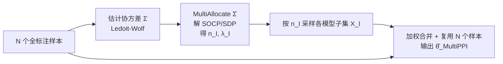

# Multiple-Prediction-Powered Inference

**会议**: ICLR 2026  
**OpenReview**: [https://openreview.net/forum?id=gJZ5rf2bS4](https://openreview.net/forum?id=gJZ5rf2bS4)  
**代码**: 待确认  
**领域**: 统计推断 / 学习理论（预测驱动推断、预算分配）  
**关键词**: Prediction-Powered Inference, 最优预算分配, minimax 最优, 二阶锥规划, LLM 评测, autorater  

## 一句话总结
MultiPPI 把"用多个不同成本/质量的预测器在固定预算下高效估计某个均值"形式化为一个凸优化问题（单约束下是二阶锥规划 SOCP），自动决定查询哪些模型子集、各查多少次、如何加权，理论上在协方差已知时是 minimax 最优，实验上在三类 LLM 评测任务中始终比现有 PPI 基线误差更低。

## 研究背景与动机

**领域现状**。在科学测量和 AI 模型评测里，常常有一个昂贵但高质量的指标（如人类标注、强力专有模型当 autorater），和一堆便宜但有噪声的代理（小模型 autorater、规则系统）。Prediction-Powered Inference (PPI) 及其高效版 PPI++（Angelopoulos 等）就是把少量"金标签"和大量便宜模型预测结合起来，给出无偏、低方差的总体量估计。

**现有痛点**。已有 PPI 框架要么只假设**单个**预测器，要么假设**一组固定的、一起查询**的预测器（Miao 等的 vector PPI++，把所有预测堆成向量）。但现实里多个 autorater 各有各的成本-性能曲线：最好的模型往往最贵。如果某些代理很贵，能采样的次数就受限，把它们和便宜模型绑死一起查就是次优；而"只挑一个性价比最高的模型做 PPI"又不知道该挑哪个、跟某个便宜子集的组合相比差多少。

**核心矛盾**。这是一个**预算分配难题**：在硬预算约束下，决定查哪些模型子集（单独、联合、或任意子集）、每个查多少次、怎样组合这些测量值，才能得到最小方差的估计。联合观测能降方差（利用相关性），但要付联合采样成本，而成本结构可能是非可加的（比如多个 autorater 可并行，延迟成本≈最慢那个；但医疗检测多做反而更难）。

**本文目标**。给定随机向量 $X=(X_1,\dots,X_k)$ 和成本结构，在总预算 $B$ 下估计任意线性泛函 $\theta^\* = a^\top \mathbb{E}[X]$（取 $a=(1,0,\dots)$ 即估 $\mathbb{E}[X_1]$，取 $a=(1,-1,0,\dots)$ 即估均值差），并给出 minimax 最优性、有限样本界与渐近正态性。

**核心 idea**。**预算自适应的子集分配**——不再粗暴地"要么单模型、要么全部一起查"，而是允许对任意索引子集 $I\subseteq\{1,\dots,k\}$ 灵活采样，把"分配样本数 $n_I$ + 选权重 $\lambda_I$"统一成一个凸优化，让方法随预算自动从依赖便宜代理过渡到引入昂贵精准模型。

## 方法详解

### 整体框架
MultiPPI 把估计器写成各子集样本均值的加权和 $\hat\theta(n,\lambda)=\sum_{I:n_I>0}\frac{1}{n_I}\sum_j \lambda_I^\top X_I^{(j)}$，然后在"无偏 + 预算"两个约束下最小化 MSE 求出最优的采样分配 $\{n_I\}$ 和权重 $\{\lambda_I\}$。整个流程分两层：先在"协方差 $\Sigma$ 已知"的理想条件下证明这个最优解就是 minimax 最优估计器（理论锚点），再把 $\Sigma$ 换成数据估计的 $\hat\Sigma$ 给出可落地的实用算法和稳定性界。

### 关键设计

**1. 把预算分配化为凸优化（SOCP/SDP）：让"查谁、查几次、怎么加权"一次解出。** 估计器对 $X$ 是线性的，所以最优 $(n,\lambda)$ 只依赖协方差矩阵 $\Sigma=\mathrm{Cov}(X)$。无偏约束 $\mathbb{E}[\hat\theta]=\theta^\*$ 可以化简成对 $\lambda$ 的一个线性约束，于是整个问题的最优 MSE 写成 $V_B=\min_{n:\,B\text{ holds}} a^\top S(n)\,a$，其中 $S(n)=\big(\sum_{I\in\mathcal I} n_I\Sigma_I^\dagger\big)^\dagger$（$\Sigma_I$ 是 $\Sigma$ 在子集 $I$ 上的主子阵嵌回 $\mathbb{R}^{k\times k}$，$\dagger$ 是 Moore-Penrose 伪逆）。最优权重则由 $\lambda_I$ 取 $n_I\Sigma_I^\dagger S(n)a$ 在坐标 $I$ 上的限制给出。松弛掉 $n_I$ 的整数约束后，单预算约束下这是一个**二阶锥规划 (SOCP)**，多预算约束下是**半定规划 (SDP)**，都能用 cvxpy/CVXOPT 这类现成工具高效求解。值得注意的是，vector PPI++（式 3）和 PPI++ 级联（式 4）都只是给 $\lambda_I$ 加额外置零限制后的特例——MultiPPI 把它们统一进同一个搜索空间。

**2. 协方差已知时的 minimax 最优性：把"最优估计"问题等价成"最小方差线性无偏估计"。** 论文先问 Question 1——若 $\Sigma$ 精确已知，关于 MSE 的 minimax 最优、满足预算的估计器是什么；再证明它等价于 Question 2——最小方差的线性无偏满预算估计器（Theorem 2）。关键结论是：在所有满预算估计器集合 $\Theta_B$（**不限于**线性或无偏）上，$\inf_{\hat\theta\in\Theta_B}\sup_{P\in\mathcal P_\Sigma}\mathbb{E}[(\hat\theta-\theta^\*)^2]=\mathrm{Var}(\hat\theta_{\text{MultiPPI}}(\Sigma))=V_B$，其中 $\mathcal P_\Sigma$ 是所有协方差为 $\Sigma$ 的分布。也就是说式 (7) 给出的最小 MSE 不只是某个估计器类内的最优，而是该协方差族上谁都打不过的下界，把"分配资源"和"估计相关结构"两件事干净地解耦开。

**3. 协方差未知时的实用算法与稳定性界：用 $\hat\Sigma$ 替代 $\Sigma$，并量化代价。** 实际中 $\Sigma$ 要从数据估计。Theorem 3 证明只要 $\hat\Sigma\xrightarrow{p}\Sigma$（随预算 $B\to\infty$），$\hat\theta_{\text{MultiPPI}}(\hat\Sigma)$ 就渐近正态并达到 Theorem 2 的最优方差 $\sqrt{B}(\hat\theta-\theta^\*)\xrightarrow{d}\mathcal N(0,V^\*)$；更重要的是，**无论 $\hat\Sigma$ 设错与否**，估计器都保持无偏、满预算、渐近正态。Theorem 4（稳定性）给出有限样本的误差敏感度：$\mathbb{E}[(\hat\theta_{\text{MultiPPI}}(\hat\Sigma)-\theta^\*)^2]\le V_B + \frac{4\sigma^2_{\text{classical}}}{\gamma_{\min}}\|\hat\Sigma-\Sigma\|_F$（当 $\|\hat\Sigma-\Sigma\|_F\le\gamma_{\min}/2$，$\gamma_{\min}$ 是 $\Sigma$ 最小特征值）。由于误差被 Frobenius 范数 $\|\hat\Sigma-\Sigma\|_F$ 控制，论文选用专门最小化该范数的 **Ledoit-Wolf 估计器**，实验中表现最佳。落地流程很简洁：用 $N$ 个全标注样本估 $\hat\Sigma$ → 解优化得 $n_I,\lambda_I$ → 按分配采样额外数据，并**复用**那 $N$ 个样本一起算出最终估计（复用引入有限样本偏差但保持一致性与渐近正态性）。

## 实验关键数据

评测设定：估计 $\theta^\*=\mathbb{E}[X_1]$，预算从 0 到 2k 单位（1 单位=查一次最贵模型），做 500k 次随机试验、250 个给定标签；汇报覆盖率、95% CI 宽度、MSE（后两者以经典采样为基准的比例，越低越好）。

### 主实验（三类 LLM 评测任务）

| 实验 | 任务 / 目标 | 模型族 (X₂…Xₖ) | 成本结构 | 结论 |
|------|-------------|----------------|----------|------|
| Exp 1 Chatbot Arena | 估 Claude-2.1 vs GPT-4-1106 的胜率 | Gemini 2.5 Pro / Flash autorater | 可加（按 API 定价） | MultiPPI 在**所有预算区间**优于全部基线 |
| Exp 2 ProcessBench | 估数学解答含过程错误的比例（二分类） | Gemini 2.5 Pro 思考预算 125/250/375/500 词（tiny/small/medium/large） | 非可加、级联（输入∝词数之和，输出∝最大词数） | MultiPPI 全区间最优 |
| Exp 3 传记事实性 | 估 524 位计算机科学家传记的事实一致比例 | Gemini 2.0 Flash Lite 多轮辩论（A 个 agent×R 轮） | 级联，成本=A·R | MultiPPI 全区间最优 |

### 关键发现

- **没有单一基线全程最优**：低预算下便宜模型的 scalar PPI++ 最好，高预算下 vector PPI++（用全部模型）才反超——MultiPPI 在每个区间都压过当前最佳基线。
- **预算自适应得到验证**：学到的 $\lambda_I,n_I$ 在低预算时收敛到"用便宜模型做 PPI++"的配置，高预算时收敛到 vector PPI++（Exp 1）或级联 PPI（Exp 2 中用 medium 去 debias large），与理论 (Section E.2) 一致。
- **更贵≠更准就够**：Exp 1 中 PPI++ + Gemini 2.5 Pro 全程被踢出 Pareto 前沿（与标签相关性不比 Flash 高却更贵）；Exp 2 中"思考更久"并不减小系统偏差，但 PPI 这类去偏方案能解决。
- **覆盖率小瑕疵**：Exp 3 高预算区 95% CI 略欠覆盖（≈1%），源于数据复用引入的有限样本偏差；当标签数随预算同比增长（N=1000）时该现象消失。

## 亮点与洞察
- **把一个看似离散的组合分配问题（查哪些子集）干净地化成凸优化**，且 vector PPI++、级联 PPI 都成了它的特例——这是把零散启发式统一进一个最优框架的漂亮一招。
- **理论扎实**：minimax 最优（不限线性/无偏的估计器类）、渐近正态、有限样本稳定性界三件套齐全，且稳定性界把误差敏感度直接挂到 $\|\hat\Sigma-\Sigma\|_F$ 上，反过来给出"选 Ledoit-Wolf"的原则性理由。
- **预算自适应是可解释的**：方法不是黑箱，能看到它随预算从"信便宜代理"平滑过渡到"引入昂贵精准模型"，且这一过渡有理论刻画。
- **直击 LLM 评测的真实痛点**：autorater 成本差异大、可并行（非可加成本）、test-time scaling 的级联成本——这些都被成本结构 $c_S$ 自然容纳。

## 局限与展望
- **固定（非自适应）分配**：为保证硬预算和有效 CI，MultiPPI 求的是对预测模型的**固定**分配策略，放弃了 input-conditional 的序贯策略（如 Angelopoulos 2025 的输入级策略、bandit 自适应 Monte Carlo），后者可能进一步降方差但难给有效 CI。
- **依赖协方差估计质量**：有限样本表现受 $\|\hat\Sigma-\Sigma\|_F$ 牵制，模型很多（$k$ 大）或样本少时 $\hat\Sigma$ 估不准会拖累。
- **子集组合规模**：原则上要考虑 $2^k$ 个子集，模型数多时优化变量爆炸，论文未深入讨论可扩展性。
- **数据复用的偏差**：复用 $N$ 个 burn-in 样本既估 $\hat\Sigma$ 又算 $\hat\theta$，在小样本下引入偏差（表现为 Exp 3 的轻微欠覆盖），需标签随预算同比增长才消失。

## 相关工作与启发
- **PPI / PPI++**（Angelopoulos 等 2023a/b）：本文的直接基座，MultiPPI 是其成本感知、多预测器的推广。
- **控制变量 / 差分估计**（Ripley 1987；Särndal 1992）与**半参数推断**（AIPW、TMLE、双重机器学习 DML）：共享"用相关变量降方差"的思想根。
- **vector PPI++**（Miao 等 2024）与**单预测器采样策略**（Angelopoulos 等 2025）：本文证明它们是 MultiPPI 的特例 / 部分推广，但本文用硬预算+固定分配而非期望预算+输入级策略。
- **预算回归 / 主动学习 / bandit 自适应 Monte Carlo**：目标不同（本文估总体均值的线性泛函而非样本级预测/最小化 regret），但分配视角相通。

## 评分
- **新颖性**: ⭐⭐⭐⭐ 把多预测器预算分配统一为凸优化并证明 minimax 最优，是对 PPI 线的实质性推广，已有方法成为其特例。
- **实验充分度**: ⭐⭐⭐⭐ 三类真实 LLM 评测（胜率、test-time scaling、多 agent 辩论）覆盖可加/非可加/级联成本，含覆盖率与 CI 宽度多维度，但任务量与基线种类可再扩。
- **写作质量**: ⭐⭐⭐⭐ 问题形式化清晰、理论层层递进（Q1→Q2→定理）、实验现象解释到位，符号偏密但可读。
- **价值**: ⭐⭐⭐⭐ 在 LLM 评测成本高企的当下提供原则性且可用现成求解器落地的省钱估计方案，理论与实践兼顾。

<!-- RELATED:START -->

## 相关论文

- [\[ICLR 2026\] Revisiting Active Sequential Prediction-Powered Mean Estimation](revisiting_active_sequential_prediction-powered_mean_estimation.md)
- [\[ICLR 2026\] Variational Inference for Cyclic Learning](variational_inference_for_cyclic_learning.md)
- [\[NeurIPS 2025\] Prediction-Powered Semi-Supervised Learning with Online Power Tuning](../../NeurIPS2025/learning_theory/prediction-powered_semi-supervised_learning_with_online_power_tuning.md)
- [\[ICLR 2026\] Singleton-Optimized Conformal Prediction](singleton-optimized_conformal_prediction.md)
- [\[ICLR 2026\] Best-of-Majority: Minimax-Optimal Strategy for Pass@k Inference Scaling](best-of-majority_minimax-optimal_strategy_for_passk_inference_scaling.md)

<!-- RELATED:END -->
