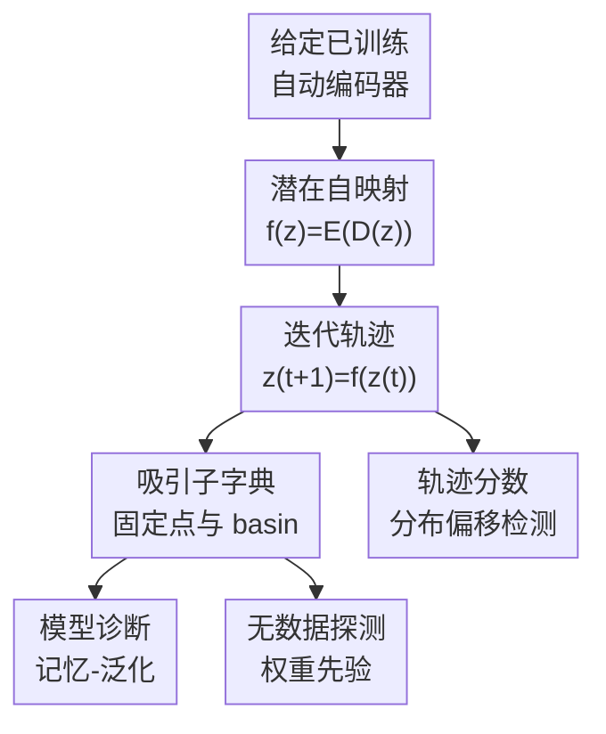

# Navigating the Latent Space Dynamics of Neural Models

**会议**: ICLR2026  
**OpenReview**: [https://openreview.net/forum?id=Zunww3FHPU](https://openreview.net/forum?id=Zunww3FHPU)  
**代码**: 未开源（文中承诺接收后开源）  
**领域**: 学习理论 / 表征学习分析  
**关键词**: 潜在空间动力学、自动编码器、吸引子、记忆与泛化、分布外检测  

## 一句话总结

这篇论文把自动编码器看成作用在潜在流形上的动力系统：反复执行 $f(z)=E(D(z))$ 会诱导一个潜在向量场，其吸引子和轨迹可以解释模型的记忆-泛化状态、无数据探测预训练权重中的先验信息，并用于分布外检测。

## 研究背景与动机

**领域现状**：表征学习通常把神经网络理解为从高维输入到低维潜在空间的映射，关注的是潜在表示是否线性可分、是否语义一致、是否适合下游任务。对于自动编码器、VAE、MAE、扩散模型中的 AE backbone，人们更多分析重建误差、瓶颈维度、正则项或潜在分布，而较少直接研究“模型在潜在空间里反复作用时会形成什么动力学”。

**现有痛点**：已有关于自动编码器记忆训练样本的理论，多半依赖强过参数化或特定网络形式，解释的是模型是否像关联记忆一样存储样本。但真实模型经常处于更复杂的中间状态：有的 attractor 贴近训练样本，有的 attractor 更像类别原型或低维字典；训练早期、正则强度、瓶颈维度变化都会改变这种结构。单看重建 loss 很难区分这些状态，因为两个模型可能有接近的训练误差，却在训练支持外以完全不同的方式插值。

**核心矛盾**：自动编码器的目标一方面要求 $D(E(x))$ 贴近输入，另一方面又通过瓶颈、weight decay、噪声、masking、KL 或 sparsity 等机制压缩局部自由度。前者鼓励保留样本细节，后者鼓励映射在数据邻域内收缩。论文的关键观察是：这种收缩不只是优化副作用，它会让 $f=E\circ D$ 在潜在空间里出现固定点和吸引 basin，而这些结构正好承载了模型“记住什么、概括到哪里、如何区分分布”的信息。

**本文目标**：作者希望建立一个统一视角，把自动编码器及其变体解释为潜在空间上的离散动力系统，并回答三个问题：第一，为什么实际训练出来的神经映射通常会诱导吸引子；第二，吸引子和轨迹分别对应模型的哪些属性；第三，这个表示能否在真实 foundation model 上变成可操作的分析工具。

**切入角度**：论文没有重新训练一个额外探针，而是只拿已有 AE 的 encoder $E$ 和 decoder $D$，构造自映射 $f(z)=E(D(z))$。从任意潜在点 $z_0$ 出发反复迭代 $z_{t+1}=f(z_t)$，就会得到一条轨迹；轨迹的残差 $f(z)-z$ 是向量场方向；收敛点 $z^*=f(z^*)$ 则是吸引子。这个角度有吸引力，因为它把模型权重中隐含的先验变成了几何对象，不需要标签，甚至在部分实验中不需要真实输入数据。

**核心 idea**：用自动编码器的潜在自映射 $E\circ D$ 诱导向量场，把“重建模型”转化为“可导航的动力系统”，再用吸引子和轨迹分析记忆、泛化、权重先验与分布偏移。

## 方法详解

### 整体框架

论文的方法可以理解为一个分析框架，而不是一个需要训练的新模型。给定任意已训练的自动编码器或带 encoder-decoder 结构的模型，作者先在潜在空间中定义 $f(z)=E(D(z))$，然后从训练样本、测试样本或纯噪声初始化一批潜在点，反复迭代 $z_{t+1}=f(z_t)$。每条轨迹的方向、收敛速度、最终吸引子及其 basin 被当作模型表示，用来解释模型状态或构造下游分析分数。

形式上，离散迭代

$$
z_{t+1}=f(z_t), \quad z_0=z
$$

可以对应到连续残差动力学

$$
\frac{\partial z}{\partial t}=f(z)-z.
$$

因此，$f(z)-z$ 就是潜在向量场在 $z$ 处的方向。若 $f$ 在局部是 Lipschitz 常数小于 1 的收缩映射，Banach 不动点定理保证迭代会收敛到固定点。若固定点附近 $J_f$ 的特征值绝对值都小于 1，它不仅是固定点，还是会吸引邻域轨迹的 attractor。

### 关键设计

**1. 潜在自映射：把自动编码器变成无需训练的向量场**

这篇论文最基础的设计是把 AE 的 encoder-decoder 组合从“输入重建器”换个角度看成潜在空间上的自映射。通常我们关心的是 $F(x)=D(E(x))$ 是否重建原图；作者关心的是先在 latent space 取一点 $z$，解码到输入空间，再编码回来：$f(z)=E(D(z))$。如果 $z$ 位于模型认为合理的潜在流形附近，$f(z)$ 应该不会离它太远；如果 $z$ 处在模型不熟悉或低密度区域，$f(z)-z$ 就会把它推向模型更偏好的区域。

这个构造的好处是完全不引入额外学习目标。向量场不是拟合出来的，而是模型自身参数已经定义好的几何对象。于是同一个 AE 可以被“导航”：从训练样本的 latent code 出发，看它归到哪个吸引子；从测试样本出发，看 basin 是否覆盖；从高斯噪声出发，看模型权重是否会把噪声推向某些稳定模式。这样，模型分析的单位从单点 reconstruction error 变成了整条 trajectory 和最终固定点。

**2. 收缩性假设：解释为什么吸引子会自然出现**

作者没有简单假设所有神经网络都是收缩映射，而是把收缩性追溯到训练管线里的几类 inductive bias。瓶颈维度 $k=\dim(Z)$ 会硬性限制 encoder Jacobian 的 rank；weight decay 会压小权重范数，从而倾向于压低 Jacobian spectral norm；denoising、masking 和数据增强会要求模型对局部扰动不敏感，相当于在数据邻域内惩罚变化率；VAE 的 KL、SAE 的稀疏约束、contractive AE 的 Jacobian penalty 也都可以被放进同一个图景。

在这个视角下，训练目标不是只最小化重建误差，而是在重建和局部收缩之间做权衡。论文把这个权衡写成带正则项的 MSE，例如 $\|x-F(x)\|_2^2+\lambda R(\Theta)$，并强调 $R$ 可以是显式正则，也可以是训练过程隐式带来的收缩压力。当 $\|J_f(z)\|_\sigma<1$ 在某个邻域内成立时，迭代 $z_{t+1}=f(z_t)$ 就会把附近点拉向固定点；当模型非线性较强时，不同初值会落入不同 basin，从而形成一组吸引子字典。

**3. 吸引子字典：用固定点分解记忆与泛化**

论文对吸引子的解释很关键：吸引子不是单纯的“坏的记忆点”，而是模型权重中存储信息的原型字典。在极端记忆状态下，解码后的吸引子 $D(z^*)$ 可能非常接近某个训练样本；在泛化较好的状态下，吸引子更像覆盖潜在分布的原型或基底，能够用较少原子重构不同样本。

作者给出一个误差分解来支撑这个解释。设 $Z^*$ 是一组吸引子，$\Pi(E(x))$ 表示测试样本 latent code 最近的吸引子，若 decoder 在邻域中是 $L_D$-Lipschitz，则重建误差可被拆成两部分：一部分是样本到吸引子解码原型 $D(\Pi(E(x)))$ 的 prototype error，另一部分是 latent code 到最近吸引子的 coverage error。直观说，若 attractor 逐个贴住训练样本，训练点 prototype error 很小，但覆盖范围窄；若 attractor 能覆盖测试分布，模型更偏泛化。这个分解把“吸引子数量、吸引子位置、basin 覆盖”与泛化误差连起来。

**4. 轨迹统计：用收敛路径而不只用终点检测分布偏移**

如果只看最终吸引子，OOD 样本有时也可能落入与 ID 样本相同的 basin；因此论文没有只用“归到哪个 attractor”做判断，而是把整条路径纳入分数。对测试样本 $z$，先记录轨迹 $\pi(z)=[z_0,\ldots,z_N]$，再计算轨迹中每个点到训练吸引子集合 $Z^*_{train}$ 的距离，并取平均：

$$
\mathrm{score}(z)=\frac{1}{N}\sum_{z_i\in\pi(z)} d(z_i,Z^*_{train}).
$$

这个分数同时捕捉两种情况：若 OOD 样本最终不进入训练 attractor basin，距离项会一直较大；若它进入了同一个 basin，但收敛速度和路径形状不同，平均轨迹距离仍可能暴露差异。相比 KNN 只在特征空间做静态邻近度，这个分数利用的是模型自身的动力学响应，因此更像“把样本放进模型的潜在流场里，看它怎么被推走”。

### 损失函数 / 训练策略

本文本身不训练新的模型，主要复用已有或从头训练的 AE，并通过迭代 $f=E\circ D$ 分析其动力学。基础 AE 训练目标是重建误差加正则：

$$
L_{MSE}(x)=\sum_{x\in X}\|x-F_\Theta(x)\|_2^2+\lambda R(\Theta).
$$

对 denoising 或 masked 类型的 AE，目标可以看成在扰动样本上也要求重建原始输入，例如对变换 $T\sim p(T)$ 加入 $\|x-F(Tx)\|_2^2$。这些训练策略不是本文新提出的 loss，而是作者用来解释“为什么实际 AE 会诱导局部收缩向量场”的来源。计算吸引子时，实验中通常迭代到残差小于阈值，例如小型 AE 实验用 $\|f(z_{t+1})-f(z_t)\|_2^2<10^{-6}$ 或最多 3000 步，foundation model 实验用 $10^{-5}$ 或最多 500 步。

## 实验关键数据

### 主实验

论文的实验分三条线：第一，在 MNIST、FashionMNIST、CIFAR10 上调节 bottleneck 维度，观察 attractor 与记忆-泛化的关系；第二，在 Stable Diffusion AE 上从高斯噪声计算 attractor，检验它们是否能作为无数据字典重构多种数据集；第三，在 ViT-MAE 上用潜在轨迹做 OOD 检测。

| 实验问题 | 模型 / 数据 | 核心指标 | 主要结论 |
|----------|-------------|----------|----------|
| bottleneck 如何影响记忆-泛化 | 卷积 AE；MNIST / FashionMNIST / CIFAR10；$k=2$ 到 $512$ | memorization coefficient、test error | 小 $k$ 强正则时更容易出现贴近训练样本的 attractor，泛化较差；中高维瓶颈让 attractor 更能覆盖分布，测试误差下降 |
| 训练过程中 attractor 如何演化 | MNIST 卷积 AE；$k=128$，另有 $k=2$ 可视化 | attractor 数量、test loss、train/noise attractor 相似度、FPR95 | 模型早期从单一吸引子和较强记忆状态出发，训练中 attractor 数量增加并趋稳，训练与噪声 attractor 逐渐接近，但轨迹仍保留来源分布差异 |
| foundation model 能否无数据探测 | Stable Diffusion AE；从 $N(0,I)$ 采样 4096 个 attractor | OMP 重构 MSE vs sparsity | 噪声吸引子作为字典在 Laion2B、ImageNet、EuroSAT、CIFAR100、PatchCamelyon、Places365 上都比随机正交基重构误差更低 |
| 轨迹能否检测分布偏移 | ViT-MAE；ImageNet 训练 attractor；SUN397 / Places365 / Texture / iNaturalist OOD | FPR95、AUROC | 轨迹到训练吸引子的距离显著优于 KNN、Mahalanobis 和 reconstruction error 等静态 baseline |

在 OOD 检测中，论文给出了最清晰的定量表。下表取自主文 Figure 5，与 KNN baseline 对比：

| OOD 数据集 | 方法 | FPR95 ↓ | AUROC ↑ |
|------------|------|---------|---------|
| SUN397 | 轨迹到训练吸引子距离 | 29.60 | 91.20 |
| SUN397 | KNN | 100.00 | 42.59 |
| Places365 | 轨迹到训练吸引子距离 | 29.95 | 90.99 |
| Places365 | KNN | 100.00 | 32.36 |
| Texture | 轨迹到训练吸引子距离 | 25.85 | 92.63 |
| Texture | KNN | 34.50 | 89.41 |
| iNaturalist | 轨迹到训练吸引子距离 | 29.85 | 91.29 |
| iNaturalist | KNN | 86.35 | 68.60 |

### 消融实验

论文没有传统意义上“去掉模块 A / B”的新方法消融，因为它提出的是分析框架；更像消融的是改变正则强度、初始分布、字典来源和检测分数。下面按论文实验组织成分析表：

| 配置 / 对照 | 关键指标 | 说明 |
|-------------|----------|------|
| bottleneck $k=2\sim16$ 的强正则 AE | memorization coefficient 较高，test error 较差 | 吸引子更接近训练样本，说明过强收缩会形成窄覆盖的记忆型原型 |
| bottleneck $k$ 增大到 $128\sim512$ | memorization coefficient 下降，test error 改善 | attractor 覆盖更多方向，decoded attractor matrix 的有效秩更高，更接近泛化状态 |
| 训练早期的 AE | attractor 数量少，常从单吸引子开始 | 初始化和早期训练阶段有明显全局收缩倾向，模型尚未形成丰富的分布结构 |
| 训练后期的 AE | train/test attractor 数量趋稳，test loss 降低 | 吸引子集合逐渐扩展并匹配训练 / 测试分布，体现从记忆到泛化的迁移 |
| Stable Diffusion 噪声吸引子字典 | OMP 重构 MSE 低于随机正交基 | 即使没有输入数据，模型权重诱导的 attractor 也包含更贴近真实图像分布的信号字典 |
| ViT-MAE 轨迹分数 vs 特征 KNN | AUROC 约 91-93，FPR95 约 26-30 | 动态轨迹比静态邻近度更能分辨 ID/OOD，尤其在 SUN397、Places365、iNaturalist 上差距很大 |
| ViT-MAE 轨迹分数 vs reconstruction error | Table 1 中 reconstruction AUROC 多数接近 50 或更差 | 单步重建误差并不能稳定刻画分布偏移，而整条潜在路径保留了更丰富的分布信息 |

### 关键发现

- 吸引子不是只对应过参数化过拟合。论文中特别强调，小 bottleneck 或强正则导致的 underfit / over-regularized 状态也会出现训练样本式记忆，这和传统“模型太大所以记住数据”的故事不同。
- 训练过程中的吸引子会经历结构化演化：早期从少量甚至单个 attractor 开始，之后 train/test attractor 数量增加并趋稳，说明模型逐步从粗糙收缩场变成覆盖数据分布的多 basin 结构。
- 噪声初始化的 attractor 可以接近训练数据 attractor，但二者的轨迹仍可分。这解释了为什么终点相似不等于路径相同，也支撑了用轨迹而不是只用最终固定点做 OOD 检测。
- Stable Diffusion AE 的噪声 attractor 能重构多域图像，说明权重里隐含的视觉先验可以通过动力学采样暴露出来；这是一种黑盒式、无数据的 model probing。
- 在 ViT-MAE 上，轨迹分数对 OOD 的区分能力远强于 KNN、Mahalanobis 和 reconstruction error，表明 latent vector field 确实捕捉了模型学习到的源分布，而不只是数学上可定义的漂亮对象。

## 亮点与洞察

- **把 AE 从函数看成流场**：论文最巧妙的地方是没有发明新架构，而是把已经存在的 $E\circ D$ 迭代起来。这个视角让很多原本分散的现象（denoising score、contractive AE、associative memory、OOD trajectory）落到同一个动力系统框架下。
- **记忆与泛化的解释更细**：常见说法会把 memorization 和 overfitting 绑在一起，但本文展示强正则 / 小瓶颈也可能形成记忆型 attractor。这个洞察提醒我们，泛化不是“少记忆”这么简单，而是 attractor 是否以合适粒度覆盖数据分布。
- **无数据权重探测很有启发**：从噪声出发找 Stable Diffusion AE 的 attractor，再把它们当 OMP 字典，比随机正交基更适合重构多域图像。这说明预训练权重中的先验不只体现在下游任务上，也可以被当作几何字典显式取出。
- **轨迹比终点更有信息**：OOD 样本可能落入同一个 basin，但进入 basin 的路径、速度和沿途距离不同。这个想法可以迁移到其他模型诊断：不要只比较 representation 的最终位置，也要比较模型迭代或层间动态如何把样本推向稳定状态。
- **对 mechanistic interpretability 有潜在连接**：论文在局限部分提到 sparse autoencoder for LLM interpretability。若 SAE 也能诱导 latent vector field，那么 feature attractor、basin 和轨迹可能成为分析大模型内部特征组织的一种新工具。

## 局限与展望

- 当前理论最直接适用于 encoder-decoder 或 self-map 结构。对分类器、纯 encoder self-supervised model、next-token predictor 等非可逆模型，作者只能通过训练 decoder、构造 surrogate AE 或在输出 / representation space 中定义残差来扩展，还没有形成同等严谨的理论。
- 收缩性假设虽然有经验和正则化解释，但真实大型模型的局部 Lipschitz 常数很难全面验证。论文给了初始化、AE 变体、残差收敛等证据，但仍不能保证所有区域、所有模型都满足同样条件。
- Attractor 的计算可能不便宜。Foundation model 实验需要大量迭代到收敛，且不同停止阈值、初始分布、采样数量都会影响吸引子集合，实际应用时需要更系统的计算预算分析。
- OOD 检测实验主要展示在 ViT-MAE 和视觉 benchmark 上，虽然结果很强，但还需要和更强的现代 OOD 方法、更大规模模型、更复杂分布偏移做比较，才能判断它是否是实用检测器还是更偏分析工具。
- 无数据探测权重先验有双刃剑属性。论文伦理声明也提到，理解 memorization 可能被误用于从预训练模型中恢复不该恢复的信息。后续若用于隐私审计，应明确边界、风险和防护措施。

## 相关工作与启发

- **vs Denoising / Contractive Autoencoder 理论**: Alain 和 Bengio 等工作说明 denoising residual 与 score function 有联系，contractive AE 通过 Jacobian penalty 学到数据流形局部结构。本文把这种联系推广到更一般的 AE 变体，并把重点从单步 residual 扩展到多步轨迹和 attractor。
- **vs Overparameterized AE as associative memory**: Radhakrishnan、Jiang 和 Pehlevan 等工作关注过参数化 AE 如何记忆训练样本。本文把记忆看成 attractor 的一种特殊形态，并展示强正则 underfit 状态也会导致训练样本式吸引子，因此覆盖了更宽的记忆-泛化谱系。
- **vs Neural ODE / Deep Equilibrium Model**: Neural ODE 把网络深度解释为连续时间动态，DEQ 把预测定义为隐式固定点。本文的动力系统不沿网络层深度展开，而是在模型已经训练好后反复应用同一个 latent self-map，因此更像一个模型分析算子。
- **vs Hopfield network 与现代吸引子记忆**: Hopfield 类方法本来就以 attractor dynamics 表示记忆。本文的区别是吸引子不是专门训练出来的记忆模块，而是从普通 AE 的 encoder-decoder 结构中自然浮现，用来解释模型已有权重。
- **vs 静态 OOD 检测方法**: KNN、Mahalanobis、reconstruction error 都主要看某个静态特征或单步误差。本文启发是把样本放入模型诱导的动力系统，通过轨迹到训练 attractor 的距离衡量它是否属于源分布。

## 评分

- 新颖性: ⭐⭐⭐⭐⭐ 把自动编码器诱导的潜在自映射系统化为向量场，并用 attractor / trajectory 统一解释多个现象，视角很有辨识度。
- 实验充分度: ⭐⭐⭐⭐ 覆盖小型 AE、Stable Diffusion AE、ViT-MAE 和多个数据集，主张有较多支撑；但与最强 OOD 方法和更广泛非 AE 模型的比较仍偏初步。
- 写作质量: ⭐⭐⭐⭐ 主线清楚，图 2-5 能把理论直觉落到现象上；部分理论假设和证明表述略理想化，需要读者对收缩映射和 score matching 有背景。
- 价值: ⭐⭐⭐⭐⭐ 对表征学习、模型诊断、OOD、隐私 / 记忆分析和 mechanistic interpretability 都有启发，尤其适合作为“如何从模型自身动力学读出信息”的基础视角。

<!-- RELATED:START -->

## 相关论文

- [\[ICLR 2026\] Quotient-Space Diffusion Models](quotient-space_diffusion_models.md)
- [\[ICLR 2026\] Neural Posterior Estimation with Latent Basis Expansions](neural_posterior_estimation_with_latent_basis_expansions.md)
- [\[ICLR 2026\] On the Expressiveness of State Space Models via Temporal Logics](on_the_expressiveness_of_state_space_models_via_temporal_logics.md)
- [\[ICLR 2026\] Transformers Learn Latent Mixture Models In-Context via Mirror Descent](transformers_learn_latent_mixture_models_in-context_via_mirror_descent.md)
- [\[ICLR 2026\] A Theoretical Analysis of Mamba's Training Dynamics: Filtering Relevant Features for Generalization in State Space Models](a_theoretical_analysis_of_mambas_training_dynamics_filtering_relevant_features_f.md)

<!-- RELATED:END -->
