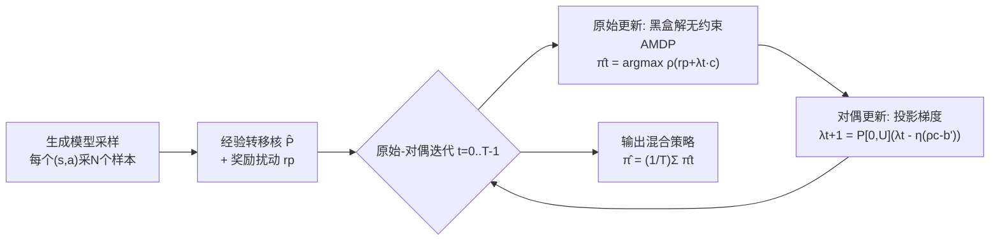

# Near-Optimal Sample Complexity Bounds for Constrained Average-Reward MDPs

**会议**: ICLR 2026  
**OpenReview**: [https://openreview.net/forum?id=PCuvo9uIXK](https://openreview.net/forum?id=PCuvo9uIXK)  
**代码**: 暂无（纯理论）  
**领域**: 学习理论 / 强化学习理论  
**关键词**: 约束平均奖励 MDP, 样本复杂度, 生成模型, 原始-对偶, minimax 下界, Slater 常数  

## 一句话总结
本文给出了**约束平均奖励 MDP（CAMDP）在生成模型下学习 ε-最优策略的首个近 minimax-最优样本复杂度上下界**：松弛可行设定下 $\tilde O\big(SA(B+H)/\varepsilon^2\big)$，严格可行设定下 $\tilde O\big(SA(B+H)/(\varepsilon^2\zeta^2)\big)$，并配以匹配的下界，刻画了长期约束如何影响学习难度。

## 研究背景与动机
- **领域现状**：无约束平均奖励 MDP（AMDP）的样本复杂度近年已被基本刻画清楚——Zurek & Chen (2024) 在生成模型下证明 $\tilde\Theta\big(SA(B+H)/\varepsilon^2\big)$ 的近 minimax-最优率，其中 $H$ 是最优偏置函数的 span、$B$ 是 transient time。折扣型约束 MDP（discounted CMDP）也已有 Vaswani et al. (2022) 给出的 minimax-最优界。
- **现有痛点**：**约束平均奖励 MDP（CAMDP）几乎空白**——智能体既要最大化稳态长期平均奖励、又要满足一个对成本/风险/资源的平均约束（对应长期公平、可持续、安全部署），但此前没有任何关于 CAMDP 学习的样本复杂度结果，松弛与严格可行设定下的统计极限完全未知。
- **核心矛盾**：折扣型 CMDP 的分析技术（如 Bellman 收缩性）在平均奖励设定下**失效**——没有 episode reset、没有几何折扣，必须直接对长期稳态行为做无折扣推理；约束的引入又叠加了原始-对偶耦合和可行域大小（Slater 常数 $\zeta$）的影响。
- **本文目标**：在生成模型（simulator，可对任意 $(s,a)$ 采样转移）下，刻画学到 ε-最优策略所需的样本量，覆盖**松弛可行**（允许约束被违反至多 ε）与**严格可行**（约束零违反）两种设定，并给出匹配上下界。
- **核心 idea**：**[降维归约 + 原始-对偶]** 把带约束的平均奖励问题，归约为求解一串"用拉格朗日乘子加权奖励"的无约束 AMDP，再用现成的 AMDP 黑盒求解器逐个解；约束满足度则通过对偶变量的投影梯度上升来调控，并用 Slater 常数收紧严格可行所需的对偶范围。

## 方法详解

### 整体框架
算法是一个**基于模型（model-based）的原始-对偶迭代器**：先对每个 $(s,a)$ 采 $N$ 个样本估计经验转移核 $\hat P$，再在经验模型上交替执行"解一个无约束 AMDP（原始更新）"与"投影梯度更新拉格朗日乘子（对偶更新）"，最终输出 $T$ 次迭代的混合策略 $\hat\pi=\frac{1}{T}\sum_t\hat\pi_t$。同一套算法通过参数化（约束右端 $b'$、对偶上界 $U$、采样数 $N$）即可同时实例化松弛与严格两种设定。

### 关键设计
**1. 归约到一串无约束 AMDP：把约束塞进奖励里。** 算法不直接求解带约束的优化 $\max_\pi \rho^\pi_r(s)\ \text{s.t.}\ \rho^\pi_c(s)\ge b$，而是把它写成鞍点问题 $\max_\pi\min_{\lambda\ge0}\big[\rho^\pi_r(s)+\lambda(\rho^\pi_c(s)-b')\big]$，于是每次原始更新只需解一个奖励为 $r_p+\lambda_t c$ 的**无约束**平均奖励 MDP $\hat\pi_t=\arg\max_\pi \rho^\pi_{r_p+\lambda_t c}$。这一步可调用任意现成黑盒求解器（如 policy iteration），从而把"约束 + 平均奖励"这一困难问题，转化为"已有近最优样本复杂度结果的无约束 AMDP"，让 Zurek & Chen 的 $SA(B+H)/\varepsilon^2$ 机制得以复用。

**2. 经验 AMDP 的折扣化 + 奖励扰动：让无约束子问题可控求解。** 直接在无折扣经验模型上求解会因缺乏收缩性而不稳定，作者把每个经验 AMDP 近似成一个折扣因子 $\gamma=1-\frac{\varepsilon_{\text{opt}}}{4(B+H)}$ 的折扣 MDP（折扣越接近 1 越逼近平均奖励，而 $\bar\varepsilon=B+H$ 正好把 transient time 与 bias span 写进 horizon 里），并对奖励加均匀扰动 $r_p(s,a)=r(s,a)+Z(s,a),\ Z\sim U[0,\omega]$ 以保证 Blackwell-最优策略的唯一性与稳定性。$\gamma$、$\omega=(1-\gamma)\bar\varepsilon/6$ 的耦合设置使得折扣近似误差被 $B+H$ 精确控制，是把平均奖励复杂度参数 $B,H$ 引入界中的关键。

**3. 对偶投影梯度 + Slater 常数收紧 $|\lambda^\star|$：把约束违反压到目标精度。** 对偶变量按 $\lambda_{t+1}=P_{[0,U]}\big(\lambda_t-\eta(\rho^{\hat\pi_t}_c(s)-b')\big)$ 更新，并投影到 $[0,U]$，其中 $U$ 取为最优乘子 $|\lambda^\star|$ 的上界。Theorem 1 给出，取 $T=\frac{U^2}{\varepsilon_{\text{opt}}^2}\big[1+\frac{1}{(U-\lambda^\star)^2}\big]$、$\eta=U/\sqrt T$ 时混合策略满足 $\rho^{\hat\pi}_{r_p}(s)\ge\rho^{\hat\pi^\star}_{r_p}(s)-\varepsilon_{\text{opt}}$ 且 $\rho^{\hat\pi}_c(s)\ge b'-\varepsilon_{\text{opt}}$。关键在于用 **Slater 常数 $\zeta=\max_\pi\rho^\pi_c(s)-b$（可行裕度）** 来界定 $|\lambda^\star|$：松弛设定下 $|\lambda^\star|\le \frac{2(1+\omega)}{\varepsilon+\varepsilon_{\text{opt}}}$，而严格设定要把约束违反完全消除，需要把对偶上界放大到 $\propto 1/\zeta$，这正是严格设定多出 $1/\zeta^2$ 因子的根源。

**4. 松弛 vs 严格的参数实例化：用约束收紧量 $b'$ 切换两种保证。** 同一算法通过设 $b'=b-\frac{3\varepsilon}{8}$（松弛，故意松一点容忍 ε 违反）或把约束右端**收紧** $b'>b$（严格，预留裕度以保证零违反）来切换。松弛设定取 $N=\tilde O\big(SA(B+H)/\varepsilon^2\big)$ 即可让经验约束值函数对最优策略 $\pi^\star$ 和输出策略 $\hat\pi$ 同时充分集中（$|\rho^\pi_c-\hat\rho^\pi_c|\le\frac{\varepsilon-\varepsilon_{\text{opt}}}{2}$），从而约束违反 $\le\varepsilon$ 且奖励次优性可分解控制；严格设定因为要把裕度提升到 $\zeta$ 级别，采样数相应放大 $1/\zeta^2$。

## 实验关键数据
> 本文为**纯理论工作，无数值实验**，核心"结果表"即其证明的样本复杂度上下界。

### 主结果：样本复杂度上下界

| 设定 | 约束保证 | 样本复杂度上界 | 下界 |
|------|----------|----------------|------|
| 松弛可行 (relaxed) | $\rho^{\hat\pi}_c\ge b-\varepsilon$ | $\tilde O\big(SA(B+H)/\varepsilon^2\big)$ | — |
| 严格可行 (strict) | $\rho^{\hat\pi}_c\ge b$（零违反） | $\tilde O\big(SA(B+H)/(\varepsilon^2\zeta^2)\big)$ | $\tilde\Omega\big(SA(B+H)/(\varepsilon^2\zeta^2)\big)$ |

均要求 $\rho^{\hat\pi}_r(s)\ge\rho^\star_r(s)-\varepsilon$。$S,A$ 为状态/动作数，$H$ 为 bias span，$B$ 为 transient time，$\zeta$ 为 Slater 常数。

### 与已有结果的对照

| 工作 | 设定 | 约束 | 率 |
|------|------|------|----|
| Zurek & Chen (2024) | 平均奖励 | 无约束 | $\tilde\Theta\big(SA(B+H)/\varepsilon^2\big)$ |
| Vaswani et al. (2022) | 折扣 | 有约束 | minimax-最优（折扣型） |
| **本文** | **平均奖励** | **有约束** | $\tilde O\big(SA(B+H)/\varepsilon^2\big)$ / $\tilde\Theta\big(SA(B+H)/(\varepsilon^2\zeta^2)\big)$ |

### 关键发现
- **松弛与严格之间存在可证分离**：严格可行比松弛可行在样本复杂度上多出 $1/\zeta^2$ 因子，且通过匹配下界证明该依赖是**必要的**——这是 CAMDP 严格可行设定的首个下界。
- 松弛设定的率与无约束 AMDP **完全一致**（$\tilde O(SA(B+H)/\varepsilon^2)$），说明"容忍 ε 约束违反"时，约束在主阶意义上**几乎不增加**学习难度。
- 上界对 $S,A,B,H$ 均达 minimax-最优，统一并推广了无约束平均奖励与折扣型约束两条已有结果线。

## 亮点与洞察
- **填补空白**：CAMDP 在生成模型下样本复杂度的"首个"近最优上下界，把无约束 AMDP 与折扣型 CMDP 两套已有理论真正接上。
- **归约思想优雅**：把"约束 + 平均奖励"这一双重困难问题，拆成"对偶迭代 + 无约束 AMDP 黑盒"，从而直接搭车 Zurek & Chen 的最优机制，避免重造平均奖励的集中分析。
- **下界揭示本质**：$1/\zeta^2$ 不是分析松弛带来的人造因子，而是严格可行的**内在统计代价**——可行域越窄（$\zeta$ 越小），要"零违反"地学就越贵。
- 算法对 $\zeta$ 的依赖可用估计值替代，不需精确已知，工程上更可落地。

## 局限与展望
- **生成模型假设较强**：依赖可对任意 $(s,a)$ 采样的 simulator，未覆盖只能在线探索（无 reset）的更现实设定，online CAMDP 的近最优率仍开放。
- **奖励/约束函数已知**：假设 $r,c$ 已知、仅 $P$ 未知，虽不影响主阶复杂度，但完整未知奖励的刻画未给。
- **多个约束、未知 $\zeta$ 的精确刻画**：本文聚焦单约束，多约束与 $\zeta$ 估计误差如何精确进入界仍可深挖。
- 算法常数与对数因子（$\tilde O$ 隐藏项）以及实际数值表现未做实验验证。

## 相关工作与启发
- **无约束平均奖励 MDP**：Zurek & Chen (2024) 的 $\tilde\Theta(SA(B+H)/\varepsilon^2)$ 是本文原始更新黑盒可复用的基石；transient time 参数 $B$ 用于处理 multichain。
- **折扣型约束 MDP**：Vaswani et al. (2022) 的对偶线性规划/对偶下降给出了折扣型 minimax-最优界与原始-对偶模板，本文将其思想迁移到平均奖励（但需克服 Bellman 收缩失效）。
- **在线 CAMDP**：Bai et al. (2024) 研究 model-free 在线设定下的 sublinear regret，关注渐近行为，与本文的有限样本生成模型保证互补。
- **启发**：把困难的结构化约束问题"归约到一串已有最优结果的无约束子问题 + 对偶调控"是一种通用范式；Slater 常数作为可行裕度，是连接"约束严格度"与"统计代价"的自然桥梁，可推广到其他约束学习场景。

## 评分
- **新颖性**: ⭐⭐⭐⭐⭐ — CAMDP 生成模型下首个近 minimax-最优上下界，并证明松弛/严格的可分离性，填补明确空白。
- **实验充分度**: ⭐⭐⭐ — 纯理论工作无数值实验，但上下界匹配、推导完整，理论"实验"层面充分（按理论论文标准给中等偏上）。
- **写作质量**: ⭐⭐⭐⭐ — 问题定义、参数（$H,B,\zeta$）、归约思路与证明 sketch 组织清晰，定理陈述规范。
- **价值**: ⭐⭐⭐⭐⭐ — 统一并推广无约束 AMDP 与折扣 CMDP 两条线，为安全/公平/资源约束下的长期 RL 提供了基础统计极限，理论价值高。

<!-- RELATED:START -->

## 相关论文

- [\[ICLR 2026\] Minimax Sample Complexity of Graph Neural Networks: Lower Bounds and Structural Effects](minimax_sample_complexity_of_graph_neural_networks_lower_bounds_and_structural_e.md)
- [\[ICLR 2026\] How hard is learning to cut? Trade-offs and sample complexity](how_hard_is_learning_to_cut_trade-offs_and_sample_complexity.md)
- [\[ICLR 2026\] Mitigating the Curse of Detail: Scaling Arguments for Feature Learning and Sample Complexity](mitigating_the_curse_of_detail_scaling_arguments_for_feature_learning_and_sample.md)
- [\[ICLR 2026\] Sampling Complexity of TD and PPO in RKHS](sampling_complexity_of_td_and_ppo_in_rkhs.md)
- [\[ICLR 2026\] Learning Correlated Reward Models: Statistical Barriers and Opportunities](learning_correlated_reward_models_statistical_barriers_and_opportunities.md)

<!-- RELATED:END -->
