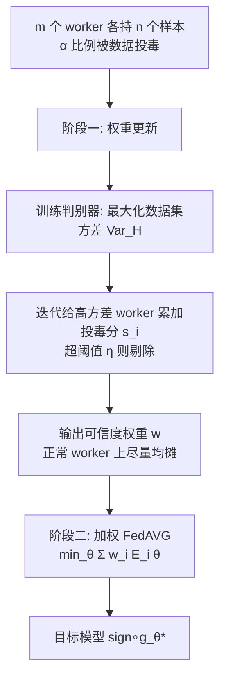

# Near Optimal Robust Federated Learning Against Data Poisoning Attack

**会议**: ICLR 2026  
**OpenReview**: [https://openreview.net/forum?id=gs6zKwv1gL](https://openreview.net/forum?id=gs6zKwv1gL)  
**代码**: 待确认  
**领域**: 学习理论 / 鲁棒联邦学习  
**关键词**: 数据投毒, 联邦学习, 极小极大下界, 鲁棒性, H-divergence, VC 维  

## 一句话总结
针对联邦学习中"每个 worker 数据少、worker 数量多"的数据投毒场景，本文先给出攻击损失的极小极大下界，再设计一个"训判别器给 worker 打可信度权重"的两阶段机制，使上界在 $m\to\infty$ 时**渐近匹配下界**，且攻击损失只依赖任务 VC 维 $d$ 而非梯度维度。

## 研究背景与动机
**领域现状**：联邦学习把模型训练分散到大量节点上而不集中数据，但天然继承了投毒攻击的脆弱性。投毒分两类——模型投毒（恶意 worker 直接篡改上传的梯度，完全不可信）和数据投毒（攻击者只污染 worker 的原始数据，worker 本身仍诚实地按被污染的数据算梯度）。后者门槛更低（label-flipping 这种经典攻击不需要懂目标模型类型就能实施），更贴近现实，却长期被忽视。

**现有痛点**：主流做法是直接套用为模型投毒设计的**鲁棒梯度聚合**（geometric median、iterative filtering、Krum 等），把离群梯度当成投毒的剔除掉。但用在数据投毒上有两个硬伤。其一，服务器每一轮收梯度都要做一次离群检测，计算开销持续累积；其二，梯度是高维向量，**维度越高离群检测越难**——论文 Figure 1(b-c) 给出同一批数据在 2 层和 32 层网络上算出的梯度主成分，模型越大投毒梯度越难和正常梯度分开。更关键的是，这类方法的攻击损失界形如 $O\big((\frac{\mathrm{trace}(\Sigma_g)}{n})^{1/2}+(\frac{d_g}{mn})^{1/2}\big)$，其中 $\Sigma_g$ 是梯度协方差、$d_g$ 是梯度维度，二者都随模型变大而膨胀，即便 worker 数 $m\to\infty$ 界也不收敛。

**核心矛盾**：本文锁定一个"难且实际"的工况——单个 worker 的样本数 $n$ 很小（自己无法判断数据是否被投毒），但 worker 总数 $m$ 很大（合起来信息足够学好任务，只要能把投毒数据揪出来）。在这个工况里，逐梯度去噪既贵又看不准，但群体的统计信息本可以被利用。

**本文目标**：回答"在最坏情况下究竟能多好地防御任意数据投毒"。防御被拆成两个目标——最大化目标模型在干净数据上的精度（攻击损失小），以及限制攻击者从攻击中获得的收益（哪怕这种收益无法被攻击损失直接刻画，比如 Trojan 攻击下模型既满足攻击者目的又在干净数据上高精度）。

**核心 idea**：**判别器替代梯度去噪** —— 不去逐轮检测梯度离群，而是在训练目标模型之前先训一个**判别器模型**直接区分 worker 的数据集，据此一次性给每个 worker 分配可信度权重；判别器的训练目标用一个由 H-divergence 诱导出的"数据集方差"概念来定义，从而把攻击损失界从依赖梯度维度 $d_g$ 改写成只依赖任务 VC 维 $d$。

## 方法详解

### 整体框架
算法分两阶段（Algorithm 1）：**可信度权重更新阶段**先训一个判别器模型并据此给 $m$ 个 worker 算出一个权重向量 $w\in\mathbb{R}^m$（各元素非负、和为 1，越可信权重越大）；**目标模型训练阶段**用这个 $w$ 作为加权系数，最小化加权误差 $\theta^*=\arg\min_\theta\sum_i w_i E_i(\theta)$ 来训目标模型，这一步直接由加权版 FedAVG 实现。整个机制的精髓在第一阶段——它把"识别投毒"从在线的逐轮梯度检测，前移成一次性的离线判别器训练。

### 关键设计

**1. 用 H-divergence 诱导的"数据集方差"作为判别信号**：判别器要区分数据集而非梯度，关键是定义一个能刻画数据集之间差异的量。论文先借 H-divergence $d_\mathcal{H}(D,D')$ 衡量两个分布在假设类 $\mathcal{H}$ 视角下的可分性（取上确界的最优假设能把两分布的样本分多开），再由它诱导出"数据集方差"：对权重 $w$、参数 $\theta$、标签向量 $a$，定义 $\mathrm{Var}_{\theta,a}(\{W_i\},w)=\sum_i w_i\big(F_i(\theta,a)-\sum_j w_j F_j(\theta,a)\big)^2$，其中 $F_i(\theta,a)=\sum_{y'}a_{y'}P_{(x,y)\sim W_i}[y=y',\,\mathrm{sign}(g_\theta(x))=1]$ 表示 worker $i$ 中"真标签为 $y'$ 却被模型判成 1"的样本比例。再对 $\theta,a$ 取最大得到 $\mathrm{Var}_\mathcal{H}(\{W_i\},w)$。其直觉是：相关性高的数据集方差小（极端情况下若所有 worker 数据集重复则方差为 0），所以正常 worker 之间的方差天然就小，一旦出现大方差，必然主要由投毒 worker 贡献——这就把"找投毒"转化成"找把方差顶上去的那批人"。

**2. 把权重约束成可证明小 H-divergence 的可行域**：要让加权分布 $D_w$ 逼近未知真值分布 $D$，权重需同时满足两点——加权方差 $\mathrm{Var}_\mathcal{H}(\{W_i\},w)\le t$ 要小，且权重要在 $(1-\alpha)m$ 个正常 worker 上**尽量分散**。形式化为可行域 $C_{\beta,\xi,t}=\{w\in V_{m,\beta,\xi}:\mathrm{Var}_\mathcal{H}(\{W_i\},w)\le t\}$，其中 $V_{m,\beta,\xi}$ 约束 $\sum_i w_i=1$、正常 worker 上的权重和 $\sum_{i\in S_n}w_i=\xi$、且每个 $0\le w_i\le\frac{1}{\beta m}$（$\alpha<\beta\le1-\alpha$，封顶单个权重防止权重塌缩到少数 worker）。论文证明只要 $w\in C_{\beta,\xi,t}$，$D_w$ 与真值 $D$ 的 H-divergence 就能用 $t$ 和 $\beta$ 界住，从而把"权重好不好"还原成"是否落在这个凸约束集里"。

**3. 迭代剔除式权重求解（Algorithm 2）**：怎么找到 $C_{\beta,\xi,t}$ 里的权重？算法从全体 worker 集合 $S=[m]$、均匀权重出发，维护一个投毒分向量 $s$。每轮先解 $\theta,a\leftarrow\arg\max\sum_i w_i(F_i-\sum_j w_j F_j)^2$ 找出最大化方差的假设，再对每个 $i$ 算偏离量 $\tau_i$，按 $\tau_i/\tau_{\max}$ 给分 $s_i$ 累加，分数超过阈值 $\eta$ 就把该 worker 移出 $S$ 并把权重重新在剩余集合上均摊。如此反复直到 $|S|<(1-2\alpha)m$ 停止。由于正常 worker 方差有界、投毒 worker 才会被反复顶上高方差，这个"谁顶方差谁掉分、掉够就出局"的过程能逐步把投毒者筛掉。分布式实现时把 $\mathrm{sign}$ 换成 sigmoid，方差最大化由广义 FedAVG 完成——worker 只上传梯度和模型输出，服务器无需直接访问数据集。

**4. 极小极大下界与渐近最优**：理论侧先在"服务器能直接看到每个数据集"的乐观假设下推下界。IID 设定（每个正常 worker 从未知真值 $D$ 独立采 $n$ 样本）下，Theorem 3.1 给出攻击损失下界 $\frac{\alpha}{2(1-\alpha)\sqrt n}$，证法是构造两个服务器无法区分、真值却不同的情形，任何假设对其中之一都至少有这么大损失。非 IID 设定用 Dirichlet 浓度参数 $\gamma$ 刻画异质性，Theorem 3.2 给出下界 $\Omega(\frac{\alpha}{\sqrt\gamma}+\frac{\alpha}{\sqrt n})$，多出的 $\frac{1}{\sqrt\gamma}$ 项正源于正常数据集相关性变弱、投毒更难被识别。算法侧 Theorem 5.1 证明在 $\alpha\le\frac13$、$n>1+d/m$ 时，以概率 $1-\delta$ 同时达到 $C(\sqrt{1/n}+\sqrt{(d\ln(mn/d)+\ln(1/\delta))/mn})$ 的 EPR 与攻击损失上界，当 $m\to\infty$ 时**渐近匹配下界**，且界只含任务 VC 维 $d$ 而非梯度维度 $d_g$。

**5. 有效投毒率 EPR 度量攻击者收益**：攻击损失抓不住 Trojan/搭便车这类收益，论文补一个鲁棒性度量——有效投毒率（Effective Poison Rate）。机制 $M$ 称为 $c$-EPR，若存在一个与正常 worker 数据 H-divergence 不超过 $c$ 的数据集 $D$，使得"各 worker 用真实（含投毒）数据集"与"所有 worker 都用 $D$"两种情形下 $M$ 的输出分布相同。直觉是训练结果等价于在一个"投毒比例不超过 $c$"的数据上训练。朴素的 FedAvg 只能做到 $\alpha$-EPR；只要算法做到 $c<\alpha$ 就说明攻击影响是**亚比例**的、被实质削弱了。本文机制把 EPR 也压到 $\tilde O(\sqrt{1/n}+\sqrt{d/mn})$（IID）。

## 实验关键数据

### 主实验设置与结果
在 MNIST / CIFAR-10 上用 flip-label 与 backdoor 两种攻击评测，正文聚焦 MNIST + flip-label。对比 geometric median、iterative filtering、Krum 三个有理论保证的主流防御。学习率 $\zeta=0.01$、训练 20 epoch，每轮服务器选 20% worker。

| 设置 | 本文 vs 基线（趋势） |
|------|----------------------|
| IID，200 正常 + 50 投毒 worker，变 $n$（30→120） | 始终更高 test accuracy、更低 attack accuracy，**$n$ 越小优势越明显** |
| IID，30 样本/worker，变投毒率 $\beta$（0.3→0.9） | test accuracy 更高、attack accuracy 更低 |
| 非 IID（Dirichlet 浓度 1.0），变投毒率 $\beta$ | 两个指标同样优于全部基线 |

- **test accuracy** 越高 ⇒ 攻击损失越小；**attack accuracy**（目标模型在被翻转标签样本上的精度）越高 ⇒ 攻击者收益越大，本文在两个指标上同时占优。

### 判别器训练有效性
2000 正常 + 500 投毒 worker、每个数据集仅 30 样本时，随判别器最大化数据集方差，正常与投毒数据集的 $F_i$ 值被逐步拉开（Figure 2a），验证了"大方差由投毒者贡献"的核心假设在大 $m$ 小 $n$ 下成立。

### 攻击损失界对比

| 方法 | IID 攻击损失界 | 依赖维度 | $m\to\infty$ 是否收敛 |
|------|----------------|----------|------------------------|
| dimension-wise / geometric median | $O\big((\tfrac{\mathrm{trace}(\Sigma_g)}{n})^{1/2}+(\tfrac{d_g}{mn})^{1/2}\big)$ | 梯度维 $d_g$ | 否（随模型膨胀） |
| iterative filtering | $O\big((\tfrac{\|\Sigma_g\|_2}{n})^{1/2}+(\tfrac{d_g}{mn})^{1/2}\big)$ | 梯度维 $d_g$ | 否 |
| **本文** | $\tilde O\big((\tfrac1n)^{1/2}+(\tfrac{d}{mn})^{1/2}\big)$ | 任务 VC 维 $d$ | **是（匹配下界）** |
| 极小极大下界 | $\dfrac{\alpha}{2(1-\alpha)\sqrt n}$ | — | — |

### 关键发现
- **效率**：本文两阶段的通信复杂度都与 FedAVG 相同，而基线需在服务器做复杂的鲁棒梯度聚合；$m$ 大时这正是基线变慢的主因。
- **小 $n$ 大 $m$ 是本方法的甜区**：单 worker 信息不足时逐梯度去噪失效，而群体方差信号依然清晰。
- **界与下界配套**：本文上界在 $m\to\infty$ 时收敛到 $\tilde O(\sqrt{1/n})$，与下界 $\Omega(1/\sqrt n)$ 同阶，而基线界因 $d_g$ 项不随 $m$ 收敛。

## 亮点与洞察
- **把界从"梯度维度"解耦到"任务 VC 维"**：这是相对鲁棒梯度聚合最本质的改进——后者的界随模型变大而膨胀、$m\to\infty$ 也不收敛，本文界只含 $d$，从根上解释了"为什么数据投毒应该有比模型投毒更便宜的防御"。
- **上下界配套**：不只给算法，还给极小极大下界并证明渐近匹配，把"近最优"坐实成理论结论而非经验口号。
- **EPR 补足攻击损失盲区**：用 $c<\alpha$ 这个干净的判据刻画"攻击影响是否亚比例"，能抓住 Trojan/搭便车这类攻击损失看不见的收益。
- **检测前移降开销**：把逐轮在线梯度去噪改成一次性离线判别器训练，通信复杂度回落到 FedAVG 水平。

## 局限与展望
- **理论限定 $\alpha<\frac13$**：和多数鲁棒聚合工作一样要求过半甚至 2/3 数据集干净，超出这个区间不保证。
- **优化当黑箱**：理论部分把模型参数优化当作可直接取到最优解的黑箱，实际用随机梯度近似；虽实验证明开销合理，但黑箱假设与真实非凸优化间的差距未被理论覆盖。
- **二分类为主**：理论核心在 binary-label 设定展开，多分类靠"原对象+标签"复合编码归约，复杂任务上的常数与可分性如何尚待检验。
- **判别器额外成本**：多了一个判别器训练前置阶段，虽通信复杂度同 FedAVG，但端到端的总计算/轮次开销与基线的精细比较可以更系统。

## 相关工作与启发
- **鲁棒梯度聚合**（geometric median、iterative filtering、Krum、dimension-wise median）是本文的主要对手，其界依赖梯度协方差范数 $\mathrm{trace}(\Sigma_g)$ / $\|\Sigma_g\|_2$ 与梯度维度 $d_g$，本文指出这些量随模型变大而发散，是数据投毒场景被"借用"防御时的根本短板。
- **H-divergence**（Ben-David 等的域适应理论）被本文创造性地从"度量分布差异"借用来定义数据集方差与 EPR，是连接"数据集可分性"与"鲁棒性界"的桥梁。
- **Dirichlet 非 IID 建模**（Hsu 等）被用于刻画联邦异质性，并直接进入下界的 $1/\sqrt\gamma$ 项，把"异质性越强越难防"量化出来。
- 启发：当一个领域长期沿用更强威胁模型的防御时，往往存在"为弱威胁专门设计、界更紧"的空间——本文以"检测数据集而非梯度"为切口给出了一个范本。

## 评分
- **新颖性**: ⭐⭐⭐⭐⭐ 把数据投毒防御从梯度空间搬到数据集空间，用 H-divergence 诱导方差概念并配套极小极大上下界，视角与工具都很新。
- **实验充分度**: ⭐⭐⭐⭐ 覆盖 IID/非 IID、变 $n$/变投毒率、两种攻击两个数据集，并验证判别器训练动态；但正文以 MNIST 为主，大模型/真实联邦规模的实证偏轻。
- **写作质量**: ⭐⭐⭐⭐ 动机—下界—算法—匹配的逻辑链清晰，图 1 的梯度可分性示意很有说服力；理论符号密集，部分读者需要对照附录。
- **价值**: ⭐⭐⭐⭐ 给出"数据投毒可比模型投毒更便宜地防御"的理论与算法支撑，对联邦学习鲁棒性研究有方法论意义。

<!-- RELATED:START -->

## 相关论文

- [\[ICLR 2026\] A Near-Optimal Best-of-Both-Worlds Algorithm for Federated Bandits](a_near-optimal_best-of-both-worlds_algorithm_for_federated_bandits.md)
- [\[ICLR 2026\] Near-Optimal Sample Complexity Bounds for Constrained Average-Reward MDPs](near-optimal_sample_complexity_bounds_for_constrained_average-reward_mdps.md)
- [\[ICLR 2026\] Noise Tolerance of Distributionally Robust Learning](noise_tolerance_of_distributionally_robust_learning.md)
- [\[ICLR 2026\] Robust Amortized Bayesian Inference with Self-Consistency Losses on Unlabeled Data](robust_amortized_bayesian_inference_with_self-consistency_losses_on_unlabeled_da.md)
- [\[ICLR 2026\] Ads that Stick: Near-Optimal Ad Optimization through Psychological Behavior Models](ads_that_stick_near-optimal_ad_optimization_through_psychological_behavior_model.md)

<!-- RELATED:END -->
