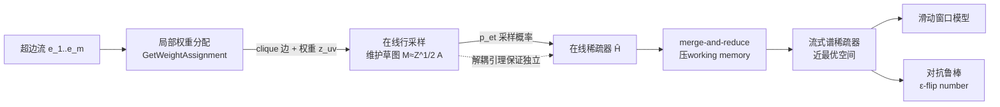

# Nearly Space-Optimal Graph and Hypergraph Sparsification in Insertion-Only Data Streams

会议：ICLR 2026  
代码：未公开  
领域：学习理论 / 流式算法（图与超图稀疏化）  
关键词：图稀疏化、谱稀疏化、超图、流式模型、在线杠杆得分采样、对抗鲁棒  

## 一句话总结

本文给出插入流（insertion-only stream）下图与超图谱稀疏化的近最优空间算法：把图谱稀疏器的空间从前人的 $O(\frac{n}{\varepsilon^2}\log^2 n)$ 比特降到 $O(\frac{n}{\varepsilon^2}\log n\cdot\text{poly}(\log\log n))$，并首次给出在 $m$（超边数）上仅差 poly-iterated-log 因子的流式超图稀疏器，同时顺带解决了在线、滑动窗口与对抗鲁棒三种设定。

## 研究背景与动机

**领域现状**：图/超图稀疏化是把大图压成保留割值（cut）或谱性质（spectral）的小图，是图表示学习、轻量化 GNN、Laplacian 求解器、谱聚类等的核心加速组件。离线设定下已非常成熟——Batson et al. (2014) 用 $O(n/\varepsilon^2)$ 条边构造图谱稀疏器，超图侧 Jambulapati et al. (2023) / Lee (2023) 把上界做到 $O(\frac{nr}{\varepsilon^2}\log n\log r)$。

**现有痛点**：当数据以**流**的形式到来（网络日志、IoT、金融交易），算法只能单遍、受严格内存约束地处理，无法把整图存下来。离线的最优采样复杂度能否搬到流式而不付额外空间代价，一直悬而未决。具体地：图侧的动态流算法（Kapralov et al. 2020）需要 $O(\frac{n}{\varepsilon^2}\log^2 n)$ 比特，比离线最优多一个 $\log n$；超图侧现有流式算法（Soma et al. 2024、Khanna et al. 2025a）要么带 $\log^2 n\log r$、要么带 $\text{polylog}(m)$ 因子，而 $r$ 最坏可达 $\Omega(n)$、$m$ 最坏可达 $\Omega(2^n)$，这些因子在大规模超图上是灾难性的。

**核心矛盾**：流式约束下无法存下"前缀子图"来计算每条（超）边的采样概率，而准确的采样概率又必须依赖全局结构——空间预算与采样精度互相挤压。

**本文目标**：回答"图稀疏化在流式模型是否需要比离线更多的空间"，并把答案压到只差 poly-iterated-log（即 $\text{poly}(\log\log n)$）。

**核心 idea**：**在线采样打头 + merge-and-reduce 兜底**——先用一个近最优的在线采样子程序把流"预瘦身"，使送进 merge-and-reduce 框架的输入流足够短，从而把本应付出的 $\text{polylog}(n)$ 因子降为 $\text{poly}(\log\log n)$；为让超图在线采样可行，又设计了**局部权重分配**（local weight assignment）与**解耦引理**（decoupling）两件武器。

## 方法详解

### 整体框架

算法以**在线超图稀疏器**为基石，逐层加壳得到流式、滑动窗口与对抗鲁棒结果。在线层的关键是：每来一条超边，先用"局部权重分配"把它拆成关联图（associated graph）上的一团 clique 边并赋权，再用"在线行采样"维护一个对加权前缀矩阵 $Z_t^{1/2}A_t$ 的 2-谱逼近草图 $M$，据此定义采样概率；"解耦引理"保证这些概率彼此独立，从而能套用 chaining 论证给出采样复杂度。流式层再把草图 $M$ 喂进 merge-and-reduce，把 $\log n$ 降成 $\log\log n$。

### 关键设计

**1. 在线杠杆得分采样：把"前缀全图"换成"前缀草图"。** 谱稀疏化的经典做法是按有效电阻（effective resistance）$r_e=w(e)(\chi_u-\chi_v)L_G^{-1}(\chi_u-\chi_v)^\top$ 采样，它等价于关联图关联矩阵 $A$ 中对应行的杠杆得分 $\tau_i=a_i(A^\top A)^{-1}a_i^\top$。流式下看不到全图，本文改用**在线杠杆得分** $\tau_i^{OL}(A):=a_i(A_i^\top A_i)^{-1}a_i^\top$，只依赖当前行之前到达的前缀矩阵 $A_i$。由于在线杠杆得分关于前缀单调，按它采样得到的是离线采样概率的"过估计"，从而既保证谱逼近又控制采样行数。

**2. 局部权重分配：让超边按 clique 受控地"摊"到普通图上。** 超图谱能量 $Q_H(x)=\sum_e w(e)\max_{(u,v)\in e}(x_u-x_v)^2$ 里有个 $\max$，无法直接当成矩阵行采样。Kapralov et al. (2021) 的思路是把每条超边换成关联图上的 clique，并贪心地在 clique 内"高比值边→低比值边"挪权，直到所有边的比值 $q_{uv}=\tau_{uv}(Z^{1/2}A)/z_{uv}$ 落在 $\gamma$ 倍区间内。本文把它**局部化**（Algorithm 2）：新超边 $e$ 到来时只在它自己的 clique 上做 weight-shift（$\lambda\leftarrow\min\{z_{uv},\frac{\gamma-1}{2\gamma\cdot q_{uv}}\}$，$z_{uv}\!+\!=\!\lambda,\ z_{u'v'}\!-\!=\!\lambda$），不动历史已分配的权重，从而保持权重矩阵一致。证明上，每次局部挪权都让生成树势能（spanning tree potential）单调增加且有上界，故有限步终止并得到 $\gamma$-balanced 分配；这恰好给出 Theorem 2.2 的两条保证：权重和为 $w(e)$、且 $\max_{(u,v)\in e}a_{uv}(A_t^\top Z_t A_t)^{-1}a_{uv}^\top=O\!\big(\sum_{(u,v)\in e}\tau_{uv}(Z_t^{1/2}A_t)\big)$，即采样概率被 clique 杠杆得分之和上界住。

**3. 解耦引理：让采样概率"互不依赖"，撑起 chaining 分析。** 朴素地看，第 $t$ 条超边的采样概率由草图 $M=(M^\top M)^{-1}$ 决定，而 $M$ 又由前面采到的边构成，似乎彼此纠缠，无法做集中不等式。本文（Lemma 2.3）指出：草图 $M$ 是由**在线行采样**独立维护的，它用的随机性与"是否把整条超边收进 $\hat H$"的随机性互相独立。因此固定在线行采样的内部随机性后，矩阵序列 $M_1,\dots,M_m$ 就被固定，于是各 $p_{e_t}=\min\{1,2\rho\max_{(u,v)}a_{uv}w(e_t)(M^\top M)^{-1}a_{uv}^\top\}$ 是相互独立定义的。这一独立性是直接套用 Jambulapati et al. (2023) 的 chaining 论证、得到最优采样复杂度（$\rho=O(\frac{1}{\varepsilon^2}\log m\log r)$）的关键前提。

**4. 流式框架：在线采样打头让 merge-and-reduce 只付 poly-iterated-log。** merge-and-reduce 把流切块、自底向上合并，每个节点用精度 $\varepsilon'=\frac{\varepsilon}{2\log(mn)}$ 重建 coreset，直接做会引入 $\log m$ 因子。本文沿用 Cohen-Addad et al. (2023) 的"在线采样前置"思想：若前置的在线采样近最优（图侧只采 $O(\frac{n}{\varepsilon^2}\log n)$ 条边），送进 merge-and-reduce 的流就短得多，coreset 尺寸里的 $\text{polylog}(n)$ 退化成 $\text{poly}(\log\log n)$。难点在于在线行采样需要"上一步的在线 coreset"来算下一条边的概率，但流式下存不下整个 coreset——本文改用**上一步流式算法输出的稀疏器** $\hat S$（而非完整 coreset）来定义下一个在线采样概率（Algorithm 3），并给出精化分析（Theorem 3.1，岭杠杆得分 $\tilde\ell_i=O(1)\cdot a_i^\top(\hat A_{i-1}^\top\hat A_{i-1}+\lambda I)^{-1}a_i$）证明它仍是合法在线 coreset，从而做到近最优空间。

**5. 对抗鲁棒：用 ε-flip number 把高概率算法升级成鲁棒算法。** 先把流式结果推到高概率区（成功率 $1-\delta$，空间只多 $O(\log\frac{1}{\delta})$），再套 Ben-Eliezer et al. (2020) 的计算路径框架。该框架要求目标函数的 **ε-flip number**（$f$ 增长 $\varepsilon$ 比例的次数）足够小：本文用输入超图关联图的 Laplacian 特征值来控制何时切换输出，只在特征值增长 $\varepsilon$ 比例时才换，而特征值至多增长 $\frac{n\log m}{\varepsilon}$ 次，故 flip number 为 $\frac{n\log m}{\varepsilon}$，配合高概率结果即得空间高效的对抗鲁棒算法。

## 实验关键数据

本文为纯理论工作，无经验实验，"关键数据"即与前人最优结果的空间复杂度对比。

### 图谱稀疏化空间对比（比特）

| 设定 | 来源 | 空间 |
|---|---|---|
| 离线 | Batson et al. (2014) | $O(\frac{n}{\varepsilon^2}\log n)$ |
| 流式 | Kapralov et al. (2020) | $O(\frac{n}{\varepsilon^2}\log^2 n)$ |
| 流式 | **本文 (Thm 1.1)** | $O(\frac{n}{\varepsilon^2}\log n\cdot\text{poly}(\log\log n))$ |

匹配离线最优，仅差 $\text{poly}(\log\log n)$，相比前人流式结果省下一个 $\log n$ 因子。

### 超图谱稀疏化 / 其他设定

| 问题 | 来源 | 空间（比特） |
|---|---|---|
| 超图（流式） | Soma et al. (2024) | $\frac{rn}{\varepsilon^2}\log^2 n\log r$ |
| 超图（流式） | Khanna et al. (2025a) | $\frac{rn}{\varepsilon^2}\cdot\text{polylog}(m)$ |
| 超图（流式） | **本文 (Thm 1.3)** | $\frac{rn}{\varepsilon^2}\log^2 n\cdot\text{poly}(\log r,\log\log m)$ |
| 图 min-cut（流式） | Ding et al. (2024) | $O(\frac{n}{\varepsilon}\log^{c+1} n)$ |
| 图 min-cut（流式） | **本文 (Thm 1.2)** | $O(\frac{n}{\varepsilon}\log^{c} n\log\frac{1}{\varepsilon})$ |
| 超图（对抗鲁棒，Thm 1.5） | **本文** | $\frac{n}{\varepsilon^2}\text{poly}(r,\log n,\log r,\log\log\frac{m}{\delta})$ |
| 超图（滑动窗口，Thm 1.6） | **本文** | $\frac{rn}{\varepsilon^2}\log n\cdot\text{polylog}(m,r)$ |

### 关键发现

- 超图侧首次去掉最坏可达 $\Omega(n)$ 的 $\log m$ 依赖（$m$ 最坏 $\Omega(2^n)$），把流式空间逼到离线采样复杂度的 poly-iterated-log 邻域。
- 在线算法本身最优到 polylog 因子，因此能无缝迁移到滑动窗口模型（代价是空间略高于纯流式，因为最近 $W$ 项里低贡献边也不能丢）。
- 更新时间为 $\text{poly}(n)$，瓶颈在在线采样概率需要矩阵乘法时间 $\tilde O(n^\omega)$（$\omega\approx2.37$）；若放宽空间可换更快更新。

## 亮点与洞察

- **"在线打头 + merge-and-reduce 兜底"是把 polylog 砍成 poly-iterated-log 的通用配方**：只要前置在线采样近最优，merge-and-reduce 的输入流就短，节点重建的对数因子自然退化为迭代对数因子。
- **局部权重分配 + 解耦引理是把超图在线化的两块拼图**：前者解决"超边的 $\max$ 能量怎么受控摊成可采样的矩阵行"，后者解决"在线串行依赖下还能不能做集中不等式"。
- **一套在线核心打通四个设定**：流式、滑动窗口、对抗鲁棒、在线，本质上都建在同一个在线超图稀疏器上，体现了在线原语的杠杆作用。

## 局限与展望

- **更新时间偏慢**：$\text{poly}(n)$（在线采样概率算 $\tilde O(n^\omega)$），并发工作 Goranci & Momeni (2025)、Khanna et al. (2025a) 用更优更新时间换更差空间——两者是空间/时间的不同取舍点，本文优先空间。
- **超图空间仍带 $\log^2 n\cdot\text{poly}(\log r)$**，与"完全匹配离线"还有迭代对数级差距；$r$ 的多项式依赖在对抗鲁棒结果里仍然存在。
- **纯理论、无实证**：实际大规模图/超图上这些常数与迭代对数因子的真实收益、与启发式稀疏化的对比尚待验证。

## 相关工作与启发

- **离线谱稀疏化**：有效电阻采样（Spielman & Srivastava 2008）、$O(n/\varepsilon^2)$ 边构造（Batson et al. 2014）是采样复杂度的天花板，本文以"匹配它"为目标。
- **在线行采样**：Cohen et al. (2020) 的在线杠杆得分采样是本文维护草图 $M$ 的直接工具。
- **超图稀疏化**：Soma & Yoshida (2019) 形式化 $(1+\varepsilon)$ 超图谱稀疏器，Kapralov et al. (2021) 的贪心权重平衡被本文局部化。
- **流式 coreset 框架**：merge-and-reduce 与 Cohen-Addad et al. (2023) 的"在线前置"思想构成本文流式层骨架。
- **对抗鲁棒流**：Ben-Eliezer et al. (2020) 的 ε-flip number / 计算路径框架被推广到超图稀疏化。
- **启发**：对任何"离线采样复杂度已知最优、但流式带额外对数因子"的问题，本文范式（前置近最优在线采样 + merge-and-reduce + 解耦保证可分析性）都值得一试。

## 评分

- **新颖性** ⭐⭐⭐⭐：局部权重分配 + 解耦引理 + 用上一步稀疏器替代在线 coreset 的流式技巧组合，是切实的新工具链，且一举覆盖四个设定。
- **实验充分度** ⭐⭐⭐（纯理论，无实证，复杂度对比扎实但缺实测）：理论结论给出严格上界与逐一对照，但没有任何经验验证。
- **写作质量** ⭐⭐⭐⭐：贡献与对比表清晰，技术概览循序渐进，主定理与附录对应明确。
- **价值** ⭐⭐⭐⭐：解决了"流式是否比离线多花空间"这一长期问题，对大规模图/超图压缩、GNN 加速、谱求解器有基础意义。

<!-- RELATED:START -->

## 相关论文

- [\[ICML 2026\] Quantum Algorithms for Triangle Cut Sparsification](../../ICML2026/learning_theory/quantum_algorithms_for_triangle_cut_sparsification.md)
- [\[ICLR 2026\] Quotient-Space Diffusion Models](quotient-space_diffusion_models.md)
- [\[ICLR 2026\] Metric $k$-Clustering using only Weak Comparison Oracles](metric_k-clustering_using_only_weak_comparison_oracles.md)
- [\[ICLR 2026\] Near Optimal Robust Federated Learning Against Data Poisoning Attack](near_optimal_robust_federated_learning_against_data_poisoning_attack.md)
- [\[ICLR 2026\] Minimax Sample Complexity of Graph Neural Networks: Lower Bounds and Structural Effects](minimax_sample_complexity_of_graph_neural_networks_lower_bounds_and_structural_e.md)

<!-- RELATED:END -->
