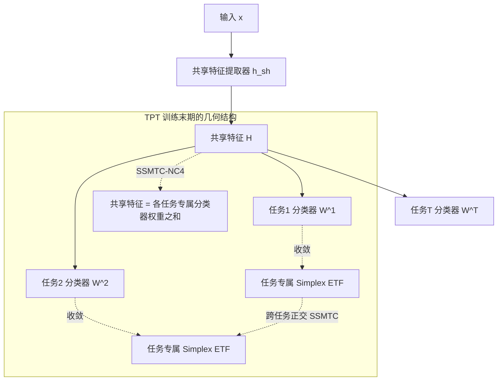

# Neural Collapse in Multi-Task Learning

**会议**: ICLR 2026  
**OpenReview**: [https://openreview.net/forum?id=M4t2JUMlfI](https://openreview.net/forum?id=M4t2JUMlfI)  
**代码**: 待确认  
**领域**: learning_theory  
**关键词**: Neural Collapse, Multi-Task Learning, Simplex ETF, Unconstrained Feature Model, Inductive Bias, Feature Sharing  

## 一句话总结
本文首次把"神经坍缩"(Neural Collapse) 理论从单任务推广到多任务学习，刻画了单源/多源两种多任务设置下任务专属分类器与特征在训练末期的几何结构（任务专属 Simplex ETF、跨任务正交、共享特征=各任务专属特征之和），并用无约束特征模型给出了全局最优解的严格证明，进而揭示了"任务相关性会重塑分类器几何、促进特征对齐"这一多任务学习的归纳偏置。

## 研究背景与动机

**领域现状**：神经坍缩 (NC) 由 Papyan et al. (2020) 发现：当深度网络进入训练末期 (terminal phase of training, TPT)——训练误差降到 0、损失仍在下降的阶段，最后一层特征和分类器会收敛到一种与架构/数据集无关的高度对称结构，可用四条性质概括：(NC1) 同类特征坍缩到类均值；(NC2) 类均值收敛到单纯形等角紧框架 (Simplex ETF)，等长、等夹角、最大间距；(NC3) 分类器权重与类均值自对偶；(NC4) 分类退化为最近类中心。NC 已被广泛用于解释不平衡学习、迁移学习、持续学习、多标签学习等场景。

**现有痛点**：迄今几乎所有 NC 的实证与理论研究都局限在**单任务、单分类器**的设定下，对**多任务学习 (MTL)** 中多个分类器与共享特征之间的几何关系几乎无人问津。而 MTL 恰恰是"硬参数共享"的天下——一个共享特征提取器 + 多个任务专属分类头，其特征空间到底长什么样、各任务学到了什么、任务之间如何相互影响，这些问题缺乏数学刻画。

**核心矛盾**：单任务 NC 只有"一个分类器收敛到一个 ETF"这件事；但 MTL 里**多个任务专属分类器共享同一份底层特征**，单一 ETF 无法描述"多个分类器如何共存、共享特征如何被多个任务瓜分"。直接套用单任务结论既不成立、也解释不了 MTL 特有的迁移与干扰现象。

**本文目标**：在两种标准 MTL 设定——单源多任务分类 (SSMTC，同一张图被打多个标签，如 Multi-MNIST) 和多源多任务分类 (MSMTC，不同任务来自不同数据子集，如 CIFAR100-Split)——下，刻画 TPT 阶段任务专属分类器与特征的几何结构，并给出理论保证。

**核心 idea**：**[几何刻画]** 把单任务 ETF 推广为"任务专属 ETF + 跨任务正交"的复合结构；**[机制揭示]** 证明共享特征是各任务专属潜在特征的（缩放）之和，即"任务专属分类器把共享特征解耦成各任务的子空间"；**[归纳偏置]** 揭示任务相关性 (task correlation) 会重塑任务专属分类器的几何——相关性越强，不同任务分类器越对齐，学到的特征越接近共享特征。

## 方法详解

### 整体框架
本文不是提出新算法，而是给"MTL 训练末期会出现什么几何结构"这一现象建立**实证观测 + 理论证明**的闭环。架构上采用标准的硬参数共享：一个共享特征提取器 $h^{sh}$ 输出共享特征，多个任务专属线性分类器 $f^t(h)=W^t h + b^t$ 各自做分类。理论分析沿用 NC 领域通用的**无约束特征模型 (Unconstrained Feature Model, UFM)**——把最后一层特征 $H$ 当作自由优化变量（因为现代网络过参数化、表达力足以拟合任意特征），从而把"网络 + 数据"的复杂优化退化为一个关于 $\{W^t\}, H, \{b^t\}$ 的带权重衰减的凸/非凸优化问题，再分析其全局最优解的形态。两条主线分别对应 SSMTC 和 MSMTC 两种设定。

### 关键设计

**1. SSMTC-NC：跨任务正交的复合 ETF + 共享特征分解。** 在单源设定下（一张图同时有多个标签），本文把样本 $x$ 的特征写成关于 UFM 的非凸损失 Eq.(3)：$\min \sum_t c_t L_{CE}(W^t H + b^t, Y^t) + \lambda_H\|H\|_F^2 + \lambda_W\sum_t c_t\|W^t\|_F^2 + \lambda_b\sum_t c_t\|b^t\|_2^2$，并在 TPT 观测到五条性质 SSMTC-NC1~5。核心创新在 NC2/NC3/NC4 三条：每个任务的分类器各自坍缩成**任务专属 Simplex ETF**（NC2: $\langle\tilde w^t_k, \tilde w^t_{k'}\rangle\to \frac{K}{K-1}\delta_{k,k'}-\frac{1}{K-1}$），而**不同任务的分类器子空间互相正交**（NC3: $\langle\tilde w^t_k, \tilde w^{t'}_{k'}\rangle\to 0,\ t\neq t'$）——正交性意味着各任务分类器可以彼此独立优化、互不干扰。最关键的 NC4 给出了共享特征的"成分公式"：归一化后的共享特征均值收敛到各任务专属标签权重向量之和方向 $\tilde h^{k_1,\dots,k_T}_j\to \frac{\sum_t w^t_{k_t}}{\|\sum_t w^t_{k_t}\|_2}$。这条把"共享特征到底由什么构成"讲清楚了：它就是各任务分类器对应权重的叠加。Theorem 3.1 进一步证明，在数据平衡、$d\ge\sum_t K_t - T$、$\lambda_H\lambda_W<\frac{N}{4K}$ 等条件下，Problem (3) 的**任意全局最优解都精确满足**这五条性质（等号成立而非趋于）。

**2. MSMTC-NC：每任务独立的自对偶 ETF。** 在多源设定下（不同任务用不同数据，各任务有独立特征矩阵 $H^t$），损失变为 Eq.(4)，每个任务有自己的 $H^t$。此时几何结构退化得更"干净"：每个任务**各自独立地**复现完整的单任务神经坍缩——任务内同类特征坍缩 (NC1)、分类器与类均值都收敛到 Simplex ETF (NC2)、且二者**自对偶** $\|\tilde\mu^t_k-\tilde w^t_k\|_2^2\to 0$ (NC3)、分类退化为最近类中心 (NC4)。直觉是：既然不同任务的数据完全分开，共享提取器实际上是在为每个任务"各自做一份单任务 NC"。Theorem 3.2 在 $d\ge\max_t K_t - 1$、$\lambda_H\lambda_W<\frac{n_t}{4}$ 条件下证明全局最优解满足这四条。SSMTC 与 MSMTC 的对比凸显了关键差异：SSMTC 因为标签共享样本，特征要被多个任务"瓜分"，故出现"正交 + 求和分解"的复合结构；MSMTC 因为数据隔离，每任务退回经典 ETF。

**3. 共享特征 = 任务专属潜在特征之和（机制解剖）。** 为验证 NC4 不只是数学巧合，本文设计了巧妙的"特征拆解"实验：在 Multi-MNIST-10-10 上训练后，把训练样本 $x^{L,R}$ 只保留左上区域得 $x^L$、只保留右下区域得 $x^R$，分别喂进网络得到 $h^L, h^R$。结果发现 $h^L$ 对分类器 $W^L$、$h^R$ 对分类器 $W^R$ **各自都满足完整的 NC1/NC2/NC3**——说明 $h^L, h^R$ 正是两个任务各自学到的"任务专属潜在特征"。更进一步，组合特征均值满足 $\tilde\mu^{L,R}_{k_1,k_2}\to \frac{\tilde\mu^L_{k_1}+\tilde\mu^R_{k_2}}{\|\tilde\mu^L_{k_1}+\tilde\mu^R_{k_2}\|}$。这就把抽象的 NC4 落到了实处：**共享特征是各任务专属潜在特征的叠加，任务专属分类器扮演了把共享特征解耦回各子空间的角色**。

**4. 任务相关性重塑分类器几何（归纳偏置）。** 这是本文最有洞察力的部分。固定总样本数 $N$，系统性地改变各标签对 $(k_1,k_2)$ 的采样比例，从"标签平衡"过渡到"任务平衡"。此时 SSMTC-NC3 的正交性被打破，变成 **Correlated-NC3：随着 $n_{k_1,k_2}$ 增大，$\cos(w^1_{k_1}, w^2_{k_2})$ 增大**——即两个任务的分类器从正交逐渐对齐。Theorem 5.1 对两个二分类任务给出了 $\cos(w^1_1, w^2_1)$ 的闭式表达式，与实验曲线高度吻合。其含义深刻：**任务相关性越强，两个任务学到的特征越对齐、越接近共享特征**。CelebA 上用 Grad-CAM++ 可视化进一步佐证——当 Eyeglasses 与 Mouth-Slightly-Open 两个属性任务被人为增强相关性后，二者的显著区域大幅重叠，说明它们关注同一批人脸特征、学到了高度对齐的表示。这条把"为什么相关任务能互相帮助"从经验直觉提升到了几何机制层面。

## 实验关键数据

### 主实验（SSMTC-NC / MSMTC-NC 的验证）
在 4 种架构 × 4 个数据集上验证 NC 指标在 TPT 阶段趋于 0。

| 设定 | 数据集 | 骨干网络 | 评估指标 | 观测结论 |
|------|--------|----------|----------|----------|
| SSMTC | Multi-MNIST-10-10, Multi-CIFAR10-10-10, CIFAR100-Cross-10x10 | VGG11/13, ResNet18/34 | $S_{NC1}\sim S_{NC5}$（类内方差/ETF角度与范数/跨任务余弦/特征-分类器和之差/NCC错误率） | 所有指标随训练降至 0，跨架构跨数据集一致 |
| MSMTC | CIFAR100-Split-5x20 等 | VGG11/13, ResNet18/34 | $M_{NC1}\sim M_{NC4}$ | 每个任务独立复现 ETF + 自对偶，指标趋 0 |

### 消融与扩展实验

| 维度 | 设置 | 结论 |
|------|------|------|
| 多任务加权策略 | MGDA / Uncertainty Weight / PCgrad / DWA / FAMO / FairGrad | NC 现象在各种加权策略下均成立，不依赖均匀权重 |
| 类别数不均 | 各任务类别数不同 | 一般化 SSMTC-NC 仍成立（Appendix B.2/D.2） |
| 学习率 / $(\lambda_H,\lambda_W)$ | 多组超参 | NC 现象稳健 |
| 大规模数据 | CelebA, ImageNet-1K | NC 现象依旧出现 |
| 参数高效训练 | 利用 NC 性质替换最后一层参数 | 末层参数可替换，验证理论可用性 |

### 关键发现
- **几何结构二分**：SSMTC 出现"任务专属 ETF + 跨任务正交 + 共享特征=权重和"的复合结构；MSMTC 每任务独立退回经典自对偶 ETF。
- **共享特征可解耦**：拆解实验证明共享特征 = 各任务专属潜在特征之和，分类器负责解耦。
- **相关性—对齐定律**：$\cos(w^1_{k_1},w^2_{k_2})$ 随样本相关性单调增大，闭式解与实验吻合；Grad-CAM++ 显示相关任务显著区域重叠。

## 亮点与洞察
- **把成熟理论推到新场景并产生新结构**：NC 在单任务已被研究透，但本文发现 MTL 不是单任务的简单堆叠——SSMTC 的"正交 + 求和"复合 ETF 是单任务理论里不存在的全新几何，这种"换设定生出新结构"的工作往往最有理论价值。
- **理论—实证双闭环**：每条经验现象都有对应的全局最优性定理（Thm 3.1/3.2/5.1），且 Correlated-NC3 还给出可验证的闭式余弦表达式，理论不是事后追认而是精确预测。
- **机制解释有"画面感"**：特征拆解实验 + Grad-CAM++ 让"共享特征由谁构成""相关任务为何互助"这些抽象问题变得可视、可触，从纯几何上升到对 MTL 工作机理的理解。
- **归纳偏置的发现具普适意义**："任务相关性重塑分类器几何、促进特征对齐"为多任务学习中"正迁移/负迁移"提供了几何层面的解释框架。

## 局限与展望
- **UFM 的理想化假设**：理论建立在无约束特征模型上，假设特征可任意优化、数据类别平衡，与真实有限容量网络、长尾数据存在差距。
- **线性分类头与 CE 损失**：分析局限于最后一层线性分类器 + 交叉熵损失，对非线性头、其他损失（如对比损失）、回归型多任务是否成立未涉及。
- **任务数与相关性刻画有限**：Correlated-NC3 的闭式解主要在两个二分类任务上推导，$K\ge 2$、任务数更多、复杂相关结构下的几何仍待系统刻画。
- **缺乏对负迁移的定量预测**：揭示了相关→对齐，但何时相关性会导致干扰/负迁移、对齐到什么程度是有害的，尚无定量边界。
- **应用侧浅尝辄止**：参数高效训练只是验证性实验，如何主动利用 NC 几何来设计更好的 MTL 算法（如任务分组、共享结构搜索）是值得展开的方向。

## 相关工作与启发
- **Neural Collapse 谱系**：Papyan et al. (2020) 首提 NC；后续在不平衡学习 (Fang et al. 2021)、迁移学习 (Galanti et al. 2022)、持续学习、多标签学习 (Li et al. 2024)、回归 (Andriopoulos et al. 2024) 等场景延伸——本文把这条谱系补上了"多任务"这一块拼图。
- **UFM / Layer-Peeled Model**：Mixon et al. (2022)、Fang et al. (2021a) 的无约束特征模型是 NC 理论分析的标准工具，本文沿用并扩展到多分类器情形。
- **特征式 MTL**：本文对接 Zhang & Yang (2022) 等特征共享 MTL 工作，但视角不同——前人关注共享特征中的偏置，本文给出 TPT 阶段的几何刻画，是对 MTL 表示学习理论的细粒度补充。
- **多任务加权策略**：MGDA、PCgrad、FAMO、FairGrad 等被用作消融，证明 NC 现象与具体加权方法解耦。
- **启发**：本文最具迁移性的洞察是"任务相关性—分类器几何对齐"这一归纳偏置，可启发任务分组、共享结构设计、迁移性预测等下游研究；其"特征拆解 + 几何度量"的实证范式也可用于分析其它表示共享系统。

## 评分
- **新颖性**: ⭐⭐⭐⭐⭐ 首次系统地把神经坍缩推广到多任务学习，发现单任务理论中不存在的"正交复合 ETF + 共享特征分解"新结构，并揭示任务相关性的几何归纳偏置，方向新且立意高。
- **实验充分度**: ⭐⭐⭐⭐ 覆盖 4 架构 × 4 数据集 + 多种加权策略 + 大规模数据 + 参数高效验证，实证扎实；但多为"验证理论现象"型，缺乏在真实复杂 MTL 任务上的应用验证。
- **写作质量**: ⭐⭐⭐⭐ 现象—定理—解释三层结构清晰，图 1 的几何示意、特征拆解与 Grad-CAM++ 可视化让抽象理论易懂；公式密集但逻辑连贯。
- **价值**: ⭐⭐⭐⭐ 为多任务学习的表示几何提供了理论地基，"相关性重塑几何"对理解正/负迁移有指导意义；短期偏理论，长期可启发 MTL 结构设计与迁移性分析。

<!-- RELATED:START -->

## 相关论文

- [\[ICLR 2026\] Pretrain–Test Task Alignment Governs Generalization in In-Context Learning](pretraintest_task_alignment_governs_generalization_in_in-context_learning.md)
- [\[ICML 2026\] Multi-task Linear Regression without Eigenvalue Lower Bounds: Adaptivity, Robustness and Safety](../../ICML2026/learning_theory/multi-task_linear_regression_without_eigenvalue_lower_bounds_adaptivity_robustne.md)
- [\[ICLR 2026\] Heads Collapse, Features Stay: Why Replay Needs Big Buffers](heads_collapse_features_stay_why_replay_needs_big_buffers.md)
- [\[ICLR 2026\] Multi-Condition Conformal Selection](multi-condition_conformal_selection.md)
- [\[ICLR 2026\] Preventing Model Collapse Under Overparametrization: Optimal Mixing Ratios for Interpolation Learning and Ridge Regression](preventing_model_collapse_under_overparametrization_optimal_mixing_ratios_for_in.md)

<!-- RELATED:END -->
