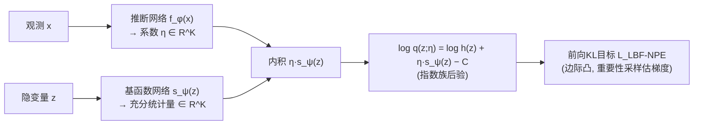

# Neural Posterior Estimation with Latent Basis Expansions

**会议**: ICLR 2026  
**OpenReview**: [https://openreview.net/forum?id=jsPQFNmnln](https://openreview.net/forum?id=jsPQFNmnln)  
**代码**: 待确认  
**领域**: 概率方法 / 摊销变分推断 / 仿真推断（SBI）  
**关键词**: Neural Posterior Estimation, 变分族, 指数族, 基函数展开, 凸优化, 似然无关推断  

## 一句话总结
把神经后验估计（NPE）的变分族改写成"对数密度 = 一组潜变量基函数的线性组合"——即一个用神经网络参数化的指数族，从而在低维后验投影上既保留高表达力、又把优化问题做成（边际）凸的，稳定地超越混合高斯和归一化流。

## 研究背景与动机
**领域现状**：NPE 是当下做贝叶斯推断的热门路线——只用"从先验采样的隐变量 + 对应观测"这种合成数据训练一个网络，学会从观测反推隐变量，训练完一次前向传播就能给出后验近似，且不需要计算似然。它还有一个独门好处：当生成模型里既有关心的参数 $z$ 又有讨厌的冗余变量 $\xi$ 时，NPE 通过"模拟完整数据再丢掉冗余变量"就能自动把 $\xi$ 边际掉，直接得到关心参数的后验投影。

**现有痛点**：NPE 和传统 ELBO 变分推断一样，卡在"变分族表达力"和"优化可解性"的两难上。简单族（高斯）优化稳但表达力差，复杂族（高斯混合 MDN、归一化流）表达力够却容易陷进浅的局部极小、优化地形糟糕。更要命的是，已有的 NPE 全局收敛理论（McNamara et al. 2024a）只覆盖简单高斯族，对实际常用的那些灵活族根本不适用。

**核心矛盾**：**想要表达力强 ⟺ 想要优化是凸的且能收敛到全局最优**——这两者在已有变分族里无法兼得。

**本文目标**：设计一个专门为 NPE 量身定制的变分族，既能逼近复杂多峰后验，又能保持凸优化的良好性质和全局收敛保证。

**核心 idea**：**【对数密度的基展开】** 注意到 NPE 场景下真正关心的往往只是少数几个科学上有意义的低维参数（高维样本本来也得后处理成低维量），而 NPE 不需要算似然——这意味着在低维隐空间里连数值积分都可行，于是可以**放弃"归一化常数必须有闭式解"这个枷锁**。作者借此把变分分布的**对数密度**直接写成一组基函数的线性组合 $\log q(z) \propto \eta^\top s_\psi(z)$，这恰好是一个指数族；表达力随基函数个数 $K$ 任意增长，而优化又能享受指数族/凸性的好处。

## 方法详解

### 整体框架
LBF-NPE（Latent Basis Function NPE）用两个神经网络来定义摊销后验：一个**基函数网络** $s_\psi: z \mapsto \mathbb{R}^K$，对任意隐变量点 $z$ 给出 $K$ 个基函数取值（充分统计量）；一个**推断网络** $f_\phi: x \mapsto \eta \in \mathbb{R}^K$，把观测映成这些基函数的系数（自然参数）。两者的内积 $f_\phi(x)^\top s_\psi(z)$ 就定义了对数密度，从而把后验写成指数族。训练就是用 NPE 的前向 KL 目标最小化，整套构造和优化全都只依赖这个内积，由此衍生出凸性、固定/自适应基、球面投影等一系列性质与变体。

### 关键设计

**1. 指数族变分族：把后验对数密度做成基函数线性组合，用 $K$ 撬动表达力。** 固定观测 $x$，作者把变分密度写成 $q(z;\eta) \propto h(z)\exp(\eta^\top s_\psi(z))$，对数密度 $\log q(z;\eta) = \log h(z) + \eta^\top s_\psi(z) - C$，其中 $s_\psi(z)$ 是充分统计量、$\eta$ 是自然参数、$h(z)$ 是任意有限基测度、$C$ 是对数归一化常数。因为基函数的个数与形式都是任意的（由一个深网络输出），这个族的表达力远超经典指数族（如高斯）——当 $K\to\infty$ 时指数族能逼近任意分布。增大 $K$ 换更强表达力，代价是更高维的优化问题。

**2. 摊销目标与重要性采样梯度：归一化常数不闭式也照样能训。** 摊销后令 $\eta = f_\phi(x)$，目标是前向 KL（NPE 的标准目标）
$$L_{\text{LBF-NPE}}(\phi,\psi) = -\mathbb{E}_{p(z,x)}\Big[f_\phi(x)^\top s_\psi(z) - \log\int \exp\big(f_\phi(x)^\top s_\psi(\tilde z)\big)\,h(\tilde z)\,d\tilde z\Big].$$
难点是对数归一化项里那个积分。由于 Jensen gap，它无法被蒙特卡洛无偏估计，但作者只需要无偏（一致）的**梯度**：把 $\log J$ 的梯度推成关于"指数倾斜密度 $q_{\phi,\psi}$"的期望，再用**自归一化重要性采样（SNIS）** 估计——从提议分布 $r$ 采 $P$ 个样本，按权重 $w(z)=\exp(k_{\phi,\psi}(z))h(z)/r(z)$ 加权。该梯度估计虽有偏（与 wake-sleep 类算法同源），但当 $P\to\infty$ 时一致。Algorithm 1 给出了完整的批量梯度计算流程。

**3. 仿射梯度与边际凸性：优化地形被压成凸的。** 因为构造与梯度都只依赖内积 $k_{\phi,\psi}(x,z)=f_\phi(x)^\top s_\psi(z)$，梯度具有极简形式 $\nabla L = -\mathbb{E}_{p(z,x)}[\nabla k_{\phi,\psi} - \mathbb{E}_{q_{\phi,\psi}}\nabla k_{\phi,\psi}]$。固定 $\psi$ 时，关于 $f_\phi$ 输出的梯度就是一个仿射函数的梯度；反之亦然。作者据此证明（Proposition 1）目标 $L(f,s)$ 关于 $f$、关于 $s$ 分别是**边际凸**的——即只要固定其中一个网络，关于另一个就是完全凸的泛函。结合宽网络的 NTK 理论，这保证了在无限宽极限下能按核梯度下降收敛到全局最优，把"复杂族训不动"的老毛病直接拔掉。

**4. 固定基 vs 自适应基，以及球面投影去退化。** 一头是**固定基**变体：直接用 B 样条、小波（局部基，只在隐空间局部非零，使梯度稀疏、问题更易解）或 EigenVI 那类正交多项式（全局基）。此时 $L(\phi,\psi)$ 退化成只对 $\phi$ 的边际目标，是完全凸的，训练异常稳定。另一头是**自适应基**变体：$f_\phi$ 与 $s_\psi$ 联合交替优化，利用每个分量上的边际凸性。但自适应带来了识别性问题——内积对 $f$、$s$ 的任意缩放/旋转不变，导致退化。作者用**球面投影重参数化**把网络输出 $(K{-}1)$ 维向量 $u$ 经 $y = \big(\tfrac{2u}{1+\|u\|^2}, \tfrac{1-\|u\|^2}{1+\|u\|^2}\big)$ 映到单位超球面 $\|y\|=1$，消除缩放退化（旋转退化仍残留），再配一个固定缩放超参 $w$，显著稳住自适应训练。

## 实验关键数据

### 主实验：三类 2D 复杂后验（Table 1，越低越好）

| 指标 | 测例 | LBF-NPE | NSF | RealNVP | MDN |
|------|------|---------|-----|---------|-----|
| 前向 KL | Bands | **0.0048** | 0.016 | 0.015 | 0.182 |
| 前向 KL | Ring | **0.0054** | 0.017 | 0.024 | 0.205 |
| 前向 KL | Spiral | **0.187** | 0.201 | 0.545 | 0.948 |
| 反向 KL | Ring | **0.0027** | 0.013 | 0.014 | 0.204 |
| NLL | Ring | **0.030** | 0.621 | 0.733 | 1.031 |

仅用 **20 个自适应基函数**就近乎完美逼近 banded/ring/spiral 三类复杂后验，在前向 KL 上较 MDN、归一化流取得数量级提升。

### 案例研究：天文红移估计（Table 2，held-out NLL，越低越好）

| 方法 | LBF-NPE | NSF | MDN |
|------|---------|-----|-----|
| 总 NLL | **−57,220 (±152)** | −55,389 (±379) | −50,648 (±322) |

在 LSST DESC DC2 模拟巡天数据集上、嵌入 BLISS 框架对 153,000 个天体做光度红移估计，LBF-NPE（固定 B 样条基）显著优于 MDN 与 NSF。

### 关键发现
- **收敛稳定性**：正弦似然玩具例（后验最多 4 个峰）上，20 个随机种子下 LBF-NPE（14 个 2 阶 B 样条）始终收敛到同一最优解，而同等参数量的 5 分量 MDN 经常掉进次优局部极小。
- **天文目标检测**：在多峰、模式高度分离的星体定位问题上，LBF-NPE 即便不直接参数化位置参数，也能靠学到的基函数表达任意成对分离的峰；消融 $K=9,20,36,64$ 展示了自适应基相对固定基的表达力优势。
- 全面优于已有基展开式 VI 方法 EigenVI（需正交固定基、不摊销）。

## 亮点与洞察
- **抓住了 NPE 的真正自由度**：别人把"归一化常数要闭式"当铁律，作者识破在低维后验投影 + 似然无关的设定里这条根本不必要，于是敢直接建模对数密度，换来指数族的高表达力。这是典型的"重新审视约束来源"的洞察。
- **表达力与凸性首次在 NPE 上兼得**：通过"只依赖内积"这一结构性观察，把一个看似复杂的神经指数族优化压成边际凸问题，并能接上已有的 NPE 全局收敛理论——这正是 MDN/流做不到的。
- **对数空间建模的副产品**：在对数空间做线性组合等价于密度空间的乘性影响，更容易把某些区域"清零"；且系数与基函数可正可负，是无约束优化，省去了别的密度估计方法常需的非负性约束。

## 局限与展望
- **梯度估计有偏**：依赖 SNIS 估计对数归一化项的梯度，偏差仅在提议样本数 $P\to\infty$ 时消失，提议分布 $r$ 的选取会影响实际方差与收敛。
- **依赖低维后验投影假设**：方法的算力可行性（数值积分、归一化）建立在"只关心少数低维参数"上，对真正需要高维联合后验的场景吸引力下降。
- **自适应基仍残留旋转退化**：球面投影只消掉了缩放退化，旋转不变性带来的识别性问题仍在，自适应训练的稳定性部分靠经验超参 $w$。
- $K$ 的选取、固定基（B 样条/小波/正交多项式）与自适应基之间的取舍仍偏经验，缺乏自动选择机制。

## 相关工作与启发
- **NPE 谱系**：Papamakarios & Murray (2016)、Cranmer et al. (2020) 等仿真推断（SBI）工作；本文延续 McNamara et al. (2024a) 的 NPE 凸性/全局收敛理论并把它从高斯族推广到神经指数族。
- **基展开式 VI**：最直接的对照是 EigenVI（Cai et al. 2024），用正交固定特征函数线性组合优化得分散度，但不摊销、且截断必然引入逼近误差；LBF-NPE 的基函数无约束、可自适应、且天然摊销。
- **神经指数族**：Pacchiardi & Dutta (2022) 首次用神经网络参数化指数族来表示似然；本文是首个用神经指数族表示**后验**并放进摊销推断框架的工作。
- **常用变分族**：高斯混合（MDN）、RealNVP、Neural Spline Flow 作为主要 baseline，文中系统论证了它们易陷浅局部极小的劣势。
- **启发**：当某个"标准约束"（如归一化必须闭式）实际来源于被默认却未必成立的前提（如高维、需要解析归一化）时，重新审视任务的真实需求往往能解锁更优的设计空间。

## 评分
- **新颖性**: ⭐⭐⭐⭐ — "对数密度做基展开 = 神经指数族变分族"在 NPE 上是首创，且巧妙借 NPE 的低维投影 + 似然无关特性解锁凸优化，思路干净有洞察。
- **实验充分度**: ⭐⭐⭐⭐ — 从玩具多峰、2D 合成后验到天文目标检测、LSST 真实红移巡天，覆盖广且有数量级提升；但多为后验逼近指标，缺与更前沿流模型/扩散式后验的横向比较及大规模高维消融。
- **写作质量**: ⭐⭐⭐⭐ — 动机—构造—性质—变体—实验链条清晰，凸性命题与梯度推导交代到位，公式与算法可复现性好。
- **价值**: ⭐⭐⭐⭐ — 为 SBI/摊销变分推断提供了一个"既表达力强又能稳收敛"的实用变分族，对天文、宇宙学等需要可信多峰后验的科学场景有直接价值。

<!-- RELATED:START -->

## 相关论文

- [\[ICLR 2026\] Transformers Learn Latent Mixture Models In-Context via Mirror Descent](transformers_learn_latent_mixture_models_in-context_via_mirror_descent.md)
- [\[ICLR 2026\] Score-Based Density Estimation from Pairwise Comparisons](score-based_density_estimation_from_pairwise_comparisons.md)
- [\[ICLR 2026\] Information Estimation with Discrete Diffusion](information_estimation_with_discrete_diffusion.md)
- [\[ICLR 2026\] Proper Velocity Neural Networks](proper_velocity_neural_networks.md)
- [\[ICLR 2026\] Neural Collapse in Multi-Task Learning](neural_collapse_in_multi-task_learning.md)

<!-- RELATED:END -->
