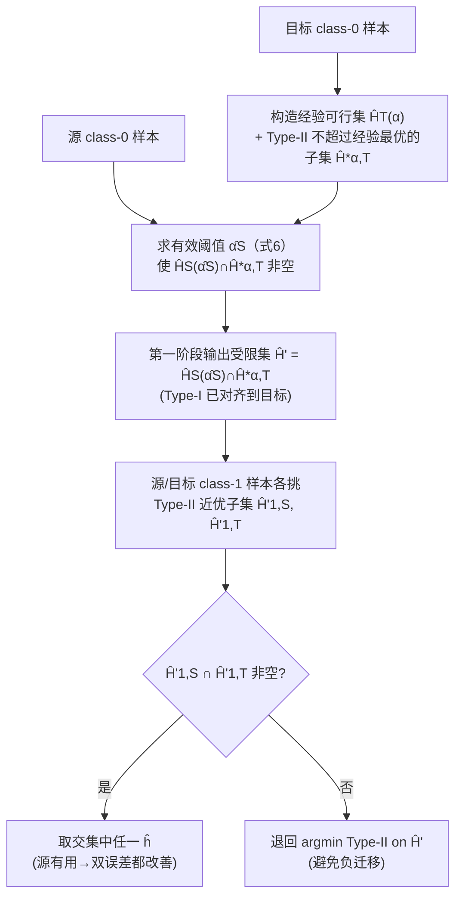

# Neyman-Pearson Classification under Both Null and Alternative Distributions Shift

**会议**: ICLR 2026  
**OpenReview**: [https://openreview.net/forum?id=pHckxhmBlI](https://openreview.net/forum?id=pHckxhmBlI)  
**代码**: 未公开  
**领域**: 学习理论 / 迁移学习 / Neyman-Pearson 分类  
**关键词**: Neyman-Pearson 分类, 迁移学习, 分布漂移, Type-I/Type-II 误差, 自适应, 避免负迁移, 凸规划  

## 一句话总结
本文首次给出在**源域与目标域的两个类条件分布 $\mu_0,\mu_1$ 同时漂移**情形下的 Neyman-Pearson（NP）迁移学习过程，既保证源域有用时同时改善 Type-I/Type-II 误差、源域无用时退化到只用目标数据（避免负迁移），又通过约化为一串凸规划给出多项式时间的计算保证。

## 研究背景与动机
**领域现状**：NP 分类是处理类别不平衡的经典框架——目标是在「Type-I 误差（对 $\mu_0$ 的错误率）不超过预设阈值 $\alpha$（如 5%）」的硬约束下，最小化 Type-II 误差（对 $\mu_1$ 的错误率）。它广泛用于疾病诊断、恶意软件检测、暴雨预警等「漏报代价极高」的场景。当目标任务样本稀缺时，自然想借助额外的源数据做迁移学习。

**现有痛点**：迁移学习在普通分类里被研究得很透，但在 NP 这种不平衡约束分类里几乎是空白。已有的少数理论工作（Kalan et al. 2025；Kalan & Kpotufe 2024b）只处理了一种受限情形——**假设源域和目标域共享同一个 $\mu_0$，漂移只发生在 $\mu_1$ 上**，而且只给统计保证、不管能不能算得动。

**核心矛盾**：一旦 $\mu_0$ 也漂移（$\mu_{0,S}\neq\mu_{0,T}$），「满足源域 $\alpha$ 约束」就**不再蕴含**「满足目标域 $\alpha$ 约束」——源域可行集 $H_S(\alpha)$ 和目标域可行集 $H_T(\alpha)$ 错位了。更糟的是目标域 class-0 样本 $n_{0,T}$ 往往很少，经验约束集 $\hat H_T(\alpha)$ 的真实 Type-I 误差会远超 $\alpha$；而又不知道该用源域哪个阈值 $\alpha'$ 去筛选才能既压住目标 Type-I 又不牺牲 Type-II。选太小的 $\alpha'$ 虽能压 Type-I，却会让 Type-II 暴涨——这个权衡本身就需要从数据里自适应地确定，而非人工调参。

**本文目标**：在不知道源/目标相关性的前提下，设计一个自适应过程，同时给出**统计保证 + 计算保证**，覆盖 $\mu_0$ 和 $\mu_1$ 都可能漂移的一般情形。**核心 idea**：**用源域 class-0 样本自动校准出一个「有效阈值」$\hat\alpha_S$ 把源约束对齐到目标约束，再用源域 class-1 样本进一步压低 Type-II 误差**——两阶段筛选 + 凸规划求解。

## 方法详解

### 整体框架
方法是一个**两阶段的「先对齐约束、再降误差」自适应筛选过程**，最终落地为一串可用随机梯度求解的凸规划。第一阶段只盯 Type-I：用目标 class-0 样本先框出经验可行假设集，再用源 class-0 样本求出一个最小的有效阈值 $\hat\alpha_S$，把那些真实 Type-I 会超标的假设剔掉。第二阶段盯 Type-II：在剩下的假设里用源/目标 class-1 样本各自挑出 Type-II 接近最优的子集，取交集得到最终分类器；若交集为空则安全退回「只用目标数据」的解，从而避免负迁移。整个统计过程最终被翻译成一串可用随机梯度上升下降（SGDA）求解的凸规划，给出多项式时间的计算保证。

### 关键设计

**1. 有效阈值 $\hat\alpha_S$：把源约束对齐到目标约束。** 这是全文最核心的创新点，专门为「$\mu_0$ 也漂移」而设。先定义理想阈值 $\alpha_S:=\inf\{\alpha':H_S(\alpha')\cap T^*(\alpha)\neq\emptyset\}$，即让源可行集恰好罩住目标最优解所需的最小源阈值。经验版本是 $\hat\alpha_S:=\inf\{\alpha'\in[\alpha,1]:\hat H_S(\alpha')\cap\hat H^*_{\alpha,T}\neq\emptyset\}$（式 6），其中 $\hat H^*_{\alpha,T}$ 是「目标经验 Type-I 满足约束、且目标经验 Type-II 不超过经验风险最小化器」的假设集。直觉是：单看 $\hat H^*_{\alpha,T}$，由于 $n_{0,T}$ 小、误差棒 $\epsilon_{0,T}=\tilde C/\sqrt{n_{0,T}}$ 大，里面混进了很多真实 Type-I 远超 $\alpha$ 的「坏假设」；用源域以阈值 $\hat\alpha_S$ 收紧成 $\hat H'=\hat H_S(\hat\alpha_S)\cap\hat H^*_{\alpha,T}$，正好把这些坏假设挡在外面，同时保留能拿到低 Type-II 的好假设。论文证明当 $\alpha<\alpha_S$ 时有 $\hat\alpha_S\le\alpha_S$，且 Figure 1 用一维 Gaussian 例子直观展示：源-1 的 $\alpha_{S_1}=\alpha$ 罩不住、帮不上忙；源-2 的 $\alpha_{S_2}>\alpha$ 才真正收缩了可行集、降低目标 Type-I。

**2. 第二阶段 Type-II 双子集取交 + 安全回退：自适应避免负迁移。** 拿到第一阶段的 $\hat H'$ 后，对 $D\in\{S,T\}$ 各自构造近优子集 $\hat H'_{1,D}:=\{h\in\hat H':\hat R_{\phi,\mu_{1,D}}(h)\le\hat R^*_{\phi,\mu_{1,D}}(\hat H')+2\epsilon_{1,D}\}$，即在源/目标上 Type-II 都接近最优的假设。决策规则（式 8）很简洁：若 $\hat H'_{1,S}\cap\hat H'_{1,T}\neq\emptyset$，说明存在「源、目标都认为好」的假设，源信息有用，取交集里任一个 $\hat h$，此时 Type-I/Type-II 同时改善；否则交集为空意味着源与目标在 class-1 上不一致（源不 informative），直接退回 $\hat h=\arg\min_{h\in\hat H'}\hat R_{\phi,\mu_{1,T}}(h)$，只信目标数据。这个「交集非空就用、为空就退」的机制，**无需任何关于源/目标相关性的先验知识**就实现了自适应，这正是 Theorem 1 保证「never worse than target-only」的来源。

**3. 转移模数（transfer modulus）刻画源的价值。** 为了把「源域上好 ↔ 目标域上好」量化进泛化界，论文不用单一的 transfer exponent，而是引入更一般的两个模数：$\phi_1^{S\to T}(\varepsilon):=\sup\{\mathcal E_{1,T}(h\mid h^*_{S,T,\alpha}):\mathcal E_{1,S}(h\mid h^*_{S,T,\alpha})\le\varepsilon\}$ 翻译 Type-II 的源→目标传递，$\phi_0^{S\to T}(\varepsilon):=\sup\{R_{\phi,\mu_{0,T}}(h):R_{\phi,\mu_{0,S}}(h)\le\varepsilon\}$ 翻译 Type-I 的传递。Theorem 1 给出高概率界 $\mathcal E_{1,T}(\hat h)\le c\cdot\min\{\epsilon_{1,T},\,R_{\phi,\mu_{1,T}}(h^*_{S,T,\alpha})-R_{\phi,\mu_{1,T}}(h^*_{T,\alpha})+\phi_1^{S\to T}(4\epsilon_{1,S})\}$，Type-I 界为 $\min\{\alpha+2\epsilon_{0,T},\phi_0^{S\to T}(\hat\alpha_S+2\epsilon_{0,S})\}$。当 $\mu_{0,S}=\mu_{0,T}$ 时 $\phi_0^{S\to T}$ 退化为恒等、$\alpha_S\le\alpha$，整个界精确还原已有工作（Remark 1），说明本文是它们的严格推广。

**4. 约化为一串凸规划 + SGDA 求解：计算保证。** 统计过程光定义不够，论文把它整体翻译成可解的优化。在参数化假设类 $h_\theta(\|\theta\|\le B)$、凸且梯度有界 Lipschitz（Assumption 3，logistic/线性模型成立）下，求 $\hat\alpha_S$ 写成带约束 $\min_{\alpha'\ge\alpha,\theta}\alpha'$ s.t. $g'(\theta,\alpha')\le 0$（式 10），再转成极小极大 $\min_{\alpha'\ge\alpha,\theta}\max_{\lambda\ge0}\alpha'+\lambda g'(\theta,\alpha')$（式 11）。核心算子 CP-Solver（Algorithm 1）用带投影步的随机梯度上升下降（SGDA，参照 Mahdavi et al. 2012），把目标和（带噪的）约束都当随机采样处理，最后投影到 $\{\theta:g(\theta)\le-\xi\}$ 留松弛量。整个流程（Algorithm 2 NP-Transfer-Learning）多次调用 CP-Solver 解不同精度的凸子程序——先 warm-start 求 $\hat\theta_{T,\alpha-\epsilon_{0,T}}$、再求 $\hat\alpha$、再解源/目标子问题、最后联合求解 $\hat h$。Theorem 2 证明输出满足 Theorem 1 的统计保证，总随机梯度调用数为多项式，量级由 $\min\{1/\epsilon_{1,S},1/\epsilon_{1,T}\}$ 主导。

## 实验关键数据

### 主实验
在两个真实气候数据集上做暴雨检测，源/目标对应不同地点；用两隐层 ReLU MLP，固定 $n_{0,T}=n_{1,T}=40$，源样本 $n_{0,S}=n_{1,S}$ 从 50 扫到 950，$\alpha=0.1$，每组 10 次试验，目标测试集 1700。对比 TLA（本文）、Only Target、Only Source。

| 数据集 | 场景 | Type-I 误差 (TLA) | Type-II 误差 (TLA) | 关键对比 |
|--------|------|-------------------|--------------------|----------|
| Yu et al. 2023（124 维） | 源 informative | 贴近阈值 0.1 | 随 $n_S$ 增大降到 ~0.02–0.05 | Only Target 超阈值且 Type-II 更差 |
| NASA POWER 2024（6 维） | 源 uninformative | 控制在阈值附近 | ~0.2–0.3，与 Only Target 相当 | Only Source 的 Type-II 高达 0.5–0.9 |

### 消融 / 补充

| 设置 | 现象 | 结论 |
|------|------|------|
| 源 informative（Fig 2） | TLA 同时压低 Type-I 与 Type-II，优于 Only Target | 有用时主动利用源 |
| 源 uninformative（Fig 3） | TLA 匹配 Only Target，远好于 Only Source | 避免负迁移，印证 Theorem 1 |
| 合成 Gaussian 数据（Appendix D） | 趋势一致 | 验证理论在受控分布下成立 |
| 阈值设置 $\alpha=0.1$ | TLA 的 Type-I 稳定贴合 0.1 附近 | 经验 Type-I 控制与理论界 $\alpha+2\epsilon_{0,T}$ 吻合 |

### 关键发现
- **自适应性是实证亮点**：同一套算法无需告知源是否相关，informative 时蹭到收益、uninformative 时不掉队，恰好对应理论里「$\min\{\text{target-only},\text{source-aided}\}$」的双保证。
- Only Target 在 $n_{0,T}=40$ 这种小样本下连阈值都压不住，凸显了借源校准 Type-I 的必要性。
- **源样本越多增益越明显**：在 informative 场景里，随 $n_{0,S}=n_{1,S}$ 从 50 增到 950，TLA 的 Type-II 误差单调下降，说明 $\hat\alpha_S$ 估计与 class-1 子集筛选都受益于更大的源样本量。
- **两个数据集形成对照**：124 维 Yu 数据上源 informative、6 维 NASA 数据上源 uninformative，同一算法在两种相反情形下都给出正确行为，是对 Theorem 1「双保证」最直接的实证。
- **MLP 上仍生效**：尽管理论需要凸性假设，实验用两隐层 ReLU MLP（非凸）也观察到预期行为，提示「凸包」论证在实践中有一定鲁棒性。
- **小目标样本是真痛点**：$n_{0,T}=n_{1,T}=40$ 对 1700 的测试集，Only Target 的不稳定恰说明目标数据稀缺时迁移的现实价值。

## 亮点与洞察
- **打开了 NP 迁移的一般情形**：第一个处理 $\mu_0,\mu_1$ 同时漂移的工作，把已有「只漂移 $\mu_1$」结果作为特例严格还原（Remark 1）。
- **$\hat\alpha_S$ 的设计很巧**：把「源阈值如何对齐目标约束」这个看似无从下手的问题，变成一个可计算的下确界，且能证明 $\hat\alpha_S\le\alpha_S$。
- **统计 + 计算双保证**：不只停在 minimax 界，而是给出多项式时间的 SGDA 实现，弥补了前作只谈统计的缺口。
- **transfer modulus 比 transfer exponent 更一般**，且能反推回 exponent 表述（Appendix A）。
- **「无先验」自适应**：整个过程不需要任何关于源/目标相关度的超参数或先验，相关性被算法从数据里隐式地估计出来，工程上很友好。
- **理论与实现一一对应**：每个统计集合（$\hat H^*_{\alpha,T}$、$\hat H'$、$\hat H'_{1,D}$）都精确对应一个凸约束 $\{\theta:g(\theta)\le0\}$，让抽象的「假设集筛选」真正可执行。

## 局限与展望
- **缺匹配下界**：作者自己点名，一般情形（双分布漂移）的 minimax 下界尚未建立，无法确认本文上界是否最优——这是最重要的 open problem。
- **凸性假设较强**：计算保证依赖 Assumption 2/3（假设类凸、损失凸且梯度 Lipschitz），固定架构神经网络需走「凸包」绕道，落地到深度模型有 gap。
- **实验规模小**：仅两个气候数据集 + 合成数据，$n_{0,T}=40$ 的极小样本场景，未在大规模/高维现代任务上验证。
- **多次嵌套调用 CP-Solver**：Algorithm 2 串行解多个不同精度的凸子程序，常数与对数因子较多，实际运行开销与误差棒标定还需更多经验验证。
- **代码未公开**，复现门槛偏高。

## 相关工作与启发
- **NP 分类基础**：Cannon et al. (2002)、Scott & Nowak (2005) 首次形式化；Rigollet & Tong (2011) 用凸替代损失；Tong (2013) 非参数 plug-in；Kalan & Kpotufe (2024a) 给出 distribution-free minimax 率与快/慢率二分。
- **NP 迁移直接前作**：Kalan & Kpotufe (2024b)、Kalan et al. (2025) 处理 $\mu_0$ 共享、仅 $\mu_1$ 漂移，本文是其严格推广。
- **自适应迁移**：Hanneke & Kpotufe (2019) 的 transfer distance / transfer exponent 思路被借用，但其只针对平衡分类。
- **普通迁移方法对照**：$\alpha$-ERM（Bu et al. 2022）与 fine-tuning（Vrbančič & Podgorelec 2020）是无约束方法，无法直接处理 NP 的 Type-I 硬约束，凸显本文约束式迁移的必要性。
- **随机优化求解器**：CP-Solver 的 SGDA + 投影框架来自 Mahdavi et al. (2012)，本文将其作为算法组件嵌入两阶段凸规划。
- **启发**：「用源数据校准约束阈值」这一思路或可迁移到更广的约束学习（公平性约束、安全约束）场景；而「交集非空才用源、否则回退」的自适应机制是一种通用的负迁移防护范式。

## 评分
- **新颖性**: ⭐⭐⭐⭐⭐ — 首次攻克 NP 分类下双分布同时漂移的迁移问题，$\hat\alpha_S$ 阈值对齐和 transfer modulus 都是实打实的理论贡献。
- **实验充分度**: ⭐⭐⭐ — 实验仅做到 proof-of-concept，数据集和规模都偏小，主要价值在理论。
- **写作质量**: ⭐⭐⭐⭐ — 问题动机、挑战刻画、特例还原（Remark 1）讲得清楚；但符号密集、对非理论读者门槛较高。
- **价值**: ⭐⭐⭐⭐ — 在不平衡 + 漂移这一现实常见但理论稀缺的方向上补齐了一块，统计+计算双保证使其有落地潜力；缺下界略减分。

<!-- RELATED:START -->

## 相关论文

- [\[ICLR 2026\] Probability Distributions Computed by Autoregressive Transformers](probability_distributions_computed_by_autoregressive_transformers.md)
- [\[ICLR 2026\] When Shift Happens - Confounding is to Blame](when_shift_happens_-_confounding_is_to_blame.md)
- [\[ICML 2026\] Expectation Consistency Loss: Rethink Confidence Calibration under Covariate Shift](../../ICML2026/learning_theory/expectation_consistency_loss_rethink_confidence_calibration_under_covariate_shif.md)
- [\[ICLR 2026\] Conformal Prediction for Long-Tailed Classification](conformal_prediction_for_long-tailed_classification.md)
- [\[ICLR 2026\] Practical Estimation of the Optimal Classification Error with Soft Labels and Calibration](practical_estimation_of_the_optimal_classification_error_with_soft_labels_and_ca.md)

<!-- RELATED:END -->
