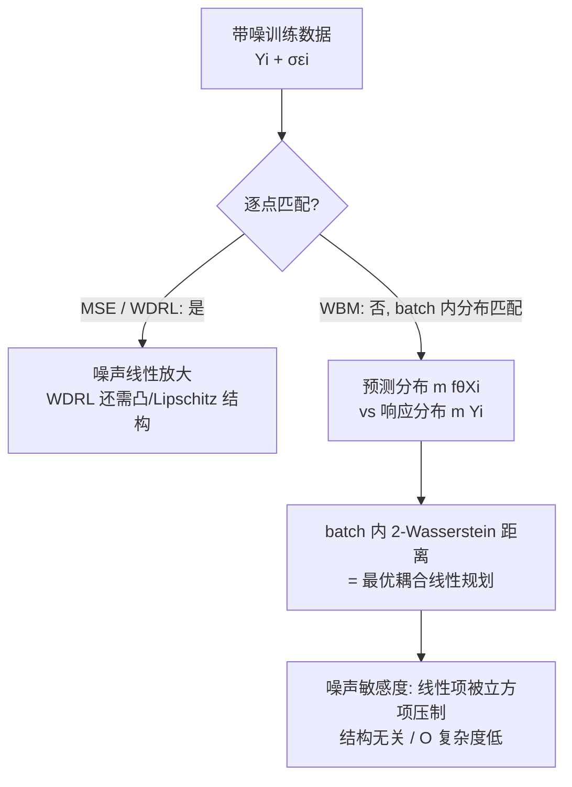

# Noise Tolerance of Distributionally Robust Learning

**会议**: ICLR 2026  
**OpenReview**: [https://openreview.net/forum?id=mf35JXqWHS](https://openreview.net/forum?id=mf35JXqWHS)  
**代码**: 论文称已开源（正文 "Code available"，未给出具体链接）  
**领域**: 学习理论 / 分布鲁棒优化 / 噪声鲁棒回归  
**关键词**: Wasserstein 距离, 分布鲁棒学习 (WDRL), 加性噪声鲁棒性, 算子学习, 噪声尺度分析  

## 一句话总结
本文揭示主流的 Wasserstein 分布鲁棒学习 (WDRL) 在回归函数非凸、非 Lipschitz 时对全局加性噪声并无鲁棒增益，进而提出与模型结构无关的 Wasserstein Batch Matching (WBM)：在 batch 内对预测分布与响应分布做最优传输匹配，理论上把损失对噪声的线性敏感项压成立方衰减，实验在 PDE 算子学习与电网时序预测上以约 10 倍更低的计算成本超过 MSE 与各类 DRO。

## 研究背景与动机
**领域现状**：真实数据普遍带噪——传感器噪声、测量误差、量化误差等。为了避免昂贵的去噪预处理，鲁棒学习范式被大量研究，其中以 Wasserstein 分布鲁棒学习 (WDRL) 最受关注：它把训练写成在以经验分布为球心、半径 $\delta$ 的 Wasserstein 球上求最坏分布的极小极大问题，理论优雅且在线性回归、图像分类、对抗防御上表现亮眼。

**现有痛点**：WDRL 的火热几乎都建立在**有界数据域**（如图像分类）上，那里损失天然满足 Lipschitz 性质，极小极大问题可被改写成可解的对偶形式。但要把这个对偶式落到无界域的回归任务，必须强行给神经网络施加凸性或 Lipschitz 结构约束，**牺牲了模型表达力**；而对于现实中最常见的"全局加性噪声"（measurement / quantization 这类作用在所有样本上、甚至重尾无界的噪声），WDRL 是否真的更鲁棒，文献几乎是空白。

**核心矛盾**：WDRL 的鲁棒性保证依赖回归函数的凸/Lipschitz 结构，而真正有表达力、能解 PDE 算子的深度模型恰恰不满足这些结构——**理论保证适用的模型不够强，够强的模型没有保证**。

**本文目标**：(1) 诊断 WDRL 在非凸/非 Lipschitz 回归下面对全局噪声的失效；(2) 提出一个与模型结构完全解耦、对加性（含重尾）噪声鲁棒的回归损失，并给出噪声尺度的理论刻画。

**核心 idea**：**[分布对齐替代逐点匹配]** 噪声已经让观测响应 $Y_i+\sigma\varepsilon_i$ 偏离真值，逐点强行匹配特征与带噪响应反而放大噪声敏感性；不如在一个 batch 内**放松一一对应**，只要求预测的分布与响应的分布在 Wasserstein 意义下对齐，从而把噪声"平均掉"。

## 方法详解

### 整体框架
方法分两步逻辑：先**证伪**——通过把 WDRL 的可解对偶式 $d_2$ 当损失直接训练卷积神经算子 (CNO) 解 Navier-Stokes，展示它在重尾噪声下甚至不如普通 MSE，说明其鲁棒性依赖被破坏的结构假设；再**立论**——提出 Wasserstein Batch Matching (WBM)，把 MSE 的逐样本平方误差换成"batch 内预测分布 vs 响应分布"的 2-Wasserstein 距离，并用一致性命题与噪声尺度分析证明其鲁棒优势。

### 关键设计

**1. WDRL 失效诊断：结构假设一旦失守，鲁棒性随之失效。** WDRL 的极小极大式 $\inf_\theta \sup_{W_2(\mu,\hat\mu)\le\delta}\mathbb{E}_\mu[\ell(Y,f_\theta(X))]$ 本是无穷维问题，只有当 $\ell_\theta$ 是凹函数的有限最大值、或 Lipschitz 连续时，才能改写成可解的对偶形式 $d_2 = \inf_{\lambda\ge0}[\lambda\delta + \frac1n\sum_i \sup_{\xi}(\ell(\xi_1-f_\theta(\xi_2)) - \lambda\|Y_i-\xi_1\|_2^2 - \lambda\|X_i-\xi_2\|_2^2)]$。本文的关键观察是：在无界域回归里要满足这些假设，就得把网络强行约束成 Lipschitz/凸，否则等式不再成立、对偶式只是个"形式上的损失"。作者直接拿 $d_2$ 当损失训练 CNO 解二维 Navier-Stokes，结果在重尾 Cauchy 噪声下 WDRL 显著差于 MSE、在高斯噪声下也无任何改善——这一负面结论此前从未被指出，根源正是前人只在有界域图像分类上验证 WDRL，回避了 Lipschitz 失效的回归场景。

**2. Wasserstein Batch Matching：把逐点回归改成 batch 内的分布最优传输。** WBM 的目标是 $\hat\theta_{\text{WBM}} \in \arg\min_\theta \sum_{p\ge1} W_2(m[(Y_i)_{i\in I_p}],\, m[(f_\theta(X_i))_{i\in I_p}])$，即对每个 batch $I_p$，比较响应经验分布与预测经验分布之间的 2-Wasserstein 距离，而非 MSE 那种固定 $i\leftrightarrow i$ 的平方差。对经验分布，该 Wasserstein 距离退化为一个线性规划 $W_2 = \min_{P\in C}\langle P, M\rangle$，其中代价矩阵 $M=(\|Y_i-f_\theta(X_j)\|_2^2)_{i,j}$ 是预测与响应之间的两两距离、$C$ 是耦合矩阵集合。直觉上（论文 Fig.3），回归不再是"穿过每个点"，而是寻找特征分布到响应分布之间的最优搬运图，让接近的样本可以互相借用对方的响应来抵消各自的噪声。两条工程性质保证它能训深度模型：损失对 $\theta$ 可微（包络定理，Bonnans-Shapiro），且每步只解一个 $O(s)$（$s=\dim(Y)$）的线性规划，**与回归函数结构无关**——相比 WDRL 凸-凹时 $O(s^3)$、非凸时可任意困难，计算与适用性都更优。

**3. 一致性保证：弱匹配不会丢掉真函数。** 放松一一对应会不会让模型学歪？命题 4.1 给出反面保证：若 $f$ 连续可微、可积且 Fourier 变换紧支（带限函数），即便采样点经过未知的保 batch 划分的置换 $\phi$ 打乱，在无噪声极限下，最小化 $\sum_p W_2(m[(f(x_i))],\, m[(g(x_j))])$ 仍能在与 $f$ 共单调 (co-monotonic) 的带限函数类里**唯一确定 $f$**。这说明 WBM 的"弱匹配"只丢掉了排列自由度（被共单调约束补回），不丢函数本身的信息，从而 batch 匹配是 MSE 逐点回归的合理松弛而非退化。

**4. 噪声尺度分析：线性敏感项被立方项压制。** 这是 WBM 鲁棒性的理论核心（命题 5.1）。设响应归一化、噪声方差 $\sigma^2$，对 $\sigma\in(0,1)$，WBM 损失关于噪声的一阶展开为 $\sum_{i,j}[(Y_i-f_\theta(X_j)) - (Y_i-f_\theta(X_j))^3]P_{i,j}\sigma\varepsilon_i + O(\sigma^2)$，而 MSE 的对应一阶项是 $\frac{2\sigma}{\#I_p}\sum_i (Y_i-f_\theta(X_i))\varepsilon_i + O(\sigma^2)$。对比可见：当预测与响应偏差小于 1 时，WBM 的线性敏感系数被一个**立方项 $-(Y_i-f_\theta(X_j))^3$ 主动削减**，噪声对损失的一阶影响因此小于 MSE——这正是"对所有耦合取下确界"带来的红利。作者进一步把分析推到 SGD 不变测度层面（推论 5.2）：用常步长随机逼近的马氏链平稳分布刻画学到的参数偏差 $\bar\theta_\eta-\theta^\star = \eta(\nabla^2\ell_{\theta^\star})^{-1}\nabla^3\ell_{\theta^\star}A(\theta^\star)V(\theta^\star)+O(\eta^2)$，其中 $V(\theta^\star)=\mathbb{E}[(\nabla_\sigma\ell_{\theta^\star})^{\otimes2}]$ 直接由损失对噪声的一阶系数决定；而 WDRL 的梯度迭代带有**非中心偏置项**，一般无法收敛——从优化动力学角度再次解释了 WDRL 的不鲁棒。

## 实验关键数据

实验全程用平均绝对误差 (MAE) 评估，主对手是 MSE（WDRL 已在第 3 节被证不如 ERM），并补充与散度型 DRO（CVaR-DRO、Chi-Sq-DRO）对比。噪声分高斯与重尾 Cauchy（无穷方差，$\sigma$ 为尺度参数），通常 30% 数据被污染，结果取 13 次平均。

### 主实验表格

| 任务 | 模型 | 噪声 | 结论 |
|------|------|------|------|
| Navier-Stokes 算子学习 | CNO | Cauchy 重尾 (污染训练/测试 30%) | MSE 与 WDRL 误差均显著大，**WBM 明显鲁棒** |
| Navier-Stokes 算子学习 | CNO | 高斯 | WBM 持续优于 MSE；WDRL 无改善 |
| 波动方程算子学习 | CNO | 高斯 (污染训练 30%) | WBM 优于 MSE |
| 电网负荷预测 (ETDataset) | TSMixer | Cauchy / 高斯 | WBM 优于 MSE，**Cauchy 下尤为明显** |

### 消融实验表格

| 对比维度 | 设置 | 结果 |
|----------|------|------|
| vs 散度型 DRO | CVaR-DRO / Chi-Sq-DRO | WBM 精度更优，且训练计算成本至少低 **10 倍** |
| vs GCDRO | kNN 图构造 | GCDRO 在本文聚焦的高维数据上表现差，不适用 |
| 计算复杂度 | WBM $O(s)$ vs WDRL $O(s^3)$（凸-凹时） | WBM 与模型结构无关，WDRL 非凸时可任意困难 |
| 分布偏移鲁棒性 | 近无噪数据训练、带噪数据测试 | WBM 展现对部署期噪声的鲁棒性 |

### 关键发现
- **WDRL 在回归 + 全局噪声下并不鲁棒**：重尾噪声时甚至不如朴素 MSE，颠覆了"WDRL 更鲁棒"的普遍印象，根因是 Lipschitz/凸结构在无界回归域被破坏。
- **WBM 对重尾噪声尤其有效**：Cauchy 无穷方差噪声下 MSE/WDRL 均崩，WBM 仍稳健，验证了立方项压制线性敏感度的理论。
- **结构无关 + 低成本**：WBM 不约束网络结构、每步只解一个低维线性规划，比散度型 DRO 省约 10 倍训练开销，可直接用作 MSE 的替换损失。

## 亮点与洞察
- **"先证伪后立论"的叙事干净有力**：先用一个具体的 CNO/Navier-Stokes 实验把社区默认正确的 WDRL 打出反例，再顺势引出 WBM，问题动机自然且具说服力。
- **把鲁棒性归因到"损失关于噪声的一阶系数"**：噪声尺度分析（线性项 vs 立方项）给出了一个可解释、可比较的鲁棒性度量，比"球半径 $\delta$"这种间接刻画更贴近实际噪声。
- **分布匹配替代逐点匹配**是一个轻巧但深刻的视角转换——本质上承认"带噪标签的逐点身份不可信"，用最优传输把 batch 当成一团点云来回归，和 noisy-label 学习、Noise2Noise 等思想暗合。
- 损失对 $\theta$ 可微 + 线性规划可解，使它真正即插即用，而非停留在理论。

## 局限与展望
- **要求底层函数足够正则**（命题 4.1 的带限/可微假设），在含间断的算子学习（如激波问题）上会吃力。
- **低噪声/近无噪场景可能轻微欠拟合**：弱匹配在响应完全可信时是次优的——这是"对噪声鲁棒"与"对干净数据精确"之间的固有张力。
- 当前只验证了 i.i.d. 加性噪声；对**相关噪声、结构化噪声**的鲁棒性留作未来工作。
- 论文聚焦回归，未触及分类；且 batch 内匹配的 batch size 成为新的（需调的）超参，作者在 PDE 实验中确实扫了不同 batch size。

## 相关工作与启发
- **WDRL / 分布鲁棒优化**（Mohajerin Esfahani & Kuhn 2018；Shafieezadeh-Abadeh 2019；Gao 2024）：本文的直接对标与"被证伪"对象，澄清了其鲁棒性的结构前提。
- **散度型 DRO**（CVaR-DRO、Chi-Sq-DRO，Duchi & Namkoong 2021；GCDRO，Liu 2024）：实验对比对象，WBM 在高维与计算成本上占优。
- **去噪/滤波 与 Noise2Noise**（Lehtinen 2018 等）：传统去噪需低噪数据或显式噪声模型并引入预处理；WBM 直接从带噪数据训练，省掉预处理，这一动机与 Noise2Noise"用噪声学噪声"一脉相承。
- **常步长 SGD 的马氏链刻画**（Dieuleveut 2020）：被借来分析 WBM/MSE 学到参数的噪声偏差，是把"损失尺度"传导到"参数尺度"的关键工具。
- **启发**：把"逐点监督"松弛为"分布级监督"是应对标签噪声的通用思路，未来可探索分类、相关噪声、以及把 batch 匹配与最优传输加速（Sinkhorn）结合以扩到更大 batch。

## 评分
- 新颖性: ⭐⭐⭐⭐ — "WDRL 在非凸回归 + 全局噪声下不鲁棒"是此前未被指出的负面结论，WBM 的分布匹配视角与立方项压制分析都很新颖。
- 实验充分度: ⭐⭐⭐ — 覆盖 PDE 算子学习与电网时序、高斯与重尾噪声、与多种 DRO 对比，但局限于回归任务、数据集偏少、只给 MAE 曲线（正文以图为主，缺大规模表格）。
- 写作质量: ⭐⭐⭐⭐ — "先证伪后立论"结构清晰，理论命题与实验呼应紧密，符号略密集但可读。
- 价值: ⭐⭐⭐⭐ — 既纠正了社区对 WDRL 鲁棒性的过度乐观，又给出一个结构无关、低成本、即插即用的鲁棒回归损失，对带噪科学/工程数据建模有实际意义。

<!-- RELATED:START -->

## 相关论文

- [\[ICML 2026\] Learning Credal Ensembles via Distributionally Robust Optimization](../../ICML2026/learning_theory/learning_credal_ensembles_via_distributionally_robust_optimization.md)
- [\[ICLR 2026\] Towards Persistent Noise-Tolerant Active Learning of Regular Languages with Class Query](towards_persistent_noise-tolerant_active_learning_of_regular_languages_with_clas.md)
- [\[ICLR 2026\] Near Optimal Robust Federated Learning Against Data Poisoning Attack](near_optimal_robust_federated_learning_against_data_poisoning_attack.md)
- [\[ICLR 2026\] Robust Decision Making with Partially Calibrated Forecasts](robust_decision-making_with_partially_calibrated_forecasters.md)
- [\[ICLR 2026\] Bandit Learning in Matching Markets Robust to Adversarial Corruptions](bandit_learning_in_matching_markets_robust_to_adversarial_corruptions.md)

<!-- RELATED:END -->
