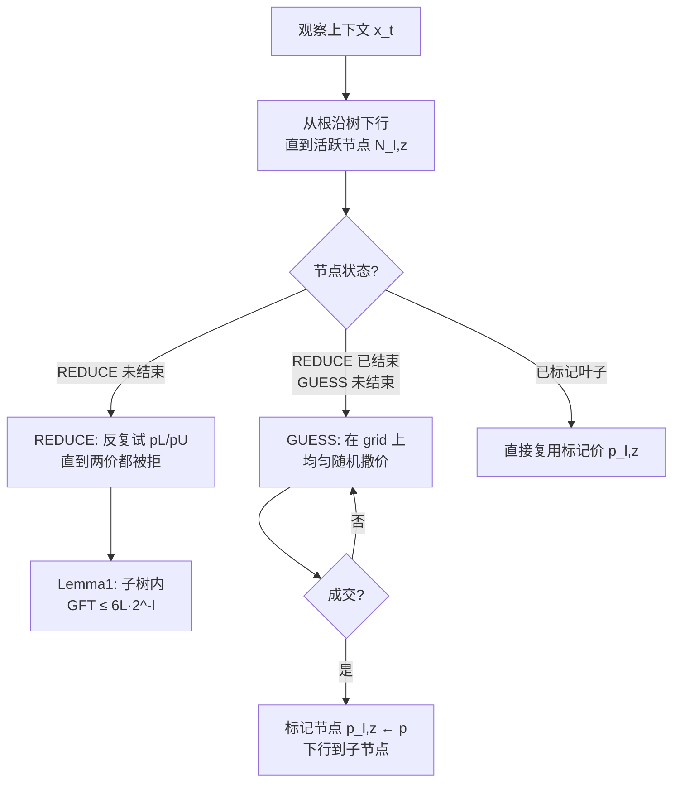

# Nonparametric Contextual Online Bilateral Trade

**会议**: ICLR 2026  
**OpenReview**: [https://openreview.net/forum?id=3IA5XRwP27](https://openreview.net/forum?id=3IA5XRwP27)  
**代码**: 未开源（纯理论）  
**领域**: learning theory  
**关键词**: 在线学习, 双边交易, 上下文老虎机, 非参数, Lipschitz, 遗憾界, 一比特反馈  

## 一句话总结
在买卖双方估值是上下文的任意 Lipschitz 函数、且只能看到"交易是否成交"这一个比特反馈、还必须强预算平衡的最苛刻设定下，给出一个基于层级树划分的定价算法，达到 $\tilde{O}(T^{(d-1)/d})$ 的遗憾界，并配上匹配下界证明其最优。

## 研究背景与动机
**领域现状**：在线双边交易（online bilateral trade）刻画的是平台在每一轮面对一对买家和卖家、在不知道双方私有估值的情况下报一个价格 $p_t$ 来撮合成交的问题。成交条件是卖家要价 $s_t \le p_t \le b_t$ 买家出价，社会福利增益（gain from trade）为 $\mathrm{GFT}(p_t|s_t,b_t)=\mathbb{1}(s_t\le p_t\le b_t)(b_t-s_t)$。现实场景里平台往往能在报价前观察到关于商品/买卖双方的 $d$ 维上下文特征 $x_t$，Gaucher et al. (2025) 据此提出了 feature-based 版本。

**现有痛点**：之前的上下文工作**只能处理线性估值模型** $s_t=x_t^\top\theta$，并且要想在最弱的一比特反馈下做到 no-regret，就必须**放松预算平衡约束**（允许平台补贴或抽成）。一旦估值是上下文的非线性函数，现有非参数上下文在线学习方法基本失效。

**核心矛盾**：双边交易的奖励函数 $\mathrm{GFT}$ 有两个让经典方法束手无策的特性——(1) 它对价格 $p$ 和对估值 $s,b$ 都是**不连续**的（阶跃函数），无法套用一般 Lipschitz 损失的 zooming/chaining；(2) 真正要最大化的奖励 $\mathrm{GFT}$ **永远观测不到**——无论成交与否，估值 $s,b$ 都是隐藏的，唯一的反馈只有 $\mathbb{1}(s\le p\le b)$ 这一个比特。如果把它当成一般 Lipschitz 奖励处理，下界会退化到 $\Omega(T^{(d+2)/(d+3)})$。

**本文目标**：在**任意 $L$-Lipschitz 估值 + 一比特反馈 + 强预算平衡**（每轮对买卖双方报同一个价）这三重约束下，给出最优遗憾界。

**核心 idea**：**【非参数 + 几何结构利用】** 不把 GFT 当黑箱 Lipschitz 函数，而是充分利用它"阶跃 + 无噪声"的特殊形状。通过一棵分支因子 $2^d$ 的层级树逐层细化上下文划分，并在每个节点上用"先逼成交者贴近对角线（REDUCE）、再随机撒价猜中（GUESS）"两个子例程，把不连续奖励转化为可控遗憾。

## 方法详解

### 整体框架
算法维护一棵对 $d$ 维上下文超立方体 $[0,1]^d$ 做层级划分的树：层 $\ell$ 的每个节点对应一个边长 $2^{-\ell}$ 的小立方体区域，分支因子为 $2^d$，树高限制为 $H=\lfloor\log_{2^d}T\rfloor$。每轮观察到上下文 $x_t$ 后，从根往下走，直到落到一个"活跃节点"（祖先全已标记但自身未标记）或叶子。在该节点上依次执行 REDUCE 和 GUESS 两个子例程：REDUCE 负责把该子树里可能的 GFT 压到 $O(L2^{-\ell})$，GUESS 负责真正找到一个能成交的价格并把节点"标记"上。一旦某节点被标记上价格 $p_{\ell,z}$，后续落到它的上下文就直接复用这个价格。

### 关键设计

**1. 层级树划分：用上下文密度自适应细化** 算法把 $[0,1]^d$ 组织成一棵树，节点 $N_{\ell,z}$ 表示区域 $\mathrm{Region}(N_{\ell,z})=[z_1,z_1+2^{-\ell}]\times\cdots\times[z_d,z_d+2^{-\ell}]$，每个节点有 $2^d$ 个子节点。这本质上是把 Slivkins (2014) 的 adaptive zooming 和 Cesa-Bianchi et al. (2017) 的 chaining 思想搬到双边交易：观测到越多上下文的区域被几何式地越细化。由 Lipschitz 性，层 $\ell$ 维护的是上下文到最优价格映射的 $O(2^{-\ell})$ 粒度离散化——同一节点内所有上下文的最优价格相差不超过 $O(L2^{-\ell})$，所以一旦找到该区域内某个能成交的价格，就能近似服务整片区域。遗憾按节点分解 $R_T=\sum_{\ell=0}^H\sum_{z\in Z_\ell}R_{\ell,z}$，逐节点逐层求和。

**2. REDUCE 子例程：故意求拒，把估值逼到对角线附近** 这是全文最反直觉也最关键的一步。在活跃节点 $N_{\ell,z}$ 上，算法以父节点标记价 $\bar p$ 为中心取两个价 $p_L=\Pi_{[0,1]}(\bar p-L2^{-(\ell-1)})$ 与 $p_U=\Pi_{[0,1]}(\bar p+L2^{-(\ell-1)})$，先反复报 $p_L$ 直到被拒，再反复报 $p_U$ 直到被拒。**为什么要主动求拒？** 因为若对抗者能让 $p_L$（偏低）和 $p_U$（偏高）都被某个买卖对拒绝，由 Lipschitz 约束反推，对抗者就被迫把该区域内所有上下文的估值都压到接近对角线 $s\approx b$ 的窄带里——Lemma 1 严格证明：REDUCE 终止后，对该节点区域内任意 $x$ 有 $f_b(x)-f_s(x)\le 6L2^{-\ell}$。这意味着整个子树后续能贡献的 GFT（也就是遗憾）都被钳到 $O(L2^{-\ell})$。而 REDUCE 本身的遗憾很小：Lemma 2 给出 $R^{\mathrm{REDUCE}}_{\ell,z}\le 24L2^{-\ell}$。对抗者要么不触发终止（多数节点如此），要么一旦触发就自缚手脚。

**3. GUESS 子例程：随机撒价对抗不连续性** REDUCE 结束后，算法在网格 $P_{\ell,z}=[\bar p-L2^{-(\ell-1)},\bar p+L2^{-(\ell-1)}]_\epsilon$ 上**均匀随机**报价，直到某次成交，再用该价格标记节点。随机化是绕开 GFT 不连续性的核心：由 Lipschitz 性该网格必含一个可成交价，网格规模 $|P_\epsilon|=O(\epsilon^{-1}L2^{-\ell})$，于是对任何 GFT$\ge\epsilon$ 的交易，每次撒价命中概率 $\Omega(\epsilon 2^\ell/L)$，平均 $O(L2^{-\ell}/\epsilon)$ 轮就能成交。Lemma 3 给出遗憾分解 $R^{\mathrm{GUESS}}_{\ell,z}\le\epsilon\,\mathbb{E}[|T_{\ell,z}|]+\frac{24L^2 2^{-2\ell}}{\epsilon}$：第一项是放弃所有 GFT$<\epsilon$ 小单的代价（每轮至多 $\epsilon$），第二项是猜价阶段的代价——注意这里因为有了 REDUCE 的 $O(2^{-\ell})$ 钳制，分子是 $2^{-2\ell}$ 而非 $2^{-\ell}$，正是这个二次因子把朴素的 $\tilde O(T^{(d-2)/d})$ 提升到最优。取 $\epsilon=LT^{-1/d}$ 逐层求和即得 Theorem 1：$R_T=O(L\log^2(T)\,T^{(d-1)/d})$。

**4. 多尺度扩展：无需已知 Lipschitz 常数** 上述算法显式依赖 $L$，但现实中 $L$ 常未知。第 4 节给出 GeometricReduce / GeometricGuess：对每个节点维护一列几何递增的猜测 Lipschitz 常数 $\tilde L^j_{\ell,z}=O(2^j)$，从小尺度逐步（对数级）往上爬，并在对应网格上随机撒价。这样既能在 GFT$\ge\epsilon$ 时保证 $O(L2^{-\ell}/\epsilon)$ 轮内终止，又不会因尺度太小而一直空耗、错失大 GFT 的单子。代价是遗憾仅多一个 $O(\log^2(T)L)$ 因子，Theorem 2 给出 $R_T=O(\log^2(T)^2 L^2 T^{(d-1)/d})$。

## 实验关键数据
本文为**纯理论工作，无数值实验**，核心结果是遗憾上界与匹配下界。

### 主要结果汇总

| 设定 | 反馈 | 预算平衡 | 是否需已知 $L$ | 遗憾界 |
|------|------|----------|----------------|--------|
| 本文 Thm 1 | 一比特 | 强预算平衡 | 需要 | $O(L\log^2(T)\,T^{(d-1)/d})$ |
| 本文 Thm 2 | 一比特 | 强预算平衡 | 不需要 | $O(\log^2(T)^2 L^2 T^{(d-1)/d})$ |
| 本文 Thm 3（下界） | 全反馈 | 强预算平衡 | — | $\Omega(L\,T^{(d-1)/d})$（$T>(4L)^d$） |
| Gaucher et al. 2025（线性） | 两比特 | 强预算平衡 | — | $\tilde O(T^{2/3})$ |
| 一般 Lipschitz 奖励 baseline | — | — | — | $\Omega(T^{(d+2)/(d+3)})$ |

### 关键发现
- **上下界匹配（最优性）**：Theorem 3 给出 $\Omega(LT^{(d-1)/d})$ 下界，且该下界在**全反馈**下都成立——意味着从全反馈降到一比特反馈在此问题上**不损失阶**，本文算法在对数因子内最优。
- **打破一般 Lipschitz 下界**：若把 GFT 当通用 Lipschitz 函数，下界是 $\Omega(T^{(d+2)/(d+3)})$；本文利用 GFT 的阶跃形状 + 无噪声结构做到 $T^{(d-1)/d}$，严格更快。
- **下界证明工具**：组合 Yao 弱极小极大原理（把随机算法的最坏情形规约到确定性算法对实例分布的期望表现）与 McShane 扩张定理（保证离散集上 Lipschitz 函数可扩张到连续域）。

## 亮点与洞察
- **"主动求拒"的反直觉设计**：REDUCE 故意去让价格被拒绝，把对抗者的自由度反向利用——若对抗者两头都拒，就被 Lipschitz 约束逼到对角线窄带，从而钳住整片子树的潜在遗憾。这是把"对抗博弈"转化为"几何约束"的漂亮一招。
- **随机化破不连续**：面对 GFT 这种既不连续又不可观测的奖励，确定性 zooming 完全失效，而在自适应网格上均匀撒价把"命中概率"显式量化为 $\Omega(\epsilon 2^\ell/L)$，是绕开不连续的关键。
- **反馈降级不损阶**：下界在全反馈下成立，说明这个问题的难度本质来自上下文维度 $d$ 和 Lipschitz 结构，而非反馈稀疏性——一比特已经"够用"。

## 局限与展望
- **维度诅咒**：遗憾 $T^{(d-1)/d}$ 随 $d$ 增大迅速逼近线性，高维上下文下实用性受限；这是非参数设定的固有代价（对比并发工作 Cosson et al. 2026 在线性无噪声设定下能做到对数级遗憾）。
- **纯理论无实证**：没有任何数值/真实市场实验验证算法在有限 $T$ 下的常数因子与实际表现。
- **对抗 oblivious 上下文 + 确定性估值映射**：假设估值是上下文的确定性 Lipschitz 函数（无噪声），现实中估值常带随机扰动，带噪声的非参数设定仍待研究。
- **强预算平衡之外**：弱/全局预算平衡、利润最大化（而非仅 GFT 最大化）等变体在非参数设定下的最优率尚未刻画。

## 相关工作与启发
- **在线双边交易**：Cesa-Bianchi et al. (2024) 开创在线版本（i.i.d. 估值）；Azar et al. (2022)、Bernasconi et al. (2024) 研究对抗/全局预算平衡；Gaucher et al. (2025) 是最直接的前作（线性上下文，本文把它推广到任意 Lipschitz）。
- **非参数上下文在线学习**：Hazan & Megiddo (2007) 起步，Rakhlin & Sridharan (2015) 闭合上下界 $\tilde O(T^{(d-1)/d})$，Lu et al. (2009)/Slivkins (2014) 的 zooming、Cesa-Bianchi et al. (2017) 的 chaining 是本文树构造的技术源头。
- **启发**：该"层级树 + REDUCE 钳制 + 随机 GUESS"框架对其他**奖励不连续且不可观测**的撮合/定价问题（如二价拍卖、动态定价、撮合市场）有迁移潜力；"主动求拒以约束对抗者"的思路值得在更广的对抗在线学习中借鉴。

## 评分
- **新颖性**: ⭐⭐⭐⭐⭐ 首个把上下文在线双边交易从线性推广到任意 Lipschitz 非参数设定，且在最苛刻的一比特反馈 + 强预算平衡下给出最优率；"主动求拒"设计原创性强。
- **实验充分度**: ⭐⭐⭐ 纯理论工作，有匹配上下界，但无任何数值/实证验证（理论论文的常态，非缺陷但限制了实用判断）。
- **写作质量**: ⭐⭐⭐⭐ 技术挑战、直觉、引理链条层层递进，Figure 1 把 REDUCE 的几何含义讲得很清楚；理论密度高，对非该领域读者门槛较高。
- **价值**: ⭐⭐⭐⭐ 在算法博弈论/在线学习交叉处补齐了非参数双边交易的最优率刻画，理论贡献扎实；实际落地受维度诅咒制约。

<!-- RELATED:START -->

## 相关论文

- [\[ICLR 2026\] Variance-Dependent Regret Lower Bounds for Contextual Bandits](variance-dependent_regret_lower_bounds_for_contextual_bandits.md)
- [\[ICLR 2026\] Contextual Multi-Armed Bandits with Minimum Aggregated Revenue Constraints](contextual_multi-armed_bandits_with_minimum_aggregated_revenue_constraints.md)
- [\[ICLR 2026\] Semi-Parametric Contextual Pricing with General Smoothness](semi-parametric_contextual_pricing_with_general_smoothness.md)
- [\[ICLR 2026\] Queue Length Regret Bounds for Contextual Queueing Bandits](queue_length_regret_bounds_for_contextual_queueing_bandits.md)
- [\[ICLR 2026\] Diversified Multinomial Logit Contextual Bandits](diversified_multinomial_logit_contextual_bandits.md)

<!-- RELATED:END -->
